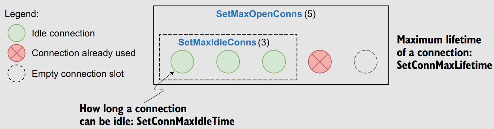
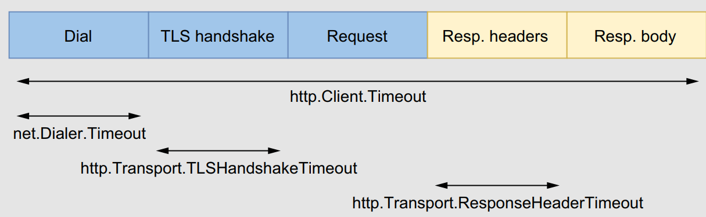
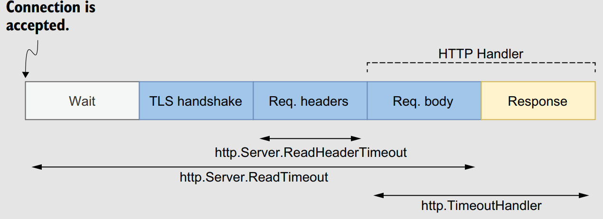

# 100 Go Mistakes and How to Avoid Them

Notes taken from reading the *100 Go Mistakes and How to Avoid Them* by Teiva Harsanyi.

## Chapter 1: Go: Simple to learn but hard to master.

- Google created the Go programming language in 2007 in response to these challenges:
  - Maximizing **agility** and reducing the time to **market** is critical for most organizations
  - Ensure that software engineers are as **productive** as possible when reading, writing, and maintaining code.
- Why does Go not have feature *X*?
  - Because it **doesn’t fit**, because it affects **compilation** speed or clarity of **design**, or because it would make the fundamental system model too **difficult**.
- Judging the quality of a programming language via its number of features is probably not an accurate metric 💯.
- Go's essential characteristics: **Stability**, **Expressivity**, **Compilation**, **Safety**.
- Go is simple but not easy:
  - Example:  Study shows that popular repos such as Docker, gRPC, and Kubernetes contain bugs are caused by inaccurate use of the message-passing paradigm via channels.
  - Although a concept such as channels and goroutines can be simple to learn, it isn’t an easy topic in practice.
- The cost of software bugs in the U.S. alone to be over $2 trillion 😢.

## Chapter 2: Code and project organization

### #1: Unintended variable shadowing

- In Go, a variable name declared in a block can be redeclared in an inner block.
- **Variable shadowing** occurs when a variable name is redeclared in an inner block, but we saw that this practice is prone to mistakes:
```go
var client *http.Client
if tracing {
    client, err := createClientWithTracing()
    if err != nil {
        return err
    }
    log.Println(client)
} else {
    client, err := createDefaultClient()
    if err != nil {
        return err
    }
    log.Println(client)
}
// Use client
```

### #2: Unnecessary nested code

- A critical aspect of **readability** is the number of **nested** levels.
- In general, the more nested levels a function requires, the more complex it is to read and understand:
    ```go
    func join(s1, s2 string, max int) (string, error) {
        if s1 == "" {
            return "", errors.New("s1 is empty")
        } else {
            if s2 == "" {
                return "", errors.New("s2 is empty")
            } else {
                concat, err := concatenate(s1, s2)
                if err != nil {
                    return "", err
                } else {
                    if len(concat) > max {
                        return concat[:max], nil
                    } else {
                        return concat, nil
                    }
                }
            }
        }
    }
    ```
- *Align the happy path to the left; you should quickly be able to scan down one column to see the expected execution flow*.
- When an `if` block returns, we should omit the `else` block in all cases.
- If we encounter a **non happy-path**, we should flip the condition like so:
    ```go
    if s == "" {
        return errors.New("empty string")
    }
    // ...
    ```

### #3: Misusing init functions

- Consider the example below:
    ```go
    var db *sql.DB
    func init() {
        dataSourceName := os.Getenv("MYSQL_DATA_SOURCE_NAME")
        d, err := sql.Open("mysql", dataSourceName)
        if err != nil {
            log.Panic(err)
        }
        err = d.Ping()
        if err != nil {
            log.Panic(err)
        }
        db = d
    }
    ```
-  Let’s describe three main downsides of the code above:
   - It shouldn’t necessarily be **up to the package** itself to decide whether to stop the application. Perhaps a caller might have preferred implementing a retry or using a fallback mechanism. In this case, opening the database within an `init` function prevents client packages from implementing their error-handling logic.
   - If we add tests to this file, the `init` function will be executed before running the test cases, which isn’t necessarily what we want (for example, if we add unit tests on a utility function that doesn’t require this connection to be created). Therefore, the `init` function in this example **complicates writing unit tests**.
   - The last downside is that the example requires assigning the database connection pool to a **global variable**. Global variables have some severe drawbacks; for example:
    - Any functions can alter global variables within the package.
    - Unit tests can be more complicated because a function that depends on a global variable won’t be **isolated anymore**.
- We should be cautious with `init` functions. They can be helpful in some situations, however, such as defining static configuration. Otherwise, and in most cases, we should handle initializations through ad-hoc functions.

### #4: Overusing getters and setters

- Using **getters** and **setters** presents some advantages, including these:
    - They **encapsulate** a behavior associated with getting or setting a field, allowing new functionality to be added later (for example, validating a field, returning a computed value, or wrapping the access to a field around a mutex).
    - They **hide** the **internal representation**, giving us more flexibility in what we expose.
    - They provide a **debugging** interception point for when the property changes at run time, making debugging easier.
- If we fall into these cases or foresee a possible use case while guaranteeing **forward compatibility**, using getters and setters can bring some value. For example, if we use them with a field called `balance`, we should follow these naming conventions:
    - The getter method should be named `Balance` (not `GetBalance`).
    - The setter method should be named `SetBalance`.
- We shouldn’t **overwhelm** our code with getters and setters on structs if they don’t bring any value. We should be pragmatic and strive to find the right balance between efficiency and following idioms that are sometimes considered indisputable in other programming paradigms.

### #5: Interface pollution

- Interface pollution is about **overwhelming** our code with **unnecessary abstractions**, making it harder to understand.
- What makes Go interfaces so different is that they are satisfied **implicitly**. There is no explicit keyword like *implements* to mark that an object `X` implements interface `Y`.
- While designing interfaces, the **granularity** (how many methods the interface contains) is also something to keep in mind:
  - 🌟 *The bigger the interface, the weaker the abstraction*.
  - Examples: `io.Reader`.
- When to use interfaces ?
  - When multiple types implement a **common** behavior. For example, This `Interface` has a strong potential for reusability because it encompasses the common behavior to **sort** any collection that is index-based:
  ```go
  type Interface interface {
    Len() int
    Less(i, j int) bool
    Swap(i, j int)
    }
  ```
  - **Decoupling** our code from an implementation:
    - **Liskov Substitution Principle** (the L in *Robert C. Martin’s* SOLID design principles).
    - If we rely on an **abstraction** instead of a **concrete** implementation, the implementation itself can be replaced with another without even having to change our code. Example:
    ```go
    type customerStorer interface {
        StoreCustomer(Customer) error
    }
    type CustomerService struct {
        storer customerStorer
    }
    func (cs CustomerService) CreateNewCustomer(id string) error {
        customer := Customer{id: id}
        return cs.storer.StoreCustomer(customer)
    }
    ```
    - This gives us more **flexibility** in how we want to test the method:
      - Use the concrete implementation via integration tests.
      - Use a mock (or any kind of test double) via unit tests.
  - **Restrict** a type to a specific behavior for various reasons, such as semantics enforcement:
    ```go
    type Foo struct {
        threshold intConfigGetter
    }
    func NewFoo(threshold intConfigGetter) Foo {
        return Foo{threshold: threshold}
    }
    func (f Foo) Bar() {
        threshold := f.threshold.Get()
        // ...
    }
    ```
    - The configuration getter is **injected** into the `NewFoo` factory method. It doesn’t impact a client of this function because it can still pass an `IntConfig` struct as
it implements `intConfigGetter`. Then, we can only read the configuration in the `Bar` method, not modify it.
- The main caveat when programming meets abstractions is remembering that abstractions should be **discovered**, not **created**.
  - 🌟 *Don’t design with interfaces, discover them*.

### #6: Interface on the producer side

- **Producer** side — An interface defined in the same package as the concrete implementation.
- **Consumer** side — An interface defined in an external package where it’s used. <p align="center"></p>
- It’s common to see developers creating interfaces on the producer side, alongside the concrete implementation. This design is perhaps a habit from developers having a *C#* or a *Java* background. But in Go, in most cases this is not what we should do 🤨.
- Let’s discuss the following example:
    ```go
    package store
    // CustomerStorage is a good way 🤷 to decouple the client code from the actual implementation.
    // Or, perhaps we can foresee that it will help clients in creating test doubles.
    type CustomerStorage interface {
        StoreCustomer(customer Customer) error
        GetCustomer(id string) (Customer, error)
        UpdateCustomer(customer Customer) error
        GetAllCustomers() ([]Customer, error)
        GetCustomersWithoutContract() ([]Customer, error)
        GetCustomersWithNegativeBalance() ([]Customer, error)
    }
    ```
- This isn’t a best practice in Go. Why ? It’s not up to the producer to **force a given abstraction** for all the clients. Instead, it’s up to the client to decide whether it needs some form of abstraction and then determine the best abstraction level for its needs. For example:
    ```go
    package client

    type customersGetter interface {
        GetAllCustomers() ([]store.Customer, error)
    }
    ```
- The main point is that the `client` package can now define the most **accurate** abstraction for its need (here, only one method). It relates to the concept of the *Interface Segregation Principle* (the `I` in *SOLID*) ▶️ No client should be forced to depend on methods it doesn’t use.
- An interface should live on the **consumer** side in most cases. However, in particular contexts (for example - in the standard library `encoding, encoding/json, encoding/binary`, when we know — not foresee—that an abstraction will be helpful for consumers), we may want to have it on the **producer** side. If we do, we should strive to keep it as **minimal** as possible, increasing its **reusability** potential and making it more easily **composable**.

### #7: Returning interfaces

- We will consider two packages: `client`, which contains a `Store` interface and `store`, which contains an implementation of `Store`. <p align="center"></p>
- The `client` package can’t call the `NewInMemoryStore` function anymore; otherwise, there would be a **cyclic dependency**.
- In general, returning an interface restricts **flexibility** because we force all the clients to use one particular type of abstraction.
- *Be conservative in what you do, be liberal in what you accept from others.* If we apply this idiom to Go, it means
    - 👍 Returning structs instead of interfaces.
    - 👍 Accepting interfaces if possible.
- We shouldn’t return interfaces but concrete implementations. Otherwise, it can make our design more complex due to package dependencies and can restrict flexibility because all the clients would have to rely on the same
abstraction.
- Also, we will only be able to use the methods **defined** in the interface, and not the methods defined in the **concrete type**.

### #8: any says nothing

- With Go 1.18, the predeclared type `any` became an alias for an **empty interface {}**.
- In assigning a value to an `any` type, we **lose** all **type information**, which requires a type assertion to get anything useful out of the `i` variable.
    ```go
    func main() {
        var i any
        i = 42
        i = "foo"
        i = struct {
            s string
        }{
            s: "bar",
        }
        i = f
        _ = i
    }
    func f() {}
    ```
- In methods, accepting or returning an `any` type doesn’t **convey meaningful information**:
  - Because there is no **safeguard** at compile time, nothing prevents a caller from calling these methods with whatever data type.
  - Also, the methods lack **expressiveness**. If future developers need to use the parameters of type `any`, they will probably have to dig into the documentation or read the code to understand how to use these methods.
- What are the cases when `any` is helpful?:
  - In the `encoding/json` package. Because we can marshal any type, the `Marshal` function accepts an `any` argument.
  - Another example is in the `database/sql` package. If the query is parameterized (for example, `SELECT * FROM FOO WHERE id = ?`), the parameters could be any kind.

### #9: Being confused about when to use generics

- Go 1.18 adds generics to the language 🥳.
-  👍 Few common uses where generics are recommended:
    - **Data structures** : We can use generics to **factor out** the element type if we implement a binary tree, a linked list, or a heap, for example.
    - **Functions working with slices, maps, and channels of any type** : A function to merge two channels would work with any `channel` type, for example
      - Hence, we could use type parameters to factor out the channel type:
        ```go
        func merge[T any](ch1, ch2 <-chan T) <-chan T {
        // ...
        }
        ```
    - **Factoring out behaviors instead of types**:  The `sort` package, for example, contains a `sort.Interface` interface with three methods:
        ```go
        type Interface interface {
            Len() int
            Less(i, j int) bool
            Swap(i, j int)
        }
        ```
      - This interface is used by different functions such as `sort.Ints` or `sort.Float64s`. Using type parameters, we could factor out the sorting behavior(for example, by defining a `struct` holding a slice and a comparison function):
        ```go
        type SliceFn[T any] struct {
            S []T
            Compare func(T, T) bool
        }
        func (s SliceFn[T]) Len() int { return len(s.S) }
        func (s SliceFn[T]) Less(i, j int) bool { return s.Compare(s.S[i], s.S[j]) }
        func (s SliceFn[T]) Swap(i, j int) { s.S[i], s.S[j] = s.S[j], s.S[i] }
        ```
      - Then, because the `SliceFn` struct implements `sort.Interface`, we can sort the provided slice using the `sort.Sort(sort.Interface)` function:
        ```go
        s := SliceFn[int]{
            S: []int{3, 2, 1},
            Compare: func(a, b int) bool {
                return a < b
            },
        }
        sort.Sort(s)
        fmt.Println(s.S)
        ```
- 👎 when is it recommended that we not use generics:
    - When **calling a method of the type argument**: Consider a function that receives an `io.Writer` and calls the `Write` method, for example:
        ```go
        func foo[T io.Writer](w T) {
            b := getBytes()
            _, _ = w.Write(b)
        }
        ```
        - In this case, using generics won’t bring any value to our code whatsoever. We should make the `w` argument an `io.Writer` directly.
    - When it makes our code **more complex**: Generics are never mandatory, and as Go developers, we have lived without them for more than a decade. If we’re writing generic functions or structures and we figure out that it doesn’t make our code clearer, we should probably reconsider our decision for that particular use case.

### #10: Not being aware of the possible problems with type embedding

- 👎 The wolloing example is a wrong usage of type embedding. Since `sync.Mutex` is an embedded type, the `Lock` and `Unlock` methods will be **promoted**. Therefore, both methods become **visible** to external clients using `InMem`:
    ```go
    type InMem struct {
        sync.Mutex
        m map[string]int
    }
- We want to write a custom logger that contains an `io.WriteCloser` and exposes two methods, `Write` and `Close`. If `io.WriteCloser` wasn’t **embedded**, we would need to write it like so:
    ```go
    type Logger struct {
        writeCloser io.WriteCloser
    }
    func (l Logger) Write(p []byte) (int, error) {
        return l.writeCloser.Write(p) // Forwards the call to writeCloser
    }
    func (l Logger) Close() error {
        return l.writeCloser.Close() // Forwards the call to writeCloser
    }
    func main() {
        l := Logger{writeCloser: os.Stdout}
        _, _ = l.Write([]byte("foo"))
        _ = l.Close()
    }
    ```
- 👍 Logger `would` have to provide both a `Write` and a `Close` method that would only **forward** the call to `io.WriteCloser`. However, if the field now becomes **embedded**, we can remove these forwarding methods:
    ```go
    type Logger struct {
        io.WriteCloser
    }
    func main() {
        l := Logger{WriteCloser: os.Stdout}
        _, _ = l.Write([]byte("foo"))
        _ = l.Close()
    }
    ```
- If we decide to use type embedding, we need to keep two main constraints in mind:
    - It shouldn’t be used solely as some **syntactic sugar** to simplify accessing a field (such as `Foo.Baz()` instead of `Foo.Bar.Baz()`). If this is the only rationale, let’s not embed the inner type and use a field instead.
    - It shouldn’t promote data (fields) or a behavior (methods) we want to **hide** from the outside: for example, if it allows clients to access a locking behavior (`sync.Mutex`) that should remain **private** to the struct.

### #11 Not using the functional options pattern

- How can we implement passing an configuration option to a function in an API-friendly way? Let’s look at the different options.
- **Config struct**:
  - The **mandatory** parameters could live as function parameters, whereas the **optional** parameters could be handled in the `Config` struct:
    ```go
    type Config struct {
        Port int
    }
    func NewServer(addr string, cfg Config) { }
    ```
    - 👍 This solution fixes the **compatibility** issue. Indeed, if we add new options, it will not break on the client side.
    - 👎 However, this approach does not distinguish between a field purposely set to 0 and a missing field:
        - 0 for an integer, 0.0 for a floating-point type
        - "" for a string
        - Nil for slices, maps, channels, pointers, interfaces.
        - ▶️ One option might be to handle all the parameters of the configuration struct as **pointers**, however, it’s not handy for clients to work with pointers as they have to create a variable and then pass a pointer 🤷, also client using our library with the default configuration will need to pass an **empty struct**.
- **Builder pattern**:
  - The construction of `Config` is separated from the struct itself. It requires an extra struct, `ConfigBuilder`, which receives methods to configure and build a `Config`:
    ```go
    type Config struct {
        Port int
    }
    type ConfigBuilder struct {
        port *int
    }
    func (b *ConfigBuilder) Port(
        port int) *ConfigBuilder {
        b.port = &port
        return b
    }
    func (b *ConfigBuilder) Build() (Config, error) {
        cfg := Config{}
        if b.port == nil {
            cfg.Port = defaultHTTPPort
        } else {
            if *b.port == 0 {
                cfg.Port = randomPort()
            } else if *b.port < 0 {
                return Config{}, errors.New("port should be positive")
            } else {
                cfg.Port = *b.port
            }
        }
        return cfg, nil
    }
    ```
  - The `ConfigBuilder` struct holds the client configuration. It exposes a `Port` method to set up the port. Usually, such a configuration method returns the **builder itself** so that we can use method **chaining** (for example, `builder.Foo("foo").Bar("bar")`). It also exposes a `Build` method that holds the logic on initializing the port value (whether the pointer was nil, etc.) and returns a `Config` struct once created.
    - 👍 This approach makes port management handier. It’s **not required** to pass an integer pointer, as the `Port` method accepts an integer. However, we still need to pass a config struct that can be empty if a client wants to use the default configuration 🤷.
    - 👎 In programming languages where exceptions are thrown, builder methods such as `Port` can raise **exceptions** if the input is invalid. If we want to keep the ability to **chain** the calls, the
function **can’t return an error**. Therefore, we have to delay the validation in the `Build()`.
- **Functional options pattern**:
- The main idea is as follows:
  - An **unexported** struct holds the configuration: options.
  - Each option is a function that returns the **same type**: `type Option func(options *options) error`. For example, `WithPort` accepts an `int` argument that represents the port and returns an `Option` type that represents how to update the options struct.
    ```go
    type options struct {
        port *int
    }
    type Option func(options *options) error

    func WithPort(port int) Option {
        return func(options *options) error {
            if port < 0 {
                return errors.New("port should be positive")
            }
            options.port = &port
            return nil
        }
    }
    ```
  - Each config field requires creating a public function (that starts with the `With` prefix by convention) containing similar logic: validating inputs if needed and updating the config struct.
    ```go
    func NewServer(addr string, opts ...Option) (*http.Server, error) {
        var options options
        for _, opt := range opts {
            err := opt(&options)
            if err != nil {
                return nil, err
            }
        }
        // At this stage, the options struct is built and contains the config
        // Therefore, we can implement our logic related to port configuration
        var port int
        if options.port == nil {
            port = defaultHTTPPort
        } else {
            if *options.port == 0 {
                port = randomPort()
            } else {
                port = *options.port
            }
        }
        // ...
    }
  - Because `NewServer` accepts **variadic** Op`tion arguments, a client can now call this API by passing multiple options following the mandatory address argument. For example:
    ```go
    server, err := httplib.NewServer("localhost",
        httplib.WithPort(8080),
        httplib.WithTimeout(time.Second)
    )
    ```
  - 👍 Provides a handy and API-friendly way to handle options and represent the most idiomatic way. If the client needs the default configuration, it doesn’t have to provide an argument.

### #12: Project misorganization

- **Project structure**:
  - Go language maintainer has no strong convention about structuring a project in Go. However, one layout has emerged over the years: [project-layout](https://github.com/golang-standards/project-layout).
  - There’s no **mandatory** convention. This layout may be helpful for you or not, but what’s important here is that **indecision** is the only **wrong decision**.
- **Package organization**:
  - In Go, there is no concept of subpackages. However, we can decide to organize packages within subdirectories.
  - The main benefit of subdirectories is to keep packages in a place where they live with **high cohesion**.
  - Avoid **premature packaging** because it might cause us to over-complicate a project. Sometimes, it’s better to use a simple organization and have our project evolve when we understand what it contains rather than **forcing** ourselves to make the perfect structure up front.
  - Avoid having **dozens** of **nano** packages containing only one or two files. Conversely, we should also avoid **huge** packages that dilute the meaning of a package name.
  - We should name our packages after what they **provide**, not what they **contain**. Also, naming should be **meaningful**. Therefore, a package name should be **short**, **concise**, **expressive**, and, by convention, a **single lowercase word**.
  - We should **minimize** what should be **exported** as much as possible to **reduce the coupling** between packages and keep unnecessary exported elements hidden. In doubt, default to not exporting it!

### #13: Creating utility packages

- As a rule of thumb, creating **shared** packages without meaningful names isn’t a good idea; this includes utility packages such as `utils`, `common`, or `base`. Also, bear in mind that naming a package after what it provides and not what it contains can be an efficient way to increase its **expressiveness**.
- Consider the following example:
    ```go
    package util

    func NewStringSet(...string) map[string]struct{} {
        // ...
    }
    func SortStringSet(map[string]struct{}) []string {
        // ...
    }

    // A client will use this package like this:
    set := util.NewStringSet("c", "a", "b")
    fmt.Println(util.SortStringSet(set))
    ```
- Instead of a utility package, we should create an expressive package name such as `stringset`. For example:
    ```go
    package stringset

    func New(...string) map[string]struct{} { ... }
    func Sort(map[string]struct{}) []string { ... }

    // In this example, we removed the suffixes for NewStringSet and SortStringSet,
    // which respectively became New and Sort. On the client side, it now looks like this:
    set := stringset.New("c", "a", "b")
    fmt.Println(stringset.Sort(set))
    ```
- We could even go a step further. Instead of exposing utility functions, we could create a specific type and expose `Sort` as a method this way:
    ```go
    type Set map[string]struct{}

    func New(...string) Set { ... }
    func (s Set) Sort() []string { ... }

    // This change makes the client even simpler. There would only be one reference to the
    set := stringset.New("c", "a", "b")
    fmt.Println(set.Sort())
    ```

### #14 Ignoring package name collisions

- Package collisions occur when a **variable name** collides with an existing **package name**, preventing the package from being reused:
    ```go
    redis := redis.NewClient() // Calls NewClient from the redis package
    v, err := redis.Get("foo") // Uses the redis variable
    ```
- Two solutions:
  - Change the variable name to `redisClient` for example.
  - Create an alias for the `redis` package: `import redisapi "mylib/redis"`
- One option could also be to use **dot imports** to access all the public elements of a package without the package qualifier ▶️ increase confusion !
- We should avoid naming collisions between a **variable** and a **built-in** function. For example, we could do something like this:
    ```go
    copy := copyFile(src, dst) // The copy variable collides with the copy built-in function.
    ```
- 👍 In summary, we should prevent variable name collisions to avoid **ambiguity**.

### #15: Missing code documentation

- First, every **exported** element must be **documented**.
- The convention is to add comments, starting with the **name** of the exported element.
- As a convention, each comment should be a **complete sentence** that ends with **punctuation**.
- When we document a function, we should highlight what the function **intends to do**, not how it does it ⚠️; this belongs to the **core** of a function and comments, not documentation.
- 💡 We should ideally provide enough information that the consumer does not have to look at our code to understand how to use an exported element.
- When it comes to documenting a **variable** or a **constant**, we might be interested in conveying two aspects: its **purpose** and its **content**.
  - The **former** should live as **code documentation** to be useful for external clients.
  - The latter, though, **shouldn’t** necessarily be **public**. For example:
    ```go
    // DefaultPermission is the default permission used by the store engine.
    const DefaultPermission = 0o644 // Need read and write accesses.
    ```
- This constant represents the default permission. The code documentation conveys its purpose, whereas the comment alongside the constant describes its actual content.
- To help clients and maintainers understand a package’s scope, we should also document each **package**. The convention is to start the comment with *// Package* followed by the package name:
    ```go
    // Package math provides basic constants and mathematical functions.
    //
    // This package does not guarantee bit-identical results
    // across architectures.
    package math
    ```
- The first line of a package comment should be **concise**. That’s because it will appear in the package. Then, we can provide all the information we need in the following lines.

### #16: Not using linters

- A linter is an automatic tool to analyze code and catch errors.
- `Golint` (deprecated now) is the linter that is developer by Google. There's no drop-in replacement for it, but tools such as `Staticcheck` and `go vet` should be used instead.
- `golangci-lint` integrate almost all community driven linters.

## Chapter 3: Data types

### #17: Creating confusion with octal literals

- In Go, an integer literal starting with `0` is considered an **octal integer** (base 8).
- Octal integers are useful in different scenarios. For instance, suppose we want to open a file using `os.OpenFile`. This function requires passing a permission as a `uint32`. If we want to match a Linux permission, we can pass an octal number for readability instead of a base 10 number:
    ```go
    file, err := os.OpenFile("foo", os.O_RDONLY, 0644)
    ```
- Using `0o` as a prefix instead of only `0` means the same thing. However, it can help make the code clearer.
- Finally, we can also use an underscore character (`_`) as a separator for **readability**. For
example, we can write 1 billion this way: `1_000_000_000`. We can also use the underscore character with other representations (for example, `0b00_00_01`).
- In summary, Go handles **binary**, **hexadecimal**, **imaginary**, and **octal** numbers.
  - Octal numbers start with a 0. However, to improve readability and **avoid potential mistakes** for future code readers, make octal numbers explicit using a `0o` prefix.

### #18: Neglecting integer overflows

- Suppose we want to initialize an `int32` to its maximum value and then increment it. What should be the behavior of this code?
    ```go
    var counter int32 = math.MaxInt32
    counter++
    fmt.Printf("counter=%d\n", counter)
    ```
- This code compiles and doesn’t panic at run time. However, the `counter++` statement generates an integer overflow: `counter=-2147483648` ‼️
- An **integer overflow** occurs when an arithmetic operation creates a value outside the range that can be represented with a given number of bytes.
- Because an `int32` is a **signed** integer, the bit on the left represents the integer’s sign: `0` for positive, `1` for negative. If we increment this integer, there is no space left to represent the new value. Hence, this leads to an integer overflow.
- In Go, an integer overflow that can be detected at **compile** time generates a compilation error. However, at **run time**, an integer **overflow** or **underflow** is **silent**; this does not lead to an application panic ⚠️.
- How can we detect an integer overflow during an **addition**? The answer is to reuse `math.MaxInt`:
    ```go
    func AddInt(a, b int) int {
        if a > math.MaxInt-b {
            panic("int overflow")
        }
        return a + b
    }
    ```
- **Multiplication** is a bit more complex to handle. We have to perform checks against the minimal integer, `math.MinInt`:
    ```go
    func MultiplyInt(a, b int) int {
        if a == 0 || b == 0 {
            return 0
        }
        result := a * b
        if a == 1 || b == 1 {
            return result
        }
        if a == math.MinInt || b == math.MinInt {
            panic("integer overflow")
        }
        if result/b != a {
            panic("integer overflow")
        }
        return result
    }
    ```

### #19: Not understanding floating points

- To avoid bad surprises, we need to know that floating-point arithmetic is an approximation of real arithmetic.
  - 💡 Let’s take the `float64` type as an example. Note that there’s an **infinite** number of real values between `math.SmallestNonzeroFloat64` (the `float64` minimum) and `math.MaxFloat64` (the `float64` maximum).
  - Conversely, the `float64` type has a **finite** number of bits: **64**.
  - Because making infinite values fit into a finite space isn’t possible, we have to work with **approximations**. Hence, we may lose **precision**. The same logic goes for the `float32` type.
- ⚠️ Using the `==` operator to **compare** two floating-point numbers can lead to **inaccuracies**:
  -  Instead, we should compare their difference to see if it is less than some small error value.
  -  For example, the [testify](https://github.com/stretchr/testify) library has an `InDelta` function to assert that two values are within a given delta of each other.
- ⚠️ The result of floating-point calculations depends on the actual **processor**.
  - Most processors have a *floating-point unit* (FPU) to deal with such calculations. There is no guarantee that the result executed on one machine will be the **same on another machine** with a **different FPU**.
  - Comparing two values using a delta can be a solution for implementing valid tests across different machines.
- ⚠️ Also note that the **error can accumulate** in a **sequence** of floating-point operations:
  - Keep in mind that the **order** of floating-point calculations can affect the **accuracy** of the result.
- ⚠️ When performing a **chain** of **additions** and **subtractions**, we should group the operations to add or subtract values with a **similar order of magnitude** before adding or subtracting those with magnitudes that aren’t close.
```go
func f1(n int) float64 {
    result := 10_000.
    for i := 0; i < n; i++ {
        result += 1.0001
    }
    return result
}
func f2(n int) float64 {
    result := 0.
    for i := 0; i < n; i++ {
        result += 1.0001
    }
    return result + 10_000. // Because f2 adds 10,000, in the end it produces more accurate results than f1.
}
```
- ⚠️ When performing floating-point calculations involving addition, subtraction, multiplication, or division, we have to complete the **multiplication** and **division** operations **first** to get better **accuracy**.

### #20: Not understanding slice length and capacity

- In Go, a **slice** is **backed** by an **array**. That means the slice’s data is stored **contiguously** in an array data structure.
- A slice also handles the logic of adding an element if the backing array is **full** or shrinking the backing array if it’s almost **empty**.
- The **length** is the number of elements the slice contains, whereas the **capacity** is the number of elements in the backing array.
- ⚠️ Accessing an element outside the length range is **forbidden**, even though it’s already allocated in memory.
- Adding an element to a full slice (length == capacity) leads to creating a new backing array with a **new capacity**, **copying** all the elements from the previous array, and updating the slice pointer to the new array.
- 💡 In Go, a slice grows by **doubling** its size until it contains *1,024* elements, after which it grows by *25%*.
- What happens with **slicing**? Slicing is an operation done on an array or a slice, providing a half-open range; the first index is included, whereas the second is excluded:
  ```go
    s1 := make([]int, 3, 6)
    s2 := s1[1:3]
    ```
  - When `s2` is created by slicing `s1`, both slices **reference** the s**ame backing array**. However, `s2` starts from a different index.
  - If we update `s1[1]` or `s2[0]`, the change is made to the same array, hence, visible in both slices.
  - If we append an element to `s2`, the shared backing array is modified, but only the length of `s2` changes.
  - if we keep appending elements to `s2` until the backing array is full, `s1` and `s2` will reference **two different arrays**. As `s1` is still a three-length, six-capacity slice, it still has some available buffer, so it keeps referencing the initial array. Also, the new backing array was made by copying the initial one from the first index of `s2`.

### #21: Inefficient slice initialization

- Consider the following example:
    ```go
    func convert(foos []Foo) []Bar {
        bars := make([]Bar, 0)
        for _, foo := range foos {
            bars = append(bars, fooToBar(foo))
        }
        return bars
    }
    ```
- This logic of creating another array because the current one is **full** is repeated multiple times when we add a third element, a fifth, a ninth, and so on.
  - Assuming the input slice has *1,000* elements, this algorithm requires allocating 10 backing arrays and copying more than 1,000 elements in total from one array to another.
  -  This leads to additional effort for the *GC* to clean all these temporary backing arrays.
- There are two different options for this:
  - The first option is to reuse the same code but allocate the slice with a **given capacity**:
    - Internally, Go preallocates an array of n elements. Therefore, adding up to n elements means reusing the **same backing array** and hence reducing the number of **allocations** drastically.
    ```go
    func convert(foos []Foo) []Bar {
        n := len(foos)
        bars := make([]Bar, 0, n)
        for _, foo := range foos {
            bars = append(bars, fooToBar(foo))
        }
        return bars
    }
    ```
  - The second option is to allocate bars with a given length:
    ```go
    func convert(foos []Foo) []Bar {
        n := len(foos)
        bars := make([]Bar, n)
        for i, foo := range foos {
            bars[i] = fooToBar(foo)
        }
        return bars
    }
    ```
    - Because we initialize the slice with a length, `n` elements are already allocated and initialized to the zero value of Bar. Hence, to set elements, we have to use, not `append` but `bars[i]`.
    - This approach is faster because we avoid **repeated calls** to the built-in `append` function, which has a small **overhead** compared to a **direct assignment**.

### #22: Being confused about nil vs. empty slices

```go
func main() {
    var s []string
    log(1, s)
    s = []string(nil)
    log(2, s)
    s = []string{}
    log(3, s)
    s = make([]string, 0)
    log(4, s)
}

func log(i int, s []string) {
    fmt.Printf("%d: empty=%t\tnil=%t\n", i, len(s) == 0, s == nil)
}
```
- This example prints the following:
    ```sh
    1: empty=true nil=true
    2: empty=true nil=true
    3: empty=true nil=false
    4: empty=true nil=false
    ```
- ▶️ All the slices are **empty**, meaning the length equals 0. Therefore, a `nil` slice is also an **empty** slice. However, only the first two are `nil` slices.
- 👍 If a function returns a slice, we **shouldn’t** do as in other languages and **return a non-nil** collection for **defensive** reasons.
  - Because a `nil` slice doesn’t require any **allocation**, we should favor returning a `nil` slice instead of an **empty** slice.
- A `nil` slice is (json) marshaled as a `null` element, whereas a **non-nil**, empty slice is marshaled as an **empty array**.
- `reflect.DeepEqual` returns false if we compare a nil and a non-nil empty slice
- All in all:
    - `var s []string` if we aren’t sure about the final length and the slice can be empty.
    - `[]string(nil)` as syntactic sugar to create a nil and empty slice.
    - `make([]string, length)` if the future length is known.
    - `[]string{}`, should be avoided if we initialize the slice without elements.

### #23: Not properly checking if a slice is empty

- We mentioned in the previous section that an empty slice has, by definition, a length of zero. Meanwhile, nil slices are always empty. Therefore, by checking the length of the slice, we cover all the scenarios:
    - If the slice is nil, `len(operations) != 0` is **false**.
    - If the slice isn’t nil but empty, `len(operations) != 0` is also **false**.
- Hence, checking the length is the best option to follow as we can’t always control the approach taken by the functions we call (by checking if the return != `nil`).
- 👍 When returning slices, it should make neither a semantic nor a technical **difference** if we return a `nil` or **empty** slice. Both **should mean the same thing** for the **callers**.
  - This principle is the same with **maps**. To check if a map is empty, check its length, not whether it’s `nil`.

### #24: Not making slice copies correctly

- To use `copy` effectively, it’s essential to understand that the number of elements copied to the destination slice corresponds to the **minimum** between:
    - The source slice’s length
    - The destination slice’s length
- If we want to perform a complete `copy`, the destination slice must have a length **greater** than or **equal** to the source slice’s length. Here, we set up a length based on the source slice:
    ```go
    src := []int{0, 1, 2}
    dst := make([]int, len(src))
    copy(dst, src)
    ```
- `copy` built-in function isn’t the only way to copy slice elements. There are different alternatives, the best known being probably the following, which uses `append`:
    ```go
    src := []int{0, 1, 2}               // using copy is more idiomatic and, therefore, easier to
    dst := append([]int(nil), src...)   // understand, even though it takes an extra line.

    ```

### #25: Unexpected side effects using slice append

- Consider the following example:
    ```go
    s1 := []int{1, 2, 3}
    s2 := s1[1:2]
    s3 := append(s2, 10)
    // All the slices are backed by the same array
    ```
<p align="center"></p>

- All the slices are backed by the same array 😮‍💨.
  - Because `s2` in not full, the `append` function adds the element by updating the backing array and returning a slice having a length incremented by 1.
- The `s1` slice’s content was **modified**, even though we did not update `s1[2]` or `s2[1]` **directly**. We should keep this in mind to avoid unintended consequences ⚠️.
- Therefore, if we print all the slices, we get this output: `s1=[1 2 10], s2=[2], s3=[2 10]`.
- If we want to protect against such side effects in function calls:
    - The first is to pass a **copy** of the slice and then construct the resulting slice.
      - 👎 Makes the code more complex to read and adds an extra copy.
    - The second option can be used to limit the range of potential side effects to the first two elements only. This option involves the so-called **full slice expression**: `s[low:high:max]`.
      - 👍 This statement creates a slice similar to the one created with `s[low:high]`, except that the resulting slice’s capacity is equal to `max - low`.
- ▶️ When using slicing, we must remember that we can face a situation leading to unintended side effects. If the resulting slice has a **length** **smaller** than its **capacity**, `append` can **mutate** the original slice.

### #26: Slices and memory leaks

#### Leaking capacity

- Consider the example below:
    ```go
    func consumeMessages() {
        for {
            msg := receiveMessage()
            // Do something with msg
            storeMessageType(getMessageType(msg))
            // After a new loop iteration, msg is no longer used.
            // However, its backing array will still be used by msg[:5]
        }
    }
    func getMessageType(msg []byte) []byte {
        return msg[:5]
    }
    ```
- The slicing operation on msg using `msg[:5]` creates a five-length slice. However, its capacity remains the same as the initial slice. The remaining elements are still allocated in memory, even if eventually msg is **not referenced**.
- What can we do to solve this issue? We can make a slice **copy** instead of slicing msg:
    ```go
    func getMessageType(msg []byte) []byte {
        msgType := make([]byte, 5)
        copy(msgType, msg)
        return msgType
    }
    ```
- Because we perform a copy, `msgType` is a **five-length**, **five-capacity** slice regardless of the size of the message received. Hence, we only store 5 bytes per message type.
- ⚠️ Using the **full slice expression** isn’t a valid option (unless a future update of Go tackles this). The whole backing array still lives in memory 😢.
- 👍 As a rule of thumb, remember that slicing a large slice or array can lead to potential **high memory consumption**. The remaining space won’t be reclaimed by the GC, and we can keep a large backing array despite using only a few elements. Using a slice **copy** is the solution to prevent such a case.

#### Slice and pointers

- Consider the example below:
    ```go
    type Foo struct {
        v []byte
    }

    func main() {
        foos := make([]Foo, 1_000)
        printAlloc()

        for i := 0; i < len(foos); i++ {
            foos[i] = Foo{ v: make([]byte, 1024*1024) }
        }
        printAlloc()

        two := keepFirstTwoElementsOnly(foos)
        runtime.GC()
        printAlloc()

        runtime.KeepAlive(two) // keep a ref to the two variable after the GC so that it won’t be collected
    }
    func keepFirstTwoElementsOnly(foos []Foo) []Foo {
        return foos[:2]
    }
    ```
- 🎯 It’s essential to keep this rule in mind when working with **slices**:
  - if the element is a **pointer** or a **struct** with pointer fields, the elements won’t be reclaimed by the GC.
- What can we do to solve this issue? We can create a **copy** of the slice. The second option if we want to keep the underlying capacity of 1,000 elements, which is to mark the slices of the remaining elements **explicitly** as `nil`.

### #27: Inefficient map initialization

- When a `map` grows, it doubles its number of **buckets**. What are the conditions for a map to grow?
    - The average number of items in the buckets (called the *load factor*) is greater than a constant value. This constant equals **6.5** (but it may change in future versions because it’s internal to Go).
    - Too many buckets have **overflowed** (containing more than **eight** elements).
<p align="center"></p>

- When a `map` **grows**, all the keys are dispatched again to all the buckets. This is why, in the worst-case scenario, inserting a key can be an *O(n)* operation, with `n` being the
total number of elements in the `map`.
- Like **slices**, we can use the make built-in function to provide an **initial size** when creating a `map`. For example, if we want to initialize a `map` that will contain 1 million elements, it can be done this way:
    ```go
    m := make(map[string]int, 1_000_000)` // ask Go runtime to allocate a map with room for at least 1m elements.
    ```
- By specifying a size, we provide a hint about the number of elements expected to go into the `map`. Internally, the map is created with an appropriate number of buckets to store 1 million elements. This saves a lot of **computation** time because the `map` won’t have to create buckets on the fly and handle **rebalancing buckets**.

### #28: Maps and memory leaks

- Consider the example below:
    ```go
    n := 1_000_000
    m := make(map[int][128]byte)
    printAlloc()

    for i := 0; i < n; i++ {
        m[i] = randBytes()
    }
    printAlloc()

    for i := 0; i < n; i++ {
        delete(m, i)
    }
    runtime.GC()
    printAlloc()

    runtime.KeepAlive(m)
    >>>>>>>>>
    0 MB
    461 MB
    293 MB
    ```
- At first, the heap size is minimal. Then it grows significantly after having added 1 million elements to the `map`. But if we expected the heap size to decrease after removing all the elements, this isn’t how maps work in Go.
- The reason is that the number of **buckets in a map cannot shrink**. Therefore, removing elements from a `map` doesn’t impact the number of existing buckets 😮‍💨; it just zeroes the slots in the buckets. 💡 A `map` can only grow and have more buckets; it never shrinks !
- One solution could be to **re-create a copy** of the current map at a regular pace. For example, every hour, we can build a new `map`, copy all the elements, and release the previous one. The main drawback of this option is that following the copy and until the next garbage collection, we may **consume twice** the current **memory** for a short period.
- Another solution would be to change the `map` type to store an array pointer: `map[int]*[128]byte`:
  - It doesn’t solve the fact that we will have a significant **number of buckets**; however, each bucket entry will reserve the **size of a pointer** for the value instead of 128 bytes.
  - Also as an optimization, if a key or a value is **over 128 bytes**, Go won’t store it directly in the `map` bucket. Instead, Go stores a pointer to reference the key or the value.

### #29: Comparing values incorrectly

- It’s essential to understand how to use `==` and `!=` to make comparisons effectively. We can use these operators on operands that are comparable:
    - **Booleans**: Compare whether two Booleans are equal.
    - **Numerics** (int, float, and complex types): Compare whether two numerics are equal.
    - **Strings**: Compare whether two strings are equal.
    - **Channels**: Compare whether two channels were created by the same call to make or if both are `nil`.
    - **Interfaces**: Compare whether two interfaces have identical dynamic types and equal dynamic values or if both are `nil`.
    - **Pointers**: Compare whether two pointers point to the same value in memory or if both are `nil`.
    - **Structs and arrays**: Compare whether they are composed of similar types.
- With these behaviors in mind, what are the options if we have to compare two **slices**, two **maps**, or two **structs** containing **non-comparable** types?
  - If we stick with the standard library, one option is to use run-time **reflection** with the `reflect` package.
  - `reflect.DeepEqual` reports whether two elements are deeply equal by **recursively** traversing two values.
- However, using `reflect.DeepEqual` has two catches ⚠️
  - It makes the distinction between an **empty** and a **nil** collection.
  - Because this function uses reflection, which introspects values at run time to discover how they are  formed, it has a **performance penalty** (is about 100 times slower than `==`).
- If performance is a crucial factor, another option might be to implement our **own comparison method**.
- In the context of unit tests, some other options are possible, such as using external libraries with [go-cmp](https://github.com/google/go-cmp) or [testify](https://github.com/stretchr/testify).
- The standard library has some existing comparison methods. For example, we can use the optimized `bytes.Compare` to compare two slices of bytes. Before implementing a custom method, we
need to make sure we don’t reinvent the wheel 🧠.

## Chapter 4: Control structures

### #30: Ignoring the fact that elements are copied in range loops

- In Go, everything we **assign** is a **copy**:
    - If we assign the result of a function returning a **struct**, it performs a **copy** of that struct.
    - If we assign the result of a function returning a **pointer**, it performs a **copy** of the memory address.
- It’s crucial ⚠️ to keep this in mind to avoid common mistakes, including those related to `range` loops. Indeed, when a `range` loop iterates over a data structure, it performs a
**copy** of each element to the value variable.
- So, what if we want to update the slice elements? There are two main options:
    ```go
    for i := range accounts {
        accounts[i].balance += 1000
    }
    for i := 0; i < len(accounts); i++ {
        accounts[i].balance += 1000
    }
    ```
- Another option is to keep using the `range` loop and access the value but modify the slice type to a slice of account **pointers**:
    ```go
    accounts := []*account{
        {balance: 100.},
        {balance: 200.},
        {balance: 300.},
    }
    for _, a := range accounts {
        a.balance += 1000
    }
    ```
    - 👎 Iterating over a slice of pointers may be **less efficient** for a CPU because of the lack of **predictability** (CPU caches).

### #31: Ignoring how arguments are evaluated in range loops

- Consider the example below:
    ```go
    s := []int{0, 1, 2}
    for range s {
        s = append(s, 10)
    }
    ```
- When using a `range` loop, the provided expression is evaluated only once, **before** the **beginning** of the loop.
- In this context, *evaluated* means the provided expression is copied to a **temporary** variable, and then `range` iterates over this variable. In this example, when the `s` expression is evaluated, the result is a **slice copy**:
<p align="center"></p>

- The behavior is **different** with a classic for `loop`.
- The same logic applies to **channels** regarding how the `range` expression is evaluated.
    ```go
    ch1 := make(chan int, 3)
    go func() {
        ch1 <- 0
        ch1 <- 1
        ch1 <- 2
        close(ch1)
    }()

    ch2 := make(chan int, 3)
    go func() {
        ch2 <- 10
        ch2 <- 11
        ch2 <- 12
        close(ch2)
    }()

    ch := ch1
    for v := range ch {
        fmt.Println(v)
        ch = ch2
    }
    ```
  - The expression provided to `range` is a `ch` channel pointing to `ch1`. Hence, `range` evaluates `ch`, performs a **copy to a temporary** variable, and iterates over elements from this channel. Despite the `ch = ch2` statement, range keeps iterating over `ch1`, **not** `ch2.`
- In **arrays**, the `range` expression is also evaluated **before** the **beginning** of the loop, what is assigned to the temporary loop variable is a **copy** of the array.
- Let’s see this principle in action with the following example that updates a specific array index during the iteration:
    ```go
    a := [3]int{0, 1, 2}
    for i, v := range a {
        a[2] = 10
        if i == 2 {
            fmt.Println(v)
        }
    }
    ```
    - This code updates the last index to `10`. However, if we run this code, it does not print `10`; it prints `2`, instead.
    - The loop doesn’t update the copy; it updates the **original** array ‼️
    - If we want to print the actual value of the last element, we can do so in two ways:
      - By accessing the element from its **index**: `fmt.Println(a[2])`.
      - Using an array pointer: `for i, v := range &a`.
        - We assign a copy of the array pointer to the temporary variable used by `range`. But because both pointers **reference** the **same array**.
        - Doesn’t lead to copying the whole array, which may be something to keep in mind in case the array is **significantly large** 💡.

### #32: Ignoring the impact of using pointer elements in range loops

- 💡 If we store **large** structs, and these structs are **frequently mutated**, we can use pointers instead to **avoid a copy** and an insertion for each mutation.
- We will consider the following two structs:
    ```go
    // A Store that holds a map of Customer pointers
    type Store struct {
        m map[string]*Customer
    }

    // A Customer struct representing a customer
    type Customer struct {
        ID string
        Balance float64
    }
    ```
- The following method iterates over a slice of `Customer` elements and stores them in the `m` map:
    ```go
    func (s *Store) storeCustomers(customers []Customer) {
        for _, customer := range customers {
            s.m[customer.ID] = &customer
        }
    }
    ```
- Iterating over the customers slice using the `range` loop, regardless of the number of elements, creates a **single** customer variable with a **fixed** address ⚠️. We can verify this by printing the pointer address during each iteration:
    ```go
    func (s *Store) storeCustomers(customers []Customer) {
        for _, customer := range customers {
            fmt.Printf("%p\n", &customer)
            s.m[customer.ID] = &customer
        }
    }
    >>>
    0xc000096020
    0xc000096020
    0xc000096020
    ```
- We can overcome this issue by: forcing the creation of a **local variable** in the loop’s scope (`current := customer`) or **creating a pointer** referencing a slice element via its **index** (`customer := &customers[i]`).
- Both solutions are fine. Also note that we took a slice data structure as an input, but the problem
would be similar with a map.

### #33: Making wrong assumptions during map iterations

### Ordering

- Regarding ordering, we need to understand a few fundamental behaviors of the map data structure:
    - It doesn’t keep the data **sorted by key** (a map isn’t based on a binary tree).
    - It doesn’t **preserve the order** in which the data was added.
- But can we at least expect the code to print the keys in the order in which they are currently stored in the map ? No, not even this 😮‍💨.
- However, let’s note that using packages from the **standard library** or **external libraries** can lead to different behaviors. For example, when the `encoding/json` package **marshals** a map into `JSON`, it reorders the data **alphabetically** by keys, regardless of the insertion order.

### Map insert during iteration

- Consider the following example:
    ```go
    m := map[int]bool{
        0: true,
        1: false,
        2: true,
    }
    for k, v := range m {
        if v {
            m[10+k] = true
        }
    }
    fmt.Println(m) // The result of this code is unpredictable
    ```
To understand the reason, we have to read what the Go specification says about a new map entry during an iteration:

> If a map entry is created during iteration, it may be produced during the iteration or skipped. The choice may vary for each entry created and from one iteration to the next.

Hence, when an element is added to a map during an iteration, it may be produced during a follow-up iteration, or it may not ⚠️.

👍 One solution is to create a copy of the map, like so: `m2 := copyMap(m)` and update `m2` instead.

### 34: Ignoring how the break statement works

- One essential rule to keep in mind is that a `break` statement terminates the execution of the **innermost** `for`, `switch`, or `select` statement.
- So how can we write code that breaks the loop instead of the `switch` statement? The most idiomatic way is to use a label:
    ```go
    loop:
        for i := 0; i < 5; i++ {
            fmt.Printf("%d ", i)
            switch i {
                default:
                case 2:
                    break loop // Not a fancy goto statement !
            }
        }
    ```
- 📔 We can also use `continue` with a label to go to the next iteration of the labeled loop.

### #35: Using defer inside a loop

- Consider the following example:
    ```go
    func readFiles(ch <-chan string) error {
        for path := range ch {
            file, err := os.Open(path)
            if err != nil {
                return err
            }
            defer file.Close()
            // Do something with file
        }
        return nil
    ```
- The `defer` calls are executed not during each loop iteration but when the `readFiles` function returns. If `readFiles` doesn’t return, the file descriptors will be kept open forever, causing **leaks**.
- So, what are the options if we want to keep using `defer`?
    1. We have to **create another surrounding function** around `defer` that is called during each iteration. For example, we can implement a `readFile` function holding the logic for each new file path received:
        ```go
        func readFile(path string) error {
            file, err := os.Open(path)
            if err != nil {
                return err
            }
            defer file.Close()
            // Do something with file
            return nil
        }
        ```
    2. Another approach could be to make the `readFile` function a **closure**:
        ```go
        func readFiles(ch <-chan string) error {
            for path := range ch {
                err := func() error {
                    // ...
                    defer file.Close()
                    // ...
                }()
                if err != nil {
                    return err
                }
            }
            return nil
        }
        ````
## Chapter 5: Strings

### #36: Not understanding the concept of a rune

- 🎗️ In Go, a `rune` is a **Unicode code point**.
- `UTF-8` encodes characters into 1 to 4 bytes, hence, up to 32 bits. This is why in Go, a `rune` is an **alias** of `int32`: `type rune = int32`.
- 📌 In Go, a source code is encoded in `UTF-8`. So, all string literals are encoded into a sequence of bytes using `UTF-8`. However, a string is a **sequence of arbitrary bytes**; it’s not necessarily based on UTF-8.
- A character isn’t always encoded into a **single byte**:
    ```go
    s := "汉"
    fmt.Println(len(s)) // 3 - len built-in function applied on a string doesn’t return the number of characters; it returns the number of bytes.
    ```
- Conversely, we can create a string from a list of bytes. We mentioned that the `汉` character was encoded using three bytes, `0xE6`,` 0xB1`, and `0x89`:
    ```go
    s := string([]byte{0xE6, 0xB1, 0x89})
    fmt.Printf("%s\n", s // 汉
    ```

### #37: Inaccurate string iteration

- Let’s look at a concrete example. Here, we want to print the different `runes` in a string and their corresponding positions:
    ```go
    s := "hêllo"
    for i := range s {
        fmt.Printf("position %d: %c\n", i, s[i])
    }
    fmt.Printf("len=%d\n", len(s))
    ```
- We have to recognize that in this example, we don’t iterate over each `rune`; instead, we iterate over each **starting index** of a `rune`.
- Printing `s[i]` doesn’t print the *ith* `rune`; it prints the `UTF-8` representation of the byte at index `i`. To fix this, we have to use the value element of the range operator:
    ```go
    s := "hêllo"
    for i, r := range s {
        fmt.Printf("position %d: %c\n", i, r)
    }
    ```
- The other approach is to convert the string into a slice of `runes` and iterate over it:
    ```go
    s := "hêllo"
    runes := []rune(s)
    for i, r := range runes {
        fmt.Printf("position %d: %c\n", i, r)
    }
    ```

### #38: Misusing trim functions

- One common mistake made by Go developers when using the `strings` package is to **mix** `TrimRight` and `TrimSuffix`.
- `TrimRight` iterates backward over each `rune`. If a rune is part of the provided set, the function removes it. If not, the function stops its iteration and returns the remaining string.
- On the other hand, `TrimSuffix` returns a string without a provided trailing suffix.
  - Also, removing the trailing suffix **isn’t a repeating** operation, so `TrimSuffix("123xoxo", "xo")` returns `123xo`.
  - The principle is the same for the left-hand side of a string with `TrimLeft` and `TrimPrefix`.


### #39: Under-optimized string concatenation

- Concatenating strings using `+=` does not perform well when we need to concatenate many strings. 🎯 Don't forget one of the core characteristics of a string: its **immutability**. Therefore, each iteration doesn’t update the string; it reallocates a new string in memory, which significantly impacts performance.
- Solution is to use `strings.Builder`. Using this struct, we can also append:
    - A byte slice using `Write`.
    - A single byte using `WriteByte`.
    - A single rune using `WriteRune`.
- **Internally**, `strings.Builder` holds a **byte slice**. Each call to `WriteString` results in a call to `append` on this slice.
- There are two impacts:
  - First, this struct shouldn’t be used **concurrently**, as the calls to `append` would lead to **race conditions**.
  - The second impact is something that we saw in mistake #21, “Inefficient slice initialization”: if the future length of a slice is already known, we should **preallocate** it. For that purpose, `strings.Builder` exposes a method `Grow(n int)` to guarantee space for another `n` bytes.
```go
func concat(values []string) string {
    total := 0
    for i := 0; i < len(values); i++ {
        total += len(values[i])
    }
    sb := strings.Builder{}
    sb.Grow(total)
    for _, value := range values {
        _, _ = sb.WriteString(value)
    }
    return sb.String()
}
```
- 👍 `strings.Builder` is the recommended solution to concatenate a list of strings. Usually, this solution should be used within a **loop**.

### #40: Useless string conversions

- When choosing to work with a `string` or a `[]byte`, most programmers tend to favor strings for convenience. But most I/O is actually done with `[]byte`.
- There is a price to pay when converting a `[]byte` into a `string` and then converting a `string` into a `[]byte`. Memory-wise, each of these conversions requires an extra **allocation**. Indeed, even though a string is backed by a `[]byte`, converting a `[]byte` into a `string` requires a **copy** of the byte slice. It means a new memory allocation and a copy of all the bytes.
- Indeed, all the **exported functions** of the `strings` package also have alternatives in the `bytes` package: `Split`, `Count`, `Contains`, `Index`, and so on. Hence, whether we’re doing I/O or not, we should first check whether we could implement a whole workflow using bytes instead of strings and avoid the price of additional conversions.

### #41: Substrings and memory leaks

- To extract a subset of a string, we can use the following syntax:
    ```go
    s1 := "Hello, World!"
    s2 := s1[:5] // Hello
    ```
- `s2` is constructed as a substring of `s1`. This example creates a string from the **first five bytes**, not the **first five runes**. Hence, we shouldn’t use this syntax in the case of runes encoded with multiple bytes. Instead, we should convert the input string into a `[]rune` type first:
    ```go
    s1 := "Hêllo, World!"
    s2 := string([]rune(s1)[:5]) // Hêllo
    ```
- When doing a substring operation, the Go specification doesn’t specify whether the resulting string and the one involved in the substring operation should share the
same data. However, the standard Go compiler does let them **share the same backing array**, which is probably the best solution **memory-wise** and **performance-wise** as it prevents a new allocation and a copy.
- We mentioned that log messages can be quite heavy. `log[:36] `will create a new string referencing the same backing array. Therefore, each uuid string that we store in
memory will contain not just 36 bytes but the number of bytes in the initial log string: potentially, thousands of bytes.
- How can we fix this? By making a **deep copy** of the substring so that the internal byte slice of uuid references a new backing array of only 36 bytes:
    ```go
    func (s store) handleLog(log string) error {
        if len(log) < 36 {
            return errors.New("log is not correctly formatted")
        }
        uuid := string([]byte(log[:36])) // The copy is performed by converting the substring into a []byte first and then into a string again.
        s.store(uuid)
        // Do something
    }
    ```
- As of Go 1.18, the standard library also includes a solution with `strings.Clone` that returns a fresh copy of a string: `uuid := strings.Clone(log[:36])`.

## Chapter 6: Functions and methods

### #42: Not knowing which type of receiver to use

- Choosing between value and pointer receivers isn’t always straightforward. Let’s discuss some of the conditions to help us choose.
- **A receiver must be a pointer:**
    - If the method needs to **mutate** the receiver. This rule is also valid if the receiver is a **slice** and a method needs to append elements:
        ```go
        type slice []int
        func (s *slice) add(element int) {
            *s = append(*s, element)
        }
        ```

    - If the method receiver contains a field that cannot be copied: for example, a type part of the `sync` package.
- **A receiver should be a pointer**:
    - If the receiver is a **large** object. Using a pointer can make the call more efficient, as doing so prevents making an **extensive copy**. When in doubt about how
large is large, benchmarking can be the solution; it’s pretty much impossible to state a specific size, because it depends on many factors.
- **A receiver must be a value**:
    - If we have to enforce a receiver’s **immutability**.
    - If the receiver is a `map`, `function`, or `channel`. Otherwise, a compilation error occurs.
- **A receiver should be a value**:
    - If the receiver is a slice that doesn’t have to be mutated.
    - If the receiver is a **small array** or **struct** that is naturally a value type without mutable fields, such as `time.Time`.
    - If the receiver is a basic type such as `int`, `float64`, or `string`.

> ⚠️ Mixing receiver types should be avoided in general but is not forbidden in 100% of cases.

### #43: Never using named result parameters

- What are the rules regarding named result parameters?
  - In most cases, using named result parameters in the context of an **interface definition** can increase **readability** without leading to any side effects. But there’s no strict rule in the context of a **method implementation**.
- In some cases, named result parameters can also increase readability: for example, if two parameters have the same type:
    ```go
    type locator interface {
        // Just by reading this code, can you guess what these two float32 results are?
        // Perhaps they are a latitude and a longitude, but in which order? using named
        // result parameters makes it clear.
        getCoordinates(address string) (lat, lng float32, err error)
    }
    ```
- In other cases, they can also be used for **convenience**:
    ```go
    func ReadFull(r io.Reader, buf []byte) (n int, err error) {
        // Because both n and err are initialized to their zero value, the implementation is shorter.
        for len(buf) > 0 && err == nil {
            var nr int
            nr, err = r.Read(buf)
            n += nr
            buf = buf[nr:]
        }
        return
    }
    ```
- 👍 Therefore, we should use named result parameters sparingly when there’s a **clear benefit**.

> 🎯 One note regarding naked returns (returns without arguments): they are considered acceptable in **short functions**; otherwise, they can harm readability because the reader must remember the outputs throughout the entire function. We should also be consistent within the scope of a function, using either only naked returns or only returns with arguments.

### #44: Unintended side effects with named result parameters

- Here’s the new implementation of the `getCoordinates` method. Can you spot what’s wrong with this code?
    ```go
    func (l loc) getCoordinates(ctx context.Context, address string) (
        lat, lng float32, err error) {
        isValid := l.validateAddress(address)
        if !isValid {
            return 0, 0, errors.New("invalid address")
        }
        if ctx.Err() != nil {
            return 0, 0, err
        }
        // Get and return coordinates
    }
    ```
- The error might not be obvious at first glance. Here, the error returned in the if `ctx.Err() != nil` scope is `err`. But we haven’t assigned any value to the `err` variable. It’s still assigned to the zero value of an error type: `nil`. Hence, this code will always return a nil error ‼️
- ⚠️ Remain cautious when using named result parameters, to avoid potential side effects.

### #45: Returning a nil receiver

- Consider the example below:
    ```go
    func (c Customer) Validate() error {
        var m *MultiError
        if c.Age < 0 {
            m = &MultiError{}
            m.Add(errors.New("age is negative"))
        }
        if c.Name == "" {
            if m == nil {
                m = &MultiError{}
            }
            m.Add(errors.New("name is nil"))
        }
        return m
    }
    ```
- Now, let’s test this implementation by running a case with a valid `Customer`:
    ```go
    customer := Customer{Age: 33, Name: "John"}
    if err := customer.Validate(); err != nil {
        log.Fatalf("customer is invalid: %v", err)
    }
    // Output:
    // > 2021/05/08 13:47:28 customer is invalid: <nil>
    ```
- 🎯 In Go, we have to know that a pointer receiver can be `nil`. In Go, a method is just **syntactic sugar** for a function whose **first parameter** is the receiver.
- `m` is initialized to the zero value of a pointer: `nil`. Then, if all the checks are valid, the argument provided to the return statement isn’t `nil` **directly** but a **nil pointer** ⚠️.
- Because a `nil` pointer is a **valid receiver**, **converting the result into an interface** won’t **yield** a `nil` value. In other words, the caller of `Validate` will always get a **non-nil** error.
- To make this point clear, let’s remember that in Go, an interface is a **dispatch wrapper**. Here, the *wrappee* is `nil` (the `MultiError` pointer), whereas the *wrapper* isn’t (the error interface).
- Therefore, regardless of the `Customer` provided, the caller of this function will always receive a non-nil error.
<p align="center"></p>

- Remember: An interface converted from a `nil` pointer isn’t a `nil` interface ‼️ For that reason, when we have to return an **interface**, we should return not a `nil` **pointer** but a `nil` **value** directly.

### #46: Using a filename as a function input

- When creating a new function that needs to read a file, passing a filename isn’t considered a best practice and can have negative effects, such as making **unit tests harder to write**.
- In Go, the idiomatic way is to start from the **reader’s abstraction** 👍.
- What are the benefits of this approach? First, this function **abstracts the data source**. Is it a file? An HTTP request? A socket input? It’s not important for the function. Because `*os.File` and the `Body` field of `http.Request` implement `io.Reader`, we can reuse the same function regardless of the input type.
- Another benefit is related to **testing**. We mentioned that creating one file per test case could quickly become **cumbersome** 👎. Now that `countEmptyLines` accepts an `io.Reader`, we can implement unit tests by creating an `io.Reader` from a string:
    ```go
    func TestCountEmptyLines(t *testing.T) {
        emptyLines, err := countEmptyLines(strings.NewReader(
            `foo
                bar
                baz
                `))
        // Test logic
    }
    ```
- In this test, we create an `io.Reader` using `strings.NewReader` from a **string literal directly**. Therefore, we don’t have to create one file per test case.
- Each test case can be **self-contained**, improving the test **readability** and **maintainability** as we don’t have to open another file to see the content.

### #47: Ignoring how defer arguments and receivers are evaluated

#### Argument evaluation

- Consider the example below:
    ```go
    func f() error {
        var status string
        defer notify(status)
        defer incrementCounter(status)

        if err := foo(); err != nil {
            status = StatusErrorFoo
            return err
        }

        if err := bar(); err != nil {
            status = StatusErrorBar
            return err
        }
        status = StatusSuccess
        return nil
    }
    ```
- We need to understand something crucial about argument evaluation in a `defer` function:
  - The arguments are **evaluated right away**, not once the surrounding function returns ⚠️.
- How can we solve this problem if we want to keep using `defer`? There are two leading solutions.
    - The first solution is to pass a string **pointer** to the `defer` functions: `defer notify(&status)`.
    - There’s another solution: calling a **closure** as a `defer` statement:
        ```go
        func f() error {
            var status string
            defer func() {
                notify(status)
                incrementCounter(status)
            }()

            // The rest of the function is unchanged
        }
        ```
      - `status` is evaluated once the **closure is executed**, not when we call `defer`.
      - This solution also works and doesn’t require `notify` and `incrementCounter` to change their **signature**.


#### Pointer and value receivers

- Consider the example below:
    ```go
    func main() {
        s := Struct{id: "foo"}
        defer s.print()
        s.id = "bar"
    }
    type Struct struct {
        id string
    }
    func (s Struct) print() {
        fmt.Println(s.id)
    }
    ```
- As with arguments, calling `defer` makes the receiver be evaluated **immediately**. Hence, `defer` delays the method’s execution with a struct that contains an `id` field equal to `foo`.
- Conversely, if the pointer is a receiver, the potential changes to the receiver **after the call** to `defer` are visible.

## Chapter 7: Error management

### #48: Panicking


- Example:
    ```go
    func main() {
        defer func() {
            if r := recover(); r != nil {
                fmt.Println("recover", r)
            }
        }()

        f()
    }

    func f() {
        fmt.Println("a")
        panic("foo")
        fmt.Println("b")
    }
    ```
- Once a panic is triggered, it continues up the call stack until either the current goroutine has returned or panic is caught with `recover`.
- Panicking in Go should be used **sparingly**. We have seen two prominent cases:
  - 👍 One to signal a **programmer error**:
    - Invalid HTTP status code: `code < 100 || code > 999 `
    - SQL driver is `nil` (`driver.Driver` is an interface) or has already been registered: `driver == nil`
  - 👍 And another where our app fails to create a **mandatory dependency**. Hence, there are exceptional conditions that lead us to stop the app.
      - We depend on a service that needs to validate the provided email address with `MustCompile`.
  -  In most other cases, error management should be done with a function that returns a **proper error** type as the last return argument.

### #49: Ignoring when to wrap an error

- Error wrapping is about wrapping or packing an error inside a wrapper container that also makes the source error available.
- In general, the two main use cases for error wrapping are the following:
    - Adding additional context to an error
    - Marking an error as a specific error
- Before Go 1.13, to wrap an error, the only option without using an external library was to create a custom error type:
    ```go
    type BarError struct {
        Err error
    }
    func (b BarError) Error() string {
        return "bar failed:" + b.Err.Error()
    }
    ```
- To overcome this situation, Go 1.13 introduced the `%w` directive:
    ```go
    if err != nil {
        return fmt.Errorf("bar failed: %w", err)
    }
    ```
- The last option we will discuss is to use the `%v` directive, instead:
    ```go
    if err != nil {
        return fmt.Errorf("bar failed: %v", err)
    }
    ```
- The difference is that the error itself isn’t wrapped. We transform it into another error to add context, and the source error is no longer available.
- Let’s review all the different options we tackled:
    | Option                   | Extra Context                                                     | Marking an error | Source error available                                                |
    | ------------------------ | ----------------------------------------------------------------- | ---------------- | --------------------------------------------------------------------- |
    | Returning error directly | No                                                                | No               | Yes                                                                   |
    | Custom error type        | Possible (if the error type contains a string field, for example) | Yes              | Possible (if the source error is exported or accessible via a method) |
    | fmt.Errorf with %w       | Yes                                                               | No               | Yes                                                                   |
    | fmt.Errorf with %v       | Yes                                                               | No               | No                                                                    |
- To summarize, when handling an error, we can decide to wrap it. Wrapping is about adding additional context to an error and/or marking an error as a specific type.
  - If we need to mark an error, we should create a custom error type.
  - However, if we just want to add extra context, we should use `fmt.Errorf` with the `%w` directive as it doesn’t require creating a new error type.
- Yet, error wrapping creates potential **coupling** as it makes the source error available for the caller.
  - If we want to prevent it, we shouldn’t use error wrapping but error transformation, for example, using `fmt.Errorf` with the `%v` directive.

### #50: Checking an error type inaccurately

<p align="center"></p>

- Go 1.13 came with a directive to wrap an error and a way to check whether the **wrapped error** is of a certain type with `errors.As`.
- This function **recursively** unwraps an error and returns true if an error in the chain matches the expected type.
    ```go
    // Get transaction ID
    amount, err := getTransactionAmount(transactionID)
    if err != nil {
        if errors.As(err, &transientError{}) {
            http.Error(w, err.Error(), http.StatusServiceUnavailable)
        } else {
            http.Error(w, err.Error(), http.StatusBadRequest)
        }
        return
    }
    ```
- ▶️ Regardless of whether the error is returned directly by the function we call or wrapped inside an error, `errors.As` will be able to recursively unwrap our main error and see if one of the errors is a specific type.

### #51: Checking an error value inaccurately

- A **sentinel error** is an error defined as a global variable:
    ```go
    import "errors"
    var ErrFoo = errors.New("foo") // the convention is to start with Err followed by the error type
    ```
- The general principle behind sentinel errors is to convey **expected** error that clients will expect to check. Therefore, as general guidelines:
  - 👍 **Expected** errors should be designed as error **values** (sentinel errors): `var ErrFoo = errors.New("foo")`.
  - 👍 **Unexpected** errors should be designed as error **types**: `type BarError struct { … }`, with `BarError` implementing the error interface.
- We have seen how `errors.As` is used to check an error against a **type**. With error **values**, we can use its counterpart: `errors.Is`:
    ```go
    err := query()
    if err != nil {
        if errors.Is(err, sql.ErrNoRows) {
        // ...
        } else {
        // ...
        }
    }
    ```
- ▶️ if we use error wrapping in our app with the `%w` directive and `fmt.Errorf`, checking an error against a specific value should be done using` errors.Is` instead of `==`. Thus, even if the sentinel error is **wrapped**, `errors.Is` can recursively unwrap it and compare each error in the chain against the provided value.

### #52: Handling an error twice

- Consider the log below:
    ```
    2021/06/01 20:35:12 invalid latitude: 200.000000
    2021/06/01 20:35:12 failed to validate source coordinates
    ```
- Having **two log lines** for a **single error** is a problem. Why?
  - Because it makes **debugging harder**. For example, if this function is called multiple times concurrently, the two messages may not be one after the other in the logs, making the debugging process more complex.
- As a rule of thumb, an error should be handled **only once**. Logging an error is handling an error, and so is returning an error. Hence, we should **either log or return** an error, **never both** ❗.
-  Let’s rewrite our implementation to handle errors only once:
    ```go
    func GetRoute(srcLat, srcLng, dstLat, dstLng float32) (Route, error) {
        err := validateCoordinates(srcLat, srcLng)
        if err != nil {
            return Route{}, err
        }
        err = validateCoordinates(dstLat, dstLng)
        if err != nil {
            return Route{}, err
        }
        return getRoute(srcLat, srcLng, dstLat, dstLng)
    }
    ```
- The issue with this implementation is that we lost the origin of the error, so we need to **add additional context**:
- Let’s rewrite the latest version of our code using Go 1.13** error wrapping**:
    ```go
    func GetRoute(srcLat, srcLng, dstLat, dstLng float32) (Route, error) {
        err := validateCoordinates(srcLat, srcLng)
        if err != nil {
            return Route{}, fmt.Errorf("failed to validate source coordinates: %w", err)
        }
        err = validateCoordinates(dstLat, dstLng)
        if err != nil {
            return Route{}, fmt.Errorf("failed to validate target coordinates: %w", err)
        }
        return getRoute(srcLat, srcLng, dstLat, dstLng)
    }
    ```

### #53: Not handling an error

- When we want to ignore an error in Go, there’s only one way to write it:
    ```go
    _ = notify() // good
    notify()     // bad
    ```
- 👍 It may be a good idea to write a comment that indicates the **rationale** for **why** the error is **ignored**.
- Even if we are sure that an error can and should be ignored, we must do so **explicitly** by assigning it to the blank identifier. This way, a future reader will understand that we ignored the error intentionally.

### #54: Not handling defer errors

- As discussed in the previous section, if we don’t want to handle the error, we should ignore it explicitly using the blank identifier:
    ```go
    defer func() {
        _ = rows.Close()
    }()
    ```
-  In this case, calling `Close()` returns an error when it fails to free a DB connection from the pool. Hence, ignoring this error is probably not what we want to do.
- Most likely, a better option would be to log a message, or propagate it to the caller of `getBalance` so that they can decide how to handle it?
    ```go
    defer func() {
        err := rows.Close()
        if err != nil {
            return err
        }
    }()
    ```
- This implementation doesn’t compile. Indeed, the `return` statement is associated with the **anonymous** `func()` function, not `getBalance`. If we want to tie the error returned by `getBalance` to the error caught in the `defer` call, we must use **named result parameters**. Let’s write the first version:
    ```go
    func getBalance(db *sql.DB, clientID string) (balance float32, err error) {
        rows, err := db.Query(query, clientID)
        if err != nil {
            return 0, err
        }
        defer func() {
         err = rows.Close()
        }()
        if rows.Next() {
            err := rows.Scan(&balance)
            if err != nil {
                return 0, err
            }
            return balance, nil
        }
    }
    ```
- This code may look okay, but there’s a problem with it. If `rows.Scan` returns an error, `rows.Close` is executed anyway; but because this call overrides the error returned by `getBalance`, instead of returning an error, we may return a `nil` error if `rows.Close` returns successfully.
- Here’s our final implementation of the anonymous function:
    ```go
    defer func() {
        closeErr := rows.Close()
        if err != nil {
            if closeErr != nil {
                log.Printf("failed to close rows: %v", err)
            }
            return
        }
        err = closeErr
    }()
    ```

## Chapter 8 Concurrency: Foundations

### #55: Mixing up concurrency and parallelism

- In a parallel implementation of a coffee shop, every part of the system is **independent**. The coffee shop should serve consumers twice as fast. <p align="center"></p>
- With this new design, we don’t make things **parallel**. But the overall structure is affected: we split a given role into two roles, and we introduce another queue. Unlike parallelism, which is about **doing the same thing multiple times at once**, concurrency is about **structure**. <p align="center"></p>
- We have increased the level of parallelism by introducing more machines. Again, the structure hasn’t changed; it remains a three-step design. But **throughput** should increase because the level of **contention** for the coffee-grinding threads should decrease.
- ▶️ With this design, we can notice something important: **concurrency enables parallelism**. Indeed, concurrency provides a **structure** to solve a problem with parts that may be **parallelized**.
- 🧠 In summary, concurrency and parallelism are different. Concurrency is about structure, and we can change a sequential implementation into a concurrent one by introducing different steps that separate **concurrent threads** can tackle. Meanwhile, parallelism is about execution, and we can use it at the step level by adding more parallel threads.

### #56: Thinking concurrency is always faster

- As Go developers, we can’t create threads directly, but we can create **goroutines**, which can be thought of as application-level threads.
- However, whereas an OS thread is **context-switched** on and off a CPU core by the **OS**, a goroutine is context-switched on and off an OS thread by the **Go runtime**.
- Goroutines start with a small stack size of **2 KB** (as of Go 1.4 and later), which can dynamically grow and shrink as needed.
- Context switching a goroutine versus a thread is about **80% to 90% faster**, depending on the architecture.
- The Go [scheduler](http://mng.bz/N611) uses the following terminology:
  - G—Goroutine
  - M—OS thread (stands for machine)
  - P—CPU core (stands for processor)
- Each OS thread (`M`) is assigned to a CPU core (`P`) by the OS scheduler. Then, each goroutine (`G`) runs on an M.
- The `GOMAXPROCS` variable defines the limit of `M`s in charge of executing user-level code simultaneously.
- A goroutine has a simpler lifecycle than an OS thread. It can be doing one of the following:
  - **Executing**  - The goroutine is scheduled on an M and executing its instructions.
  - **Runnable** - The goroutine is waiting to be in an executing state.
  - **Waiting** - The goroutine is stopped and pending something completing, such as a system call or a synchronization operation (such as acquiring a mutex).
- The Go runtime handles two kinds of **queues**: one **local** queue per `P` and a **global** queue shared among all the `Ps`.
<p align="center"></p>

- Every sixty-first execution, the Go scheduler will check whether goroutines from the global queue are available. If not, it will check its local queue. Meanwhile, if both the global and local queues are empty, the Go scheduler can pick up goroutines from other local queues.
  - This principle in scheduling is called **work stealing**, and it allows an **underutilized** processor to actively look for another processor’s goroutines and steal some.
-  Since Go 1.14, the Go scheduler is now **preemptive**: when a goroutine is running for a specific amount of time *(10 ms)*, it will be marked preemptible and can be context-switched off to be replaced by another goroutine. This allows a **long-running job** to be forced to **share CPU** time.
- 🧠 If the workload that we want to parallelize is too **small**, meaning we’re going to compute it too **fast**, the benefit of distributing a job across cores is destroyed 🤒:
  -  The time it takes to create a goroutine and have the scheduler execute it is much too high compared to directly merging a tiny number of items in the current goroutine.
  -  Although goroutines are lightweight and faster to start than threads, we can still face cases where a workload is too small.
- 📑 So, where should we go from here? We must keep in mind that **concurrency isn’t always faster** and shouldn’t be considered the default way to go for all problems.
  - First, it makes things more complex. Also, modern CPUs have become incredibly efficient at executing **sequential** code and **predictable** code.
  - For example, a **superscalar processor** can parallelize instruction execution over a single core with high efficiency.

### #57: Being puzzled about when to use channels or mutexes

<p align="center"></p>

- **Synchronization** is enforced with **mutexes** but not with any channel types (not with buffered channels). Hence, in general, synchronization between parallel goroutines should be achieved via mutexes.
- Conversely, in general, concurrent goroutines have to **coordinate and orchestrate**. For example, if `G3` needs to aggregate results from both `G1` and `G2`, `G1` and `G2` need to signal to `G3` that a new intermediate result is available. This coordination falls under the scope of **communication** — therefore, **channels**.
- Regarding concurrent goroutines, there’s also the case where we want to transfer the ownership of a resource from one step (`G1` and `G2`) to another (`G3`); for example, if `G1` and `G2` are enriching a shared resource and at some point, we consider this job as complete. Here, we should use **channels** to **signal** that a specific resource is ready and handle the ownership transfer.
- Mutexes and channels have different semantics. Whenever we want to **share** a state or **access a shared resource**, mutexes ensure exclusive access to this resource.
- Conversely, channels are a mechanic for **signaling** with or without data (chan struct{} or not).
- **Coordination** or **ownership** transfer should be achieved via **channels**.
- It’s important to know whether goroutines are parallel or concurrent because, in general, we need **mutexes** for **parallel goroutines** and **channels** for **concurrent** ones.

### #58: Not understanding race problems

#### Data races vs. race conditions

- Data race occurs when two or more goroutines **simultaneously** access the **same memory** location and **at least one is writing**.
- Here is an example where two goroutines increment a shared variable:
    ```go
    i := 0
    go func() {
        i++
    }()
    go func() {
        i++
    }()
    ```
- The first option is to make the increment operation **atomic**, meaning it’s done in a single operation. This prevents entangled running operations:
    ```go
    var i int64
    go func() {
        atomic.AddInt64(&i, 1)
    }()
    go func() {
        atomic.AddInt64(&i, 1)
    }()
    ```
- An atomic operation **can’t be interrupted**, thus preventing two accesses at the same time.
- Or we can use a **mutex** to ensures that at most one goroutine accesses a so-called **critical section**.
    ```go
    i := 0
    mutex := sync.Mutex{}
    go func() {
        mutex.Lock()
        i++
        mutex.Unlock()
    }()
    go func() {
        mutex.Lock()
        i++
        mutex.Unlock()
    }()
    ```
- Another possible option is to prevent sharing the same memory location and instead favor communication across the goroutines. For example, we can create a **channel** that each goroutine uses to produce the value of the increment:
    ```go
    i := 0
    ch := make(chan int)
    go func() {
        ch <- 1
    }()
    go func() {
        ch <- 1
    }()
    i += <-ch
    i += <-ch
    ```
- Each goroutine sends a notification via the channel that we should increment i by 1. The parent goroutine collects the notifications and increments `i`. Because it’s the only goroutine writing to `i`, this solution is also **free of data races**.
- Does a **data-race-free** application necessarily mean a deterministic result? Let’s explore this question with another example:
    ```go
    i := 0
    mutex := sync.Mutex{}
    go func() {
        mutex.Lock()
        defer mutex.Unlock()
        i = 1
    }()
    go func() {
        mutex.Lock()
        defer mutex.Unlock()
        i = 2
    }()
    ```
- Depending on the execution order, `i` will eventually equal either 1 or 2. This example doesn’t lead to a **data race**. But it has a **race condition** ‼️
- A **race condition** occurs when the behavior depends on the **sequence** or the **timing** of events that can’t be controlled. Here, the timing of events is the goroutines’ execution order.

#### The Go memory model

- The [Go memory model](https://golang.org/ref/mem) is a specification that defines the conditions under which a read from a variable in one goroutine can be guaranteed to happen after a write to the same variable in a different goroutine.
- Let’s examine these guarantees:
  1. Creating a goroutine happens before the goroutine’s execution begins. Therefore, reading a variable and then spinning up a new goroutine that writes to this variable doesn’t lead to a data race:
    ```go
    i := 0
    go func() {
        i++
    }()
    ```
  2. Conversely, the exit of a goroutine isn’t guaranteed to happen before any event. Thus, the following example has a data race:
    ```go
    i := 0
    go func() {
        i++
    }()
    fmt.Println(i)
    ```
  3. A send on a channel happens before the corresponding receive from that channel completes. In the next example, a parent goroutine increments a variable before a send, while another goroutine reads it after a channel read:
    ```go
    i := 0
    ch := make(chan struct{})
    go func() {
        <-ch
        fmt.Println(i)
    }()
    i++
    ch <- struct{}{}
    ```
  4. Closing a channel happens before a receive of this closure. The next example is similar to the previous one, except that instead of sending a message, we close the channel:
    ```go
    i := 0
    ch := make(chan struct{})
    go func() {
        <-ch
        fmt.Println(i)
    }()
    i++
    close(ch)
    ```
  5. A receive from an **unbuffered** channel happens before the send on that channel completes.
    ```go
    i := 0
    ch := make(chan struct{})
    go func() {
        i = 1
        <-ch
    }()
    ch <- struct{}{}
    fmt.Println(i)
    ```

### #59: Not understanding the concurrency impacts of a workload type

- It it important to classify a **workload** in the context of a concurrent application. Let’s illustrate this alongside one concurrency pattern: **worker pooling**.
- Doing so involves creating workers (goroutines) of a **fixed size** that poll tasks from a **common channel**:
    ```go
    func read(r io.Reader) (int, error) {
        var count int64
        wg := sync.WaitGroup{}
        var n = 10 // define the pool size.
        ch := make(chan []byte, n) // create a channel with the same capacity as the pool
        wg.Add(n)
        for i := 0; i < n; i++ {
            go func() {
                defer wg.Done()
                for b := range ch {
                    v := task(b)
                    atomic.AddInt64(&count, int64(v))
                }
            }()
        }
        for {
            b := make([]byte, 1024)
            // Read from r to b
            ch <- b
        }
        close(ch)
        wg.Wait()
        return int(count), nil
    }
    ```
- If the workload is **I/O-bound**, the answer mainly depends on the external system. How many concurrent accesses can the system cope with if we want to maximize **throughput**?
- If the workload is **CPU-bound**, a best practice is to rely on `GOMAXPROCS`. `GOMAXPROCS` is a variable that sets the number of OS threads allocated to running goroutines. By default, this value is set to the number of logical CPUs.
- Let’s take a concrete example and say that we will run our application on a four-core machine: thus Go will instantiate four OS threads where goroutines will be executed. At first, things may not be ideal: we may face a scenario with four CPU cores and four goroutines but only one goroutine being executed 😐:
<p align="center"></p>

- Eventually, given the work-stealing concept we already described, `P1` may steal goroutines from the local `P0` queue. However, since one of the main goals of the Go scheduler is to optimize resources (here, the distribution of the goroutines), we should end up in such a scenario given the nature of the workloads.
<p align="center"></p>

- This scenario is still not optimal, because at most two goroutines are running. If there are enough resources in the machine, eventually, the OS should move M2 and M3 as shown: <p align="center"></p>

- ⚠️ There is no guarantee about when this situation will happen. This global picture cannot be designed and requested by us (Go developers), However, as we have seen, we can enable it with favorable conditions in the case of CPUbound workloads: having a worker pool based on `GOMAXPROCS`.
- Last but not least, let’s bear in mind that we should validate our assumptions via **benchmarks** in most cases. **Concurrency isn’t straightforward**, and it can be pretty easy to make hasty assumptions that turn out to be invalid 🙃.

### #60: Misunderstanding Go contexts

- A Context carries a **deadline**, a **cancellation signal**, and **other value**s across API boundaries.

#### Deadline

```go
func (h publishHandler) publishPosition(position flight.Position) error {
    ctx, cancel := context.WithTimeout(context.Background(), 4*time.Second)
    defer cancel() //
    return h.pub.Publish(ctx, position)
}
```
What’s the rationale for calling the `cancel` function as a `defer` function?
    - Internally, `context.WithTimeout` creates a **goroutine** that will be retained in memory for 4 seconds or until `cancel` is called.
    - Therefore, calling `cancel` as a `defer` function means that when we exit the parent function, the context will be canceled, and the goroutine created will be stopped.
    - It’s a **safeguard** so that when we return, we don’t leave retained objects in memory.

#### Cancellation signals

- A possible approach is to use `context.WithCancel`, which returns a context (first variable returned) that will cancel once the `cancel` function (second variable returned) is called:
    ```go
    func main() {
        ctx, cancel := context.WithCancel(context.Background())
        defer cancel()
        go func() {
            CreateFileWatcher(ctx, "foo.txt")
        }()
        // ...
    }
    ```
- When `main` returns, it calls the `cancel` function to cancel the context passed to `CreateFileWatcher` so that the file descriptor is **closed gracefully**.

#### Context values

- A context conveying values can be created this way:
    ```go
    ctx := context.WithValue(parentCtx, "key", "value")
    ```
- Just like `context.WithTimeout`, `context.WithDeadline`, and `context.WithCancel`, `context.WithValue` is created from a **parent** context.
- We can access the value using the `Value` method:
    ```go
    ctx := context.WithValue(context.Background(), "key", "value")
    fmt.Println(ctx.Value("key"))
    ```
- The key and values provided are `any` types. Indeed, for the value, we want to pass `any `types . But why should the key be an empty interface as well and not a **string**, for example ❓
  - That could lead to **collisions**: two functions from different packages could use the **same string** value as a key. Hence, the latter would **override** the former value.
  - Consequently, a best practice while handling context keys is to create an **unexported** custom type:
    ```go
    package provider
    type key string
    const myCustomKey key = "key"
    func f(ctx context.Context) {
        ctx = context.WithValue(ctx, myCustomKey, "foo")
    // ...
    }
    ```
- Use cases:
  - For example, if we use tracing, we may want different subfunctions to share the **same correlation ID**.
  - Another example is if we want to implement an HTTP middleware.

#### Catching a context cancellation

- `context.Context` type exports a `Done` method that returns a receive-only notification channel: `<-chan struct{}`. This channel is closed when the work associated with the context should be canceled.
- `context.Context` exports an `Err` method that returns nil if the `Done` channel isn’t yet closed. Otherwise, it returns a **non-nil** error explaining why the Done channel was closed: for example:
    - A `context.Canceled` error if the channel was canceled
    - A `context.DeadlineExceeded` error if the context’s deadline passed.
- Let’s see a concrete example in which we want to keep receiving messages from a channel. Meanwhile, our implementation should be context aware and return if the provided context is done:
    ```go
    func handler(ctx context.Context, ch chan Message) error {
        for {
            select {
            case msg := <-ch:
                // Do something with msg
            case <-ctx.Done():
                return ctx.Err()
            }
        }
    }
    ```
- Within a function that receives a context conveying a possible cancellation or timeout, the action of receiving or sending a message to a channel **shouldn’t** be done in a **blocking** way. For example, in the following function, we send a message to a channel and receive one from another channel:
    ```go
    func f(ctx context.Context) error {
        // ...
        ch1 <- struct{}{}
        v := <-ch2
        // ...
    }
- The problem with this function is that if the context is canceled or times out, we may have to wait until a message is sent or received, without benefit. Instead, we should use `select` to either wait for the channel actions to complete or wait for the context cancellation:
    ```go
    func f(ctx context.Context) error {
        // ...
        select {
            case <-ctx.Done():
                return ctx.Err()
            case ch1 <- struct{}{}:
        }
        select {
            case <-ctx.Done():
                return ctx.Err()
            case v := <-ch2:
        // ...
        }
    }
    ```
- With this new version, if `ctx` is canceled or times out, we return immediately, without blocking the channel send or receive.
- 👍 In general, a function that users wait for should take a context, as doing so allows upstream callers to decide when calling this function should be aborted.
- 👍 When in doubt about which context to use, we should use `context.TODO()` instead of passing an empty context with `context.Background`. `context.TODO()` returns an empty context, but semantically, it conveys that the context to be used is either unclear or not yet available.

## Chapter 9: Concurrency: Practice

### #61: Propagating an inappropriate context

- Context propagation can sometimes lead to subtle bugs, preventing subfunctions from being correctly executed.
- Consider the example below:
    ```go
    func handler(w http.ResponseWriter, r *http.Request) {
        response, err := doSomeTask(r.Context(), r)
        if err != nil {
            http.Error(w, err.Error(), http.StatusInternalServerError)
            return
        }
        go func() {
            err := publish(r.Context(), response)
            // Do something with err
        }()
        writeResponse(response)
    }
    ```
- We have to know that the context attached to an HTTP request can cancel in different conditions:
    - When the client’s connection closes
    - In the case of an HTTP/2 request, when the request is canceled
    - ⚠️ When the response has been written back to the client
- When the response has been written to the client, the context associated with the request will be **canceled**. Therefore, we are facing a **race condition**.
- If the response is written before or during the Kafka publication, the message shouldn’t be published. Calling `publish` will return an error because we returned the HTTP response quickly.
- Ideally, we would like to have a new context that is **detached** from the potential parent cancellation but still conveys the **values**.
- The context’s deadline is managed by the `Deadline` method and the cancellation signal is managed via the `Done` and `Err` methods. When a deadline has passed or the context has been canceled, `Done` should return a **closed channel**, whereas `Err` should return an error. Finally, the values are carried via the `Value` method.
- Let’s create a custom context that detaches the cancellation signal from a parent context:
    ```go
    type detach struct {
        ctx context.Context
    }
    func (d detach) Deadline() (time.Time, bool) {
        return time.Time{}, false
    }
    func (d detach) Done() <-chan struct{} {
        return nil
    }
    func (d detach) Err() error {
        return nil
    }
    func (d detach) Value(key any) any {
        return d.ctx.Value(key)
    }
    ```
- Thanks to our custom context, we can now call publish and detach the cancellation signal:
    ```go
    err := publish(detach{ctx: r.Context()}, response)
    ```

### #62: Starting a goroutine without knowing when to stop it

- A goroutine is a resource like any other that must eventually be closed to free memory or other resources.
- Starting a goroutine without knowing when to stop it is a design issue. Whenever a goroutine is started, we should have a clear plan about when it will stop, if we don't, it can lead to **leaks** ⚠️.
-  In terms of memory, a goroutine starts with a **minimum stack size** of `2 KB`, which can grow and shrink as needed (the **maximum stack** size is `1 GB` on 64-bit and `250 MB` on 32-bit). Memory-wise, a goroutine can also hold variable references allocated to the heap. Meanwhile, a goroutine can hold resources such as HTTP or database connections, open files, and network sockets that should eventually be closed gracefully. If a goroutine is leaked, these kinds of resources will also be leaked.
-  Here’s a first implementation:
    ```go
    func main() {
        newWatcher()
        // Run the application
    }

    type watcher struct { /* Some resources */ }

    func newWatcher() {
        w := watcher{}
        go w.watch()
    }
    ```
- The problem with this code is that when the main goroutine exits, the application is stopped. Hence, the resources created by watcher aren’t closed **gracefully**.
- One option could be to pass to `newWatcher` a context that will be **canceled** when `main` returns:
    ```go
    ctx, cancel := context.WithCancel(context.Background())
    defer cancel()
    newWatcher(ctx)
    ```
  - However, can we guarantee that watch will have time to do so? Absolutely not — and that’s a design flaw !
- The problem is that we used signaling to convey that a goroutine had to be stopped. We didn’t **block the parent** goroutine until the resources had been closed. Let’s make sure we do:
```go
func main() {
    w := newWatcher()
    defer w.close() // Defers the call to the close method
    // Run the application
}
func newWatcher() watcher {
    w := watcher{}
    go w.watch()
    return w
}
func (w watcher) close() {
    // Close the resources
}
```
- `watcher` has a new method: `close`. Instead of signaling watcher that it’s time to close its resources, we now call this `close` method, using `defer` to guarantee that the resources are closed before the application exits.

### #63: Not being careful with goroutines and loop variables

- In the following example, we initialize a slice. Then, within a closure executed as a new goroutine, we access this element:
    ```go
    s := []int{1, 2, 3}
    for _, i := range s {
        go func() {
            fmt.Print(i)
        }()
    }
    ```
- The output of this code **isn’t deterministic**. For example, sometimes it prints `233` and other times `333`.
- All the goroutines refer to the exact same variable! When a goroutine runs, it prints the value of `i` at the time `fmt.Print` is executed. Hence, i may have been modified since the goroutine was launched.
- The first solution, if we want to keep using a closure, involves **creating a new variable**:
    ```go
    for _, i := range s {
        val := i
        go func() {
            fmt.Print(val)
        }()
    }
    ```
- The second option no longer relies on a closure and instead uses an **actual function**:
    ```go
    for _, i := range s {
        go func(val int) {
            fmt.Print(val)
        }(i)
    }
    ```

### #64: Expecting deterministic behavior using select and channels

Imagine an example where we receive from two channels, but we want to prioritize `messageCh`. For example, if a disconnection occurs, we want to ensure that we have received all the messages before returning. We may decide to handle the prioritization like so:
```go
for {
    select {
        case v := <-messageCh: fmt.Println(v)
    case <-disconnectCh:
        fmt.Println("disconnection, return")
        return
    }
}

// Dummy code to produce messages.
for i := 0; i < 10; i++ {
    messageCh <- i
}
disconnectCh <- struct{}{}
```

- If we run this example, here is a possible output if `messageCh` is buffered:
```
0 1 2 3 4
disconnection, return
```
- Why 🤔? If one or more of the communications can proceed, a single one that can proceed is chosen via a uniform **pseudo-random selection**.
- Unlike a `switch` statement, where the first case with a match wins, the `select` statement selects **randomly** if multiple options are possible.
- There are different possibilities if we want to receive all the messages before returning in case of a disconnection.
    - If there’s a **single producer** goroutine, we have two options:
        - Make `messageCh` an **unbuffered** channel instead of a buffered channel.
        - Use a **single channel** instead of two channels. For example, we can define a struct that conveys either both messages.
    - If we fall into the case where we have multiple producer goroutines, it may be impossible to guarantee which one writes first. Hence, whether we have an **unbuffered** `messageCh` channel or a **single** channel, it will lead to a **race condition** among the producer goroutines.
      - In that case, we can implement the following solution: Receive from either `messageCh` or `disconnectCh` and if a disconnection is received, read all the existing messages in `messageCh`, if any, then return.
```go
for {
    select {
    case v := <-messageCh: fmt.Println(v)
    case <-disconnectCh:
        for {
            select {
            case v := <-messageCh: fmt.Println(v)
            default:
                fmt.Println("disconnection, return")
                return
            }
        }
    }
}
```

### #65: Not using notification channels

- If we don’t need a specific value to convey some information, we need a channel **without data**. The idiomatic way to handle it is a channel of **empty structs**: `chan struct{}`.
- In Go, an empty struct is a struct without any fields. Regardless of the architecture, it occupies **zero bytes** of storage. But why not use an **empty interface** `(var i interface{})`? Because an empty interface isn’t free; it occupies 8 bytes on 32-bit architecture and 16 bytes on 64-bit architecture.
- For example, if we need a **hash set** structure (a collection of unique elements), we should use an empty struct as a value: `map[K]struct{}`.
- An empty struct clarifies for receivers that they shouldn’t expect any meaning from a message’s content—only the fact that they have received a message. In Go, such channels are called **notification channels**.

### #66: Not using nil channels

- In this example of merging two channels, we can use **nil channels** to implement an elegant state machine that will remove one case from a `select` statement, it doesn’t require a **busy loop** that will waste CPU cycles.
- If `ch1` is closed, we assign `ch1` to `nil`. Hence, during the next loop iteration, the `select` statement will only wait for two conditions:
    - `ch2` has a new message.
    - `ch2` is closed
```go
func merge(ch1, ch2 <-chan int) <-chan int {
    ch := make(chan int, 1)
    go func() {
        for ch1 != nil || ch2 != nil {
            select {
                case v, open := <-ch1:
                    if !open {
                        ch1 = nil
                        break
                    }
                    ch <- v
                case v, open := <-ch2:
                    if !open {
                        ch2 = nil
                        break
                    }
                    ch <- v
            }
        }
        close(ch)
    }()
    return ch
}
```

### #67: Being puzzled about channel size

- A **buffered channel** doesn’t provide any **strong synchronization**. Buffered channels can lead to obscure **deadlocks** that would be immediately apparent with unbuffered channels.
- While using a **worker pooling-like** pattern, meaning spinning a fixed number of goroutines that need to send data to a shared channel. In that case, we can tie
the channel size to the number of goroutines created 👍.
- When using channels for **rate-limiting** problems. For example, if we need to enforce resource utilization by bounding the number of requests, we should set
up the channel size according to the limit 👍.
- It’s pretty common to see a codebase using magic numbers for setting a channel size: `ch := make(chan int, 40)`.
    - Why 40? What’s the rationale? Why not `50` or even `1000`? Setting such a value should be done for a good reason.
    - Perhaps it was decided following a **benchmark** or performance tests.
    - In many cases, it’s probably a good idea to **comment** on the rationale for such a value.
- Let’s bear in mind that deciding about an accurate **queue size** isn’t an easy problem. First, it’s a balance between CPU and memory. The smaller the value, the more **CPU contention** we can face. But the bigger the value, the more **memory** will need to be allocated.
- Another point to consider is the one mentioned in a 2011 white paper about [LMAX Disruptor](https://lmax-exchange.github.io/disruptor/files/Disruptor-1.0.pdf):
    > Queues are typically always close to full or close to empty due to the differences in pace between consumers and producers. They very rarely operate in a balanced middle ground where the rate of production and consumption is evenly matched
- So, it’s rare to find a channel size that will be steadily accurate, meaning an accurate value that won’t lead to too much contention or a waste of memory allocation.

### #68: Forgetting about possible side effects with string formatting

- Let's demonstrate with this first example how one formatting a key from a context can lead to a **data race**:
    ```go
    func (w *watcher) Watch(ctx context.Context, key string, opts ...OpOption) WatchChan {
        ctxKey := fmt.Sprintf("%v", ctx) // Formats the map key depending on the provided context
        wgs := w.streams[ctxKey]
    ```
- When formatting a string from a context created with values (`context.WithValue`), Go will read **all the values** in this context.
  - In this case, the *etcd* developers found that the context provided to `Watch` was a context containing mutable values (for example, a pointer to a struct) in some conditions.
  - They found a case where one goroutine was updating one of the context values, whereas another was executing `Watch`, hence reading all the values in this context.
  - ⚠️ This led to a data race.
- The [fix](https://github.com/etcd-io/etcd/pull/7816) was to not rely on `fmt.Sprintf` to format the map’s key to prevent traversing and reading the chain of wrapped values in the context. Instead, the solution was to implement a custom `streamKeyFromCtx` function to extract the key from a specific context value that **wasn’t mutable**.
- The second example deals with a `Customer` struct that can be accessed **concurrently**:
    ```go
    type Customer struct {
        mutex sync.RWMutex
        id string
        age int
    }
    func (c *Customer) UpdateAge(age int) error {
        c.mutex.Lock()
        defer c.mutex.Unlock()
        if age < 0 {
            return fmt.Errorf("age should be positive for customer %v", c)
        }
        c.age = age
        return nil
    }

    func (c *Customer) String() string {
        c.mutex.RLock()
        defer c.mutex.RUnlock()
        return fmt.Sprintf("id %s, age %d", c.id, c.age)
    }
    ```
- If the provided `age` is negative, we return an error. Because the error is formatted, using the `%s` directive on the receiver, it will call the `String` method
to format `Customer`. But because `UpdateAge` already acquires the mutex lock, the `String` method won’t be able to acquire it.
- ⚠️ Hence, this leads to a deadlock situation. (That's why we should create unit tests also for edge cases 🧠).
- In our case, locking the mutex only after the age has been checked avoids the deadlock situation or we change the way we format the error so that it doesn’t call the `String` method.

### #69: Creating data races with append

- In the following example, we will initialize a slice and create two goroutines that will use `append` to create a new slice with an additional element:
    ```go
    s := make([]int, 1)
    go func() {
        s1 := append(s, 1)
        fmt.Println(s1)
    }()
    go func() {
        s2 := append(s, 1)
        fmt.Println(s2)
    }()
    ```
  - In this example, we create a slice with `make([]int, 1)`. The code creates a one length, one-capacity slice. Thus, because the slice is **full**, using `append` in each goroutine returns a slice backed by a new array. It **doesn’t mutate** the existing array; hence, it doesn’t lead to a data race.
- Instead of creating a slice with a length of 1, we create it with a length of 0 but a capacity of 1: `s := make([]int, 0, 1)`:
    ```
    WARNING: DATA RACE
    Write at 0x00c00009e080 by goroutine 10:
    ...
    Previous write at 0x00c00009e080 by goroutine 9:
    ```
  - The array isn’t full. Both goroutines attempt to update the **same index** of the backing array (index 1), which is a data race ⚠️.
- To solve this issue, we can make a copy and uses `append` on the copied slice. This prevents a data race because both goroutines work on isolated data.

🎯 Data races with slices and maps

- How much do data races impact slices and maps? When we have multiple goroutines the following is true:
    - Accessing the same slice index with at least one goroutine updating the value is a data race. The goroutines access the same memory location.
    - Accessing different slice indices regardless of the operation isn’t a data race; different indices mean different memory locations.
    - Accessing the same map (regardless of whether it’s the same or a different key) with at least one goroutine updating it is a data race. Why is this different from a slice data structure? As we mentioned in chapter 3, a map is an array of buckets, and each bucket is a pointer to an array of key-value pairs. A hashing algorithm is used to determine the array index of the bucket. Because this algorithm contains some randomness during the map initialization, one execution may lead to the same array index, whereas another execution may not. The race detector handles this case by raising a warning regardless of whether an actual data race occurs.

#### #70: Using mutexes inaccurately with slices and maps

- Consider the example below:
    ```go
    func (c *Cache) AverageBalance() float64 {
        c.mu.RLock()
        balances := c.balances
        c.mu.RUnlock()

        sum := 0.
        for _, balance := range balances {
            sum += balance
        }
        return sum / float64(len(balances))
    }
    ```
- If we run a test using the `-race` flag with two concurrent goroutines, one calling `AddBalance` and another calling `AverageBalance`, a data race occurs.
The reason is that `balances := c.balances` (same for a slice) creates a new slice that has the same length and the same capacity and is backed by the same array as `c.balances` ⚠️.
- There are two leading solutions to prevent this: **protect the whole function**, or work on a **deep copy** of the actual data.

### #71: Misusing sync.WaitGroup

- Consider the example below:
    ```go
    wg := sync.WaitGroup{}
    var v uint64
    for i := 0; i < 3; i++ {
        go func() {
            wg.Add(1)
            atomic.AddUint64(&v, 1)
            wg.Done()
        }()
    }
    wg.Wait()
    fmt.Println(v)
    ```
- If we run this example, we get a non-deterministic value: the code can print any value from 0 to 3. Also, if we enable the `-race `flag, Go will even catch a data race. How is this possible, given that we are using the `sync/atomic` package to update v? What’s wrong with this code?
- The problem is that `wg.Add(1)` is called within the newly created goroutine, not in the parent goroutine. Hence, there is no guarantee that we have indicated to the wait group that we want to wait for three goroutines before calling `wg.Wait()` 🤷.
- When dealing with goroutines, it’s crucial to remember that the execution **isn’t deterministic without synchronization**. For example, the following code could print either `ab or ba`:
    ```go
    go func() {
        fmt.Print("a")
    }()
    go func() {
        fmt.Print("b")
    }()
    ```
- Both goroutines can be assigned to different threads, and there’s no guarantee which thread will be executed first.
- The CPU has to use a **memory fence** (also called a memory barrier) to ensure order. Go provides different synchronization techniques for implementing memory fences: for example, `sync.WaitGroup` enables a **happens-before** relationship between `wg.Add` and `wg.Wait`.
- There are two options to fix our issue:
  - First, we can call `wg.Add` before the loop with 3: `wg.Add(3)`.
  - Or, second, we can call `wg.Add` during each loop iteration **before spinning** up the child goroutines.

### #72: Forgetting about sync.Cond

- The example in this section implements a donation goal mechanism: an application that raises alerts whenever specific goals are reached. We will have one goroutine in charge of incrementing a balance (an updater goroutine). In contrast, other goroutines will receive updates and print a message whenever a specific goal is reached (listener goroutines).
    ```go
    // Listener goroutines
    f := func(goal int) {
        donation.mu.RLock()
        for donation.balance < goal {
            donation.mu.RUnlock()
            donation.mu.RLock()
        }
        fmt.Printf("$%d goal reached\n", donation.balance)
        donation.mu.RUnlock()
    }
    ```
- The main issue—and what makes this a terrible implementation—is the **busy loop**. Each listener goroutine keeps looping until its donation goal is met, which wastes a lot of CPU cycles and makes the CPU usage gigantic 🤒.
- If we think about **signaling in Go**, we should consider **channels**. So, let’s try another version using the channel primitive:
    ```go
    // Listener goroutines
    f := func(goal int) {
        for balance := range donation.ch {
            if balance >= goal {
                fmt.Printf("$%d goal reached\n", balance)
                return
            }
        }
    }
    ```
    - A message sent to a channel is received by only one goroutine.
    - The default distribution mode with multiple goroutines receiving from a **shared channel** is **round-robin**. It can change if one goroutine isn’t **ready** to receive messages; in that case, Go distributes the message to the next available goroutine.
    - Only a **channel closure** event can be **broadcast** to multiple goroutines. But here we don’t want to close the channel, because then the updater goroutine couldn’t send messages.
    - Another issue is that the listener goroutines return whenever their donation goal is met. Hence, the updater goroutine has to know when all the listeners stop receiving messages to the channel. Otherwise, the channel will eventually become **full** and **block** the sender.
- Ideally, we need to find a way to repeatedly broadcast notifications whenever the balance is updated to multiple goroutines. Fortunately, Go has a solution: `sync.Cond`:
    ```go
    // Listener goroutines
    f := func(goal int) {
        donation.cond.L.Lock()
        for donation.balance < goal {
            donation.cond.Wait()
        }
        fmt.Printf("%d$ goal reached\n", donation.balance)
        donation.cond.L.Unlock()
    }
    // Updater goroutine
    for {
        time.Sleep(time.Second)
        donation.cond.L.Lock()
        donation.balance++
        donation.cond.L.Unlock()
        donation.cond.Broadcast() // wakes all the goroutines waiting on the condition.
    }
    ```
- The call to `Wait` must happen within a critical section, which may sound odd 😶‍🌫️ Won’t the lock prevent other goroutines from waiting for the same condition? Actually, the implementation of `Wait` is the following:
    1. Unlock the mutex 🌝.
    2. Suspend the goroutine, and wait for a notification.
    3. Lock the mutex when the notification arrives.

> Let’s also note one possible drawback when using sync.Cond. When we send a notification—for example, to a chan struct—even if there’s no active receiver, the message is buffered, which guarantees that this notification will be received eventually. Using `sync.Cond` with the Broadcast method wakes all goroutines currently waiting on the condition; if there are none, the notification will be **missed**.

🧠 `Signal()` vs. `Broadcast()`:

> We can wake a single goroutine using Signal() instead of Broadcast(). In terms of semantics, it is the same as sending a message in a chan struct in a non-blocking fashion:
```go
ch := make(chan struct{})
select {
    case ch <- struct{}{}:
    default:
}
```

### #73: Not using errgroup

- `golang.org/x` is a repository providing extensions to the standard library. The *sync* sub-repository contains a handy package: `errgroup`.
- It exports a single `WithContext` function that returns a `*Group` struct given a context. This struct provides **synchronization**, **error propagation**, and *context cancellation* for a group of goroutines and exports only two methods:
    - `Go` to trigger a call in a new goroutine.
    - `Wait` to block until all the goroutines have completed. It returns the first non-nil error, if any.
```go
func handler(ctx context.Context, circles []Circle) ([]Result, error) {
    results := make([]Result, len(circles))
    g, ctx := errgroup.WithContext(ctx)
    for i, circle := range circles {
        i := i
        circle := circle
        g.Go(func() error {
            result, err := foo(ctx, circle)
            if err != nil {
                return err
            }
            results[i] = result
            return nil
        })

    if err := g.Wait(); err != nil {
        return nil, err
    }
    return results, nil
}
```
- This solution is inherently more straightforward as we don’t have to rely on extra concurrency primitives, and the `errgroup.Group` is sufficient to tackle our use case.
- When want to return an error, if any. Hence, there’s no point in waiting until the second and third calls are complete.
  - Using `errgroup.WithContext` creates a shared context used in all the parallel calls. Because the first call returns an error in 1ms, it will cancel the context and thus the other goroutines. So, we won’t have to wait 5 seconds to return an error 👍. This is another benefit when using `errgroup`.

### #74: Copying a sync type

- The `sync` package provides basic synchronization primitives such as mutexes, condition variables, and wait groups. For all these types, there’s a hard rule to follow: they should never be **copied** ⚠️.
    ```go
    type Counter struct {
        mu sync.Mutex
        counters map[string]int
    }

    func NewCounter() Counter {
        return Counter{counters: map[string]int{}}
    }

    func (c Counter) Increment(name string) {
        c.mu.Lock()
        defer c.mu.Unlock()
        c.counters[name]++
    }
    ```
- If we run this example, it raises a data race !
- The problem in our `Counter` implementation is that the **mutex is copied**. Because the receiver of `Increment` is a value, whenever we call `Increment`, it performs a copy of the `Counter` struct, which also copies the mutex. Therefore, the increment isn't done in a shared critical section.
- `sync` types shouldn’t be copied. This rule applies to the following types:
  - sync.Cond
  - sync.Map
  - sync.Mutex
  - sync.RWMutex
  - sync.Once
  - sync.Pool
  - sync.WaitGroup
- We may face the issue of unintentionally copying a `sync` field in the following conditions:
    - Calling a method with a value receiver (as we have seen)
    - Calling a function with a `sync` argument
    - Calling a function with an argument that contains a `sync` field.

## Chapter 10: The Standard Library

### #75: Providing a wrong time duration

- The standard library provides common functions and methods that accept a `time.Duration`. However, because `time.Duration` is an alias for the `int64` type, newcomers to the language can get confused and provide a wrong duration.
- `time.Duration` represents the elapsed time between two instants in **nanoseconds**. Therefore, we provided `NewTicker` with a duration of `1,000 nanoseconds = 1 microsecond`.
- This mistake happens frequently. Indeed, standard libraries in languages such as *Java* and *JavaScript* sometimes ask developers to provide durations in `milliseconds`.
- Furthermore, if we want to purposely create a `time.Ticker` with an interval of 1 microsecond, we shouldn’t pass an `int64` directly. We should instead always use the `time.Duration` API to avoid possible confusion:
    ```go
    ticker = time.NewTicker(time.Microsecond)
    // Or
    ticker = time.NewTicker(1000 * time.Nanosecond)
    ```

### #76: time.After and memory leaks

- `time.After(time.Duration)` is a convenient function that returns a channel and waits for a provided duration to elapse before sending a message to this channel.
- It can be used to implement scenarios such as “*If I don’t receive any message in this channel for 5 seconds, I will … .*” But codebases often include calls to `time.After` in a loop, which may be a root cause of **memory leaks**.
- Here is a possible implementation:
    ```go
    func consumer(ch <-chan Event) {
        for {
            select {
            case event := <-ch:
                handle(event)
            case <-time.After(time.Hour):
                log.Println("warning: no messages received")
            }
        }
    }
    ```
- We may expect this channel to be closed during each loop iteration, but this isn’t the case ⚠️.
  - The resources created by `time.After` (including the channel) are released once the timeout expires and use memory until that happens.
  - How much memory? In `Go 1.15`, about *200 bytes* of memory are used per call to `time.After`.
  - If we receive a significant volume of messages, such as 5 million per hour, our application will consume 1 GB of memory to store the `time.After` resources.
- One possible fix is to use a context instead, like `ctx, cancel := context.WithTimeout(context.Background(), time.Hour)`. The 👎 of this approach is that we have to **re-create** a context during every single loop iteration. Creating a context isn’t the most lightweight operation in Go: for example, it **requires creating a channel**. Can we do better?
- The second option comes from the `time` package: `time.NewTimer`. This function creates a t`ime.Timer` struct that exports the following:
    - A `C` field, which is the internal timer channel
    - A `Reset(time.Duration)` method to reset the duration
    - A `Stop()` method to stop the timer.
- Let’s implement a new version using `time.NewTimer`:
  ```go
  func consumer(ch <-chan Event) {
    timerDuration := 1 * time.Hour
    timer := time.NewTimer(timerDuration)
    defer timer.Stop()
    for {
        timer.Reset(timerDuration)
        select {
        case event := <-ch:
            handle(event)
        case <-timer.C:
            log.Println("warning: no messages received")
        }
    }
  }
  ```

### #77: Common JSON-handling mistakes

#### Unexpected behavior due to type embedding

- Let’s consider the following example:
    ```go
    event := Event{
        ID: 1234,
        Time: time.Now(),
    }
    b, err := json.Marshal(event)
    if err != nil {
        return err
    }
    fmt.Println(string(b))
    ```
- We may expect this code to print something like the following:
    ```json
    {"ID":1234,"Time":"2021-05-18T21:15:08.381652+02:00"}
    ```
- Instead, it prints this: `"2021-05-18T21:15:08.381652+02:00"`. What happened to the `ID` field and the `1234` value? 🤒.
- First, as discussed in *mistake #10*, if an embedded field type implements an interface, the struct containing the embedded field will also implement this interface.
`time.Time` implements the `json.Marshaler` interface. Because `time.Time` is an embedded field of `Event`, the compiler promotes its methods. Therefore, `Event` also implements `json.Marshaler`.
- We would also face the issue the other way around if we were unmarshaling an `Event` using `json.Unmarshal`.
- To fix this issue, there are two main possibilities. First, we can add a name so the
`time.Time` field is no longer **embedded**, or the other option is to make `Event` implement the `json.Marshaler` interface:
```go
func (e Event) MarshalJSON() ([]byte, error) {
    return json.Marshal(
        struct {
            ID int
            Time time.Time
        }{
            ID: e.ID,
            Time: e.Time,
        },
    )
}
```

#### JSON and the monotonic clock

- An OS handles two different clock types: wall and monotonic:
  - The wall clock is used to determine the **current time of day**. This clock is subject to variations. For example, if the clock is synchronized using *NTP*, it can jump backward or forward in time. We shouldn’t measure durations using the wall clock because we may face strange behavior, such as **negative durations**.
  - The monotonic clock guarantees that time always moves forward and is not impacted by jumps in time.
- If you JSON marshall a `time.Time` then un-marshall it, you loose the monotonic part.
    ```sh
    2021-01-10 17:13:08.852061 +0100 CET m=+0.000338660
    2021-01-10 17:13:08.852061 +0100 CET
    ```
- So if you try to compare two time object later using `==`, it will fail.
- To avoid this, we can use the `Equal` method instead:
    ```go
    fmt.Println(event1.Time.Equal(event2.Time))
    ```
- We can also strip away the monotonic time using the `Truncate` method then use `==`:
    ```go
    event1 := Event{
        Time: t.Truncate(0),
    }
    ```

#### Map of any

- There’s an important gotcha to remember if we use a map of `any`: any numeric value, regardless of whether it contains a decimal, is converted into a `float64` type 😶.
-  We can observe this by printing the type of `m["id"]`:
```go
fmt.Printf("%T\n", m["id"])
float64
```
- We should be sure we don’t make the wrong assumption and expect numeric values
without decimals to be converted into integers by default ⚠️.

### #78: Common SQL mistakes

#### Forgetting that sql.Open doesn’t necessarily establish connections to a database

- The behavior depends on the SQL driver used. For some drivers, `sql.Open` doesn’t establish a connection: it’s only a preparation for later use (for example, with `db.Query`). Therefore, the first connection to the database may be established **lazily**.
- Why it matters? For example, in some cases, we want to make a service ready only after we know that all the dependencies are correctly **set up and reachable**. If we don’t know this, the service may **accept traffic** despite an erroneous configuration.
- 👍 Use `Ping` to force establishing a connection that ensures that the data source name is valid and the database is reachable.

#### Forgetting about connections pooling

- `sql.Open` returns an `*sql.DB` struct. This struct **doesn’t** represent a **single database connection**; instead, it represents a pool of connections.
- A connection in the pool can have two states:
  - Already used (for example, by another goroutine that triggers a query)
  - Idle (already created but not in use for the time being)
- It’s also important to remember that creating a pool leads to four available config parameters that we may want to override. Each of these parameters is an exported method of `*sql.DB`:
  - `SetMaxOpenConns` — Maximum number of open connections to the database (default value: unlimited)
  - `SetMaxIdleConns` — Maximum number of idle connections (default value: 2)
  - `SetConnMaxIdleTime` — Maximum amount of time a connection can be idle before it’s closed (default value: unlimited)
  - `SetConnMaxLifetime` — Maximum amount of time a connection can be held open before it’s closed (default value: unlimited)
<p align="center"></p>

So, why should we tweak these config parameters?
  - Setting `SetMaxOpenConns` is important for production-grade applications. Because the default value is unlimited, we should set it to make sure it **fits** what the underlying **database can handle**.
  - The value of `SetMaxIdleConns` (default: 2) should be increased if our application generates a significant number of **concurrent** requests. Otherwise, the application may experience frequent **reconnects**.
  - Setting `SetConnMaxIdleTime` is important if our application may face a **burst of requests**. When the application returns to a more peaceful state, we want to make sure the connections created are eventually **released**.
  - Setting `SetConnMaxLifetime` can be helpful if, for example, we connect to a **load-balanced** database server. In that case, we want to ensure that our application never uses a connection for too long.

#### Not using prepared statements

- A **prepared** statement is a feature implemented by many SQL databases to execute a **repeated SQL** statement. Internally, the SQL statement is **precompiled** and separated from the data provided. There are two main benefits:
  - 👍 **Efficiency** — The statement doesn’t have to be recompiled (compilation means **parsing + optimization + translation**).
  - 👍 **Security** — This approach reduces the risks of **SQL injection attacks**.

#### Mishandling null values

- When we execute a sql query and iterate over the rows, we use `Scan` to copy the column into the values pointed to by the variables that receives the values.
- If the value retrieved is `NULL`, the SQL driver raises an error in `Scan()`.  There are two options to fix this issueL
    - Declare the variable (`X`) as a string(for example) pointer. By doing so, if the value is `NULL`, `X` will be `nil`.
    - The other approach is to use one of the `sql.NullXXX` types, such as `sql.NullString`.
- `sql.NullString` is a wrapper on top of a string. It contains two exported fields:
  - `String` contains the string value, and `Valid` conveys whether the string isn’t `NULL`.

#### Not handling row iteration errors

- We have to know that the for rows `.Next() {}` loop can break either when there are no more rows or when an error happens while preparing the next row. Following a row iteration, we should call `rows.Err` to distinguish between the two cases:
    ```go
        for rows.Next() {
            // ...
        }
        if err := rows.Err(); err != nil {
            return "", 0, err
        }
    }

### #79: Not closing transient resources

It is important it is to close ephemeral resources and thus avoid leaks. Ephemeral resources must be closed at the right time and in specific situations. It’s not always clear up front what has to be closed. We can only acquire this information by carefully reading the API documentation and/or through experience. But we should remember that if a struct implements the `io.Closer` interface, we must eventually call the `Close` method 👍.

####  HTTP body

- resp is an `*http.Response` type. It contains a Body `io.ReadCloser` field. This body must be closed if `http.Get` doesn’t return an error; otherwise, it’s a **resource leak**.
- On the **server** side, while implementing an HTTP handler, we aren’t required to close the request body because the server does this **automatically**.
- We should also understand that a response body must be closed regardless of whether we read it ⚠️. For example, if we are only interested in the HTTP status code and not in the body, it has to be closed no matter what, to avoid a leak.
- Another essential thing to remember is that the behavior is different when we close the body, depending on whether we have read from it:
  - If we close the body without a read, the default HTTP transport may close the connection.
  - If we close the body following a read, the default HTTP transport won’t close the connection; hence, it may be **reused**.
  - Therefore, if `getStatusCode` is called repeatedly and we want to use **keep-alive** connections, we should read the body even though we aren’t interested in it:
  ```go
  _, _ = io.Copy(io.Discard, resp.Body) // reads the body but discards it without any copy, making it more efficient than io.ReadAll.
  ```

#### sql.Rows

- Forgetting to close the rows means a **connection leak**, which prevents the database connection from being put back into the connection pool.

#### os.File

- If we don’t eventually close an `os.File`, it will not lead to a leak per se: the file will be **closed automatically** when `os.File` is **garbage collected**. However, it’s better to call `Close` explicitly because we don’t know when the next GC will be triggered (unless we manually run it).
- There’s another benefit of calling `Close` **explicitly**: to actively monitor the error that is returned. For example, this should be the case with writable files.
- Writing to a file descriptor **isn’t a synchronous** operation. For performance concerns, data is buffered. The *BSD* manual page for close(2) mentions that a closure can lead to an error in a previously **uncommitted write** (still living in a buffer) encountered during an I/O error. For that reason, if we want to write to a file, we should propagate any error that occurs while closing the file:
    ```go
    func writeToFile(filename string, content []byte) (err error) {
        // Open file ...
        defer func() {
            closeErr := f.Close()
            if err == nil {
                err = closeErr
            }
        }()
        _, err = f.Write(content)
        return
    }
    ```
- Furthermore, success while closing a writable `os.File` doesn’t guarantee that the file will be written on disk. The write can still live in a buffer on the filesystem and not be flushed on disk. If durability is a critical factor, we can use the `Sync()` method to **commit** a change. In that case, errors coming from `Close` can be safely ignored:
    ```go
    func writeToFile(filename string, content []byte) error {
        // Open file ...
        defer func() {
            _ = f.Close()
        }()
        _, err = f.Write(content)
        if err != nil {
            return err
        }
        return f.Sync()
    }
    ```

### #80: Forgetting the return statement after replying to an HTTP request

- Remember that `http.Error` doesn’t stop a handler execution and must be added manually:
    ```go
    func handler(w http.ResponseWriter, req *http.Request) {
        err := foo(req)
        if err != nil {
            http.Error(w, "foo", http.StatusInternalServerError)
            return  //  <-- without a return, it may lead to a nil pointer dereference (and hence a goroutine panic).
    }
    // ...
    ```

### #81: Using the default HTTP client and server

#### HTTP client

- What’s the problem with using the default HTTP client?
  - It doesn’t specify any **timeouts**. This absence of timeout is not something we want for production-grade systems: it can lead to many issues, such as never-ending requests that could exhaust system resources.
- The five steps during an HTTP request, and the related timeouts: <p align="center"></p>
- Here’s an example of an HTTP client that overrides these timeouts:
    ```go
    client := &http.Client{
        Timeout: 5 * time.Second,
        Transport: &http.Transport{
        DialContext: (&net.Dialer{Timeout: time.Second,}).DialContext,
        TLSHandshakeTimeout: time.Second,
        ResponseHeaderTimeout: time.Second,
        },
    }
    ```
- The second aspect to bear in mind about the default HTTP client is how connections are handled. By default, the HTTP client does **connection pooling**.
  - There is an extra timeout (`http.Transport.IdleConnTimeout`) to specify how long an idle connection is kept in the pool. The default value is 90 seconds, which means the connection can be reused for other requests during this time. After that, if the connection hasn’t been reused, it will be closed.
  - To configure the **number of connections in the pool**, we must override `http.Transport.MaxIdleConns`. This value is set to *100* by default. But there’s something important to note: the `http.Transport.MaxIdleConnsPerHost` limit per host, which by default is set to 2.
  - For example, if we trigger 100 requests to the same host, only 2 connections will remain in the connection pool after that. Hence, if we trigger 100 requests again, we will have to reopen at least 98 connections. This configuration can also impact the **average latency** if we have to deal with a significant number of **parallel requests** to the same host.

#### HTTP server

- The five steps of an HTTP response, and the related timeouts: p align="center"></p>
- While exposing our endpoint to untrusted clients, the best practice is to set at least the `http.Server.ReadHeaderTimeout` field and use the `http.TimeoutHandler` wrapper function. Otherwise, clients may exploit this flaw and, for example, create **never-ending connections** that can lead to exhaustion of system resources.
- Here’s an example of an HTTP server that overrides these timeouts:
    ```go
    s := &http.Server{
        Addr: ":8080",
        ReadHeaderTimeout: 500 * time.Millisecond,
        ReadTimeout: 500 * time.Millisecond,
        Handler: http.TimeoutHandler(handler, time.Second, "foo"),
    }
    ```
- Just as we described regarding HTTP clients, on the server side we can configure the maximum amount of time for the next request when **keep-alives** are enabled. We do so using `http.Server.IdleTimeout`:
    ```go
    s := &http.Server{
        // ...
        IdleTimeout: time.Second,
    }
    ```