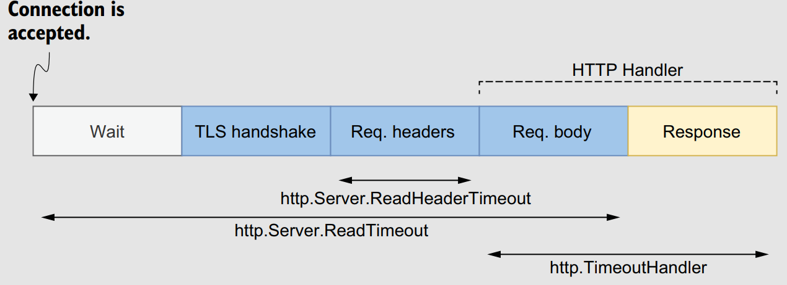

# Chapter 10: The Standard Library

## #75: Providing a wrong time duration

- The standard library provides common functions and methods that accept a `time.Duration`. However, because `time.Duration` is an alias for the `int64` type, newcomers to the language can get confused and provide a wrong duration.
- `time.Duration` represents the elapsed time between two instants in **nanoseconds**. Therefore, we provided `NewTicker` with a duration of `1,000 nanoseconds = 1 microsecond`.
- This mistake happens frequently. Indeed, standard libraries in languages such as *Java* and *JavaScript* sometimes ask developers to provide durations in `milliseconds`.
- Furthermore, if we want to purposely create a `time.Ticker` with an interval of 1 microsecond, we shouldn’t pass an `int64` directly. We should instead always use the `time.Duration` API to avoid possible confusion:
    ```go
    ticker = time.NewTicker(time.Microsecond)
    // Or
    ticker = time.NewTicker(1000 * time.Nanosecond)
    ```

## #76: time.After and memory leaks

- `time.After(time.Duration)` is a convenient function that returns a channel and waits for a provided duration to elapse before sending a message to this channel.
- It can be used to implement scenarios such as “*If I don’t receive any message in this channel for 5 seconds, I will … .*” But codebases often include calls to `time.After` in a loop, which may be a root cause of **memory leaks**.
- Here is a possible implementation:
    ```go
    func consumer(ch <-chan Event) {
        for {
            select {
            case event := <-ch:
                handle(event)
            case <-time.After(time.Hour):
                log.Println("warning: no messages received")
            }
        }
    }
    ```
- We may expect this channel to be closed during each loop iteration, but this isn’t the case ⚠️.
  - The resources created by `time.After` (including the channel) are released once the timeout expires and use memory until that happens.
  - How much memory? In `Go 1.15`, about *200 bytes* of memory are used per call to `time.After`.
  - If we receive a significant volume of messages, such as 5 million per hour, our application will consume 1 GB of memory to store the `time.After` resources.
- One possible fix is to use a context instead, like `ctx, cancel := context.WithTimeout(context.Background(), time.Hour)`. The 👎 of this approach is that we have to **re-create** a context during every single loop iteration. Creating a context isn’t the most lightweight operation in Go: for example, it **requires creating a channel**. Can we do better?
- The second option comes from the `time` package: `time.NewTimer`. This function creates a t`ime.Timer` struct that exports the following:
    - A `C` field, which is the internal timer channel
    - A `Reset(time.Duration)` method to reset the duration
    - A `Stop()` method to stop the timer.
- Let’s implement a new version using `time.NewTimer`:
  ```go
  func consumer(ch <-chan Event) {
    timerDuration := 1 * time.Hour
    timer := time.NewTimer(timerDuration)
    defer timer.Stop()
    for {
        timer.Reset(timerDuration)
        select {
        case event := <-ch:
            handle(event)
        case <-timer.C:
            log.Println("warning: no messages received")
        }
    }
  }
  ```

## #77: Common JSON-handling mistakes

### Unexpected behavior due to type embedding

- Let’s consider the following example:
    ```go
    event := Event{
        ID: 1234,
        Time: time.Now(),
    }
    b, err := json.Marshal(event)
    if err != nil {
        return err
    }
    fmt.Println(string(b))
    ```
- We may expect this code to print something like the following:
    ```json
    {"ID":1234,"Time":"2021-05-18T21:15:08.381652+02:00"}
    ```
- Instead, it prints this: `"2021-05-18T21:15:08.381652+02:00"`. What happened to the `ID` field and the `1234` value? 🤒.
- First, as discussed in *mistake #10*, if an embedded field type implements an interface, the struct containing the embedded field will also implement this interface.
`time.Time` implements the `json.Marshaler` interface. Because `time.Time` is an embedded field of `Event`, the compiler promotes its methods. Therefore, `Event` also implements `json.Marshaler`.
- We would also face the issue the other way around if we were unmarshaling an `Event` using `json.Unmarshal`.
- To fix this issue, there are two main possibilities. First, we can add a name so the
`time.Time` field is no longer **embedded**, or the other option is to make `Event` implement the `json.Marshaler` interface:
```go
func (e Event) MarshalJSON() ([]byte, error) {
    return json.Marshal(
        struct {
            ID int
            Time time.Time
        }{
            ID: e.ID,
            Time: e.Time,
        },
    )
}
```

### JSON and the monotonic clock

- An OS handles two different clock types: wall and monotonic:
  - The wall clock is used to determine the **current time of day**. This clock is subject to variations. For example, if the clock is synchronized using *NTP*, it can jump backward or forward in time. We shouldn’t measure durations using the wall clock because we may face strange behavior, such as **negative durations**.
  - The monotonic clock guarantees that time always moves forward and is not impacted by jumps in time.
- If you JSON marshall a `time.Time` then un-marshall it, you loose the monotonic part.
    ```sh
    2021-01-10 17:13:08.852061 +0100 CET m=+0.000338660
    2021-01-10 17:13:08.852061 +0100 CET
    ```
- So if you try to compare two time object later using `==`, it will fail.
- To avoid this, we can use the `Equal` method instead:
    ```go
    fmt.Println(event1.Time.Equal(event2.Time))
    ```
- We can also strip away the monotonic time using the `Truncate` method then use `==`:
    ```go
    event1 := Event{
        Time: t.Truncate(0),
    }
    ```

### Map of any

- There’s an important gotcha to remember if we use a map of `any`: any numeric value, regardless of whether it contains a decimal, is converted into a `float64` type 😶.
-  We can observe this by printing the type of `m["id"]`:
```go
fmt.Printf("%T\n", m["id"])
float64
```
- We should be sure we don’t make the wrong assumption and expect numeric values
without decimals to be converted into integers by default ⚠️.

## #78: Common SQL mistakes

### Forgetting that sql.Open doesn’t necessarily establish connections to a database

- The behavior depends on the SQL driver used. For some drivers, `sql.Open` doesn’t establish a connection: it’s only a preparation for later use (for example, with `db.Query`). Therefore, the first connection to the database may be established **lazily**.
- Why it matters? For example, in some cases, we want to make a service ready only after we know that all the dependencies are correctly **set up and reachable**. If we don’t know this, the service may **accept traffic** despite an erroneous configuration.
- 👍 Use `Ping` to force establishing a connection that ensures that the data source name is valid and the database is reachable.

### Forgetting about connections pooling

- `sql.Open` returns an `*sql.DB` struct. This struct **doesn’t** represent a **single database connection**; instead, it represents a pool of connections.
- A connection in the pool can have two states:
  - Already used (for example, by another goroutine that triggers a query)
  - Idle (already created but not in use for the time being)
- It’s also important to remember that creating a pool leads to four available config parameters that we may want to override. Each of these parameters is an exported method of `*sql.DB`:
  - `SetMaxOpenConns` — Maximum number of open connections to the database (default value: unlimited)
  - `SetMaxIdleConns` — Maximum number of idle connections (default value: 2)
  - `SetConnMaxIdleTime` — Maximum amount of time a connection can be idle before it’s closed (default value: unlimited)
  - `SetConnMaxLifetime` — Maximum amount of time a connection can be held open before it’s closed (default value: unlimited)
<p align="center"></p>

So, why should we tweak these config parameters?
  - Setting `SetMaxOpenConns` is important for production-grade applications. Because the default value is unlimited, we should set it to make sure it **fits** what the underlying **database can handle**.
  - The value of `SetMaxIdleConns` (default: 2) should be increased if our application generates a significant number of **concurrent** requests. Otherwise, the application may experience frequent **reconnects**.
  - Setting `SetConnMaxIdleTime` is important if our application may face a **burst of requests**. When the application returns to a more peaceful state, we want to make sure the connections created are eventually **released**.
  - Setting `SetConnMaxLifetime` can be helpful if, for example, we connect to a **load-balanced** database server. In that case, we want to ensure that our application never uses a connection for too long.

### Not using prepared statements

- A **prepared** statement is a feature implemented by many SQL databases to execute a **repeated SQL** statement. Internally, the SQL statement is **precompiled** and separated from the data provided. There are two main benefits:
  - 👍 **Efficiency** — The statement doesn’t have to be recompiled (compilation means **parsing + optimization + translation**).
  - 👍 **Security** — This approach reduces the risks of **SQL injection attacks**.

### Mishandling null values

- When we execute a sql query and iterate over the rows, we use `Scan` to copy the column into the values pointed to by the variables that receives the values.
- If the value retrieved is `NULL`, the SQL driver raises an error in `Scan()`.  There are two options to fix this issueL
    - Declare the variable (`X`) as a string(for example) pointer. By doing so, if the value is `NULL`, `X` will be `nil`.
    - The other approach is to use one of the `sql.NullXXX` types, such as `sql.NullString`.
- `sql.NullString` is a wrapper on top of a string. It contains two exported fields:
  - `String` contains the string value, and `Valid` conveys whether the string isn’t `NULL`.

### Not handling row iteration errors

- We have to know that the for rows `.Next() {}` loop can break either when there are no more rows or when an error happens while preparing the next row. Following a row iteration, we should call `rows.Err` to distinguish between the two cases:
    ```go
        for rows.Next() {
            // ...
        }
        if err := rows.Err(); err != nil {
            return "", 0, err
        }
    }

## #79: Not closing transient resources

It is important it is to close ephemeral resources and thus avoid leaks. Ephemeral resources must be closed at the right time and in specific situations. It’s not always clear up front what has to be closed. We can only acquire this information by carefully reading the API documentation and/or through experience. But we should remember that if a struct implements the `io.Closer` interface, we must eventually call the `Close` method 👍.

###  HTTP body

- resp is an `*http.Response` type. It contains a Body `io.ReadCloser` field. This body must be closed if `http.Get` doesn’t return an error; otherwise, it’s a **resource leak**.
- On the **server** side, while implementing an HTTP handler, we aren’t required to close the request body because the server does this **automatically**.
- We should also understand that a response body must be closed regardless of whether we read it ⚠️. For example, if we are only interested in the HTTP status code and not in the body, it has to be closed no matter what, to avoid a leak.
- Another essential thing to remember is that the behavior is different when we close the body, depending on whether we have read from it:
  - If we close the body without a read, the default HTTP transport may close the connection.
  - If we close the body following a read, the default HTTP transport won’t close the connection; hence, it may be **reused**.
  - Therefore, if `getStatusCode` is called repeatedly and we want to use **keep-alive** connections, we should read the body even though we aren’t interested in it:
  ```go
  _, _ = io.Copy(io.Discard, resp.Body) // reads the body but discards it without any copy, making it more efficient than io.ReadAll.
  ```

### sql.Rows

- Forgetting to close the rows means a **connection leak**, which prevents the database connection from being put back into the connection pool.

### os.File

- If we don’t eventually close an `os.File`, it will not lead to a leak per se: the file will be **closed automatically** when `os.File` is **garbage collected**. However, it’s better to call `Close` explicitly because we don’t know when the next GC will be triggered (unless we manually run it).
- There’s another benefit of calling `Close` **explicitly**: to actively monitor the error that is returned. For example, this should be the case with writable files.
- Writing to a file descriptor **isn’t a synchronous** operation. For performance concerns, data is buffered. The *BSD* manual page for close(2) mentions that a closure can lead to an error in a previously **uncommitted write** (still living in a buffer) encountered during an I/O error. For that reason, if we want to write to a file, we should propagate any error that occurs while closing the file:
    ```go
    func writeToFile(filename string, content []byte) (err error) {
        // Open file ...
        defer func() {
            closeErr := f.Close()
            if err == nil {
                err = closeErr
            }
        }()
        _, err = f.Write(content)
        return
    }
    ```
- Furthermore, success while closing a writable `os.File` doesn’t guarantee that the file will be written on disk. The write can still live in a buffer on the filesystem and not be flushed on disk. If durability is a critical factor, we can use the `Sync()` method to **commit** a change. In that case, errors coming from `Close` can be safely ignored:
    ```go
    func writeToFile(filename string, content []byte) error {
        // Open file ...
        defer func() {
            _ = f.Close()
        }()
        _, err = f.Write(content)
        if err != nil {
            return err
        }
        return f.Sync()
    }
    ```

## #80: Forgetting the return statement after replying to an HTTP request

- Remember that `http.Error` doesn’t stop a handler execution and must be added manually:
    ```go
    func handler(w http.ResponseWriter, req *http.Request) {
        err := foo(req)
        if err != nil {
            http.Error(w, "foo", http.StatusInternalServerError)
            return  //  <-- without a return, it may lead to a nil pointer dereference (and hence a goroutine panic).
    }
    // ...
    ```

## #81: Using the default HTTP client and server

### HTTP client

- What’s the problem with using the default HTTP client?
  - It doesn’t specify any **timeouts**. This absence of timeout is not something we want for production-grade systems: it can lead to many issues, such as never-ending requests that could exhaust system resources.
- The five steps during an HTTP request, and the related timeouts: <p align="center"></p>
- Here’s an example of an HTTP client that overrides these timeouts:
    ```go
    client := &http.Client{
        Timeout: 5 * time.Second,
        Transport: &http.Transport{
        DialContext: (&net.Dialer{Timeout: time.Second,}).DialContext,
        TLSHandshakeTimeout: time.Second,
        ResponseHeaderTimeout: time.Second,
        },
    }
    ```
- The second aspect to bear in mind about the default HTTP client is how connections are handled. By default, the HTTP client does **connection pooling**.
  - There is an extra timeout (`http.Transport.IdleConnTimeout`) to specify how long an idle connection is kept in the pool. The default value is 90 seconds, which means the connection can be reused for other requests during this time. After that, if the connection hasn’t been reused, it will be closed.
  - To configure the **number of connections in the pool**, we must override `http.Transport.MaxIdleConns`. This value is set to *100* by default. But there’s something important to note: the `http.Transport.MaxIdleConnsPerHost` limit per host, which by default is set to 2.
  - For example, if we trigger 100 requests to the same host, only 2 connections will remain in the connection pool after that. Hence, if we trigger 100 requests again, we will have to reopen at least 98 connections. This configuration can also impact the **average latency** if we have to deal with a significant number of **parallel requests** to the same host.

### HTTP server

- The five steps of an HTTP response, and the related timeouts: <p align="center"></p>
- While exposing our endpoint to untrusted clients, the best practice is to set at least the `http.Server.ReadHeaderTimeout` field and use the `http.TimeoutHandler` wrapper function. Otherwise, clients may exploit this flaw and, for example, create **never-ending connections** that can lead to exhaustion of system resources.
- Here’s an example of an HTTP server that overrides these timeouts:
    ```go
    s := &http.Server{
        Addr: ":8080",
        ReadHeaderTimeout: 500 * time.Millisecond,
        ReadTimeout: 500 * time.Millisecond,
        Handler: http.TimeoutHandler(handler, time.Second, "foo"),
    }
    ```
- Just as we described regarding HTTP clients, on the server side we can configure the maximum amount of time for the next request when **keep-alives** are enabled. We do so using `http.Server.IdleTimeout`:
    ```go
    s := &http.Server{
        // ...
        IdleTimeout: time.Second,
    }
    ```
