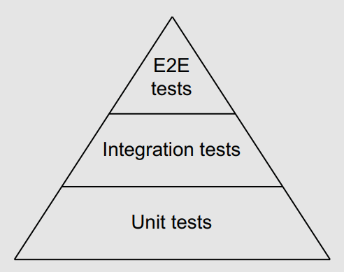

# Chapter 11: testing

## #82: Not categorizing tests

- Usually, as we go further up the pyramid, tests become more complex to write and slower to run, and it is more difficult to guarantee their **determinism**: <p align="center"></p>
- A common technique is to be **explicit** about which **kind of tests** to run.

### Build tags

- The most common way to classify tests is using **build tag**s. A build tag is a special comment at the beginning of a Go file, followed by an empty line: `//go:build foo`.
- we can use a build tag as a **conditional** option to build an application:
  - for example, if we want a source file to be included only if cgo is enabled: `//go:build cgo`.
  - Second, if we want to categorize a test as an **integration** test, we can add a specific build flag, such as integration.
- Then execute: `go test --tags=integration -v .`.
- If we want to run only integration tests? A possible way is to add a **negation** tag on the unit test files. For example, using `!integration` means we want to include the test file only if the integration flag is not enabled  `//go:build !integration`.

### Environment variables

- Build tags have one main 👎: the **absence of signals** that a test has been **ignored** (see http://mng.bz/qYlr).
- For that reason, some projects favor the approach of checking the test category using **environment variables**.
    ```go
    func TestInsert(t *testing.T) {
        if os.Getenv("INTEGRATION") != "true" {
            t.Skip("skipping integration test")
        }
    }
    ```

### Short mode

- If we like to categorize the slow test so we don’t have to run it every time. **Short mode** allows us to make this distinction:
    ```go
    func TestLongRunning(t *testing.T) {
        if testing.Short() {
            t.Skip("skipping long-running test")
        }
    }
    ```
- Then run `go test -short -v .`  to skip the test.

## #83: Not enabling the -race flag

- In Go, the race detector isn’t a static analysis tool used during compilation; instead, it’s a tool to find data races that occur at runtime. To enable it, we have to enable the -race flag while compiling or running a test. For example:
```sh
$ go test -race ./...
```
- In production, we should avoid it (or only use it in the case of **canary** releases, for example) because:
  - Memory usage may increase by 5 to 10x
  - Execution time may increase by 2 to 20x
- 🗒️ Internally, the race detector uses **vector clocks**, a data structure used to determine a **partial ordering** of events.
  - Each goroutine creation leads to the creation of a vector clock.
  - The instrumentation updates the vector clock at each memory access and synchronization event.
  - Then, it compares the vector clocks to detect potential data races.
- The race detector cannot catch a false positive (an apparent data race that isn’t a real one). Therefore, we know our code contains a data race if we get a warning. Conversely, it can sometimes lead to false negatives (missing actual data races) 🤐.
- We need to note two things regarding testing:
  - First, the race detector can only be **as good as our tests**. Thus, we should ensure that concurrent code is tested thoroughly
against data races.
  - Second, given the possible **false negatives**, if we have a test to check data races, we can put this logic inside a **loop**. Doing so increases the chances of catching possible data races:
  ```go
    func TestDataRace(t *testing.T) {
        for i := 0; i < 100; i++ {
            // Actual logic
        }
    }
    ```
- In addition, if a specific file contains tests that lead to data races, we can exclude it from race detection using the `!race` build tag.

## #84: Not using test execution modes

- **Parallel execution mode** allows us to run specific tests in parallel, which can be very useful: for example, **to speed up long-running** tests. We can mark that a test has to be run in parallel by calling `t.Parallel`:
    ```go
    func TestFoo(t *testing.T) {
        t.Parallel()
        // ...
    }
    ```
  - When we mark a test using `t.Parallel`, it is executed in parallel alongside all the other parallel tests.
  - In terms of execution, though, Go first runs all the **sequential tests** one by one. Once the sequential tests are completed, it executes the parallel tests.
  - By default, the maximum number of tests that can run simultaneously equals the `GOMAXPROCS` value. To serialize tests or, for example, increase this number in the context of long-running tests doing a lot of I/O, we can change this value using the `-parallel` flag:
    ```sh
    $ go test -parallel 16 .
    ```
- A best practice while writing tests is to make them isolated. For example, they **shouldn’t depend on execution order** or shared variables.
    - These hidden dependencies can mean a possible test error or, even worse, a bug that won’t be caught during testing.
    - To prevent that, we can use the `-shuffle` flag to **randomize tests**.
    - We can set it to on or off to enable or disable test shuffling (its disabled by default):
    ```sh
    $ go test -shuffle=on -v .
    ```
    - To force the tests to be run in the same order, we provide the **seed** value to shuffle:
    ```sh
    go test -shuffle=1636399552801504000 -v .
    ```

## #85: Not using table-driven tests

- Table-driven tests are an efficient technique for writing **condensed tests** and thus **reducing boilerplate code** to help us focus on what matters.
- Table-driven tests rely on subtests, and a single test function can include multiple subtests. For example, the following test contains two subtests:
    ```go
    func TestFoo(t *testing.T) {
        t.Run("subtest 1", func(t *testing.T) {
            if false {
                t.Error()
            }
        })
        t.Run("subtest 2", func(t *testing.T) {
            if 2 != 2 {
                t.Error()
            }
        })
    }
    ```
- We can also run a single test using the `-run` flag and concatenating the parent test name with the subtest. For example, we can run only subtest 1:
    ```sh
    $ go test -run=TestFoo/subtest_1 -v
    ```
- Table-driven tests **avoid boilerplat**e code by using a data structure containing test data together with subtests. Here’s a possible implementation using a map:
    ```go
    func TestRemoveNewLineSuffix(t *testing.T) {
    tests := map[string]struct {
        input string
        expected string
    }{
    `empty`: {
        input: "",
        expected: "",
    },
    `ending with \r\n`: {
        input: "a\r\n",
        expected: "a",
    },
    ...
    ```
- This test solves two drawbacks:
    - 👍 Each test name is now a string instead of a **PascalCase** function name, making it simpler to read.
    - 👍 The logic is written only once and shared for all the different cases. Modifying the testing structure or adding a new test requires minimal effort.
- When running subtests inside a loop using `Parallel`, we should create another variable or shadow `tt`:
    ```go
    for name, tt := range tests {
        tt := tt
        t.Run(name, func(t *testing.T) {
            t.Parallel()
            // Use tt
        })
    }
    ```

## #86: Sleeping in unit tests

- Flaky tests are among the biggest hurdles in testing because they are expensive to debug and undermine our confidence in testing accuracy.
- Calling `time.Sleep` in a test can be a **signal** of possible flakiness.
- Let's look at an example:
    ```go
    func TestGetBestFoo(t *testing.T) {
        mock := publisherMock{}
        h := Handler{
            publisher: &mock, n: 2,
        }
        foo := h.getBestFoo(42)
        // Check foo
        time.Sleep(10 * time.Millisecond)
        published := mock.Get()
        // Check published
    }
    ```
- This test is inherently flaky. There is no strict guarantee that *10ms* will be enough (in this example, it is likely but **not guaranteed)**.
- So, what are the options to improve this unit test? First We can periodically assert a given condition using **retries**:
    - We can write a function that takes an assertion as an argument and a maximum number of retries plus a wait time that is called periodically to avoid a **busy loop**:
        ```go
        func assert(t *testing.T, assertion func() bool, maxRetry int, waitTime time.Duration) {
            for i := 0; i < maxRetry; i++ {
                if assertion() {
                    return
                }
                time.Sleep(waitTime)
            }
            t.Fail()
        }
        ```
        - Instead of sleeping for *10ms*, we sleep each millisecond and configure a maximum number of retries. Such an approach **reduces** the execution time if the test succeeds because we reduce the waiting interval 👍.
    - Another strategy is to use **channels** to synchronize the goroutine publishing the `Foo` structs and the testing goroutine.
      - The publisher sends the received argument to a channel. Meanwhile, the testing goroutine sets up the mock and creates the assertion based on the received value.
      - We can also **implement** a timeout strategy to make sure we don’t wait forever for `mock.ch` if something goes wrong. For example, we can use select with a `time.After` case.
- Indeed, synchronization **reduces waiting time** to the bare minimum and makes a test fully deterministic if well designed.
- If synchronization is truly impossible, we should use the retry option, which is a better choice than using passive sleeps to eradicate non-determinism in tests.

## #87: Not dealing with the time API efficiently

- In general, we should be cautious about testing code that uses the time API. It can be an open door for **flaky** tests.
- Imagine we implement unit tests for a in-memory cache of application received events:
    ```go
    func TestCache_TrimOlderThan(t *testing.T) {
        events := []Event{
            {Timestamp: time.Now().Add(-20 * time.Millisecond)},
            {Timestamp: time.Now().Add(-10 * time.Millisecond)},
            {Timestamp: time.Now().Add(10 * time.Millisecond)},
        }
        cache := &Cache{}
        cache.Add(events)
        cache.TrimOlderThan(15 * time.Millisecond)
        got := cache.GetAll()
        expected := 2
        if len(got) != expected {
            t.Fatalf("expected %d, got %d", expected, len(got))
        }
    }
    ```
- Such an approach has one main 👎: if the machine executing the test is **suddenly busy**, we may trim fewer events than expected. We might be able to increase the duration provided to reduce the chance of having a failing test, but doing so isn’t always possible.
- The first approach is to make the way to retrieve the current time a dependency of the `Cache` struct. In production, we would **inject the real** implementation, whereas in unit tests, we would pass a **stub**, for example:
    ```go
    func TestCache_TrimOlderThan(t *testing.T) {
        events := []Event{
            {Timestamp: parseTime(t, "2020-01-01T12:00:00.04Z")},
            {Timestamp: parseTime(t, "2020-01-01T12:00:00.05Z")},
            {Timestamp: parseTime(t, "2020-01-01T12:00:00.06Z")},
        }
        cache := &Cache{
            now: func() time.Time {return parseTime(t, "2020-01-01T12:00:00.06Z")}
        }
        cache.Add(events)
        cache.TrimOlderThan(15 * time.Millisecond)
        // ...
    }
    ```
- This approach has one main drawback: the `now` dependency isn’t available if we, for example, create a unit test from an **external** package.
- In that case, we can use another technique. Instead of handling the time as an unexported dependency, we can ask clients to provide the current time:
    ```go
    func (c *Cache) TrimOlderThan(now time.Time, since time.Duration) {
        // ...
    }
    ```
- To go even further, we can **merge** the two function arguments in a single time.Time that represents a specific point in time until which we want to trim the events:
    ```go
    func (c *Cache) TrimOlderThan(t time.Time) {
        // ...
    }
    ```
- And in the test, we also have to pass the corresponding time:
    ```go
    func TestCache_TrimOlderThan(t *testing.T) {
        // ...
        cache.TrimOlderThan(parseTime(t, "2020-01-01T12:00:00.06Z").Add(-15 * time.Millisecond))
        // ...
    }
    ```
- This approach is the simplest because it doesn’t require creating another type and a stub.

## #88: Not using testing utility packages

### The httptest package

- The [httptest package](https://pkg.go.dev/net/http/httptest) provides utilities for HTTP testing for both clients and servers. Let’s look at these two use cases.
- An HTTP handler accepts two arguments: the request and a way to write the response.
```go
func TestHandler(t *testing.T) {
    req := httptest.NewRequest(http.MethodGet, "http://localhost", strings.NewReader("foo")) // Build the request
    w := httptest.NewRecorder() // Creates the response recorder.
    Handler(w, req)
    if got := w.Result().Header.Get("X-API-VERSION"); got != "1.0" {
        t.Errorf("api version: expected 1.0, got %s", got)
    }
    body, _ := ioutil.ReadAll(wordy)
    if got := string(body); got != "hello foo" {
        t.Errorf("body: expected hello foo, got %s", got)
    }
    if http.StatusOK != w.Result().StatusCode {
        t.FailNow()
    }
}
```
- Testing a handler using `httptest` doesn’t test the **transport** (the HTTP part). The focus of the test is calling the handler directly with a request and a way to record the response. Then, using the response recorder, we write the assertions to verify the HTTP header, body, and status code.\
- What if we want to test this client? One option is to use Docker and spin up a **mock server** to return some preregistered responses. However, this approach makes the test **slow** to execute.
- The other option is to use `httptest.NewServer` to create a local HTTP server based on a handler that we will provide. Once the server is up and running, we can pass its URL to `GetDuration`.
    ```go
    func TestDurationClientGet(t *testing.T) {
        srv := httptest.NewServer(
            http.HandlerFunc(func(w http.ResponseWriter, r *http.Request) {
                _, _ = w.Write([]byte(`{"duration": 314}`))
            },),
        )
        defer srv.Close()
        client := NewDurationClient()
        duration, err := client.GetDuration(srv.URL, 51.551261, -0.1221146, 51.57, -0.13)
        if err != nil {
            t.Fatal(err)
        }
        if duration != 314*time.Second {
            t.Errorf("expected 314 seconds, got %v", duration)
        }
    }
    ```
- Compared to testing a handler, this test performs an **actual HTTP call**, but it executes in only a few **milliseconds**.

### The iotest package

- The [iotest package](https://pkg.go.dev/testing/iotest) implements utilities for testing readers and writers.
- When implementing a custom `io.Reader`, we should remember to test it using `iotest.TestReader`. This utility function tests that a reader behaves correctly: it accurately returns the number of bytes read, fills the provided slice, and so on. It also tests different behaviors if the provided reader implements interfaces such as `io.ReaderAt`.
    ```go
    func TestLowerCaseReader(t *testing.T) {
        err := iotest.TestReader(
            &LowerCaseReader{reader: strings.NewReader("aBcDeFgHiJ")}, io.Reader([]byte("acegi")))
    if err != nil {
        t.Fatal(err)
    }
    ```
- Another use case for the `iotest` package is to make sure an application using readers and writers is tolerant to errors:
  - `iotest.ErrReader` creates an `io.Reader` that returns a provided error.
  - `iotest.HalfReader` creates an `io.Reader` that reads only half as many bytes as requested from an io.Reader.
  - `iotest.OneByteReader` creates an `io.Reader` that reads a single byte for each non-empty read from an io.Reader.
  - `iotest.TimeoutReader` creates an `io.Reader` that returns an error on the second read with no data. Subsequent calls will succeed.
  - `iotest.TruncateWriter` creates an `io.Writer` that writes to an `io.Writer` but stops silently after `n` bytes.

## #89: Writing inaccurate benchmarks

- In general, we should never guess about performance 🧠.
- **Not resetting or pausing the timer**:
  - In some cases, we need to perform operations before the benchmark loop. These operations may take quite a while (for example, generating a large slice of data) and may significantly impact the benchmark results.
  - In this case, we can use the `ResetTimer` method before entering the loop:
      ```go
      func BenchmarkFoo(b *testing.B) {
          expensiveSetup()
          b.ResetTimer()
          for i := 0; i < b.N; i++ {
              functionUnderTest()
          }
      }
      ```
  - What if we have to perform an expensive setup not just once but within **each loop iteration**?
  - We can’t reset the timer, because that would be executed during each loop iteration. But we can stop and resume the benchmark timer, surrounding the call to `expensiveSetup`:
      ```go
      for i := 0; i < b.N; i++ {
          b.StopTimer()
          expensiveSetup()
          b.StartTimer()
          functionUnderTest()
      }
      ```
- **Making wrong assumptions about micro-benchmarks**:
  - Changing the order of execution of these 2 unit tests shows different results.
    ```go
    func BenchmarkAtomicStoreInt32(b *testing.B) {
        var v int32
        for i := 0; i < b.N; i++ {
            atomic.StoreInt32(&v, 1)
        }
    }
    func BenchmarkAtomicStoreInt64(b *testing.B) {
        var v int64
        for i := 0; i < b.N; i++ {
            atomic.StoreInt64(&v, 1)
        }
    }
 - In the case of micro-benchmarks, many factors can impact the results, such as **machine activity** while running the benchmarks, **power management**, **thermal scaling**, and better **cache alignment** of a sequence of instructions. We must remember that many factors, even outside the scope of our Go project, can impact the results.
 - Tools such as *perflock* can limit how much CPU a benchmark can consume. For example, we can run a benchmark with 70% of the total available CPU, giving 30% to the OS and other processes and reducing the impact of the machine activity factor on the results 👍.
 - One option is to increase the benchmark time using the `-benchtime` option. Similar to the **law of large numbers** in probability theory, if we run a benchmark a large number of times, it should tend to approach its expected value.
 - Another option is to use external tools on top of the classic benchmark tooling. For instance, the *benchstat* tool, which is part of the golang.org/x repository, allows us to compute and compare statistics about benchmark executions.
    ```sh
    $ go test -bench=. -count=10 | tee stats.txt
    cpu: Intel(R) Core(TM) i5-7360U CPU @ 2.30GHz
    BenchmarkAtomicStoreInt32-4 234935682 5.124 ns/op
    BenchmarkAtomicStoreInt32-4 235307204 5.112 ns/op
    // ...

    // We can then run benchstat on this file:
    $ benchstat stats.txt
    name time/op
    AtomicStoreInt32-4 5.10ns ± 1%
    AtomicStoreInt64-4 5.10ns ± 1%
    ```
- **Not being careful about compiler optimizations**:
  - If the function we are testing is simple enough that the compile dedices to **inline** it, it can lead to wrong benchmark assumptions 🤒.
  - To avoid compiler optimizations fooling benchmark results: assign the result of the function under test to a **local variable**, and then assign
the latest result to a **global variable**:
    ```go
    var global uint64
    func BenchmarkPopcnt2(b *testing.B) {
        var v uint64
        for i := 0; i < b.N; i++ {
            v = popcnt(uint64(i))
        }
        global = v
    }
    ```
- **Being fooled by the observer effect**:
  - Imagine we want to benchmark a function that sums the first 8 columns of a matrix of 512 columns, and we want to know whether varying the number
of columns has an impact to decide which one is the most performant given a fixed number of rows:
    ```go
    func calculateSum512(s [][512]int64) int64 {
        var sum int64
        for i := 0; i < len(s); i++ {
            for j := 0; j < 8; j++ {
                sum += s[i][j]
            }
        }
        return sum
    }
    func calculateSum513(s [][513]int64) int64 {
        // Same implementation as calculateSum512
    }
    ```
- We want to create the matrix only once, to limit the footprint on the results. Therefore, we call `createMatrix512` and `createMatrix513` outside of the loop. We may expect the results to be similar as again we only want to iterate on the first eight columns, but this isn’t the case (on my machine) 😶‍🌫️:
    ```sh
    cpu: Intel(R) Core(TM) i5-7360U CPU @ 2.30GHz
    BenchmarkCalculateSum512-4 81854 15073 ns/op
    BenchmarkCalculateSum513-4 161479 7358 ns/op
    ```
- The second benchmark with 513 columns is about **50% faster** 🤔:
- The main issue is that we keep **reusing** the same matrix in both cases. Because the function is repeated **thousands of times**, we don’t measure the function’s execution when it receives a plain new matrix. Instead, we measure a function that gets a matrix that already has a subset of the cells present in the **cache**. Therefore, because `calculateSum513` leads to fewer **cache misses**, it has a better execution time 🤪.

## #90: Not exploring all the Go testing features

### Code coverage

- During the development process, it can be handy to see visually which parts of our code are covered by tests. We can access this information using the `-coverprofile` flag:
    ```sh
    go test -coverprofile=coverage.out ./...
    ```
- This command creates a `coverage.out` file that we can then open using go tool cover:
    ```sh
    $ go tool cover -html=coverage.out
    ```

### Testing from a different package

- We may want our tests to focus on what’s visible from the outside (exposed APIs), not the implementation details. This way, if the implementation
changes (for example, if we refactor one function into two), the tests will remain the same.
- To follow this pattern, we can place our tests in a external package, for example under `tests/counter_test.go`. By doing so, we make sure we cannot access **internal** variables/methods, hence we will focus on testing the **exposed behavior**.

### Utility functions

- Imagine a situation where you have to create a customer in every single test and fail the tests if there are errors.
- Instead of repeating the code, we can create the `createCustomer` utility function, and then we perform the rest of the test. We can simplify error management by passing the `*testing.T` variable to the utility function:
    ```go
    func createCustomer(t *testing.T, someArg string) Customer {
        // Create customer
        if err != nil {
            t.Fatal(err)
        }
        return customer
    }

    func TestCustomer(t *testing.T) {
        customer := createCustomer(t, "foo")
        // ...
    }
    ```

### Setup and teardown

- We can call setup and teardown functions per test or per package. Fortunately, in Go, both are possible 👍.
- To do so per test, we can call the setup function as a preaction and the teardown function using defer:
    ```go
    func TestMySQLIntegration(t *testing.T) {
        setupMySQL()
        defer teardownMySQL()
    // ...
    }
    ```
- It’s also possible to register a function to be executed at the end of a test:
    ```go
    t.Cleanup(func() {
        _ = db.Close()
    })
    ```
- Note that we can register **multiple cleanup** functions. In that case, they will be executed just as if we were using defer: **last in**, **first out**.
- To handle setup and teardown **per package**, we have to use the `TestMain` function.
- This particular function accepts a `*testing.M` argument that exposes a single `Run()` to run all the tests. Therefore, we can surround this call with setup and teardown functions:
    ```go
    func TestMain(m *testing.M) {
        setupMySQL()
        code := m.Run()
        teardownMySQL()
        os.Exit(code)
    }
    ```
