# Chapter 12 : Optimizations

## #91: Not understanding CPU caches

- When a specific memory location is accessed (for example, by reading a variable), one of the following is likely to happen in the near future:
    - The same location will be referenced again.
    - Nearby memory locations will be referenced.
- The former refers to **temporal locality**, and the latter refers to **spatial locality**. Both are part of a principle called *locality of reference* ⭐.
- Because of spatial locality, the CPU copies what we call a **cache line** instead of copying a single variable from the main memory to a cache.
- If we benchmark these two functions:
  - `sumFoo` which receives a **slice of struct**, and sums the first field of the struct.
  - `sumBar` also computes a sum. But this time, the argument is a **struct containing slices**. <p align="center">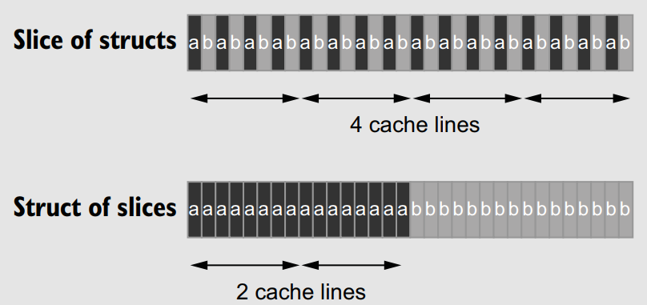</p>
- ➡️ `sumBar` is faster (about 20% on my machine). The main reason is a **better spatial locality** (all the elements of a
are allocated contiguously ) that makes the CPU **fetch fewer cache lines** from memory.
- This example demonstrates how spatial locality can have a substantial impact on performance. To optimize an application, we should **organize data** to get the most value out of each individual cache line.
- **Predictability** refers to the ability of a CPU to anticipate what the application will do to speed up its execution. Let’s see a concrete example where a lack of predictability negatively impacts application performance.
  - Again, let’s look at two functions that sum a list of elements:
    - `linkedList` iterates over a linked list (allocated contiguously) and sums all the values.
    - `sum2` iterates over a slice, one element out of two. <p align="center">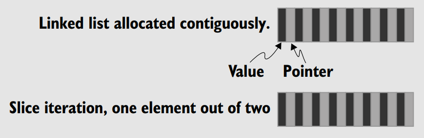</p>
  - The two data structures have the **same spatial locality**, so we may expect a similar execution time for these two functions. But the function iterating on the slice is significantly faster (about 70% on my machine). What’s the reason? 🤔:
- **Striding** relates to how CPUs work through data. There are three different types of strides:
    - **Unit stride** — All the values we want to access are allocated **contiguously**: for example, a slice of `int64` elements. This stride is **predictable** for a CPU and the most efficient because it requires a minimum number of cache lines to walk through the elements.
    - **Constant stride** — Still predictable for the CPU: for example, a slice that iterates over every two elements. This stride requires more cache lines to walk through data, so it’s less efficient than a unit stride.
    - **Non-unit stride** — A stride the CPU **can’t predict**: for example, a linked list or a slice of pointers. Because the CPU **doesn’t know** whether data is allocated **contiguously**, it won’t fetch any cache lines. <p align="center">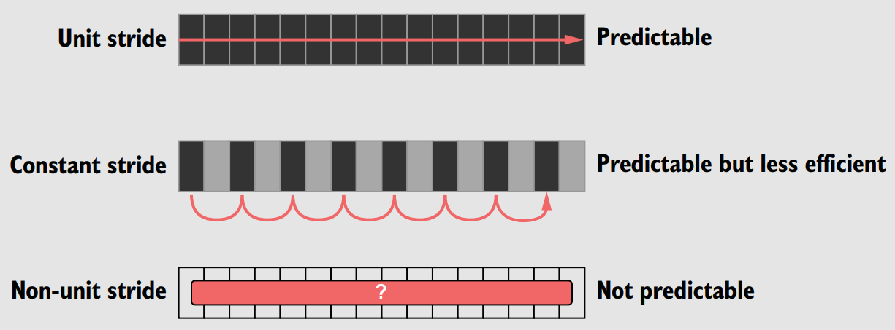</p>
- For `sum2`, we face a constant stride. However, for the linked list, we face a non-unit stride. Even though we know the data is allocated contiguously, the CPU doesn’t know that. Therefore, it can’t predict how to walk through the linked list 🤷.
- Because of the different stride and similar spatial locality, iterating over a linked list is **significantly slower** than a slice of values. We should generally favor unit strides over constant strides because of the better spatial locality. But a non-unit stride cannot be predicted by the CPU regardless of how the data is allocated, leading to negative performance impacts.
- why changing the overall number of columns (seen in *Mistake#89*) impacted the benchmark results. It might sound counterintuitive: because we need to read only the first eight columns, why does changing the total number of columns affect the execution time ❓
  - When these two functions (`calculateSum512` and `513`) are benchmarked each time with a new matrix, we don’t observe **any difference**. However, if we keep reusing the same matrix, `calculateSum513` is about **50% faster** on my machine. The reason lies in CPU caches and how a memory block is copied to a cache line.
  - Now, let’s say the benchmark executes the function with a slice pointing to the same matrix starting at address `0000000000000`. When the function reads `s[0][0]`, the address isn’t in the cache. This block was **already replaced**.
  - Instead of using **CPU caches from one execution** to **another**, the benchmark will lead to more **cache misses**.
  - This type of cache miss is called a **conflict miss**: a miss that wouldn’t occur if the cache wasn’t **partitioned**. All the variables we iterate belong to a memory block whose set index is `00`. Therefore, we use only **one cache set** instead of having a distribution across the entire cache.
  - In this example, this stride is called a **critical stride**: it leads to accessing memory addresses with the same set index that are hence stored to the same cache set.
  - Let’s come back to our real-world example with the two functions calculateSum512 and calculateSum513. The benchmark was executed on a `32 KB` eight-way set-associative L1D cache: 64 sets total. Because a cache line is `64 bytes`, the critical stride equals 64 × 64 bytes = `4 KB`. Four KB of `int64` types represent `512` elements.
  - ➡️ Therefore, we reach a critical stride with a matrix of **512 columns**, so we have a **poor caching distribution**. Meanwhile, if the matrix contains **513 columns**, it doesn’t lead to a critical stride. This is why we observed such a massive difference between the two benchmarks 😵‍💫.

## #92: Writing concurrent code that leads to false sharing

- To illustrate the concept of false sharing, we use two structs, `Input` and `Result`:
    ```go
    type Input struct {
        a int64
        b int64
    }
    type Result struct {
        sumA int64
        sumB int64
    }
    ```
- We spin up two goroutines: one that iterates over each `a` field and another that iterates over each `b` field:
    ```go
    go func() {
        for i := 0; i < len(inputs); i++ {
            result.sumA += inputs[i].a
        }
        wg.Done()
    }()
    go func() {
        for i := 0; i < len(inputs); i++ {
            result.sumB += inputs[i].b
        }
        wg.Done()
    }()
    ```
- Because `sumA` and `sumB` are allocated contiguously, in most cases (seven out of eight), both variables are allocated to the **same memory block**. <p align="center">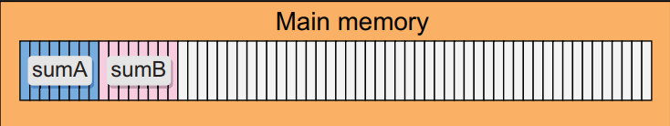</p>
- Now, let’s assume that the machine contains two cores. In most cases, we should eventually have two threads scheduled on different cores. So if the CPU decides to copy this memory block to a cache line, it is copied twice: <p align="center">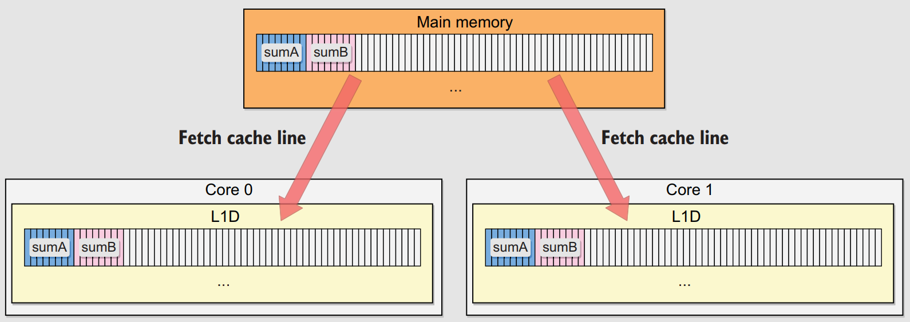</p>
- Both cache lines are replicated because L1D is per core. Recall that in our example, each goroutine updates its own variable: `sumA` on one side, and `sumB` on the other side.
- Because these cache lines are **replicated**, one of the goals of the CPU is to **guarantee cache coherency**. For example, if one goroutine updates `sumA` and another reads `sumA` (after some synchronization), we expect our application to get the latest value.
- However, our example doesn’t do exactly this. Both goroutines access their own variables, not a shared one. We might expect the CPU to know about this and understand that it **isn’t a conflict**, but this isn’t the case 🤷‍♂️.
- When we write a variable that’s in a cache, the **granularity** tracked by the CPU isn’t the variable: it’s the **cache line**.
- When a cache line is **shared** across **multiple cores** and at least one goroutine is a **writer**, the **entire cache line** is **invalidated**. - This happens even if the updates are logically independent (for example, `sumA` and `sumB`). This is the problem of false sharing, and it degrades performance ⚠️.
- So how do we solve false sharing? There are two main solutions.
    - The first solution is to use the same approach we’ve shown but ensure that `sumA` and `sumB` aren’t part of the same cache line. For example, we can update the `Result` struct to add **padding** between the fields:
        ```go
        type Result struct {
            sumA int64
            _ [56]byte
            sumB int64
        }
        ```
        - Using padding, `sumA` and `sumB` will always be part of different memory blocks and hence **different cache lines**.
        - If we benchmark both solutions (with and without padding), we see that the padding solution is **significantly faster** (about 40% on my machine) 😮‍💨.
    - The second solution is to **rework the structure** of the algorithm. For example, instead of having both goroutines share the same struct, we can make them communicate their local result via channels.

## #93: Not taking into account instruction-level parallelism

- CPU designers stopped focusing solely on **clock speed** to improve CPU performance. They developed multiple optimizations, including **ILP (Instruction-Level Parallelism)**.
- If we have a sequence of 3 instructions:
  - If executed sequentially, this would have taken the following time: `total time = t(I1) + t(I2) + t(I3)`.
  - Thanks to ILP, the total time is the following: `total time = max(t(I1), t(I2), t(I3))`.
- ILP looks 🤹‍♂️, theoretically. But it leads to a few challenges called **hazards**:
  - For example, what if `I3` sets a variable to 42 but `I2` is a conditional instruction. In theory, this scenario should prevent executing `I2` and `I3` in parallel. This is called a **control hazard** or **branching hazard**. In practice, CPU designers solved control hazards using **branch prediction**.
  - For example, if `I1` adds the numbers in registers A and B to C and `I2` adds the numbers in registers C and D to D. Because `I2` depends on the outcome of `I1` concerning the value of register C, the two instructions cannot be executed simultaneously ➡️ **data hazard**.
    - CPU designers have come up with a trick called **forwarding** that basically bypasses writing to a register. This technique doesn’t solve the problem but rather tries to alleviate the effects 🤷.
  - There are also **structural hazards**, when at least two instructions in the pipeline need the **same resource**. As Go developers, we can’t really impact these kinds of hazards.
- Let’s get back to our initial problem and focus on the content of the loop:
    ```go
    s[0]++
    if s[0]%2 == 0 {
        s[1]++
    }
    ```
- If we highlight the hazards between the instructions, we get: <p align="center">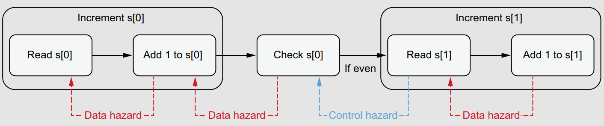</p>
    - The only independent instructions are the `s[0]` check and the `s[1]` increment, so these two instruction sets can be executed in parallel thanks to branch prediction. <p align="center">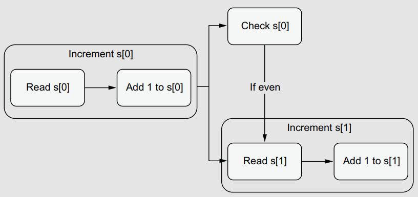</p>

- Can we improve our code to minimize the number of data hazards ❓ Let’s write another version that introduces a **temporary variable**:
    ```go
    v := s[0]
    s[0] = v + 1
    if v%2 != 0 {
        s[1]++
    }
    ```
<p align="center">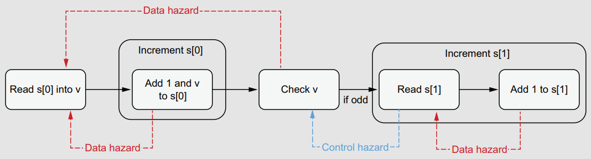</p>

- The significant difference is regarding the data hazards: the `s[0]` increment step and the check `v` step now depend on the **same instruction** (`read s[0] into v`).
- Why does this matter? Because it allows the CPU to increase the level of parallelism:
<p align="center">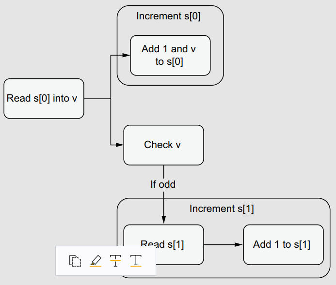</p>

- Despite having the same number of steps, the second version increases how many steps can be executed in parallel: three parallel routes instead of two. Meanwhile, the execution time should be optimized because the longest path has been reduced. If we benchmark these two functions, we see a significant **speed improvement** for the second version (about 20% on my machine), mainly because of ILP.

## #94: Not being aware of data alignment

- Suppose we allocate two variables, an `int32` (32 bytes) and an `int64` (64 bytes):
    ```go
    var i int32
    var j int64
    ```
- Without data alignment, on a 64-bit architecture, these two variables could be allocated as below:
    <p align="center">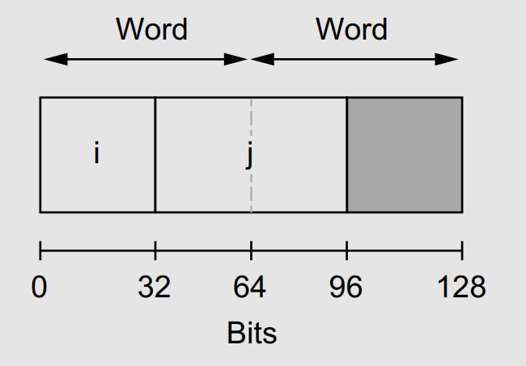</p>
- The `j` variable allocation could be spread over two words. If the CPU wanted to read `j`, it would require **two memory accesses** instead of one.
- To prevent such a case, a variable’s memory address should be a **multiple** of its own **size**. This is the concept of **data alignment**. In Go, the alignment is guaranteed for common variable types such as: `byte`, `float64`, `complex128`, ..
- During the compilation, the Go compiler adds **padding** to guarantee data alignment:
    ```go
    type Foo struct {
        b1 byte
        _ [7]byte // Added by the compiler
        i int64
        b2 byte
        _ [7]byte // Added by the compiler, because a struct’s size must be a multiple of the word size (8 bytes)
    }
    ```
- Every time a `Foo` struct is created, it requires **24 bytes** in memory, but only **10 bytes** contain data—the remaining 14 bytes are padding ❗
- Because a struct is an **atomic unit**, it will never be **reorganized**, even after a GC; it will always occupy 24 bytes in memory.
- Note that the compiler **doesn’t rearrange** the fields; it only adds padding to guarantee data alignment.
- How can we reduce the amount of memory allocated? The rule of thumb is to reorganize a struct so that its fields are **sorted by type size** in descending order 👍.
- Besides the size overhead of padding, if we created `Foo` variables frequently and they were allocated to the heap, the result would be more frequent GCs, impacting overall application performance ⚠️.
- Speaking of performance, there’s another effect on **spatial locality**:
    ```go
    // Consider the example of iterating over the slice and sums all the i fields.
    for i := 0; i < len(foos); i++ {
        s += foos[i].i
    }
    ```
  - Each gray bar represents 8 bytes of data, and the darker bars are the i variables.
    <p align="center">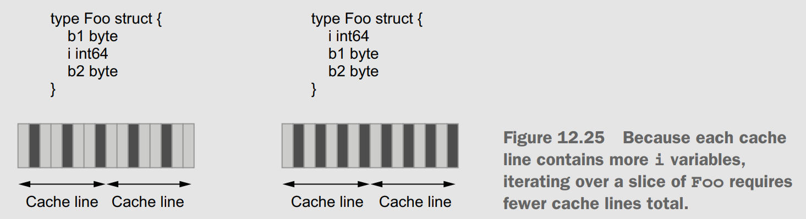</p>
  - Because each cache line contains more `i` variables, iterating over a slice of `Foo` requires fewer cache lines total.
  - ➡️  Each cache line is more useful because it contains on average **33%** more `i` variables. Therefore, iterating over a `Foo` slice to sum all the int64 elements is more efficient 👍.

## #95: Not understanding stack vs. heap

- When a goroutine starts, it gets **2 KB** of contiguous memory as its stack space (this size has evolved over time and could change again). However, this size **isn’t fixed** at run time and can grow and shrink as necessary (but it always remains contiguous in memory, preserving data locality).
- Consider the example below:
    ```go
    func main() {
        a := 3
        b := 2
        c := sumPtr(a, b)
        println(*c)
    }
    func sumPtr(x, y int) *int {
        z := x + y
        return &z
    }
    ```
- If `c` was referencing the address of the `z` variable, and that `z` was allocated on the stack, we would have a major problem. The address would **no longer be valid,** plus the stack frame of main would keep growing and erase the `z` variable. For that reason, the stack isn’t enough, and we need another type of memory: the **heap**.
- Because the `z` variable couldn’t live on the stack; therefore, it has been **escaped** to the heap. If the compiler cannot prove that a variable isn’t referenced after the function returns, the variable is allocated on the heap 💁.
- The stack is **self-cleaning**, and is accessed by a single goroutine. Conversely, the heap must be cleaned by an external system: the **GC**.
- The more heap allocations are made, the more we **pressure** the GC. When the GC runs, it uses **25%** of the available CPU capacity and may create milliseconds of “*stop the world*” latency (the phase when an application is paused).
- We must also understand that allocating on the stack is **faster** for the Go runtime because it’s trivial: a pointer references the following available memory address. Conversely, allocating on the heap requires more effort to find the right place and hence takes more time.
> 💡 This example shows that using pointers to avoid a copy **isn’t necessarily faster**; it depends on the context. So far in this book, we have only discussed values versus pointers via the prism of semantics: using a pointer when a value has to be **shared**. In most cases, this should be the rule to follow. Also bear in mind that modern CPUs are extremely efficient at copying data, especially within the same cache line. Let’s avoid premature optimization and focus on readability and semantics first.
- **Escape analysis** refers to the work performed by the compiler to decide whether a variable should be allocated on the stack or the heap. Let’s look at the main rules.
  - When an allocation cannot be done on the stack, it is done on the heap. Even though this sounds like a simplistic rule, it’s important to remember 🤷.
  - For example, if the compiler cannot prove that a variable isn’t **referenced** after a function returns, this variable is allocated on the heap.
  - In general, **sharing up** escapes to the heap and **sharing down** stays on the stack.
- The following are other cases in which a variable can be escaped to the heap:
  - **Global variables**, because multiple goroutines can access them.
  - A **pointer** sent to a **channel**:
    ```go
    type Foo struct{ s string }
    ch := make(chan *Foo, 1)
    foo := &Foo{s: "x"}
    ch <- foo // Here, foo escapes to the heap.
    ```
  - A variable referenced by a value sent to a channel:
    ```go
    type Foo struct{ s *string }
    ch := make(chan Foo, 1)
    s := "x"
    bar := Foo{s: &s} // Because s is referenced by Foo via its address, it escapes to the heap in these situations
    ch <- bar
    ```
  - If a local **variable** is **too large** to fit on the stack.
  - If the size of a local variable is **unknown**. For example, `s := make([]int, 10)` may not escape to the heap, but `s := make([]int, n)` will, because its size is based on a variable.
  -  If the backing array of a slice is reallocated using **append**.
- Although this list gives us ideas for understanding the compiler’s decisions, it’s **not exhaustive** and may change in future Go versions. To confirm an assumption, we can access the compiler’s decisions using `-gcflags`:
    ```sh
    $ go build -gcflags "-m=2"
    ...
    ./main.go:12:2: z escapes to heap:
    ```

## #96: Not knowing how to reduce allocations

- We discuss three common approaches to reduce allocations:
    - Changing our API
    - Relying on compiler optimizations
    - Using tools such as `sync.Pool`.

### API changes

- Let’s take as a concrete example the `io.Reader` interface:
    ```go
    type Reader interface {
        Read(p []byte) (n int, err error)
    }
    ```
- The Go designers used the sharing-down approach to prevent **automatically escaping** the slice to the heap. Therefore, it’s up to the **caller** to provide a slice.
- That doesn’t necessarily mean this slice won’t be escaped: the compiler may have decided that this slice cannot stay on the stack. However, it’s up to the caller to handle it, not a constraint caused by calling the `Read` method.

### Compiler optimizations

- In Go, we can’t define a map using a slice as a key type. In some cases, especially in applications doing I/O, we may receive `[]byte` data that we would like to use as a key. We are obliged to transform it into a string first, so we can write the following code:
    ```go
    func (c *cache) get(bytes []byte) (v int, contains bool) {
        key := string(bytes)
        v, contains = c.m[key]
        return
    }
    ```
- However, the Go compiler implements a specific optimization if we query the map using `string(bytes)`:
    ```go
    func (c *cache) get(bytes []byte) (v int, contains bool) {
        v, contains = c.m[string(bytes)]
        return
    }
    ```
- Despite this being almost the same code (we call `string(bytes)` directly instead of passing a variable), the compiler will avoid doing this **bytes-to-string** conversion. Hence, the second version is faster than the first.

### sync.Pool

- If we **frequently allocate** many objects of the **same type**, we can consider using `sync.Pool`. It is a set of temporary objects that can help us prevent reallocating the same kind of data repeatedly. And `sync.Pool` is safe for use by multiple goroutines simultaneous.
- We define a new pool using the `sync.Pool` struct and set the factory function to create a new `[]byte` with a length of *1,024* elements. In the `write` function, we try to retrieve one buffer from the pool.
- If the pool is **empty**, the function creates a **new buffer**; otherwise, it selects an arbitrary buffer from the pool and returns it.
- One crucial step is to reset the buffer using `buffer[:0]`, as this slice may already have been used. Then we defer the call to `Put` to put the slice back into the pool.
- With this version, calling `write` doesn’t lead to creating a new `[]byte` slice for **every call**. Instead, we can **reuse** existing allocated slices. In the worst-case scenario — for example, after a GC — the function will create a new buffer; however, the amortized allocation cost is reduced.
    ```go
    var pool = sync.Pool{
        New: func() any {
            return make([]byte, 1024)
        },
    }
    func write(w io.Writer) {
        buffer := pool.Get().([]byte)
        buffer = buffer[:0]
        defer pool.Put(buffer)
        getResponse(buffer)
        _, _ = w.Write(buffer)
    }
    ```

## #97: Not relying on inlining

- If we run go build using `-gcflags`, we access the decision made by the compiler regarding inlining a function:
    ```sh
    $ go build -gcflags "-m=2"
    ./main.go:10:6: can inline sum with cost 4 as:
    func(int, int) int { return a + b }
    ...
    ./main.go:6:10: inlining call to sum func(int, int) int { return a + b }
    ```
- Inlining only works for functions with a **certain complexity**, also known as an **inlining budget**. Otherwise, the compiler will inform us that the function is too complex to be inlined:
    ```sh
    ./main.go:10:6: cannot inline foo: function too complex:
    cost 84 exceeds budget
    ```
- Inlining has two main benefits 👍:
  - First, it removes the **overhead** of a **function call** (even though the overhead has been mitigated since Go 1.17 and register-based calling conventions).
  - Second, it allows the compiler to proceed to **further optimizations**. For example, after inlining a function, the compiler can decide that a variable it was initially supposed to escape on the heap may stay on the stack.
- The question is, if this optimization is applied automatically by the compiler, why should we care about it as Go developers? The answer lies in the concept of **mid-stack** inlining.
- Mid-stack inlining is about inlining functions that **call other functions**. Before Go 1.9, only **leaf** functions were considered for inlining. Now, thanks to mid-stack inlining, the following foo function can also be inlined:
    ```go
    func main() {
        foo() // Because the foo function isn’t too complex, the compiler can inline its call.
    }
    func foo() {
        x := 1
        bar(x)
    }
    ```
- Thanks to mid-stack inlining, as Go developers, we can now optimize an application using the concept of **fast-path** inlining to distinguish between fast and slow paths.
- This optimization technique is about distinguishing between **fast and slow paths**. If a fast path can be inlined but not a slow one, we can extract the slow path inside a **dedicated function**. Hence, if the inlining budget isn’t exceeded, our function is a candidate for inlining.
- ➡️ This will allow us to avoid the overhead of calling a function (speed improves **around 5%**).

## #98: Not using Go diagnostics tooling

- **Profiling**  is achieved via **instrumentation** using a tool called a profiler: in Go, **pprof**.
- There are several ways to enable `pprof`. For example, we can use the `net/http/pprof` package to serve the profiling data via HTTP.
- 📓 Note that enabling `pprof` is **safe** even in **production** (https://go.dev/doc/diagnostics#profiling). The profiles that impact performance,
such as CPU profiling, aren’t enabled by default, nor do they run continuously: they are activated only for a specific period.

### CPU PROFILING

- We can access the `/debug/pprof/profile` endpoint to activate CPU profiling.
- Accessing this endpoint executes CPU profiling for **30 seconds** by default. For 30s, our application is interrupted every **10 ms**.
- We can also enable the CPU profiler using the `-cpuprofile flag`, such as when running a benchmark: `$ go test -bench=. -cpuprofile profile.out`.
    - This command produces the same type of file that can be downloaded via `/debug/pprof/profile`.
- From this file, we can navigate to the results using go tool: `$ go tool pprof -http=:8080 <file>`.
- Thanks to this kind of data, we can get a general idea of how an application behaves:
    - Too many calls to `runtime.mallogc` can mean an **excessive** number of **small heap allocations** that we can try to minimize.
    - Too much time spent in **channel** operations or **mutex locks** can indicate excessive **contention** that is harming the app's performance.
    - Too much time spent on `syscall.Read` or `syscall.Write` means the application spends a significant amount of time in **Kernel mode. Working on I/O buffering may be an avenue for improvement.

### HEAP PROFILING

- Like CPU profiling, heap profiling is **sample-based**. Located at `/debug/pprof/heap/`.
- By default, samples are profiled at one allocation for every **512 KB** of heap allocation.
- Besides looking at the call chain to understand what part of an application is responsible for most of the heap allocations. We can also look at different sample types:
    - `alloc_objects` — Total number of objects allocated
    - `alloc_space` — Total amount of memory allocated
    - `inuse_objects` — Number of objects allocated and not yet released
    - `inuse_space` — Amount of memory allocated and not yet released
- Forcing a GC before downloading data is a way to prevent **false assumptions**. For example, if we see a peak of retained objects without running a GC first, we cannot be sure whether it’s a leak or objects that the next GC will collect.
- Using `pprof`, we can download a heap profile and force a GC in the meantime. The procedure in Go is the following:
    1 Go to `/debug/pprof/heap?gc=1` (trigger the GC and download the heap profile).
    2 Wait for a few seconds/minutes.
    3 Go to `/debug/pprof/heap?gc=1` again.
    4 Use go tool to compare both heap profiles: `$ go tool pprof -http=:8080 -diff_base <file2> <file1>`.
- Slow increases are **normal**, the important part is to track **steady increases** in allocations of a specific object 👍.

### GOROUTINES PROFILING & BLOCK PROFILING

- The goroutine profile reports the stack trace of all the current goroutines in an application. We can download a file using `debug/pprof/goroutine/?debug=0` and use `go tool` again.
- We can see the current state of the application and how many goroutines were created per function.
- The **block** profile reports where ongoing goroutines block waiting on synchronization primitives. Possibilities include
    - Sending or receiving on an unbuffered channel
    - Sending to a full channel
    - Receiving from an empty channel
    - Mutex contention
    - Network or filesystem waits.
- Block profiling also records the amount of **time** a goroutine has been **waiting** and is accessible via `debug/pprof/block`.
- The block profile isn’t enabled by default: we have to call `runtime.SetBlockProfileRate` to enable it.

### MUTEX PROFILING

- If we suspect that our application spends significant time waiting for locking mutexes, thus harming execution, we can use mutex profiling. It’s accessible via `/debug/pprof/mutex`.
- It’s disabled by default: we have to enable it using `runtime.SetMutexProfileFraction`, which controls the fraction of mutex contention events reported.
- ⚠️ Be sure to enable only **one profiler at a time**: for example, do not enable CPU and heap profiling simultaneously. Doing so can lead to erroneous observations.

## The execution tracer

- The execution tracer is a tool that captures a wide range of runtime events with go tool to make them available for visualization. It is helpful for the following:
    - Understanding runtime events such as how the GC performs
    - Understanding how goroutines execute
    - Identifying poorly parallelized execution
- We will write a benchmark for the first version (merge sort) and execute it with the `-trace` flag to enable the execution tracer: `go test -bench=. -v -trace=trace.out`. We can also download a remote trace file using the `/debug/pprof/trace?debug=0` pprof endpoint.
- This command creates a `trace.out` file that we can open using go tool: `$ go tool trace trace.out`.
- Each bar corresponds to a single goroutine execution. Having too many small bars doesn’t look right: it means execution that is **poorly parallelized** 🤕.
- Figure below zooms even closer to see how these goroutines are orchestrated. Roughly 50% of the CPU time isn’t spent executing application code. The white spaces represent the time the Go runtime takes to spin up and orchestrate new goroutines:
<p align="center">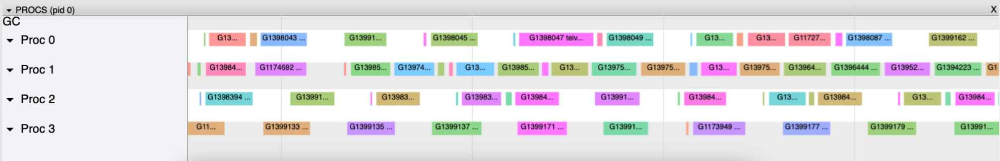</p>
- Let’s compare this with the second parallel implementation, which was about an order of magnitude faster:
<p align="center">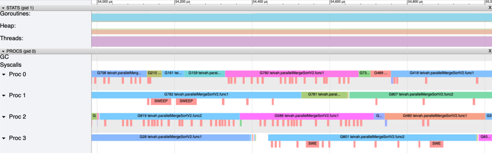</p>

- ➡️ Each goroutine takes more time to execute, and the number of white spaces has been **significantly reduced**. Hence, the CPU is much more occupied executing application code than it was in the first version.
- What are the main differences compared between profiling and user-level traces?
  - CPU profiling:
    – Sample-based.
    – Per function.
    – Doesn’t go below the sampling rate (10 ms by default).
  - User-level traces:
    – Not sample-based.
    – Per-goroutine execution (unless we use the `runtime/trace` package).
    – Time executions aren’t bound by any rate.

## #99: Not understanding how the GC works

- A GC keeps a **tree of object references**.
- The Go GC is based on the **mark-and-sweep** algorithm, which relies on two stages:
    - **Mark stage** — Traverses all the **objects** of the heap and marks whether they are still **in use**.
    - **Sweep stage** — Traverses the tree of **references** from the root and **deallocates** blocks of objects that are no longer referenced.
- When a GC runs, it first performs a set of actions that lead to stopping the world (two stop-the-worlds per GC, to be precise 🤔). That is, all the available CPU time is used to perform the GC, putting our application code on hold. Following these steps, it starts the world again, resuming our application but also running a **concurrent** phase. For that reason, the Go GC is called **concurrent mark-and-sweep**: it aims to reduce the number of stop-the-world operations per GC cycle and mostly run concurrently alongside our application.
- Go GC has a way to free memory after consumption **peak** thanks to the **periodic scavenger**. When it detects that a large heap  is no longer necessary, it frees some memory and returns it to the OS.
- When will a GC cycle run? It relies on a single environment variable: `GOGC`. This variable defines the % of the heap growth since the last GC before triggering another GC; the default value is **100%**.
- In most cases, keeping the `GOGC` at 100 should be enough. However, if our application may face request **peaks** leading to frequent GC and latency impacts, we can **increase** this value.
- Finally, in the event of an exceptional request peak, we can consider using the trick of keeping the virtual heap size to a minimum by forcing a **large allocation** of memory to improve the stability of the heap. For example, we can force the allocation of 1 GB using a global variable in `main.go`:
`var min = make([]byte, 1_000_000_000) // 1 GB`
  - What’s the point of such an allocation? If **GOGC** is kept at 100, instead of triggering a GC every time the heap doubles, Go will only trigger a GC when the heap reaches 2 GB.
  - This should **reduce the number of GC cycles** triggered when all the users connect, reducing the impact on average latency.