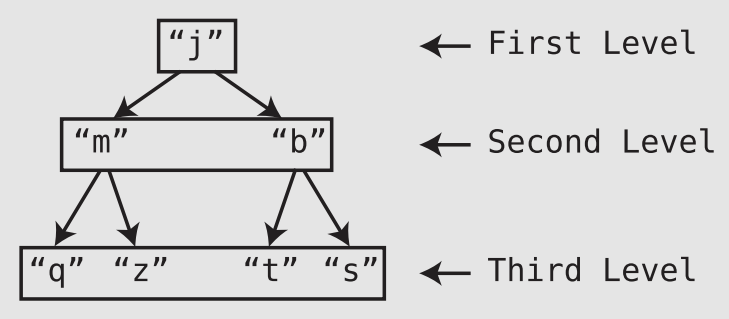

# Speeding Up All the Things with Binary Search Trees

- An ordered array is a simple but effective tool for keeping data in order:
  - 👍 O(1) reads and O(log N) search (when using binary search).
  - 👎 When it comes to insertions and deletions, ordered arrays are relatively **slow**:
    - Shift all greater values one cell to the right.
  - Takes `N` steps in a **worst-case** scenario (inserting or deleting from the first cell of the array), and` N/2` steps on **average**. Either way, it’s O(N), and O(N) is relatively slow for a simple ➕ or ➖.
- Now, if we were looking for a DS that delivers all-around amazing speed, a **hash table** is a great choice:
  - They are O(1) for search, insertion, and deletion. However, they do not maintain order 🤷.

## Trees

- A 🌴 is a node-based DS, but within a tree (as opposed to linked lists), each node can have links to **multiple nodes**.

- The uppermost node (in our example, the “`j`”) is called the **root**.
- “`j`” is a **parent** to “`m`” and “`b`.” Conversely, “`m`” and “`b`” are **children** of “`j`.”.
-  A node’s **descendants** are all the nodes that stem from a node, while a node’s **ancestors** are all the nodes that it stems from.
-  Trees are said to have **levels**. Each level is a row within the tree.
- One property of a tree is how **balanced** it is. A tree is balanced when its nodes’ subtrees have the **same number of nodes** in it.

## Binary Search Trees

- A **binary** tree is a 🌴 in which each node has **zero**, **one**, or **two** children.
- A **binary search** tree is a binary tree that also abides by the following rules:
  - Each node can have at most one “left” child and one “right” child.
  - A node’s “left” descendants can only contain values that are **less** than the node itself. Likewise, a node’s “right” descendants can only contain values that are **greater** than the node itself.

## Searching