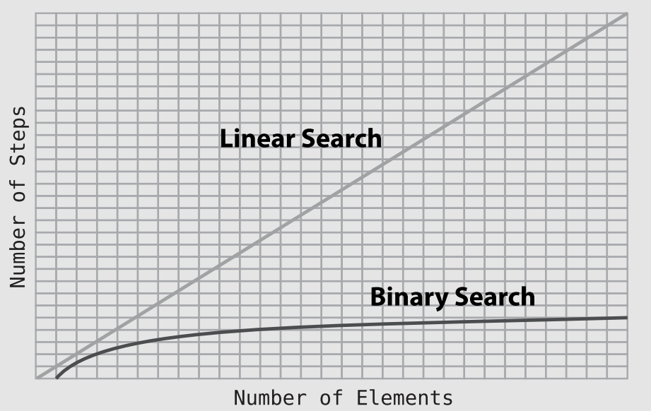

# Why Algorithms Matter

- Another major factor can affect the efficiency of our code: the proper selection of which **algorithm** to use.

## Ordered Arrays

- When inserting into an ordered array, we need to always conduct a search before the actual insertion to determine the correct spot for the insertion.
- This is one difference in performance between a classic array and an ordered array.
- Interestingly, the number of steps for insertion **remains similar** no matter where in the ordered array our new value ends up 🤒.

## Searching an Ordered Array

- With an ordered array, we can **stop a search early** even if the value isn’t contained within the array.
- In this light, linear search can take fewer steps in an ordered array than in a classic array in certain situations. That being said, if we’re searching for a value that happens to be the **final value** or **not within the array** at all, we will still end up searching each and every cell 🤕.

## Binary Search

- Is a searching algorithm used in a sorted array by repeatedly dividing the search interval in **half**.
- Here is an iterative implementation of binary search in C++:
```c++
#include <iostream>

int binary_search(int arr[], int low, int high, int x) {
    while (low <= high) {
        int mid = low + (high - low) / 2;
        if (arr[mid] == x) {
            return mid;
        }
        if (arr[mid] < x ) {
            low = mid+1;
        } else {
            high = mid -1;
        }
    }
    return -1;
}

int main () {
    int arr[] = {2, 3, 4, 10, 40};
    int x = 10;
    int n = sizeof(arr) / sizeof(arr[0]);
    int result = binary_search(arr, 0, n-1, x);
    if (result == -1) {
        std::cout << "Element is not present in array" << std::endl;
    } else {
        std::cout << "Element is present in array at index: " << result << std::endl;
    }
    return 0;
}
```

## Binary Search vs. Linear Search

- With ordered arrays of a **small size**, the algorithm of binary search **doesn’t** have much of an **advantage** over linear search.
- When we use binary search, however, each guess we make eliminates half of the possible cells we’d have to search.
- The pattern that emerges is that for each time we **double** the **size** of the ordered array, the number of steps needed for binary search **increases by one**. This makes sense, as each lookup eliminates half of the elements from the search.
<p align="center"></p>

## Exercises

> 1. How many steps would it take to perform a linear search for the number 8 in the ordered array, [2, 4, 6, 8, 10, 12, 13]?

4

> 2. How many steps would binary search take for the previous example?

1

> 3. What is the maximum number of steps it would take to perform a binary search on an array of size 100,000?

Keep dividing until we get down to 1.
