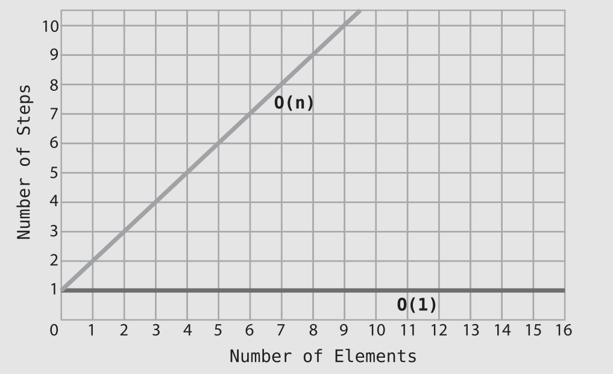
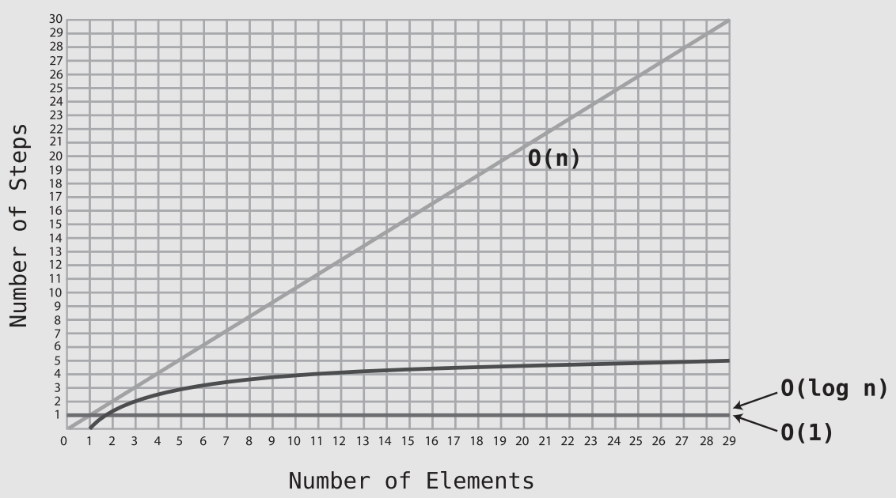

# O Yes! Big O Notation

- To help ease communication regarding time complexity, computer scientists have borrowed a concept from the world of mathematics to describe a concise and consistent language around the efficiency of data structures and algorithms. Known as **Big O** Notation, this formalized expression of these concepts allows us to easily categorize the efficiency of a given algorithm and convey it to others.

## Big O: How Many Steps Relative to N Elements?

- As we’ve previously phrased it: for N elements in the array, linear search can take up to N steps ➡️ `O(N)`.
- Some pronounce this as “*Big Oh of N.*” Others call it “*Order of N.*” My personal preference, however, is “*Oh of N*.”
- An algorithm that is `O(N)` is also known as having **linear time**.
- Reading from an array takes just one step. So, we express this as `O(1)`, which I pronounce “*Oh of 1.*”
- `O(1)` algorithm can also be referred to as having **constant time**.

## The Soul of Big O

- We have learned that if there are `N` data elements, how many steps will the algorithm take? While that key question is indeed the strict definition of Big O, there’s actually more to Big O than meets the eye 🤔.
- Let’s say we have an algorithm that always takes **three** steps no matter how much data there is. That is, for `N elements, the algorithm always takes three steps. How would you express that in terms of Big O? Based on everything you’ve learned up to this point, you’d probably say that
it’s `O(3)`. However, it’s actually `O(1)` 🙃.
- The soul of Big O is what Big O is truly concerned about: *how will an algorithm’s performance change as the data increases ❓*
<p align="center"></p>

- Notice that `O(N)` makes a perfect **diagonal line**. This is because for every additional piece of data, the algorithm takes one additional step. Accordingly, the more data, the more steps the algorithm will take.
- Contrast this with `O(1)`, which is a perfect **horizontal line**. No matter how much data there is, the number of steps remain **constant**.
- If we were to describe the **efficiency** of **linear search** in its **totality**, we’d say that linear search is:
  - `O(1)` in a **best-case** scenario,
  - `O(N)` in a **worst-case** scenario.
- While Big O effectively describes both the best- and worst-case scenarios of a given algorithm, Big O Notation **generally** refers to the **worst-case** scenario unless specified otherwise.

## An Algorithm of the Third Kind

- `O(log N)` is the Big O way of describing an algorithm that **increases** one step each time the data is **doubled**. As you learned in the previous chapter, **binary search** does just that.
<p align="center"></p>

## O(log N) Explained

- In computer science, whenever we say `O(log N)`, it’s actually shorthand for saying `O(log2 N)`. We just omit that small 2 for convenience.
- The following table demonstrates a striking difference between the efficiencies of `O(N)` and `O(log N)`:

  | N Elements | O(N) | O(log N) |
  | ---------- | ---- | -------- |
  | 8          | 8    | 3        |
  | 16         | 16   | 4        |
  | 32         | 32   | 5        |
  | 64         | 64   | 6        |
  | 128        | 128  | 7        |
  | 256        | 256  | 8        |
  | 512        | 512  | 9        |
  | 1024       | 1024 | 10       |

## Exercises

> 1. Use Big O Notation to describe the time complexity of the following function that determines whether a given year is a leap year:
>   ```js
>     function isLeapYear(year) {
>       return (year % 100 === 0) ? (year % 400 === 0) : (year % 4 === 0);
>   }
>   ```

0(1)


> 2. Use Big O Notation to describe the time complexity of the following function that sums up all the numbers from a given array:
  ```js
  function arraySum(array) {
    let sum = 0;
    for(let i = 0; i < array.length; i++) {
      sum += array[i];
    }
    return sum;
  }
  ```

O(N)

> 3. Imagine you have a chessboard and put a single grain of rice on one square. On the second square, you put 2 grains of rice, since that is double the amount of rice on the previous square. On the third square, you put 4 grains. On the fourth square, you put 8 grains, and on the fifth square, you put 16 grains, and so on.

> Use Big O Notation to describe the time complexity of this function, which is below:
  ```js
  function chessboardSpace(numberOfGrains) {
    let chessboardSpaces = 1;
    let placedGrains = 1;
    while (placedGrains < numberOfGrains) {
      placedGrains *= 2;
      chessboardSpaces += 1;
    }
    return chessboardSpaces;
  }
  ```

O(Log N)

> 4. The following function accepts an array of strings and returns a new array that only contains the strings that start with the character "a". Use Big O Notation to describe the time complexity of the function:
  ```js
  function selectAStrings(array) {
    let newArray = [];
    for(let i = 0; i < array.length; i++) {
      if (array[i].startsWith("a")) {
        newArray.push(array[i]);
      }
    }
    return newArray;
  }
  ```

O(N)

> 5. The following function calculates the median from an ordered array. Describe its time complexity in terms of Big O Notation:
  ```js
  function median(array) {
    const middle = Math.floor(array.length / 2);
    // If array has even amount of numbers:
    if (array.length % 2 === 0) {
      return (array[middle - 1] + array[middle]) / 2;
    } else { // If array has odd amount of numbers:
      return array[middle];
    }
  }
  ```

1
