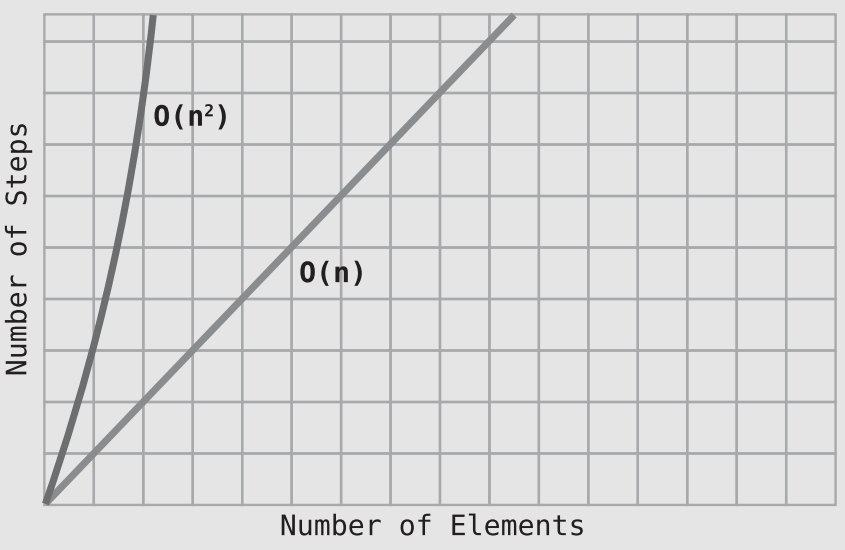

# Speeding Up Your Code with Big O

## Bubble Sort

- Bubble Sort is a **basic** sorting algorithm.
- It is called *Bubble Sort* because in each **pass-through**, the highest unsorted value “bubbles” up to its correct position.
- Because we made at **least one swap** during this pass-through, we need to conduct another pass-through ❗
- Here’s an implementation of Bubble Sort in Python:

```py
def bubble_sort(list):
    unsorted_until_index = len(list) - 1
    sorted = False
    while not sorted:
        sorted = True
        for i in range(unsorted_until_index):
            if list[i] > list[i+1]:
                list[i], list[i+1] = list[i+1], list[i]
                sorted = False
        unsorted_until_index -= 1
    return list
```

## The Efficiency of Bubble Sort

- For N elements, we make `(N - 1) + (N - 2) + (N - 3) … + 1` **comparisons**.
- In a **worst-case** scenario, where the array is sorted in **descending** order (the exact opposite of what we want), we’d actually need a swap for each comparison. So, we’d have **10 comparisons** and **10 swaps** in such a scenario for a grand total of 20 steps.
- If you look at the growth of steps as N increases, you’ll see that it’s growing by approximately `N^2`. Take a look at the following table:
    | N Data Elements | # of Bubble Sort Steps | N2   |
    | --------------- | ---------------------- | ---- |
    | 5               | 20                     | 25   |
    | 10              | 90                     | 100  |
    | 20              | 380                    | 400  |
    | 40              | 1560                   | 1600 |
    | 80              | 6320                   | 6400 |

Because for `N` values, Bubble Sort takes `N^2` steps, in Big O, we say that Bubble Sort has an efficiency of `O(N2)`. O(N2) is considered to be a relatively **inefficient** algorithm, since as the data increases, the steps increase dramatically. Look at this graph, which compares `O(N2)` against the faster `O(N)`:

<p align="center"></p>

- One last note: `O(N2)` is also referred to as **quadratic time**.

## A Quadratic Problem

Consider the example below which check for duplicated values in an array:
```js
function hasDuplicateValue(array) {
    for(let i = 0; i < array.length; i++) {
        for(let j = 0; j < array.length; j++) {
            if(i !== j && array[i] === array[j]) {
                return true;
            }
        }
    }
    return false;
}
```

Very often (but not always), when an algorithm **nests one loop inside another**, the algorithm is `O(N2)`. So, whenever you see a nested loop, `O(N2)` alarm bells should go off in your head ⏰.

## A Linear Solution

Another way to solve the duplicated value in an array is to track even value encountered in a "hash map".
```js
function hasDuplicateValue(array) {
    let existingNumbers = [];
    for(let i = 0; i < array.length; i++) {
        if(existingNumbers[array[i]] === 1) {
            return true;
        } else {
            existingNumbers[array[i]] = 1;
        }
    }
    return false;
}
```

This approach will have an O(N) and we know that O(N) is much faster than O(N2), so by using this second approach, we’ve optimized our `hasDuplicateValue` function significantly. This is a huge speed boost (Neglecting the time complexity for insertion and searching in the map or the array ⚠️).

## Exercises

> 1. Replace the question marks in the following table to describe how many steps occur for a given number of data elements across various types of Big O:

| N Elements | O(N)     | O(log N) | O(N2)       |
| ---------- | -------- | -------- | ----------- |
| 100        | 100      | **7**    | **10000**   |
| 2000       | **2000** | **11**   | **4000000** |


> 2. If we have an O(N2) algorithm that processes an array and find that it takes 256 steps, what is the size of the array?

16

> Use Big O Notation to describe the time complexity of the following function. It finds the greatest product of any pair of two numbers within a given array:

```py
def greatestProduct(array):
    greatestProductSoFar = array[0] * array[1]
    for i, iVal in enumerate(array):
        for j, jVal in enumerate(array):
            if i != j and iVal * jVal > greatestProductSoFar:
                greatestProductSoFar = iVal * jVal
    return greatestProductSoFar
```

N^2

> 4. The following function finds the greatest single number within an array, but has an efficiency of O(N2). Rewrite the function so that it becomes a speedy O(N):


```cpp
int find_greatest(std::array<int, 10> &arr) {

    int greatest = arr[0];
    for (size_t i = 1; i < arr.size(); i++) {
      if (arr[i] > greatest) {
        greatest = arr[i];
      }
    }
    return greatest;
}
```
