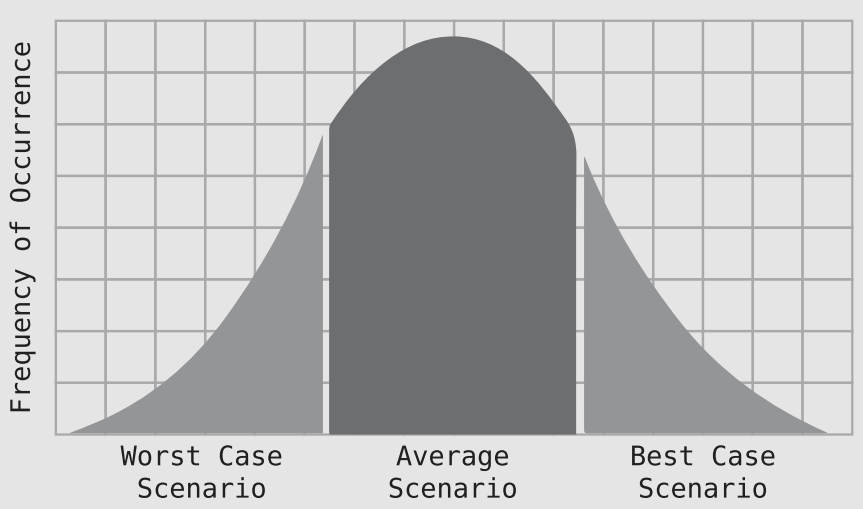
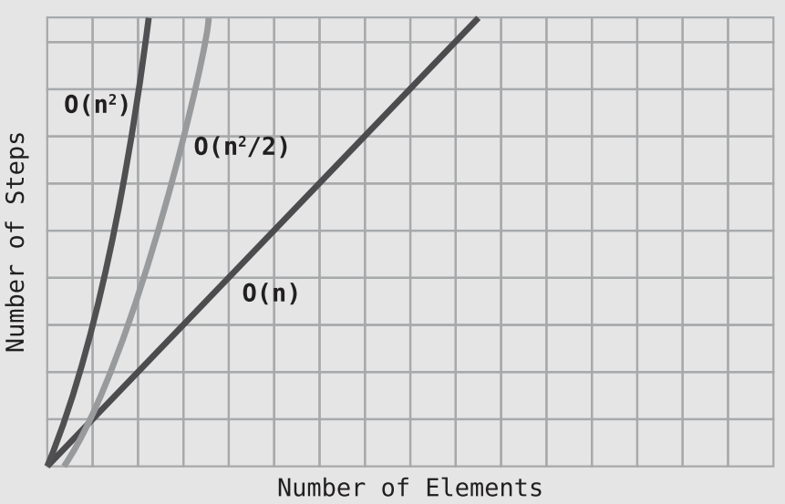
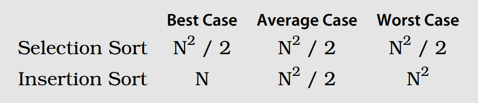

# Chapter 6: Optimizing for Optimistic Scenarios

## Insertion Sort

- Insertion sort is a simple sorting algorithm that works by iteratively inserting each element of an unsorted list into its correct position in a sorted portion of the list.
- It is like sorting playing cards in your hands. You split the cards into two groups: the **sorted** cards and the **unsorted** cards. Then, you pick a card from the unsorted group and put it in the right place in the sorted group.
- Here is a Python implementation of Insertion Sort:
    ```py
    def insertion_sort(array):
        for index in range(1, len(array)):
            temp_value = array[index]
            position = index - 1
            while position >= 0:
                if array[position] > temp_value:
                    array[position + 1] = array[position]
                    position = position - 1
                else:
                    break
            array[position + 1] = temp_value
        return array
    ```

## The Efficiency of Insertion Sort

- Four types of steps occur in Insertion Sort: **removals**, **comparisons**, **shifts**, and **insertions**.
- In a worst-case scenario, where the array is sorted in reverse order:
  - `1 + 2 + 3 + … + (N - 1)` comparisons ~= `N2 / 2` **comparisons**.
  - `N2 / 2` **shifts**.
  - Removing and inserting the *temp_value* from the array happens once per passthrough. Since there are always `N - 1` pass-throughs, we can conclude that there are `N - 1` **removals** and `N - 1` **insertions**.
  - If we tally up ➡️ `N2 + 2N - 2` steps, simplify this to `O(N2 + N)`.
- However, there is another major rule of Big O that I’ll reveal now:
    - *Big O Notation only takes into account the highest order of N when we have multiple orders added together*.
- That is, if we have an algorithm that takes `N4 + N3 + N2 + N` steps, we only consider `N4` to be significant—and just call it `O(N4)` 💁.
- It emerges that in a worst-case scenario, Insertion Sort has the same time complexity as Bubble Sort and Selection Sort. They’re all `O(N2)` 😮‍💨.

## The Average Case

- Indeed, in a **worst-case** scenario, **Selection** Sort is **faster** than **Insertion** Sort. However, it is critical we also take into account the **average-case** scenario.
- By definition, the cases that occur most frequently are average scenarios 🤓. Take a look at this simple bell curve:
<p align="center"></p>

- In the **best-case** scenario, where the data is already sorted in ascending order, we end up making just **one comparison per pass-through** and **not a single shift**, since each value is already in its correct place.
- For the **average** scenario, we can say that in the aggregate,
we probably compare and shift about **half** the data. Thus, if Insertion Sort takes `N2` steps for the **worst-case** scenario, we’d say that it takes about `N2 / 2` steps for the **average** scenario. (In terms of Big O, however, both scenarios are `O(N2)` 💁.)
- You can see these three types of performance in the following graph:
<p align="center"></p>

> 💡 Contrast this with Selection Sort. Selection Sort takes N2 / 2 steps in all cases, from worst to average to best-case scenarios. This is because Selection Sort doesn’t have any mechanism for ending a pass-through early at any point. Each pass-through compares every value to the right of the chosen index no matter what.

Here’s a table that compares Selection Sort and Insertion Sort:
<p align="center"></p>

- So, which is better ❓ Selection Sort or Insertion Sort? The answer is: well, it **depends**. In an **average** case—where an array is randomly sorted—they perform **similarly**.
  - If you have reason to assume you’ll be dealing with data that is **mostly sorted**, Insertion Sort will be a **better** choice.
  - If you have reason to assume you’ll be dealing with data that is **mostly sorted** in **reverse** order, **Selection** Sort will be **faster**.
  - If you have no idea what the data will be like, that’s essentially an average case, and both will be **equal**.

## A Practical Example

Suppose we want to get the **intersection** between two arrays. Here’s one possible implementation:
```js
function intersection(firstArray, secondArray){
    let result = [];
    for (let i = 0; i < firstArray.length; i++) {
        for (let j = 0; j < secondArray.length; j++) {
            if (firstArray[i] == secondArray[j]) {
                result.push(firstArray[i]);
             }
        }
    }
    return result;
}
```
- If the two arrays are of **equal** size, and say that` N` is the size of either array, the number of comparisons performed are `N2`. So, this intersection algorithm has an efficiency of `O(N2)`.
- The **insertions**, at most, would take `N` steps (if the two arrays happened to be identical). This is a lower order compared to `N2`, so we’d still consider the algorithm to be `O(N2)`.
- If the arrays are **different sizes** —say N and M— we’d say that the efficiency of this function is `O(N * M)`.
- Is there any way we can improve this algorithm ❓ This is where it’s important to consider scenarios beyond the **worst** case. In the current implementation of the intersection function, we make `N2` comparisons **in all scenarios**, no matter whether the arrays are identical or the arrays do not share a single common value.
- Here is an improved implementation:
    ```js
    function intersection(firstArray, secondArray){
        let result = [];
        for (let i = 0; i < firstArray.length; i++) {
            for (let j = 0; j < secondArray.length; j++) {
                if (firstArray[i] == secondArray[j]) {
                    result.push(firstArray[i]);
                    break;
                }
            }
        }
        return result;
    }
    ```
- With the addition of the *break*, we can cut the inner loop short and save steps (and therefore time).
- ➡️ In the best-case scenario, where the two arrays are **identical**, we only have to perform `N` comparisons. In an average case, where the two arrays are different **but share some** values, the performance will be somewhere **between** `N` and `N2`.

## Exercises

> 1. Use Big O Notation to describe the efficiency of an algorithm that takes 3N2 + 2N + 1 steps.

O(N^2).

> 2. Use Big O Notation to describe the efficiency of an algorithm that takes N + log N steps.

O(N).

> 3. The following function checks whether an array of numbers contains a pair of two numbers that add up to 10. What are the best-, average-, and worst-case scenarios? Then, express the worst-case scenario in terms of Big O Notation.

```c
function twoSum(array) {
    for (let i = 0; i < array.length; i++) {
        for (let j = 0; j < array.length; j++) {
            if (i !== j && array[i] + array[j] === 10) {
                return true;
            }
        }
    }
    return false;
}
```

- Best-case: The two pair are the first 2 numbers of the array.
- Average-case: The two pair are somewhat in the middle.
- Worst-case: O(N2)

> 4. The following function returns whether or not a capital “X” is present within a string.
```c
function containsX(string) {
    foundX = false;
    for(let i = 0; i < string.length; i++) {
        if (string[i] === "X") {
            foundX = true;
        }
    }
    return foundX;
}
```
- What is this function’s time complexity in terms of Big O Notation? `O(N)`.
- Then, modify the code to improve the algorithm’s efficiency for best- and average-case scenarios.

```c
function containsX(string) {
    for(let i = 0; i < string.length; i++) {
        if (string[i] === "X") {
            return true;
        }
    }
    return false;
}
```
