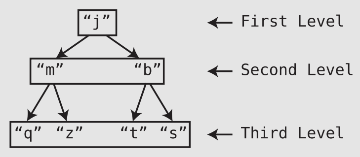

# Speeding Up All the Things with Binary Search Trees

- An ordered array is a simple but effective tool for keeping data in order:
  - 👍 `O(1)` reads and `O(log N)` search (when using binary search).
  - 👎 When it comes to insertions and deletions, ordered arrays are relatively **slow** (O(N), due to shifting).
- Now, if we were looking for a DS that delivers all-around amazing speed, a **hash table** is a great choice:
  - They are `O(1)` for *search*, insertion, and deletion. However, they do not maintain order 🤷.

## Trees

- A 🌴 is a **node-based** DS, but within a tree (as opposed to linked lists), each node can have links to **multiple nodes**.
<p align="center"></p>

- The uppermost node (in our example, the “`j`”) is called the **root**.
- “`j`” is a **parent** to “`m`” and “`b`.” Conversely, “`m`” and “`b`” are **children** of “`j`.”.
- A node’s **descendants** are all the nodes that stem from a node, while a node’s **ancestors** are all the nodes that it stems from.
- Trees are said to have **levels**. Each level is a **row** within the tree.
- One property of a tree is how **balanced** it is. A tree is balanced when its nodes’ subtrees have the **same number of nodes** in it.
- The following tree, on the other hand, is **imbalanced**:
  ```c
         A
        / \
       B   C
      /   / \
     D   E   F
          \
           G
  ```

## Binary Search Trees

- A **binary** tree is a 🌴 in which each node has **zero**, **one**, or **two** children.
- A **binary search** tree is a binary tree that also abides by the following rules:
  - Each node can have at most one **“left”** child and one **“right”** child.
  - A node’s **“left”** descendants can only contain values that are **less** than the node itself. Likewise, a node’s **“right”** descendants can only contain values that are **greater** than the node itself.
  ```c
         8
        / \
       3   10
      / \    \
     1   6    14
        / \   /
       4   7 13
  ```

## Searching

1. Designate a node to be the “**current node**” (At the beginning of the algorithm, the **root** node is the first “current node”).
2. Inspect the value at the current node. If we’ve found the value we’re looking for, great!
3. If the value we’re looking for is **less** than the current node, search for it
in its **left** subtree.
4. If the value we’re looking for is **greater** than the current node, search for
it in its **right** subtree.
5. Repeat Steps 1 through 4 until we find the value we’re searching for, or until we hit the **bottom** of the tree, in which case our value must not be in the tree.

## The Efficiency of Searching a Binary Search Tree

- Notice that each step **eliminates half** of the remaining nodes from our search.
- We’d say, then, that searching in a binary search tree is `O(log N)` (though, that this is only for a **perfectly balanced** binary search tree, which is a best-case scenario 🤥).
- Another way of describing why search in a binary search tree is `O(log N)`:
  - ➡️ If there are `N` nodes in a balanced binary tree, there will be about `log N` levels (rows).
  - Each time we **add a new full level** to the tree, we end up roughly doubling the
number of nodes that the tree has (Really, we’re doubling the nodes and adding one 🤓).
- In this regard, then, searching a binary search tree has the **same efficiency** as **binary search** within an **ordered array**. Where binary search trees really shine over ordered arrays, though, is with **insertion**.

## Code Implementation: Searching a Binary Search Tree

Here’s how we can use recursion to implement search with Python:
```py
def search(searchValue, node):
  # Base case: If the node is nonexistent
  # or we've found the value we're looking for:
  if node is None or node.value == searchValue:
    return node
  # If the value is less than the current node, perform
  # search on the left child:
  elif searchValue < node.value:
    return search(searchValue, node.leftChild)
  # If the value is greater than the current node, perform
  # search on the right child:
  else: # searchValue > node.value
    return search(searchValue, node.rightChild)
```