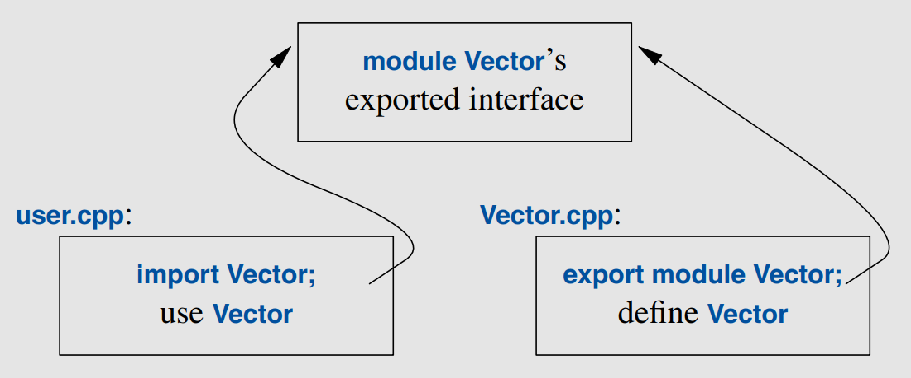

# Modularity

C++ supports a notion of separate compilation where user code sees only declarations of the types and functions used. This can be done in two ways:
    - **Header files**: Place declarations in separate files, called header files, and textually `#include` a header file where its declarations are needed.
    - **Modules**: Define module files, compile them separately, and import them where needed. Only explicitly exported declarations are seen by code importing the module
- A `.cpp` file that is compiled by itself (including the `h` files it `#includes`) is called a **translation unit**. A program can consist of thousands of translation units.
- The use of header files and `#include` is a very old way of simulating modularity with significant **disadvantages**:
  - 👎 **Compilation time**:
    -  If you `#include header.h` in **101** translation units, the text of `header.h` will be processed by the compiler **101** times.
    -  If a header file changes, all source files that include it must be **recompiled**.
    -  Template-heavy code: headers like `STL` or `Eigen` force full recompilation when modified.
  - 👎 **Order dependencies**:
    - `<windows.h>` includes `<winsock.h>` (a deprecated Winsock version), which conflicts with `<winsock2.h>`.
    - If included in the wrong order, you get "redefinition" errors.
  - 👎 **Inconsistencies**:
    -  Defining an entity, such as a type or a function, in one file and then defining it slightly differently in another file, can lead to crashes or subtle errors.
  - 👎 **Transitivity**:
    - All code that is needed to express a declaration in a header file must be present in that header file. This leads to massive code bloat as header files `#include` other headers and this results in the user of a header file – accidentally or deliberately – becoming dependent on such implementation details.
  - 👎 **Poor Encapsulation**:
    - Implementation details exposed: Private members must be declared in headers, leaking internal details.
  - 👎 **One Definition Rule (ODR) Violations**:
      - Duplicates definitions: If a header defines (rather than declares) functions/variables, multiple inclusions cause linker errors.
      - Requires `#pragma once` or include guards (manual maintenance).
  - 👎 **Macro Pollution** & **Global Namespace Issues**:
    - Macros in headers (#define) affect all included files, leading to:
        - Naming conflicts (e.g., `min`, `max` macros breaking `std::min`).
        - Unintended side effects (e.g., `Windows.h` macros).
  - 👎 **Circular Dependencies**:
    - Hard to resolve: If A.h includes B.h and B.h includes A.h, compilation fails without careful forward declarations.
- The differences between headers and modules are not just **syntactic**.
    - A module is compiled **once only** (rather than in each translation unit in which it is used).
    - Two modules can be imported in either **order** without changing their meaning.
    - If you `import` or `#include` something into a module, users of your module do not implicitly gain access to that: `import` is not **transitive**.
    - `import std` compiles 10 times faster than the version using `#include<iostream>` even though the format contains 10x times as much information:
      - The reason is that modules only **export interfaces** whereas a header delivers all that it directly or indirectly contains to the compiler.
- Mixing is allowed as it's essential for gradually upgrading older code from using `#include` to using `import`.

## Namespaces

- Namespaces are primarily used to organize larger program components, such as libraries. They simplify the composition of a program out of separately developed parts.
- If repeatedly qualifying a name becomes tedious or distracting, we can bring the name into a scope with a `using`-declaration:
    ```cpp
    void my_code(vector<int>& x, vector<int>& y)
    {
        using std::swap; // make the standard-library swap available locally
        // ...
        swap(x,y); // std::swap()
        other::swap(x,y); // some other swap()
        // ...
    }

    // To gain access to all names in the standard-library namespace, we can use a using-directive:
    using namespace std;
    ```
- A `using`-declaration makes a name from a namespace usable as if it were declared in the **scope** in which it appears.
- To gain access to all names in the standard-library namespace, we can use a using-directive: `using namespace std;`.
- When defining a module, we do **not** have to **separate declarations and definitions** into separate files; we can if that improves our source code organization, but we don’t have to. We could define the simple `Vector` module like this:
    ```cpp
    export module Vector; // defining the module called "Vector"
    export class Vector {
        // ...
    };
    export bool operator==(const Vector& v1, const Vector& v2)
    {
        // ...
    }
    ```
- Graphically, the program fragments can be represented like this:
 <p align="center"></p>

- Using modules, we don’t have to complicate our code to hide implementation details from users; a module will only **grant access** to **exported declarations**.

## Function Arguments and Return Values

- We return **by reference** only when we want to grant a caller access to something that is not local to the function.
- A local variable disappears when the function returns, so we should not return a pointer or reference to it.
- **Copy elision** is an optimization technique in C++ that allows the compiler to avoid unnecessary object copies or moves, improving performance. It is particularly relevant in the context of returning objects from functions. With C++17, the standard mandates copy elision in certain situations, making it a more predictable and reliable optimization.

## Suffix Return Type

- In C++11 and later, the **suffix return type** (also called a trailing return type) is a way to declare a function's return type after its parameter list, using the `->` syntax.
- This feature was introduced primarily to support **lambda** expressions and **template meta-programming**, where the return type may depend on the function's arguments or complex expressions.
- Adding the return type after the argument list where we want to be **explicit** about the return type.
  - That makes `auto` mean *the return type will be mentioned later or be deduced.*:
  ```cpp
  auto mul(int i, double d) −> double { return i∗d; } // the return type is "double"`
  ```

## Structured Binding

A function can return only a single value, but that value can be a class object with many members. This allows us to **elegantly** return **many values**.

```cpp
struct Entry {
    string name;
    int value;
};

Entry read_entry(istream& is) // naive read function (for a better version, see §11.5)
{
    string s;
    int i;
    is >> s >> i;
    return {s,i}; // {s,i} is used to construct the Entry return value.
}

auto e = read_entry(cin);
cout << "{ " << e.name << " , " << e.value << " }\n"

// Similarly, we can unpack an Entry’s members into local variables:
auto [n,v] = read_entry(is); //This mechanism for giving local names to members of a class object is called structured binding.

// Consider another example:
map<string,int> m;

// ... fill m ...

for (const auto [key,value] : m)
    cout << "{" << key << "," << value << "}\n";
```
