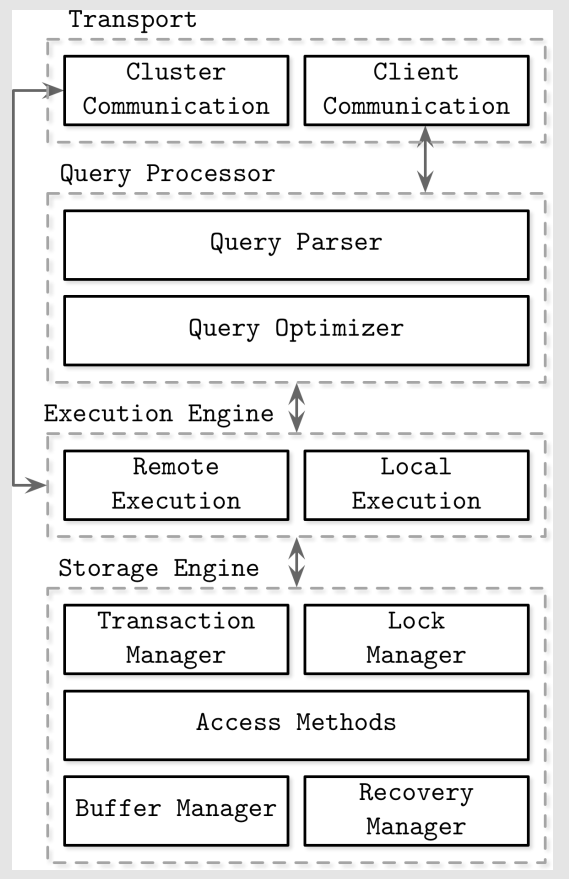
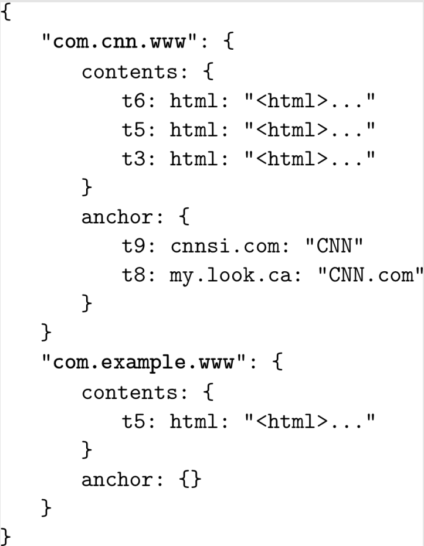

# Chapter 1: Introduction and Overview

- DBMS can serve different purposes: some are used primarily for **temporary hot data**, some serve as a **long-lived cold storage**, some allow **complex analytical queries**, some only allow accessing values by the **key**, some are optimized to store **time-series** data, and some store **large blobs** efficiently.
- There are many ways DBMSs can be classified. For example, in terms of a **storage medium** (*Memory vs Disk-Based*) or **layout** (*“Column- vs Row-Oriented*). Some sources group them into three major categories:
    - *Online transaction processing (OLTP) databases* - These handle a large number of user-facing requests and transactions. Queries are often **predefined** and **short-lived**.
    - *Online analytical processing (OLAP) databases* - These handle **complex aggregations**. OLAP databases are often used for **analytics** and data **warehousing**, and are capable of handling complex, **long-running ad hoc queries**.
    - **Hybrid transactional and analytical processing (HTAP)** - These databases combine properties of both OLTP and OLAP stores.
- There are many other terms and classifications: key-value stores, relational databases, document-oriented stores, and graph databases.

## DBMS Architecture

- DBMS use a **client/server** model, where database system instances (nodes) take the role of servers, and application instances take the role of clients.

- Client requests arrive through the **transport subsystem**. Requests come in the form of queries, most often expressed in some query language. The transport subsystem is also responsible for **communication with other nodes** in the database cluster.
- Upon receipt, the transport subsystem hands the query over to a **query processor**, which parses, interprets, and validates it.
- The parsed query is passed to the **query optimizer**, which first eliminates impossible and redundant parts of the query, and then attempts to find the most efficient way to execute it based on internal statistics and data placement.
- The query is usually presented in the form of an **execution plan** (or **query plan**): a sequence of operations that have to be carried out for its results to be considered complete. Since the same query can be satisfied using different execution plans that
can vary in efficiency, the optimizer picks the best available plan.
- The execution plan is handled by the **execution engine**, which collects the results of the execution of local and remote operations. **Remote** execution can involve writing and reading data to and from **other nodes** in the cluster, and replication. **Local** queries (coming directly from clients or from other nodes) are executed by the storage engine. The storage engine has several components with dedicated responsibilities:
  - **Transaction manager** - This manager schedules transactions and ensures they cannot leave the database in a logically inconsistent state.
  - **Lock manager** - This manager locks on the database objects for the running transactions, ensuring that concurrent operations do not violate physical data integrity.
  - **Access methods** (storage structures) - These manage access and organizing data on disk. Access methods include heap files and storage structures such as B-Trees or LSM Trees.
  - **Buffer manager** - This manager caches data pages in memory.
  - **Recovery manager** - This manager maintains the operation log and restoring the system state in case of a failure.

## Memory-Versus Disk-Based DBMS

In-memory database management systems (sometimes called **main memory** DBMS) store data primarily in memory and use the disk for **recovery** and **logging**. Disk-based DBMS hold most of the data on disk and use memory for **caching** disk contents or as a temporary storage.

Databases using memory as a primary data store do this mainly because of **performance**, comparatively **low access costs**, and **access granularity**. Programming for main memory is also significantly **simpler** than doing so for the disk. OSs abstract memory management and allow us to think in terms of allocating and freeing arbitrarily sized memory chunks. On disk, we have to manage data references, serialization formats, freed memory, and fragmentation manually 🤷.

### Durability in Memory-Based Stores

- In-memory database systems maintain backups on disk to provide durability and prevent loss of the **volatile** data.
- Before the operation can be considered complete, its results have to be written to a **sequential log file**.
- To avoid replaying complete log contents during startup or after a crash, in-memory stores maintain a **backup copy**. The backup copy is maintained as a sorted disk-based structure, and modifications to this structure are often **asynchronous** (decoupled from client requests) and applied in **batches** to reduce the number of I/O
operations. During recovery, database contents can be restored from the backup and logs.

## Column-Versus Row-Oriented DBMS

- Most database systems store a set of data **records**, consisting of **columns** and **rows** in **tables**.
- **Field** is an **intersection** of a column and a row.
- A collection of values that belong logically to the same record (usually identified by the key) constitutes a row.
- One of the ways to classify databases is by how the data is **stored on disk**: row or column wise.
  - Tables can be partitioned either **horizontally** (storing values belonging to the same row together) ▶️ *MySQL*, *PostgreSQL*.
  - or **vertically** (storing values belonging to the same column together) ▶️ *MonetDB* and *C-Store*.

### Row-Oriented Data Layout

- Their layout is quite close to the **tabular** data representation, where every row has the **same** set of **fields**.
  | ID  | Name  | Birth Date  | Phone Number   |
  | --- | ----- | ----------- | -------------- |
  | 10  | John  | 01 Aug 1981 | +1 111 222 333 |
  | 20  | Sam   | 14 Sep 1988 | +1 555 888 999 |
  | 30  | Keith | 07 Jan 1984 | +1 333 444 555 |
- This approach works well for cases where several fields constitute the record (name, birth date, and a phone number) uniquely identified by the key (in this example, a
monotonically incremented number)
- All fields representing a single user record are often **read together**. When creating records, we write them together as well.
- Since row-oriented stores are most useful in scenarios when we have to access data by row, storing entire rows together improves **spatial locality**.
  - 👍 When we’d like to access an entire user record.
  - 👎 Makes queries accessing individual fields of multiple user records more 🤑, since data for the other fields will be **paged in** as well.

### Column-Oriented Data Layout

- Here, values for the same column are stored contiguously on disk.
- Storing values for different columns in separate files or file segments allows efficient queries by column, since they can be **read in one pass** rather than consuming entire rows and discarding data for columns that weren’t queried 🤷.
- Column-oriented stores are a good fit for analytical workloads that **compute aggregates**, such as *finding trends*, *computing average values*, etc.
- Processing complex aggregates can be used in cases when logical records have multiple fields, but some of them (in this case, price quotes) have different importance and are often consumed together.

Values belonging to the same row are stored closely together:
| Rows |
|---|
| Symbol: 1:DOW; 2:DOW; 3:S&P; 4:S&P |
| Date: 1:08 Aug 2018; 2:09 Aug 2018; 3:08 Aug 2018; 4:09 Aug 2018 |
| Price: 1:24,314.65; 2:24,136.16; 3:2,414.45; 4:2,232.32 |
- To reconstruct data tuples, which might be useful for joins, filtering, and multi-row aggregates, we need to preserve some **metadata** on the column level to identify which data points from other columns it is associated with. If you do this explicitly, each value will have to hold a **key**, which introduces duplication and increases the amount of stored data 🥶.
- During the last several years, likely due to a rising demand to run complex analytical queries over growing datasets, we’ve seen many 🆕 column-oriented **file formats** such as *Apache Parquet*, *Apache ORC*, *RCFile*, as well as column-oriented stores, such as *Apache Kudu*, *ClickHouse*, and many others.

### Distinctions and Optimizations

- Reading multiple values for the same column in one run significantly improves **cache utilization** and **computational efficiency**. On modern CPUs, vectorized instructions (SIMD) can be used to process multiple data points with a single CPU instruction.
- Storing values that have the same data type together offers a better **compression** ratio. We can use different compression algorithms depending on the data type and pick the most effective compression method for each case.
- To decide whether to use a column- or a row-oriented store, you need to understand your **access patterns**.
  - If the read data is consumed in records (i.e., most or all of the columns are requested) and the workload consists mostly of **point queries** and **range scans**, the row-oriented approach is likely to yield better results.
  - If scans span many rows, or **compute aggregate** over a subset of columns, it is worth considering a column-oriented approach.

### Wide Column Stores

- Column-oriented databases should not be mixed up with wide column stores, such as *BigTable* or *HBase*, where data is represented as a **multidimensional map**, columns
are grouped into **column families** (usually storing data of the same type), and inside each column family, data is stored **row-wise**. This layout is best for storing data retrieved by a **key** or a **sequence of keys**.
- A canonical example from the *Bigtable* paper is a *Webtable*. A *Webtable* stores snapshots of web page contents, their attributes, and the relations among them at a specific timestamp. 

- Data is stored in a multidimensional sorted map with hierarchical indexes:
  - We can locate the data related to a specific web page by its reversed URL and its *contents* or *anchors* by the timestamp.
  - Each row is indexed by its row key. Related columns are grouped together in column families — *contents* and *anchor* — which are stored on disk separately.
  - Each column inside a column family is identified by the column key, which is a combination of the column family name and a qualifier (html, cnnsi.com, my.look.ca in this example).
  - Column families store multiple versions of data by timestamp. This layout allows us to quickly locate the higher-level entries (web pages, in this case) and their parameters (versions of content and links to the other pages).

## Data Files and Index Files

❓ Why do we need a database management system and **not just a bunch of files**? How does file organization improve efficiency? 🤔

- Database systems do use files for storing the data, but instead of relying on **filesystem hierarchies** of directories and files for locating records, they compose files using **implementation-specific** formats. The main reasons to use specialized file organization over flat files are:
  - 👍 **Storage efficiency** - Files are organized in a way that minimizes storage overhead per stored data record.
  - 👍 **Access efficiency** - Records can be located in the smallest possible number of steps.
  - 👍 **Update efficiency** - Record updates are performed in a way that minimizes the number of changes on disk.
- A database system usually separates **data files** and **index files**: data files store **data records**, while index files store record **metadata** and use it to locate records in data files.

### Data Files
