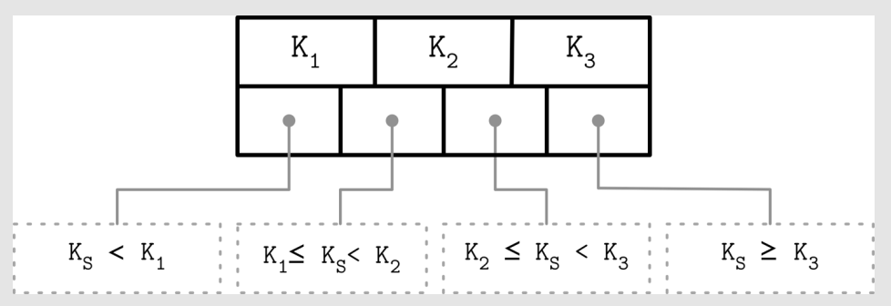

# Chapter 2: B-Tree Basics

## Binary Search Tree

- Insertion might lead to the situation where the tree is **unbalanced**. The worst-case scenario is where we end up with a **pathological** tree, which looks more like a linked list, and instead of desired logarithmic complexity `O(log2 N)`, we get linear `O(N)`.
- One of the ways to keep the tree **balanced** is to perform a **rotation** step after nodes are added or removed.
  - If the insert operation leaves a branch unbalanced, we can rotate nodes around the middle one.
  - In the example below, during rotation the middle `node (3)`, known as a **rotation pivot**, is promoted one level higher, and its parent becomes its right child.

.

- Some jargon I had to google outside of what available on this 📖:
  - **Depth** and **height** are properties of a node:
    - The **depth** of a node is the number of edges from the node to the tree's root node.
      - A root node will have a depth of 0.
    - The **height** of a node is the number of edges on the longest path from the node to a leaf.
      - A leaf node will have a height of 0.
  - Properties of a tree:
      - The **height** of a tree would be the height of its root node, or equivalently, the depth of its deepest node.
      - The **diameter** (or width) of a tree is the number of nodes on the longest path between any two leaf nodes. The tree below has a diameter of 6 nodes.

.

- At the same time, due to **low fanout** (fanout is the maximum allowed number of children per node), we have to perform **balancing**, **relocate nodes**, and **update pointers** rather frequently. Increased maintenance costs make BSTs impractical as on-disk data structures.
- If we wanted to maintain a BST on disk, we’d face several problems 🤒
  - **Locality**: node child pointers may span across several disk pages, since elements are added in random order (we can improve the situation by modifying the tree layout and using **paged binary trees**).
  - **Tree height**: since BT has a fanout of just two, height is a binary logarithm of the number of the elements in the tree, and we have to perform `O(log2 N)` **seeks** to locate the searched element and, subsequently, perform the same number of **disk transfers**.
- Considering these factors, a version of the tree that would be better suited for **disk implementation** has to exhibit the following properties:
  - **High fanout** to improve locality of the neighboring keys.
  - **Low height** to reduce the number of seeks during traversal.

## Disk-Based Structures

On-disk data structures are often used when the amounts of data are so large that keeping an entire dataset in memory is impossible or not feasible. Only a fraction of the data can be cached in memory at any time, and the rest has to be stored on disk in a manner that allows efficiently accessing it.

### Hard Disk Drives

On spinning disks, seeks increase costs of random reads because they require disk rotation and mechanical head movements to position the read/write head to the desired location. However, once the expensive part is done, reading or writing contiguous bytes (i.e., sequential operations) is relatively cheap.

Head positioning is the most expensive part of an operation on the HDD. This is one of the reasons we often hear about the positive effects of sequential I/O: reading and writing contiguous memory segments from disk.

### Solid State Drives

Since in both device types (HDDs and SSDs) we are addressing chunks of memory rather than individual bytes (i.e., accessing data block-wise), most operating systems have a block device abstraction. It hides an internal disk structure and buffers I/O operations internally, so when we’re reading a single word from a block device, the whole block containing it is read. This is a constraint we cannot ignore and should always take into account when working with disk-resident data structures.

In SSDs, we don’t have a strong emphasis on random versus sequential I/O, as in HDDs, because the difference in latencies between random and sequential reads is not as large. There is still some difference caused by prefetching, reading contiguous
pages, and internal parallelism.

Even though garbage collection is usually a background operation, its effects may negatively impact write performance, especially in cases of random and unaligned write workloads. Writing only full blocks, and combining subsequent writes to the same block, can help to reduce the number of required I/O operations.

### On-Disk Structures

Besides the cost of disk access itself, the main limitation and design condition for building efficient on-disk structures is the fact that the smallest unit of disk operation is a block. To follow a pointer to the specific location within the block, we have to fetch an entire block. Since we already have to do that, we can change the layout of the data structure to take advantage of it.

In summary, on-disk structures are designed with their target storage specifics in mind and generally optimize for fewer disk accesses. We can do this by improving locality, optimizing the internal representation of the structure, and reducing the
number of out-of-page pointers.

We came before to the conclusion that high fanout and low height are desired properties for an optimal on-disk data structure. We’ve also just discussed additional space overhead coming from pointers, and maintenance over‐
head from remapping these pointers as a result of balancing. B-Trees combine these ideas: increase node fanout, and reduce tree height, the number of node pointers, and the frequency of balancing operations.

## Ubiquitous B-Trees

- B-Trees build upon the foundation of balanced search trees and are different in that they have higher fanout and smaller height.
- Figure below shows binary tree, 2-3-Tree, and B-Tree nodes side by side, which helps to understand the similarities and differences between them.

B-Trees are sorted: keys inside the B-Tree nodes are stored in order. Because of that, to locate a searched key, we can use an algorithm like binary search. This also implies that lookups in B-Trees have logarithmic complexity. For example, finding a searched key among 4 billion (4 × 109) items takes about 32 comparisons (see “B-Tree Lookup Complexity” on page 37 for more on this subject). If we had to make a disk seek for each one of these comparisons, it would significantly slow us down, but since B-Tree nodes store dozens or even hundreds of items, we only have to make one disk seek per level jump. We’ll discuss a lookup algorithm in more detail later in this chapter.

Using B-Trees, we can efficiently execute both **point** and **range** queries. oint queries, expressed by the equality (=) predicate in most query languages, locate a single item. On the other hand, range queries, expressed by comparison (<, >, ≤, and ≥) predicates, are used to query multiple data items in order.

### B-Tree Hierarchy

- B-Trees consist of multiple nodes. Each node holds up to N keys and N + 1 pointers to the child nodes. These nodes are logically grouped into three groups:
  - Root node: This has no parents and is the top of the tree.
  - Leaf nodes: These are the bottom layer nodes that have no child nodes.
  - Internal nodes: These are all other nodes, connecting root with leaves. There is usually more than one level of internal nodes
- Since B-Trees are a **page** organization technique (i.e., they are used to organize and navigate fixed-size pages), we often use terms **node** and **page** **interchangeably**.
- The relation between the node capacity and the number of keys it actually holds is called **occupancy**.

B-Trees are characterized by their fanout: the number of keys stored in each node. Higher fanout helps to amortize the cost of structural changes required to keep the tree balanced and to reduce the number of seeks by storing keys and pointers to child nodes in a single block or multiple consecutive blocks. Balancing operations (namely, *splits* and *merges*) are triggered when the nodes are full or nearly empty.

🔭 B+-Tree 

We’re using the term B-Tree as an **umbrella** for a family of data structures that share all or most of the mentioned properties. A more precise name for the described data structure is **B+-Tree**. *[KNUTH98]* refers to trees with a high fanout as **multiway trees**.

B-Trees allow storing values on any level: in root, internal, and leaf nodes. B+-Trees store values **only in leaf nodes**. Internal nodes store only **separator keys** used to guide the search algorithm to the associated value stored on the leaf level. Since values in B+-Trees are stored only on the leaf level, all operations (inserting, updating, removing, and retrieving data records) affect only leaf nodes and propagate to higher levels only during splits and merges.

B+-Trees became widespread, and we refer to them as B-Trees, similar to other literature the subject. For example, in [GRAEFE11] B+-Trees are referred to as a default design, and MySQL InnoDB refers to its B+-Tree implementation as B-tree.

### Separator Keys

- Keys stored in B-Tree nodes are called **index entries**, **separator keys**, or **divider cells**.
- They split the tree into subtrees (also called **branches** or **subranges**), holding corresponding key ranges.
- Keys are stored in sorted order to allow binary search. A subtree is found by locating a key and following a corresponding pointer from the **higher** to the **lower level**.
- The first pointer in the node points to the subtree holding items less than the first key, and the last pointer in the node points to the subtree holding items greater than or equal to the last key. Other pointers are reference subtrees between the two keys: Ki-1 ≤ Ks < Ki, where `K` is a set of keys, and `Ks` is a key that belongs to the subtree.

What sets B-Trees apart is that, rather than being built from top to bottom (as binary search trees), they’re constructed the other way around—from bottom to top. The number of leaf nodes grows, which increases the number of internal nodes and tree height.

Since B-Trees reserve extra space inside nodes for future insertions and updates, tree storage utilization can get as low as 50%, but is usually considerably higher. Higher occupancy does not influence B-Tree performance negatively.

### B-Tree Lookup Complexity

- B-Tree lookup complexity can be viewed from two standpoints: the number of block transfers and the number of comparisons done during the lookup.
  - In terms of **number of transfers**, the logarithm base is `N` (number of keys per node). There are `K` times more nodes on each new level, and following a child pointer reduces the search space by the factor of `N`. During lookup, at most `logK M` (where `M` is a total number of items in the B-Tree) pages are addressed to find a searched key. The number of child pointers that have to be followed on the root-to-leaf pass is also equal to the number of levels, in other words, the **height** `h` of the tree.
  - From the perspective of **number of comparisons**, the logarithm base is 2, since searching a key inside each node is done using binary search. Every comparison halves the search space, so complexity is `log2 M`.

### B-Tree Lookup Algorithm

The algorithm starts from the root and performs a binary search, comparing the searched key with the keys stored in the root node until it finds the first separator key that is **greater** than the searched value. This locates a searched subtree. As we’ve discussed previously, index keys split the tree into subtrees with boundaries between two neighboring keys. As soon as we find the subtree, we follow the pointer that corresponds to it and continue the same search process (locate the separator key, follow the pointer) until we reach a target leaf node, where we either find the searched key or conclude it is not present by locating its predecessor.

### B-Tree Node Splits

If the target node doesn’t have enough room available, we say that the node has **overflowed** and has to be split in two to fit the new data. More precisely, the node is split if the following conditions hold:
  - For **leaf nodes**: if the node can hold up to N key-value pairs, and inserting one more key-value pair brings it over its maximum capacity N.
  - For **non-leaf nodes**: if the node can hold up to N + 1 pointers, and inserting one more pointer brings it over its maximum capacity N + 1.
- Node splits are done in four steps:
  1. Allocate a new node.
  2. Copy half the elements from the splitting node to the new one.
  3. Place the new element into the corresponding node.
  4. At the parent of the split node, add a separator key and a pointer to the new
  node.

Figure below shows a fully occupied leaf node during insertion of the new element `11`. We draw the line in the middle of the full node, leave half the elements in the node, and move the rest of elements to the new one. A split point value is placed into the parent node to serve as a separator key.

Figure below shows the split process of a fully occupied nonleaf (i.e., root or internal) node during insertion of the new element 11. To perform a split, we first create a new node and move elements starting from index N/2 + 1 to it. The split point key is promoted to the parent

### B-Tree Node Merges

Deletions are done by first locating the target leaf. When the leaf is located, the key and the value associated with it are removed.

If neighboring nodes have too few values (i.e., their occupancy falls under a threshold), the sibling nodes are merged. This situation is called **underflow**.

Two nodes are merged if the following conditions hold:
- For leaf nodes: if a node can hold up to `N` key-value pairs, and a combined number of key-value pairs in two neighboring nodes is less than or equal to `N`.
- For nonleaf nodes: if a node can hold up to `N + 1` pointers, and a combined number of pointers in two neighboring nodes is less than or equal to `N + 1`.

Figure below shows the merge during deletion of element 16. To do this, we move elements from one of the siblings to the other one. Generally, elements from the right sibling are moved to the left one, but it can be done the other way around as long as the key order is preserved.

Figure below shows two sibling nonleaf nodes that have to be merged during deletion of element 10. If we combine their elements, they fit into one node, so we can have one node instead of two. During the merge of nonleaf nodes, we have to pull the corresponding separator key from the parent (i.e., demote it). The number of pointers is reduced by one because the merge is a result of the propagation of the pointer deletion from the lower level, caused by the page removal. Just as with splits, merges can propagate all the way to the root level.

To summarize, node merges are done in three steps, assuming the element is already removed:
1. Copy all elements from the right node to the left one.
2. Remove the right node pointer from the parent (or demote it in the case of a non‐
leaf merge).
1. Remove the right node.