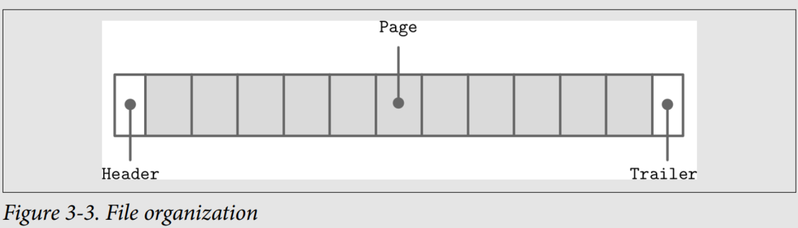
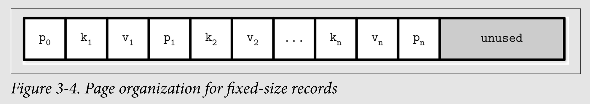
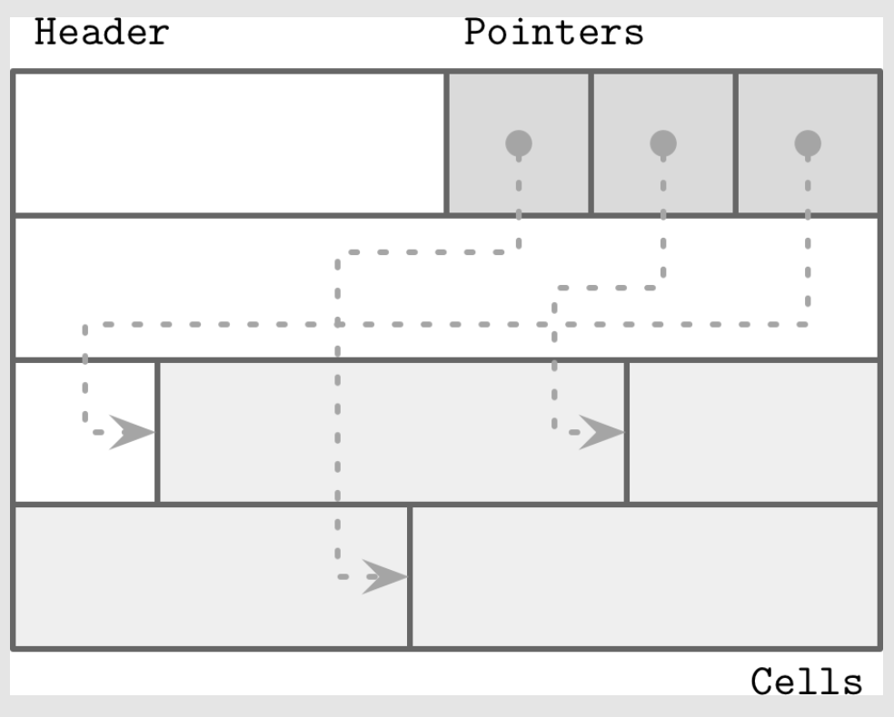

# File Formats

To implement B-Trees and similar structures on disk, developers must account for the differences between memory and disk access. Unlike memory, where access is largely transparent due to virtual memory, disk access requires explicit offset management via system calls. This necessitates designing efficient file formats that are easy to construct, modify, and interpret.

## Motivation

Designing file formats is similar to building data structures in low-level, unmanaged memory environments. In memory, we can freely allocate and reference data using pointers without worrying about fragmentation or garbage collection. However, on disk, we must handle these concerns manually.

Key differences:
    - **Disk storage** requires careful data layout to ensure efficient access and manage fragmentation and garbage collection.
    - Memory allows flexible handling of variable-sized data and uses pointers for dynamic allocation, making layout concerns less critical.
    - On-disk structures must be serialized/deserialized using binary formats and must account for persistent storage constraints.
    - Even though filesystems help with some tasks, on-disk structure design is more complex and error-prone than in-memory design.

## Binary encoding

Binary encoding is used to store data efficiently on disk or transmit it over networks by converting data into a compact, serialized format. Key principles include:
    - Primitive Types
        - Numeric types (integers, floats) are stored as fixed-size values with consistent endianness (byte order: big-endian or little-endian).
        - Floating-point numbers follow the IEEE 754 standard, using sign, fraction, and exponent bits.
    - Records & Serialization
        - Data must be serialized (converted to bytes) before storage/transmission and deserialized afterward.
        - Complex structures (like C structs) combine primitive types, fixed-size arrays, or pointers.
    - Variable-Size Data (Strings, Arrays)
        - Represented with a length prefix (e.g., Pascal strings) followed by the data.
        - More efficient than null-terminated strings, allowing O(1) length checks.
    - Bit-Packed Data
        - Booleans: Often packed into single bits (8 booleans per byte) to save space.
        - Enums: Stored as integers to represent low-cardinality values (e.g., NodeType in B-Trees).
        - Flags: Use bitmasks to represent multiple boolean attributes (e.g., `IS_LEAF_MASK`).
            - Bitwise operations (|, &, ~, <<) are used to set, unset, or check flags.

## General Principles

Usually, you start designing a file format by deciding how the addressing is going to be done: whether the file is going to be split into same-sized pages, which are represented by a single block or multiple contiguous blocks. Most in-place update storage structures use pages of the same size, since it significantly simplifies read and write access. Append-only storage structures often write data page-wise, too: records are appended one after the other and, as soon as the page fills up in memory, it is flushed on disk.

The file usually starts with a fixed-size header and may end with a fixed-size trailer,
which hold auxiliary information that should be accessed quickly or is required for
decoding the rest of the file. The rest of the file is split into pages.

## Page Structure

Database systems store data records in data and index files. These files are partitioned into fixed-size units called pages, which often have a size of multiple filesystem blocks. Page sizes usually range from 4 to 16 Kb.

Let’s take a look at the example of an on-disk B-Tree node. From a structure perspective, in B-Trees, we distinguish between the leaf nodes that hold keys and data records pairs, and nonleaf nodes that hold keys and pointers to other nodes. Each B-Tree node occupies one page or multiple pages linked together, so in the context of B-Trees the terms node and page (and even block) are often used interchangeably.

This approach is easy to follow, but has some downsides:
- 👎 Appending a key anywhere but the right side requires relocating elements.
- 👎 It doesn’t allow managing or accessing variable-size records efficiently and works
only for fixed-size data.

## Slotted Pages

We need a page format that allows us to:
- Store variable-size records with a minimal overhead.
- Reclaim space occupied by the removed records.
- Reference records in the page without regard to their exact locations.

To efficiently store variable-size records such as strings, binary large objects (BLOBs),etc., we can use an organization technique called slotted page (i.e., a page with slots).

We organize the page into a collection of slots or cells and split out pointers and cells in two independent memory regions residing on different sides of the page. This means that we only need to reorganize pointers addressing the cells to preserve the order, and deleting a record can be done either by nullifying its pointer or removing it.

A slotted page has a fixed-size header that holds important information about the page and cells. Cells may differ in size and can hold arbitrary data: keys, pointers, data records, etc. Figure below shows a slotted page organization, where every page has a maintenance region (header), cells, and pointers to
them:

Let’s see how this approach fixes the problems we stated in the beginning of this
section:
- Minimal overhead: the only overhead incurred by slotted pages is a pointer array
holding offsets to the exact positions where the records are stored.
- Space reclamation: space can be reclaimed by defragmenting and rewriting the
page.
- Dynamic layout: from outside the page, slots are referenced only by their IDs, so
the exact location is internal to the page.