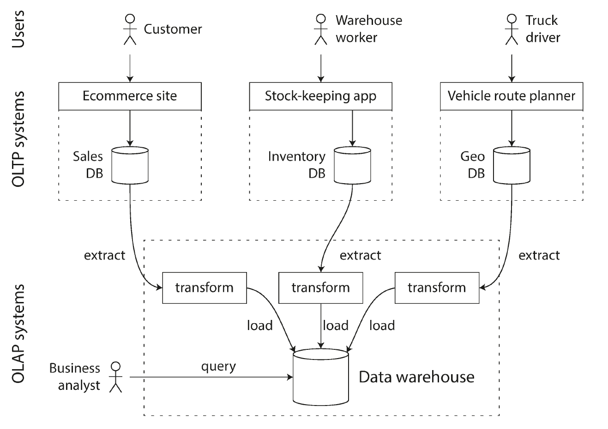

# Chapter 3. Storage and Retrieval

## Data Structures That Power Your Database

- Many databases internally use a _log_, an **append-only** data file, which has pretty good performance and generally very efficient.
- Real databases have more issues to deal with (such as **concurrency** control, **reclaiming disk** space so that the log doesn’t grow forever, handling **errors**, **partially written** records, and so on) but the basic principle is the same. Logs are incredibly useful.
- In order to efficiently find the value for a particular key in the database, we need a different data structure: an **index**.
  - The idea behind them is simple: keep some additional metadata on the side, which acts as a signpost and helps you to locate the data you want.
  - If you want to search the same data in several different ways, you may need several different indexes on different parts of the data.
- An index is an additional structure that is derived from the primary data—many databases allow you to add and remove indexes, and this doesn’t affect the contents of the database, it only affects the performance of queries. Maintaining additional structures is **overhead**, especially on **writes**. For writes, it’s hard to beat the performance of simply appending to a file, so any kind of index usually slows down writes.
- This is an important trade-off in storage systems: well-chosen indexes can **speed up read** queries, but every index **slows down writes**. For this reason, databases don’t usually index everything **by default**, but require you to choose indexes manually, using your knowledge of the application’s typical query patterns.

### Hash indexes

- Key-value stores are quite similar to the dictionary type that you can find in most programming languages, and which is usually implemented as a **hash map** (hash table).
- Whenever you append a new key-value pair to the file, you also update the hash map to reflect the offset of the data you just wrote (this works both for inserting new keys and for updating existing keys). When you want to look up a value, use the hash map to find the offset in the data file, seek to that location, and read the value. <p align="center"></p>
- How do we avoid eventually running out of disk space? A good solution is to break the log into **segments** of a certain size, and to periodically run a background process for **compaction and merging** of segments.
- **Compaction** means throwing away all key-value pairs in the log except for the most recent update for each key. This makes the segments **much smaller** (assuming that every key is updated multiple times on average), so we can also **merge** several segments into one.
- Each segment now has its **own in-memory** hash table, mapping keys to file offsets. In order to find the value for a key, we first check the **most recent** segment’s hash map; if the key is not present we check the second-most-recent segment, and so on.
- Pros :+1::
  - Appending and segment merging are **sequential write operations**, which are generally much faster than **random writes**. This performance difference applies both to traditional **spinning-disk** hard drives and to **flash-based** solid state drives (SSDs).
  - **Concurrency** and **crash recovery** are much simpler if files are immutable. For example, you don’t have to worry about the case where a crash happened while a value was being overwritten, leaving you with a file containing part of the old and part of the new value spliced together.
  - Merging old segments avoids problems of **data files** getting **fragmented** over time.
- Cons :-1::
  - The hash table must **fit in memory**, so if you have a very large number of keys, you’re out of luck. In principle, you could maintain a hash map on disk, but unfortunately it is difficult to make an on-disk hash map perform well. It requires a lot of **random access I/O**, it is expensive to grow when it becomes full, and **hash collisions** require fiddly logic.
  - **Range queries** are not efficient. For example, you cannot easily fetch the values for all keys between `kitty00000` and `kitty99999`, you’d have to look up each key individually in the hash maps.
- 👁️ Example of storage engines using a log-structured hash table: [Bitcask](https://en.wikipedia.org/wiki/Bitcask).

## SSTables and LSM-trees

- In **Sorted String Table**, or SSTable for short, we require that the sequence of key-value pairs is **sorted by key**. We also require that each key only **appears once** within each merged segment file (the compaction process already ensures that).
- SSTables have several big advantages over log segments with hash indexes 👍:
  - **Merging segments is simple and efficient**, even if the files are bigger than the available memory. You start reading the input files side-by-side, look at the first key in each file, copy the lowest-numbered key to the output file, and repeat. If the same key appears in several input files, keep the one from the most recent input file, and discard the values in older segments. This produces a new merged segment which is also sorted by key, and which also has exactly one value per key.
  - In order to find a particular key in the file, you **no longer need to keep an index** of all the keys in memory. You still need an in-memory index to tell you the **offsets for some of the keys**, but it can be sparse: one key for every few kilobytes of segment file is sufficient, because a few kilobytes can be scanned very quickly.
  - Since read requests need to scan over several key-value pairs in the requested range anyway, it is possible to **group those records into a block and compress it** before writing it to disk. Each entry of the sparse in-memory index then points at the start of a compressed block. Nowadays, **disk bandwidth is usually a worse bottleneck than CPU**, so it is worth spending a few additional CPU cycles to reduce the amount of data you need to write to and read from disk.

### Constructing and maintaining SSTables

- Maintaining a sorted structure on disk is possible, but maintaining it in memory is much easier. There are plenty of well-known tree data structures that you can use, such as _Red-Black trees_ or _AVL_ trees. With these data structures, you can insert keys in any order, and read them back in **sorted** order.
- When a write comes in, add it to an in-memory balanced tree data structure. This in-memory tree is sometimes called a **memtable**.
- When the memtable gets bigger than some threshold — typically a few megabytes — write it out to disk as an **SSTable** file. This can be done efficiently because the tree already maintains the key-value pairs sorted by key. The new SSTable file becomes the most recent segment of the database. When the new SSTable is ready, the memtable can be emptied.
- The basic idea - keeping a cascade of SSTables that are merged in the **background** - is simple and effective. Even when the dataset is much bigger than memory it continues to work well. Since data is stored in sorted order, you can efficiently perform range queries (scanning all keys above some minimum and up to some maximum). And because the disk writes are sequential, the LSM-tree can support remarkably **high write throughput**.

### Making an LSM-tree out of SSTables

- ⭐The algorithm described here is essentially what is used in **LevelDB** and **RocksDB**, key-value storage engine libraries.
- Originally this indexing structure was described by *Patrick O’Neil* under the name **Log-Structured Merge-Tree** building on earlier work on log-structured filesystems. Storage engines that are based on this principle of merging and compacting sorted files are often called **LSM storage engines**
- ⭐ **Lucene**, an indexing engine for FTS used by **Elasticsearch** and **Solr**, uses a similar method for storing its term dictionary. A full-text index is much more
complex than a KV index but is based on a similar idea:
  - Given a word in a search query, find all the documents that mention the word. This is implemented with a KV structure where the key is a word (a **term**) and the value is the list of IDs of all the documents that contain the word (the **postings list**). In Lucene, this mapping from term to postings list is kept in SSTable-like sorted files, which are merged in the background as needed.

### Performance optimizations

- LSM-tree algorithm can be **slow** when looking up keys that do **not exist** in the database:
  1. You have to check the memtable,
  2. Then the segments all the way back to the **oldest** (possibly having to read from disk for each one) before you can be sure that the key does not exist.
- In order to optimize this kind of access, storage engines often use additional **Bloom filters**.
- There are also different strategies to determine the **order** and **timing** of how SSTables are compacted and merged. The most common options are **size-tiered** and **leveled compaction**.
  - ▶️ **LevelDB** and **RocksDB** use leveled compaction, **HBase** uses size-tiered, and **Cassandra** supports both.

## B-trees

- Are the most widely-used indexing structure.
- Remain the standard index implementation in almost all relational databases, and many non-relational databases use them too.
- The **log-structured indexes** we saw earlier break the database down into **variable-size segments**, typically several megabytes or more in size, and always write a segment sequentially. By contrast, **B-trees** break the database down into **fixed-size blocks** or pages, traditionally `4 kB` in size, and read or write one page at a time. This corresponds more closely to the underlying hardware, as disks are also arranged in fixed-size blocks.
- Each page can be identified using an address or location, which allows one page to refer to another—similar to a **pointer**, but on disk instead of in memory. We can use these page references to construct a tree of pages: <p align="center"></p>
- The number of references to child pages in one page of the B-tree is called the **branching factor**.
- A four-level tree of 4 KB pages with a branching factor of 500 can store up to 256 TB 🆗.

### Making B-trees reliable

- Some operations require several **different pages** to be overwritten. For example, if you split a page because an insertion caused it to be overfull, you need to write the two pages that were split, and also overwrite their parent page to update the references to the two child pages.
  - ⚠️ This is a dangerous operation, because if the DB crashes after only some of the pages have been written, you end up with a corrupted index.
  - In order to make the DB resilient to crashes, it is common for B-tree implementations to include an additional data structure on disk: a **write-ahead log** (WAL, also known as a *redo log*). This is an append-only file to which every B-tree modification must be written before it can be applied to the pages of the tree itself. When the DB comes back up after a crash, this log is used to restore the B-tree back to a consistent state.
- An additional complication of updating pages in place is that careful **concurrency** control is required if multiple threads are going to access the B-tree at the same time - otherwise a thread may see the tree in an inconsistent state.
  - This is typically done by protecting the tree’s data structures with **latches** (lightweight locks). Log-structured approaches are simpler in this regard, because they do all the merging in the background **without interfering** with incoming queries and atomically swap old segments for new segments from time to time.

### B-tree optimizations

- Instead of overwriting pages and maintaining a WAL for crash recovery, some databases (like **LMDB**) use a CoW scheme.
- We can save space in pages by not storing the entire key, but **abbreviating** it. keys only need to provide enough information to act as boundaries between key ranges.
  - ▶️ Packing more keys into a page allows the tree to have a **higher branching factor**, and thus **fewer levels**.

### Comparing B-Trees and LSM-Trees

- As a rule of thumb, LSM-trees are typically faster for **writes**, whereas B-trees are thought to be faster for **reads**.
- Reads are typically slower on LSM-trees because they have to check several different data structures and SSTables at different stages of compaction.
- 👍 Advantages of LSM-trees:
  - A B-tree index must write every piece of data at least **twice**: once to the write-ahead log, and once to the tree page itself (and perhaps again as pages are split).
  - Log-structured indexes also rewrite data **multiple** times due to repeated compaction and merging of SSTables. This effect —one write to the database resulting in multiple writes to the disk over the course of the database’s lifetime— is known as **write amplification**.
  - LSM-trees are typically able to sustain **higher write throughput** than Btrees, partly because they sometimes have **lower write amplification** (although this depends on the storage engine configuration and workload), and partly because they **sequentially** write compact SSTable files rather than having to overwrite several pages in the tree. This difference is particularly important on magnetic hard drives, where sequential writes are much faster than random writes.
  - LSM-trees can be **compressed** better, and thus often produce smaller files on disk than B-trees.
- 👎 Downsides of LSM-trees:
  - **Compaction** can interfere with reads/writes since disk resources are limited. While average performance impact is small, query latency can spike at higher percentiles, making LSMs less predictable than B-trees.
  - As databases grow, more disk **bandwidth** is consumed by compaction. If compaction can’t keep up, **segment files accumulate**, slowing reads and eventually exhausting disk space. Unlike some systems, LSM engines don’t throttle writes when this happens, so monitoring is critical.
  - LSM-trees may store multiple versions of a key across segments, unlike B-trees where each key exists only once. This makes B-trees more suitable for **transactional** systems that rely on range locks for isolation.
  - B-trees are **mature**, reliable, and predictable, and still dominate many databases. LSMs are more common in new datastores but the “better” choice depends on empirical testing for your workload.

## Other Indexing Structures

- It is also very common to have **secondary** indexes:
  - They are often crucial for performing **joins** efficiently.

### Storing values within the index

- The **heap file** approach is common because it avoids **duplicating** data when multiple secondary indexes are present: each index just references a location in the heap file, and the actual data is kept in one place -> Updating vlaues are efficient but can be challenging sometimes (see Dababase Internals Chap 1).
- In some situations, the extra hop from the index to the heap file is too much of a performance penalty for reads, so it can be desirable to store the indexed row directly within an index. This is known as a clustered index.
- A compromise between a **clustered** index (storing all row data within the index) and a **nonclustered** index (storing only references to the data within the index) is known as a **covering index** or index with included columns, which stores some of a table’s columns within the index. This allows some queries to be answered by using the index alone.

### Multi-column indexes

- The most common type of multi-column index is called a **concatenated index**, which simply combines several fields into one key by appending one column to another (the index definition specifies in which order the fields are concatenated).
- Multi-dimensional indexes are a more general way of querying several columns at once, which is particularly important for **geospatial** data:

```sql
SELECT * FROM restaurants
WHERE latitude > 51.4946 AND latitude < 51.5079 AND longitude > -0.1162 AND longitude < -0.1004;
```

- A standard B-tree or LSM-tree index is not able to answer that kind of query efficiently: it can give you either all the restaurants in a range of latitudes (but at any longitude), or all the restaurants in a range of longitudes (but anywhere between north and south pole), but not both simultaneously.
- One option is to translate a two-dimensional location into a single number using a space-filling curve, and then to use a regular B-tree index. More commonly, specialized **spatial** indexes such as **R-trees** are used. For example, **PostGIS** implements **geospatial indexes** as R-trees using PostgreSQL’s *Generalized Search Tree* indexing facility.

### Full-text search and fuzzy indexes

- FTS engines commonly allow a search for:
  - One word to be expanded to include **synonyms** of the word
  - Ignore **grammatical** variations of words
  - Search for **occurrences** of words near each other in the same document
  - Support various other features that depend on **linguistic analysis** of the text.
- To cope with typos in documents or queries, *Lucene* is able to search text for words within a certain edit distance (an edit distance of 1 means that one letter has been added, removed, or replaced).
  - Lucene uses a SSTable-like structure for its term dictionary.
- Other fuzzy search techniques go in the direction of document classification and ML.

### Keeping everything in memory

- As RAM becomes cheaper, the cost-per-gigabyte argument is eroded ➡️ This has led to the development of in-memory databases.
- Some in-memory key-value stores, such as *Memcached*, are intended for caching use only, where it’s **acceptable** for data to be lost if a machine is restarted. But other in-memory databases aim for **durability**, which can be achieved with special hardware (such as **battery-powered RAM**), by writing a log of changes to disk, by writing periodic snapshots to disk, or by replicating the in-memory state to other machines.
- Counterintuitively, the performance advantage of in-memory databases is not due to the fact that they don’t need to read from disk 😵‍💫. Even a disk-based storage engine may never need to read from disk if you have enough memory, because the **OS caches recently** used disk blocks in memory anyway. Rather, they can be faster because they can avoid the overheads of **encoding** in-memory data structures in a form that can be written to disk.

## Transaction Processing or Analytics?

Even though databases started being used for many different kinds of data comments on blog posts, actions in a game, contacts in an address book, etc. the basic access pattern remained similar to processing business transactions. An application typically looks up a small number of records by some key, using an index. Records are inserted or updated based on the user’s input. Because these applications are interactive, the access pattern became known as **online transaction processing** (OLTP).

However, databases also started being increasingly used for data analytics, which has very **different access patterns**. Usually an analytic query needs to scan over a **huge number of records**, only reading a few columns per record, and calculates aggregate statistics (such as `count`, `sum`, or `average`) rather than returning the raw data to the user. For example, if your data is a table of sales transactions, then analytic queries might be:
  - What was the total revenue of each of our stores in January?
  - How many more bananas than usual did we sell during our latest promotion?
  - Which brand of baby food is most often purchased together with brand X diapers?
<p align="center"></p>

At first, the same databases were used for both transaction processing and analytic queries. SQL turned out to be quite flexible in this regard: it works well for OLTP-type queries as well as OLAP-type queries. Nevertheless, in the late 1980s and early 1990s, there was a trend for companies to stop using their OLTP systems for analytics purposes, and to run the analytics on a separate database instead. This separate database was called a *data warehouse*.

## Data Warehousing

Database administrators therefore closely **guard** their OLTP databases. They are usually reluctant to let business analysts run **ad hoc** analytic queries on an OLTP database, since those queries are often expensive, scanning large parts of the dataset, which can harm the performance of concurrently executing transactions.

A data warehouse, by contrast, is a **separate db** that analysts can query to their hearts’ content, without affecting OLTP operations.
  - Contains a **read-only copy** of the data in all the various OLTP systems in the company.
  - Data is extracted from OLTP databases (using either a periodic data dump or a continuous stream of updates), transformed into an analysis-friendly schema, cleaned up, and then loaded into the data warehouse.
:arrow_forward: This process of getting data into the warehouse is known as **Extract–Transform–Load** (ETL).
<p align="center"></p>

:+1: A big advantage of using a separate data warehouse, rather than querying OLTP systems directly for analytics, is that the data warehouse can be optimized for **analytic access patterns**.

### The divergence between OLTP databases and data warehouses

On the surface, a data warehouse and a relational OLTP database look similar, because they both have a SQL query interface. However, the internals of the systems can look quite different, because they are optimized for very different query patterns. Many database vendors now focus on supporting either transaction processing or analytics workloads, but not both.

### Stars and Snowflakes: Schemas for Analytics

- Many data warehouses are used in a fairly formulaic style, known as a **star schema** (also known as dimensional modeling).
- The example schema in figure below shows a data warehouse that might be found at a grocery retailer:
  - At the center of the schema is a so-called **fact table** (in this example, it is called *fact_sales*).
  - Each row of the fact table represents an event that occurred at a particular time (here, each row represents a customer’s purchase of a product). If we were analyzing website traffic rather than retail sales, each row might represent a page view or a click by a user.
  - Other columns in the fact table are **FK references** to other tables, called **dimension tables**. As each row in the fact table represents an event, the dimensions represent the *who*, *what*, *where*, *when*, *how*, and *why* of the event.
<p align="center"></p>

- A variation of this template is known as the **snowflake schema**, where dimensions are further broken down into subdimensions. For example, there could be separate tables for *brands* and *product* categories, and each row in the `dim_product` table could reference the brand and category as FKs, rather than storing them as strings in the `dim_product` table.
- Snowflake schemas are **more normalized** than star schemas, but star schemas are often preferred because they are **simpler** for analysts to work with 🤷‍♀️.

## Column-Oriented Storage

- In most OLTP databases, storage is laid out in a **row-oriented** fashion: all the values from one row of a table are stored **next to each other**. Document databases are similar: an entire document is typically stored as **one contiguous** sequence of bytes.
- Even if you need to select only a couple of dields, a row-oriented storage engine still needs to load all of those rows (each consisting of over 100 attributes) from disk into memory, parse them, and filter out those that don’t meet the required conditions. That can take a long time 🤷.
- The idea behind column-oriented storage is simple: don’t store all the values from o**ne row together**, but store all the values from **each column together** instead 😼.

### Column Compression

- Column-oriented storage often lends itself very well to **compression**. Take a look at the sequences of values for each column in figure below: they often look quite repetitive, which is a good sign for compression.
<p align="center"></p>

> 💡 Column-oriented storage and column families *Cassandra* and *HBase* have a concept of column families, which they inherited from *Bigtable*. However, it is very **misleading** to call them **column-oriented**: within each **column family**, they store all columns from a row together, along with a row key, and they do not use column compression. Thus, the *Bigtable* model is still mostly row-oriented.

### Sort Order in Column Storage

- Another advantage (beside query perf) of sorted order is that it can help with **compression** of columns.
- If the primary sort column does not have many distinct values, then after sorting, it will have long sequences where the same value is repeated many times in a row 🙃. A simple **run-length encoding** could compress that column down to a few KB even if the table has billions of rows 😼.

### Several different sort orders

- A clever extension of this idea was introduced in *C-Store* and adopted in *Vertica*
- Different queries benefit from different sort orders, so why not store the same data sorted in several different ways?
  - Data needs to be replicated to **multiple machines** anyway, so that you don’t lose data if one machine fails.
  - You might as well store that **redundant** data **sorted in different ways** so that when you’re processing a query, you can use the version that **best fits** the **query pattern**.

### Writing to Column-Oriented Storage

- Column-oriented storage, compression, and sorting all help to make those read queries faster. However, they have the 👎 of making writes more difficult 🫤.
- An update-in-place approach, like **B-trees** use, is not possible with compressed columns. If you wanted to insert a row in the middle of a sorted table, you would most likely have to rewrite all the column files.
- Solution: ➡️ **LSM-trees**: all writes first go to an in-memory store, where they are added to a sorted structure and prepared for writing to disk. It doesn’t matter whether the in-memory store is row-oriented or column-oriented. When enough writes have **accumulated**, they are **merged** with the column files on disk and written to new files in **bulk**. This is essentially what *Vertica* does.

### Aggregation: Data Cubes and Materialized Views

- If the same aggregates are used by many different queries, it can be **wasteful** to crunch through the raw data every time. Why not cache some of the counts or sums that queries use most often?
- One way of creating such a cache is a **materialized view**.
- A common special case of a materialized view is known as a **data cube** or **OLAP cube**. It is a **grid of aggregates** grouped by different dimensions.
- The 👍 of a materialized data cube is that certain queries become very fast because they have effectively been **precomputed**. For example, if you want to know, the total sales per store yesterday, you just need to look at the totals along the appro‐
priate dimension—no need to scan millions of rows 🤓.
- The 👎 is that a data cube doesn’t have the same **flexibility** as querying the raw data. For example, there is no way of calculating which proportion of sales comes from items that cost more than $100, because the **price** isn’t one of the **dimensions** 🫤.
