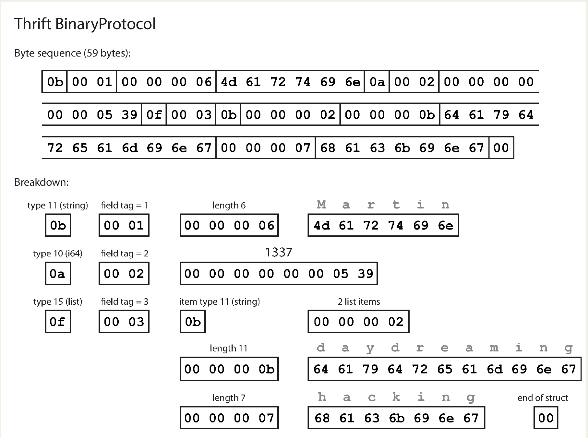
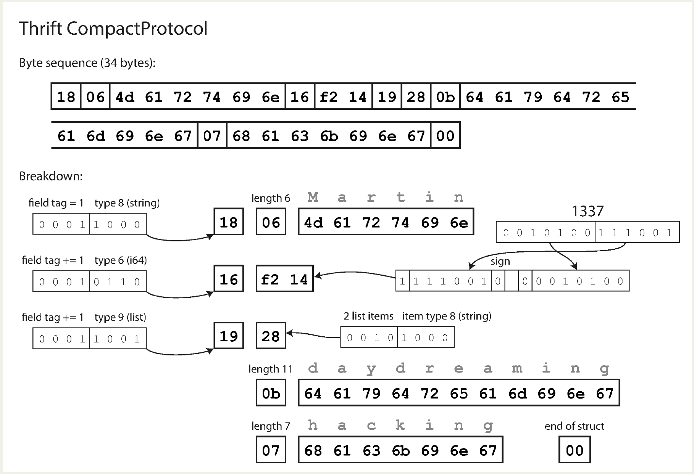
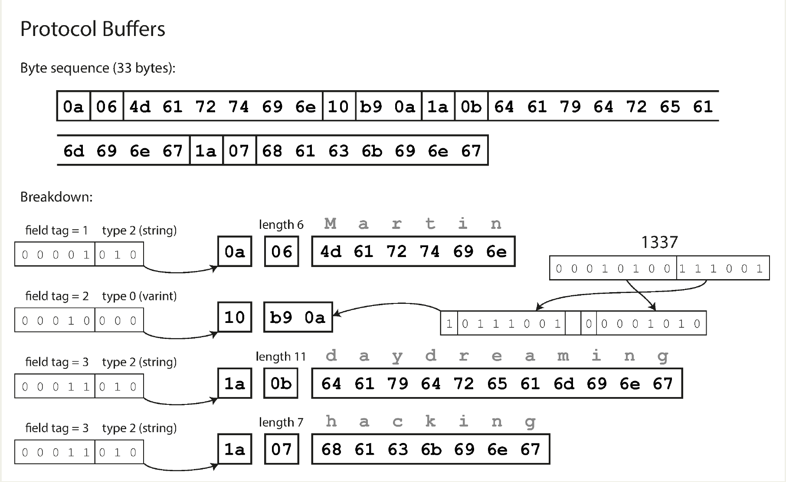
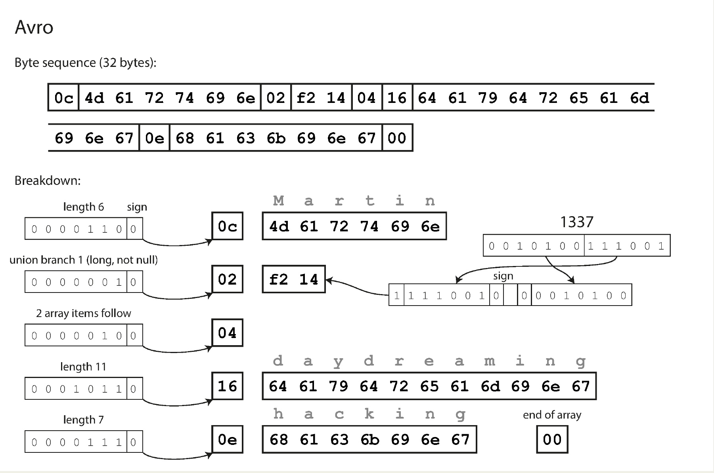

# Chapter 4. Encoding and Evolution

- When a data format or schema changes, a corresponding change to application code often needs to happen. However, in a large application, code changes often cannot happen instantaneously:
  - With **server-side** apps you may want to perform a **rolling upgrade** (also known as a **staged rollout**).
  - With **client-side** apps you’re at the mercy of the user, who may not install the update for some time 🤷.
- This means that old and new versions of the code, and old and new data formats, may potentially all coexist in the system at the same time. In order for the system to continue running smoothly, we need to maintain compatibility in both directions:
    - **Backward compatibility**: Newer code can read data that was written by older code.
    - **Forward compatibility**: Older code can read data that was written by newer code.
- ⚠️ Forward compatibility can be trickier, because it requires **older code** to **ignore additions** made by a newer version of the code.

## Formats for Encoding Data

### Language-Specific Formats

- Many programming languages come with built-in support for encoding in-memory objects into byte sequences. For example:
  -  Java has `java.io.Serializable`
  -  Ruby has `Marshal`
  -  Python has `pickle` and so on.
- Many third-party libraries also exist, such as `Kryo` for Java.
- These encoding libraries are very **convenient**. However, they also have a number of deep problems:
  - Encoding is often tied to a particular programming language, and reading the data in another language is very difficult.
  - Decoding process needs to be able to **instantiate arbitrary classes**. This is frequently a source of **security** problems.
  - **Versioning** data is often an **afterthought** in these libraries.
  - **Efficiency** is also often **afterthought**.

### JSON, XML, and Binary Variants

- Moving to standardized encodings that can be written and read by many programming languages, *JSON* and *XML* are the obvious contenders. They are **widely known** & **supported**. *XML* is often criticized for being too verbose and unnecessarily complicated 🤷‍♂️. *JSON*’s popularity is mainly due to its built-in support in **web browsers**.
Besides the superficial syntactic
issues, they also have some subtle problems:
- There is a lot of ambiguity around the encoding of numbers:
  - In XML and CSV, you **cannot distinguish** between a **number** and a **string** that happens to consist of digits (except by referring to an external schema 🫤). *JSON* distinguishes strings and numbers, but it **doesn’t distinguish** integers and **floating-point numbers**, and it doesn’t specify a precision.
  - This is a problem when dealing with **large numbers**; for example, integers greater than `2^53` cannot be exactly represented in an *IEEE 754* double-precision floating-point number, so such numbers become inaccurate when parsed in a language that uses floating-point numbers (such as *JavaScript*).
  - JSON and XML have good support for Unicode character strings (i.e., human-readable text), but they don’t support binary strings (sequences of bytes without a character encoding).
  - There is **optional schema support** for both XML and JSON. These schema languages are quite powerful, and thus quite complicated to learn and implement.
  - CSV does not have any schema, so it is up to the application to define the meaning of each row and column. If an application change adds a new row or column, you have to handle that change manually. CSV is also a quite vague format (what happens if a value contains a comma or a *newline* character?). Although its **escaping rules** have been **formally specified**, not all parsers implement them correctly.

### Binary encoding

- JSON is less verbose than XML, but both still use a **lot of space** compared to binary formats 💯.
  - Since they don’t prescribe a schema, they need to include **all the object field names** within the encoded data.
- ➡️ This observation led to the development of a profusion of binary encodings for JSON (`MessagePack`, `BSON`, `BJSON`, `UBJSON`, `BISON`, and `Smile`, ...) and for XML (`WBXML` and `Fast Infoset`, for example).

## Thrift and Protocol Buffers

- Apache Thrift and (Google) Protocol Buffers (protobuf) are binary encoding libraries that are based on the same principle.
- Both Thrift and Protocol Buffers **require a schema** for any data that is encoded.
- Thrift and Protocol Buffers each come with a **code generation** tool that takes a **schema definition** like and produces **classes** that implement the schema in various programming languages.
- For Thrift **BinaryProtocol**, the big difference is that there are no **field names**. Instead, the encoded data contains **field tags**, which are numbers (1, 2, and 3). Those are the numbers that appear in the **schema definition**.
- Field tags are like aliases for fields—they are a compact way of saying what field we’re talking about, without having to spell out the field name.
- Each field has a **type annotation** and, where required, a length indication (length of a string, number of items in a list). <p align="center"></p>
- The Thrift **CompactProtocol** encoding is semantically equivalent to **BinaryProtocol** it packs the same information into only **34 bytes**. It does this by packing the **field type** and **tag number** into a **single byte**, and by using **variable-length integers**. Rather than using a full eight bytes for the number `1337`, it is encoded in two bytes, with the **top bit** of each byte used to indicate whether there are still more bytes to come. This means numbers between `64` and `63` are encoded in
1 byte, numbers between `8192` and `8191` are encoded in 2 bytes, etc. Bigger numbers use more bytes. <p align="center"></p>
- Finally, **Protocol Buffers** does the bit packing slightly differently, but is otherwise very similar to Thrift’s CompactProtocol. Protocol Buffers fits the same record in 33 bytes. <p align="center"></p>

### Field tags and schema evolution

- As you can see from the examples, an encoded record is just the **concatenation** of its **encoded fields**.
  - Each field is identified by its tag number and annotated with a datatype.
  - If a field value is not set, it is simply omitted from the encoded record.
  - From this you can see that field tags are critical to the meaning of the encoded data. You can change the name of a field in the schema, since the **encoded data never refers to field names**, but you cannot change a field’s tag, since that would make all existing encoded data invalid ⚠️.
- If **old code** (which doesn’t know about the new tag numbers you added) tries to **read data written by new code**, including a new field with a tag number it doesn’t recognize, it can simply ignore that field. The datatype annotation allows the parser to determine **how many bytes it needs to skip**. This maintains **forward compatibility**: old code can read records that were written by new code.
- What about **backward compatibility**? As long as each field has a unique tag number, **new code can always read old data**, because the **tag numbers** still have the **same meaning**. The only detail is that if you **add a new field**, you **cannot make it required** ⚠️. If you were to add a field and make it `required`, that check would fail if new code read data written by old code, because the old code will not have written the new field that you added. Therefore, to maintain backward compatibility, every field you add after the initial deployment of the schema must be `optional` or have a **default value**.
- Removing a field is just like adding a field, with backward and forward compatibility concerns reversed.
  - That means you can only remove a field that is `optional` (a `required` field can never be removed ⚠️), and you can never use the **same tag number** again (because you may still have data written somewhere that includes the old tag number, and that field must be ignored by new code).

### Datatypes and schema evolution

- What about changing the datatype of a field? 
  - May be possible but there is a risk that values will **lose precision** or get **truncated**.
- A curious detail of **Protocol Buffers** is that it does not have a list or array datatype, but instead has a `repeated` marker for fields.
  - The encoding of a repeated field is just what it says on the tin: the same field tag simply appears multiple times in the record.
  - ➡️ This has the nice effect that it’s okay to change an optional (single-valued) field into a repeated (multi-valued) field.
- **Thrift** has a dedicated list datatype, which is parameterized with the datatype of the list elements. This **does not allow** the same evolution from single-valued to multi-valued as PB does, but it has the advantage of supporting **nested lists**.

## Avro

- It was started in 2009 as a subproject of Hadoop, as a result of Thrift not being a **good fit** for `Hadoop’s` use cases.
- It has two schema languages: one (Avro IDL) intended for human editing, and one (based on JSON) that is more easily machine-readable:
  ```json
  {
    "type": "record",
    "name": "Person",
    "fields": [
      {"name": "userName", "type": "string"},
      {"name": "favoriteNumber", "type": ["null", "long"], "default": null},
      {"name": "interests", "type": {"type": "array", "items": "string"}}
    ]
  }
  ```
- Notice that there are **no tag numbers** in the schema. If we encode our example record using this schema, the Avro binary encoding is just **32 bytes** long - the most compact of all the encodings we have seen.
- If you examine the byte sequence, you can see that there is nothing to identify fields or their datatypes. The encoding simply consists of values concatenated together. <p align="center"></p>
- To parse the binary data, you go through the fields **in the order** that they appear in the schema and use the schema to tell you the datatype of each field. This means that the binary data can only be decoded correctly if the code reading the data is using the **exact same schema** as the code that wrote the data. Any mismatch in the schema between the reader and the writer would mean incorrectly decoded data. So, how does Avro support schema evolution 🤔?

### The writer’s schema and the reader’s schema

- Data is **encoded** using a **writer's schema** and **decoded** using a **reader's schema**.
- The writer's schema is the version of the data's schema that the application creating the data knows about. The reader's schema is the version the application receiving the data expects it to be in.
- The key idea with Avro is that the writer’s schema and the reader’s schema **don’t have** to be **the same** - they only need to be **compatible** 🦊.
- Avro handles schema differences between a reader and a writer through a process called **schema resolution**. The Avro library resolves the discrepancies by comparing the two schemas side by side and transforming the data as needed.
  - **Field Mismatch**: Fields are matched **by name**, not by their position in the schema.
  - **New Field**: If a field exists in the writer's schema but not in the reader's, the Avro library will **ignore it**.
  - **Missing Field**: If a field exists in the reader's schema but not in the writer's, it will be filled with the **default value** specified in the reader's schema.

### Schema evolution rules