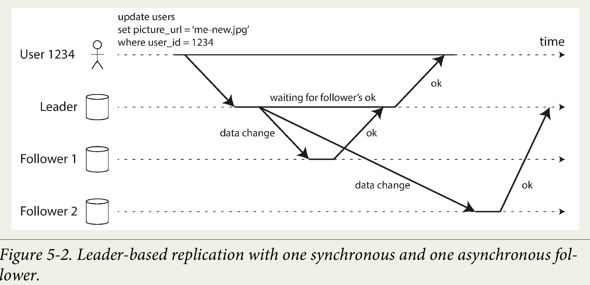
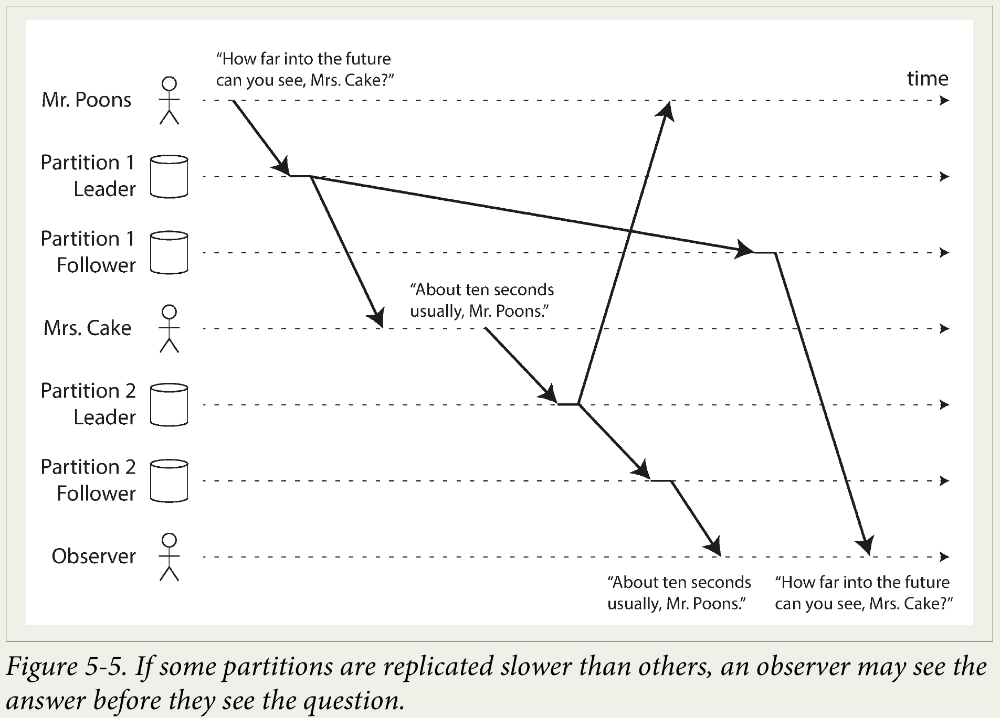

# Chapter 5. Replication

- Replication means keeping a **copy** of the same data on **multiple machines** that are connected via a network. 
  - To keep data **geographically close** to your users (and thus reduce latency)
  - Increase **availability**.
  - To scale out the number of machines that can serve read queries (and thus increase **read throughput**).
- If the data that you’re replicating **does not change** over time, then replication is easy 🤹‍♂️:
  - You just need to copy the data to every node once, and you’re done. 
  - All of the **difficulty** in replication lies in handling **changes** to replicated data, and that’s what this chapter is about.

## Leaders and Followers

- Each node that stores a copy of the database is called a **replica**.
- How do we ensure that all the data ends up on all the replicas ❓
- The most common solution for this is called **leader-based replication** (also known as **active/passive** or **master–slave** replication). It works as follows:
  1. One of the replicas is designated the **leader** (also known as **master** or **primary**). When clients want to write to the database, they must send their requests to the leader, which first writes the new data to its local storage.
  2. The other replicas are known as **followers** (read **replicas**, **slaves**, **secondaries**, or **hot standbys**). Whenever the leader writes new data to its local storage, it also sends the data change to all of its followers as part of a **replication log** or **change stream**. Each follower takes the log from the leader and updates its local copy of the data‐base accordingly, by applying all writes in the same order as they were processed on the leader.
  3. When a client wants to read from the database, it can query either the leader or any of the followers. However, writes are only accepted on the leader (the followers are read-only from the client’s point of view).

### Synchronous Versus Asynchronous Replication

- In the example of Figure 5-2, the replication to *follower 1* is **synchronous**: the leader waits until follower 1 has **confirmed** that it received the **write** before reporting success to the user, and before making the write visible to other clients. The replication to *follower 2* is **asynchronous**: the leader sends the message, but doesn’t wait for a response from the follower.

- Normally, replication is **quite fast**: most database systems apply changes to followers in **less than a second**.
- However, there is no guarantee of how long it might take 🤓. There are circumstances when followers might fall behind the leader by several minutes or more, for example:
  - If a follower is recovering from a **failure**,
  - If the system is operating near **maximum capacity**,
  - or if there are **network problems** between the nodes.
- The 👍 of synchronous replication is that the follower is **guaranteed** to have an **up-to-date** copy of the data that is consistent with the leader. If the leader suddenly fails, we can be sure that the data is still available on the follower.
- The 👎 is that if the synchronous follower **doesn’t respond** (because it has **crashed**, or there is a **network fault**, or for any other reason), the write cannot be processed 👨‍💻. The leader must block all writes and wait until the synchronous replica is available again.
- ➡️ This configuration is sometimes also called **semi-synchronous**.
- **Asynchronous** leader-based replication allows the leader to confirm writes without waiting for followers.
  - This improves **availability** and **throughput** (especially with many or geographically distant replicas) but **weakens** **durability** if the leader fails before replication, recent writes may be lost. Despite this risk, it’s commonly used in practice 🤷‍♂️.

### Setting Up New Followers

- Conceptually, the process looks like this:
  - Take a **consistent snapshot** of the leader’s database at some point in time — if possible, **without** taking a **lock** on the entire database.
  - Copy the snapshot to the new follower node.
  -The follower connects to the leader and requests all the data changes that have happened since the snapshot was taken. This requires that the snapshot is associated with an exact position in the **leader’s replication log**. That position has various names: for example, `PostgreSQL` calls it the **log sequence number**, and MySQL calls it the **binlog coordinates**.
   -When the follower has processed the backlog of data changes since the snapshot, we say it has caught up. It can now continue to process data changes from the leader as they happen.

### Handling Node Outages

- When a follower fails or is disconnected, it uses its **local log** to identify the **last processed transaction**. Upon recovery, it reconnects to the leader, requests the missing changes, applies them, and then resumes normal replication.
- Leader failure requires **failover**, where a follower is **promoted** to **leader**, clients redirect writes, and other replicas follow the new leader. Failover may be **manual** or **automatic**, involving:
  - (1) detecting leader failure (often via **timeouts**),
  - (2) electing/choosing the most up-to-date replica as new leader (a **consensus** problem), and
  - (3) reconfiguring the system so **clients** and nodes follow the **new leader** while ensuring the **old leader steps down** if it returns.
- Failover is fraught with things that can go wrong:
  - Failover can cause **data loss** or **conflicts** if replication is **asynchronous**: the new leader may lack some of the old leader’s writes, and if the old leader rejoins, its unreplicated writes are usually **discarded** — potentially breaking **durability** guarantees 🤷‍♂️.
  - **Split brain** occurs when two nodes both think they are leader, risking data loss or corruption if both accept writes. To prevent this, systems may **shut down** one leader — but poor design can cause both to shut down 🤓.
  - Choosing the leader **timeout** is a **trade-off**: long timeouts delay recovery after failure, but short ones risk unnecessary failovers due to load spikes or network glitches, which can worsen problems.

### Implementation of Replication Logs

#### Statement-based replication

Statement-based replication logs and **forwards** executed **SQL statements** (`INSERT`, `UPDATE`, or `DELETE`) to followers, but it suffers from problems with **non-deterministic** functions (such as `NOW()` or `RAND()`), **auto-incrementing** values, **ordering** of **concurrent** transactions, and side effects from **triggers** or **procedures**. Workarounds exist, but due to many edge cases, more reliable replication methods are generally preferred.

#### Write-ahead log (WAL) shipping

WAL shipping replicates data by sending the leader’s **append-only** log of low-level storage changes to followers, which then rebuild the same data structures. It’s used in systems like `PostgreSQL` and `Oracle`. While effective, it tightly couples replication to the storage engine, making **cross-version** replication difficult. This complicates **upgrades**, often requiring downtime since followers usually can’t run **newer versions** than the **leader**.

#### Logical (row-based) log replication

Logical logs **decouple** replication from **storage engine** internals by recording changes at the row level (inserts, deletes, updates) rather than **low-level disk operations** 🤔. This approach, used in `MySQL’s` row-based `binlog`, enables easier **backward compatibility**, supports running different versions or storage engines across leader and followers, and is more accessible for external applications (e.g., data warehouses, custom indexes). This technique is known as **change data capture**.

#### Trigger-based replication

Replication is usually handled by the database itself, but in cases needing more **flexibility** — like **selective replication**, **cross-database** replication, or **conflict resolution** — it can be moved to the **application** layer. Tools like `Oracle GoldenGate` read database logs, while triggers and stored procedures let custom code capture and replicate changes. Although trigger-based replication is **slower** and more **error-prone** than built-in methods, it remains valuable for its flexibility.

## Problems with Replication Lag

For read-heavy workloads, databases often use a **leader–follower** replication model: writes go to the leader, while reads are distributed across many followers to scale capacity and reduce load. This usually requires **asynchronous** replication, since synchronous replication to all followers would make the system **fragile** — any single node or network failure could block writes.

The trade-off is **replication lag**: followers may return outdated data compared to the leader, causing **eventual consistency**. Normally, lag is small (fractions of a second 🤔), but under heavy load or network issues it can grow to **seconds or minutes**, creating real problems for applications.

### Reading Your Own Writes

When users submit data (e.g., a profile update, comment, or record), the write goes to the leader, but reads are often served from followers for scalability. With asynchronous replication, this causes a problem: if the user **immediately reads after writing**, their update may not have reached the replica yet. It looks like their data was lost, creating a bad user experience 🤷‍♀️.

The solution is **read-after-write consistency** (a.k.a. *read-your-writes* consistency): users must always see their own updates, even if followers are lagging. Ways to achieve this in leader-based replication:
- **Selective leader reads**: Read potentially user-modified data (e.g., a user’s own profile) from the leader, but use followers for other data.
- **Time-based fallback**: After a user write, read from the leader for a short period (e.g., 1 minute) or avoid lagging replicas.
- **Timestamps**: Track the user’s last write timestamp; ensure followers serving reads are up-to-date at least to that point (using logical or physical clocks).
- **Multi-datacenter routing**: If replicas span regions, route reads that need the leader to the leader’s datacenter.

#### Monotonic Reads

When reading from asynchronous replicas, users may sometimes see data move **backward** in time. For example, a user might first read from a replica that has recent data, then from a more lagging replica where that update hasn’t appeared yet — making the data seem **to disappear** 🤦.

**Monotonic reads** prevent this anomaly by ensuring that once a user has seen newer data, they won’t later see older data. It’s **weaker** than **strong consistency** but **stronger** than **eventual consistency**.

A common way to implement it is to route all of a user’s reads to the **same replica** (e.g., by hashing the user ID), though if that replica fails, rerouting must ensure the replacement is at least as up to date.

#### Consistent Prefix Reads

- Replication lag can cause **causality violations**, where events appear **out of order** (e.g., an answer showing up before the corresponding question).
- This anomaly is prevented by **consistent prefix reads**, which guarantee that if writes occur in a certain order, readers will always see them in that order.
- The issue is common in **partitioned/sharded** databases, since different partitions may apply writes independently without a global order.
- Solutions include co-locating causally related writes in the same partition or using algorithms that track causal dependencies. 

#### Solutions for Replication Lag

Replication lag in **eventually consistent** systems can cause a poor user experience. While it's fine if an application can handle delays of minutes or hours, systems that can't, should be designed for stronger guarantees, like **read-after-write** consistency.

Although an application can be coded to handle these issues by directing specific reads to the leader, this approach is **complex** and prone to **errors**. It's more ideal for the database to handle these guarantees, which is the purpose of *transactions*.

Many distributed databases have moved away from **single-node transactions**, arguing they are too costly for performance and availability, and that **eventual consistency** is a **necessary** trade-off for scalability 👨‍🔬. However, this is a simplistic view. The book will explore a more nuanced perspective on transactions and alternative mechanisms in later chapters.

## Multi-Leader Replication

- Leader-based replication centralizes all writes on one node, creating a SPOF.
- Multi-leader replication (also known as *master-master* or *active/active* replication) allows multiple nodes to accept writes and replicate to each other, improving **availability** since writes can continue even if one leader fails.

### Use Cases for Multi-Leader Replication

#### Multi-datacenter operation

In **multi-datacenter** deployments, **single-leader replication** forces all writes through one datacenter, causing latency, sensitivity to network issues, and reliance on failover if the leader’s datacenter fails. Multi-leader replication allows **each datacenter** to process **local writes** and **asynchronously** replicate across datacenters, improving performance and resilience to outages or network problems.

Despite these benefits, multi-leader replication has a major 👎: **write conflicts**. When the same data is modified in two different datacenters simultaneously, these conflicts must be resolved. Because this feature is often added to databases as an afterthought, it can lead to complex issues with features like **auto-incrementing keys**, **triggers**, and **integrity constraints**, making it a potentially problematic and risky configuration to implement ⚠️.

#### Clients with offline operation

Multi-leader replication is an excellent choice for applications that require **offline operation**, such as **calendar apps** on **mobile devices**. In this model, each device has a **local database** that acts as a leader, accepting both read and write requests while disconnected from the internet.

When the device comes back online, an asynchronous multi-leader replication process **syncs** the changes with a central server and other devices. The **replication lag** can be **significant**, potentially hours or even days.

Architecturally, this is similar to multi-datacenter replication, but with an extremely unreliable network connection between "datacenters" (the devices). Getting this right can be difficult, as evidenced by the many flawed synchronization implementations 🤷. However, some tools, like `CouchDB`, are specifically designed to facilitate this type of multi-leader setup.

#### Real-Time Collaborative Editing

Apps like *Etherpad* and *Google Docs* let multiple users edit documents simultaneously. Each user’s edits apply immediately to their local replica and are asynchronously synced to the server and other users.

With **strict locking**, edits happen sequentially — this is like single-leader replication with transactions. For smoother collaboration (e.g., keystroke-level changes), locking is avoided, enabling concurrent edits. This model resembles multi-leader replication, requiring conflict resolution to handle simultaneous changes.

### Handling Write Conflicts