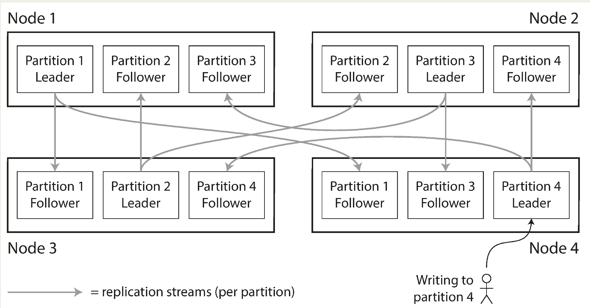
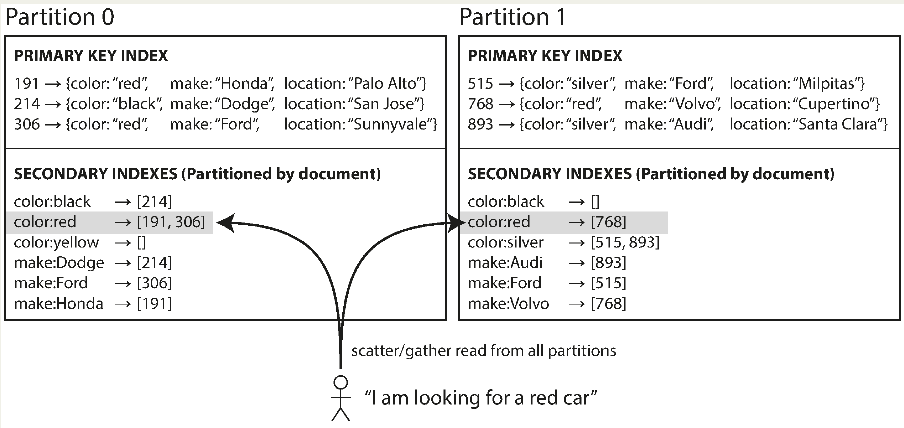
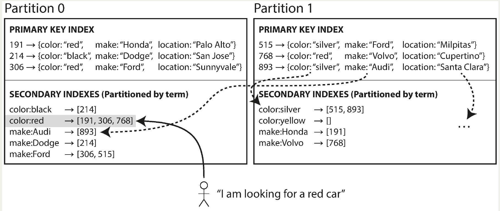
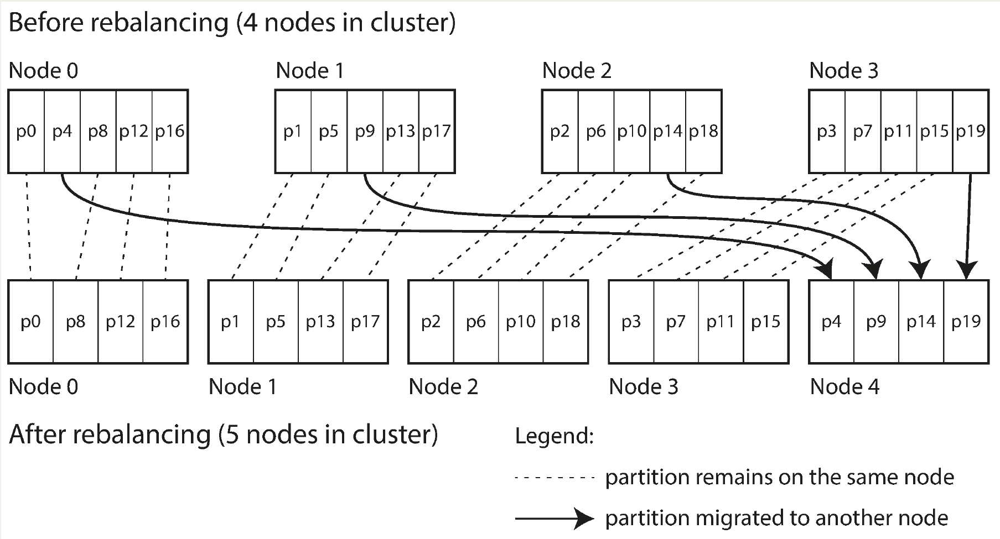
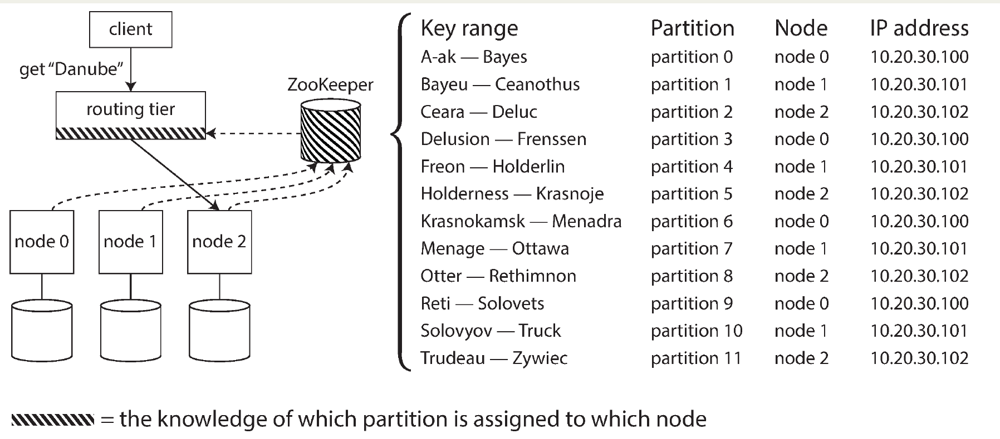

# Chapter 6. Partitioning

- Replication alone isn’t enough for very large datasets or high query throughput → need **partitioning/sharding**.
- Each record/document belongs to ((exactly one partition)) (aka shard, region, tablet, vnode, vBucket, etc.).
- Each partition functions like a small independent database.
- Scalability benefit:
  - Data and query load distributed across nodes in a shared-nothing cluster.
  - Single-partition queries scale easily by adding nodes.
  - Large queries may be parallelized, but this is harder.
- Partitioned databases date back to the 1980s (`Teradata`, `Tandem NonStop SQL`), re-popularized by `NoSQL` and `Hadoop`.
- Systems differ by workload type: transactional vs. analytical, but partitioning principles apply to both.

## Partitioning and Replication

- **Partitioning** is usually **combined** with **replication** → each partition is stored on multiple nodes for fault tolerance.
- A node can hold multiple partitions.
- With leader–follower replication:
  - Each partition has a leader on one node, and followers on others.
  - A node can be leader for some partitions and follower for others.
- Replication principles (from Chapter 5) apply to partitions as well.
- Partitioning scheme choice is independent of replication scheme.

## Partitioning of Key-Value Data

- Partitioning aims to **evenly distribute** data and **query load** across nodes so performance scales with the cluster size.
- **Skewed** partitions cause imbalance: some nodes get more data/queries, creating **hot spots** that limit scalability.
- **Random** assignment avoids hot spots but makes reads inefficient (must check all nodes).
- A better approach uses a **key-based** partitioning model, where records are accessed via a primary key (like alphabetized entries in an encyclopedia), ensuring efficient lookups while distributing load more evenly.

### Partitioning by Key Range

- Range-based partitioning assigns continuous **ranges of keys** to partitions (like encyclopedia volumes).
- 👍:
  - Easy to determine the partition for a key.
  - Supports sorted keys within a partition, enabling efficient range scans and multi-record queries (e.g., sensor data by time).
- Challenges:
  - Data distribution may be **uneven**, so partition boundaries must adapt to balance load.
  - Certain access patterns (like **timestamps as keys**) create **hot spots**  as all recent writes go to **one partition**.
- Mitigation: Use **composite keys** (e.g., prefix timestamp with sensor ID) to spread writes across partitions, though queries then require multiple range scans.

### Partitioning by Hash of Key

**Hash-based** partitioning distributes data evenly across partitions by hashing keys into numeric ranges. This avoids skew and hot spots, unlike r**ange partitioning**, which can concentrate load on certain partitions.
- Mechanism:
  - A hash function (e.g., `MD5` in *Cassandra/MongoDB*, `FNV` in *Voldemort*) maps each key ➡️ a value.
  - Partitions hold ranges of these hash values.
  - This ensures even distribution, but loses key ordering.
- 👎:
  - Range queries become **inefficient**: adjacent keys are **scattered** across partitions, so queries must **fan out** to all partitions.
  - Example: *MongoDB’s* hash-sharding requires broadcasting range queries. *Riak*, *Couchbase*, and *Voldemort* do **not support** range queries on hashed keys.
- *Cassandra’s* compromise:
  - Uses **compound primary keys**: the **first column** is hashed to pick a partition, while remaining columns preserve order in SSTables.
  - Range scans work efficiently within a fixed partition (once the first key part is given).
  - Example: (`user_id`, `update_timestamp`) lets you fetch all posts from a user over a time range, ordered by timestamp, while still distributing users across partitions.

### Skewed Workloads and Relieving Hot Spots

- Hash partitioning reduces but doesn’t eliminate hot spots 🤷.
  - If all activity targets the same key (e.g., celebrity user ID on social media), hashing won’t help because identical keys always hash to the same partition.
  - Current systems generally don’t auto-balance such skew, so the application must handle it.
- Common workaround:
  - Key-splitting: append a **random number** (e.g., two digits) to a hot key, spreading writes across multiple partitions.
  - ⚖️ Trade-off: **reads** become more **expensive**, since they must fetch and merge from all split keys.
  - Requires **bookkeeping** to track which keys are “hot” and split.
- Future possibility:
  - Databases might automatically detect and mitigate skew, but today it’s mostly left to application design 🫤.

## Partitioning and Secondary Indexes

- Partitioning with secondary indexes is harder than with primary keys.
  - With primary keys, partitioning is straightforward: the key determines the partition.
  - With secondary indexes, queries are value-based (e.g., “all posts by user 123” or “all cars that are red”), so they **don’t map cleanly to a single partition**.
- Partitioning with secondary indexes typically uses one of two strategies:
  - **Document-based** partitioning – keep indexes local to each partition.
  - **Term-based** partitioning – partition the index by the indexed term itself.

### Partitioning Secondary Indexes by Document

- How it works:
  - Data is partitioned by document ID (for example, IDs `0 to 499` in partition 0, IDs `2` in partition 1, etc.).
  - Each partition maintains its own **local secondary index** (only for documents it stores).
  - Writes are simple: only the partition containing the document needs updating.
- **Reads are harder**:
  - Since indexed values (e.g., all red cars) may span **multiple partitions**, queries must be sent to all partitions.
  - This is the **scatter/gather** approach: query every partition in parallel and merge results.
- 👎 higher latency, especially tail latency.
- Adoption:
  - Widely used in *MongoDB*, *Riak*, *Cassandra*, *Elasticsearch*, *SolrCloud*, and *VoltDB*.
- Vendors suggest partitioning so queries often hit just **one partition**, but this isn’t always possible (e.g., queries filtering by multiple secondary indexes like `color + make`).

### Partitioning Secondary Indexes by Term

- How it works:
  - Instead of each partition maintaining its own index, there is a **global index** covering all data.
  - The global index is **itself partitioned by term** (e.g., `color:red` stored in one partition, `make:ford` in another).
  - Partitioning can be:
    - By term value → supports range scans (e.g., price ranges).
    - By hash of term → balances load evenly.
- 👍:
  - Makes **reads efficient**: a query only needs to go to the partition containing the term, instead of scatter/gather across all partitions.
- 👎:
  - Writes become slower and more complex:
    - A single document **update** may affect **multiple index partitions**.
    - Requires coordination across nodes.
  - Maintaining strict **consistency** would need distributed transactions, which many databases avoid 🤷‍♂️.
- Reality in practice:
  - Many databases (e.g., *DynamoDB*) update global indexes **asynchronously**.
  - This means recent writes may not immediately appear in queries.
  - Some systems (Riak Search, Oracle) allow choosing between **local vs. global indexing**.

## Rebalancing Partitions

- Rebalancing is the process of **moving data** and requests between nodes when load changes, storage needs grow, or failures occur.
- Minimum requirements:
  - **Fair load distribution** across nodes after rebalancing.
  - **Continuous availability** of reads/writes during the process.
  - **Efficiency**, i.e., moving as little data as necessary to reduce time, network, and disk I/O.

### Strategies for Rebalancing

#### How not to do it: hash mod N

- Assigning keys using `hash(key) mod N` works initially, but if the **number of nodes changes**, almost all keys must be **remapped** to new nodes
- ▶️ This makes rebalancing very expensive.

#### Fixed number of partitions

- 💡 Create **many more partitions than nodes** and assign multiple partitions to each node.
  - Example: 10 nodes, 1,000 partitions → ~100 partitions per node.
- **Rebalancing**:
  - Adding a node: it “steals” partitions from existing nodes.
  - Removing a node: its partitions are redistributed to remaining nodes.
  - Only whole partitions move, not individual keys.
  - Reads/writes continue using the old assignment until transfer completes.
- 👍:
  - Allows uneven hardware: more partitions can be assigned to more **powerful** nodes.
  - **Reduces data movement** compared to mod-based hashing.
  - Implementation: Used by *Riak*, *Elasticsearch*, *Couchbase*, *Voldemort*.
- Partition sizing trade-offs ⚖️:
  - Too large → expensive rebalancing and recovery.
  - Too small → high management overhead.
  - Fixed number of partitions **simplifies operations** but must be chosen to handle future growth.

#### Dynamic partitioning

- Dynamic partitioning in databases (like *HBase*, *RethinkDB*, and *MongoDB*) avoids the problems of fixed key range boundaries by **splitting partitions automatically** when they grow too large and merging them when they shrink.
- Each partition is assigned to a node, and partitions can be moved between nodes to balance load.
- 👍:
  - Number of partitions adapts to data volume.
  - Prevents oversized partitions by capping their size.
  - Reduces overhead when data is small.
Challenges:
  - A new/**empty** database starts with a single partition, meaning **one node handles all writes** until the first split.
  - To avoid early bottlenecks, systems like *HBase* and *MongoDB* support **pre-splitting** (manually defining initial partitions if you know the key distribution).

#### Partitioning proportionally to nodes

- Each **node** has a **fixed number of partitions** (e.g., *Cassandra* defaults to 256).
- Thus, **partition size** scales with **dataset size** if the number of nodes is constant, but adding nodes reduces partition size, keeping them fairly balanced.
- When a **new node joins**, it randomly selects some **existing partitions to split**, taking half of each and leaving the other halves behind.
- **Randomization** may cause **unfairness**, but across many partitions the load **evens out**; newer rebalancing algorithms (Cassandra 3.0+) improve fairness.
- This approach requires **hash-based partitioning**, and it aligns with the original idea of **consistent hashing**, which newer hash functions can implement with less metadata overhead.
- 👉 In short: Fixed partitions per node = stable partition sizes, fair load distribution when scaling, and natural fit with consistent hashing.

### Operations: Automatic or Manual Rebalancing

- Rebalancing can be automatic or manual:
  - **Automatic rebalancing**: System moves partitions **without admin input**.
    - Pros: Less operational work.
    - Cons: Expensive (data + request rerouting), can overload network/nodes, risky with automatic failure detection (may cause cascading failures if a node is just slow, not dead).
  - **Manual/semi-automatic rebalancing**: System suggests partition assignments, but an **admin must approve** (e.g., *Couchbase*, *Riak*, *Voldemort*).
    - Pros: Slower, but safer—keeps humans in the loop and avoids surprises.
- 👉 Tradeoff: Automation offers **convenience** but **unpredictability**; manual rebalancing is **slower** but **safer** for stability.

## Request Routing

- Once data is partitioned across nodes, the challenge becomes:
  - 👉 *How does a client know which node to contact for a given key*❓
- Approaches to Routing
  1. **Any node** (with forwarding): Client contacts any node → if it owns the partition, it handles it; otherwise forwards to the correct node. (Used in *Cassandra*, *Riak*)
  2. **Routing tier**: A dedicated tier routes requests to the correct node. (e.g., *HBase*, *SolrCloud*, *Kafka*, *MongoDB* with mongos)
  3. **Partition-aware clients**: Clients maintain cluster metadata and contact the right node directly.
- Key Challenge
  - The routing component (node, tier, or client) must **always have up-to-date** knowledge of partition-to-node assignments.
  - Requires **coordination** so all participants agree → typically solved via **consensus protocols** or **coordination services**.
- Coordination Mechanisms
  - **ZooKeeper** (common choice): Nodes register, *ZooKeeper* maintains the authoritative mapping, routing tier or clients subscribe to updates.
  - **Gossip protocols**: (*Cassandra*, *Riak*) → nodes share state changes with each other, avoiding *ZooKeeper*.
  - Custom mechanisms: *Couchbase* uses *moxi*; *MongoDB* uses config servers + *mongos*.
- Bootstrapping client connections
  - Clients still need an entry point (e.g., routing tier or any node’s IP).
  - Since node IPs change less often than partition ownership, DNS is usually sufficient for this.
- ⚖️ Trade-off:
  - ZooKeeper-based designs → central, authoritative metadata, external dependency.
  - Gossip-based designs → decentralized, simpler for clients, but more complexity inside nodes.

### Parallel Query Execution

- Most NoSQL stores only support simple single-key queries (or scatter/gather for secondary indexes), but (*massively parallel processing*) **MPP** relational - databases (used in analytics) can handle complex queries with joins, filtering, grouping, and aggregations.
- The query optimizer **breaks queries** into **execution stages** that run in **parallel** across nodes, making large dataset scans efficient.
- Parallel query execution is a specialized and commercially important area (especially for analytics workloads), and later chapters cover techniques in more detail.