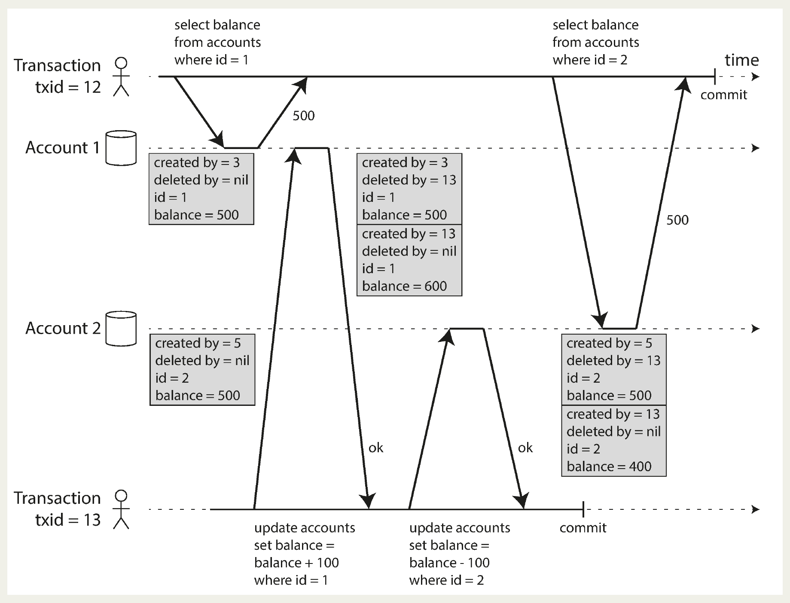

# Chapter 7. Transactions

- Data systems face many possible failures: software/hardware crashes, application crashes mid-operation, network interruptions, concurrent writes, partial updates, and race conditions.
- To handle these, systems need fault tolerance, which is complex and requires careful design and testing.
- **Transactions simplify** error handling by **grouping reads/writes** into a **single logical unit** that either **fully succeeds** (commit) or **fully fails** (rollback). This frees applications from dealing with partial failures or concurrency issues, since the database provides safety guarantees.
- Transactions are not always necessary; sometimes **weaker guarantees** are chosen for **performance** or **availability** 🤷‍♂️.
- To decide whether transactions are needed, one must understand what guarantees they provide and their trade-offs ⚖️.

## The Slippery Concept of a Transaction

- Most relational databases today (MySQL, PostgreSQL, Oracle, SQL Server, etc.) implement transactions in a style originating from *IBM’s System R* in the 1970s. While details have evolved, the core ideas remain consistent.
- When NoSQL databases rose in the late 2000s, they introduced new data models and emphasized replication and partitioning. Transactions were **often dropped** or **weakened**, fueling a belief that transactions **limit scalability**, while traditional vendors promoted them as essential for critical applications 🤷.
- In reality, both claims are exaggerated. Transactions are neither universally necessary nor inherently incompatible with scalability — they are a trade-off ⚖️, offering **strong safety guarantees** but with **performance** and a**vailability costs**.
- To reason about these trade-offs, one must understand exactly what guarantees transactions provide under normal and failure conditions 🤔.

### The Meaning of ACID

- The concept of `ACID` (**Atomicity**, **Consistency**, **Isolation**, **Durability**) was introduced in 1983 to define database fault-tolerance guarantees. However, implementations differ greatly — especially around **isolation** —so “*ACID compliance*” has become more of a **marketing** term than a precise guarantee 🫤.
- As a contrast, `BASE` (**Basically Available**, **Soft state**, **Eventual consistency**) emerged to describe *non-ACID* systems, but it’s even vaguer and often just means “*not ACID*.” 🫨.

#### Atomicity

- Atomicity has slightly different meanings depending on context:
  - In **multithreading**: An atomic operation cannot be observed in a **partial state** — only before or after completion.
  - In **ACID transactions**: Atomicity ensures that if a transaction fails partway (due to crash, network error, full disk, or constraint violation), **all writes** are **discarded/undone**.
- Without atomicity, partial changes make it unclear which updates succeeded, and retries risk duplicates or corruption. With atomicity, aborted transactions guarantee no changes, making retries safe.
- 👉 ACID atomicity = **all-or-nothing** execution of a transaction (better thought of as *abortability*).

#### Consistency

- The word consistency is terribly overloaded 🫣:
  - In Chapter 5 we discussed **replica consistency** and the issue of **eventual consistency** that arises in **asynchronously** replicated systems.
  - **Consistent hashing** is an approach to partitioning that some systems use for rebalancing.
  - In the **CAP** theorem, the word consistency is used to mean **linearizability** (see Chapter 9).
  - In the context of **ACID**, consistency refers to an application-specific notion of the database being in a “**good state**”.
- It’s unfortunate that the same word is used with at least four different meanings 🤷‍♂️.
- ACID consistency means that application-defined invariants (rules that must always hold true, e.g., credits = debits in accounting) are preserved across transactions.
- The **application** is responsible for ensuring its transactions maintain these **invariants**.
- The database cannot guarantee consistency on its own —it only **enforces limited constraints** (like foreign keys or uniqueness).
- In contrast, *atomicity*, *isolation*, and *durability* are properties provided by the **database**.
- 👉 Therefore, consistency in ACID is really an **application concern**, not a **true database property** — some argue the “`C`” doesn’t even belong in ACID 😐.

#### Isolation

- Isolation in ACID ensures that **concurrent transactions** don’t **interfere with each other**, avoiding **race conditions** (e.g., two clients incrementing the same counter but ending up with the wrong result).
- Formally, isolation is defined as **serializability**: transactions behave as if they ran **one after another**, even if they actually run concurrently.
- In practice, full serializable isolation is rarely used due to performance costs.
- Many databases (e.g., *Oracle 11g*) use **weaker guarantees** like **snapshot isolation**, even when labeled “serializable.”
- 👉 Isolation = transactions **don’t step on each other’s toes**, ideally serializable, but often weaker in practice.

#### Durability

- Durability in ACID means that **once a transaction commits**, its data will **not be lost** — even after crashes or hardware faults.
- **Single-node** databases: Ensure durability by writing to nonvolatile storage (HDD/SSD) and often use a WAL for recovery.
- **Replicated** databases: Ensure durability by replicating data to multiple nodes **before confirming commit**.
- A database must wait for these writes/replications to finish before declaring success.
- Perfect durability is impossible — if all disks and backups are destroyed, data is lost 🤓.
- 👉 Durability = **committed data survives crashes**, but only as strong as your **storage + replication setup**.

### Single-Object and Multi-Object Operations

- 👉 Atomicity = rollback on failure; Isolation = no half-visible states in concurrent access.
- Example (email app):
  - Denormalized unread counter can get inconsistent (message inserted but counter not updated).
  - Isolation prevents anomalies (users see consistent state).
  - Atomicity ensures if counter update fails, the message insert is rolled back.
- Implementation:
  - Relational DBs: Use `BEGIN TRANSACTION` … `COMMIT` (tied to a client connection).
  - Many nonrelational DBs: Don’t support true transactions — multi-object operations may partially succeed, leaving inconsistencies.

#### Single-object writes

- When writing a single object (e.g., 20KB JSON doc), DBs must avoid:
  - Partial writes (cut-off JSON fragments).
  - Corrupted values (old + new spliced together).
  - Reads seeing half-updated data.
- Storage engines ensure **atomic single-object writes** (via crash-recovery logs) and isolation (via per-object locks).
- Extra features:
  - Some DBs provide atomic operations like:
    - increment (avoids **read-modify-write** race conditions).
    - compare-and-set (update only if value hasn’t changed).
  - These help prevent lost updates in concurrent writes.
- ⚠️ But:
  - These are **not true transactions** (multi-object, grouped operations).
  - Calling them “*lightweight transactions*” or “ACID” is **marketing**, not accurate 🤷‍♀️.
- 👉 Atomic writes & isolation are almost always guaranteed per object, but real transactions cover **multiple objects together**.

#### The need for multi-object transactions

- Many distributed datastores dropped them for simplicity, availability, and performance, but they are still possible to implement.
- Single-object operations (insert, update, delete) are sometimes enough, but many cases need coordinated multi-object writes:
  - Relational DBs: enforcing **foreign keys and references** across rows/tables.
  - Document DBs: usually fine with single-object updates, but denormalization (due to lack of joins) often requires updating **multiple documents** at once.
  - **Secondary indexes**: must be updated with the base record; without transactions, you risk inconsistent index states.
- Without multi-object transactions:
  - Apps can still work, but error handling is much harder.
  - Lack of isolation causes concurrency anomalies.
  - Transactions simplify correctness by handling these automatically.
- 👉 Transactions aren’t strictly required, but they greatly **reduce complexity** and prevent data inconsistencies in relational, document, and indexed databases.

## Weak Isolation Levels

- Transactions that don’t access the same data can run in parallel safely.
- Concurrency issues happen when:
  - One transaction reads data modified by another.
  - Two transactions try to modify the same data at once.
- Concurrency 🐛 are:
  - Rare and timing-dependent → hard to reproduce in testing.
  - Difficult to reason about in large apps with many users.
- Role of isolation:
  - Goal: hide concurrency from developers by making execution look serial.
  - Serializable isolation: strongest guarantee, but has performance costs.
  - Many databases use weaker isolation levels → fewer guarantees, easier performance, but risk subtle and dangerous bugs.
- Real-world impact:
  - Weak isolation has caused:
    - Financial losses.
    - Auditor investigations.
    - Customer data corruption.
  - Even “ACID” databases may use weak isolation, so ACID ≠ full safety 😲.
- Key takeaway:
  - Don’t blindly trust tools.
  - Understand concurrency problems and isolation levels.
  - Choose the right isolation level for your app’s needs.

### Read Committed

- The most basic level of transaction isolation is read committed. It makes two guarantees:
  1. When reading from the database, you will only see data that has been committed (**no dirty reads**).
  2. When writing to the database, you will only overwrite data that has been committed (**no dirty writes**).

#### No dirty reads

- Dirty reads happen when a transaction **sees** data written by **another transaction** that **hasn’t committed** yet.
- At the read committed isolation level, dirty reads are prevented: writes only become visible once a transaction commits, and all changes appear at once.
- Why prevent dirty reads ❓
  - To avoid showing partial updates (inconsistent state, e.g., unread email shown but counter not updated).
  - To avoid exposing data that may later be rolled back, making reasoning about correctness very difficult.

#### No dirty writes

- Dirty writes occur when a transaction **overwrites** data written by **another transaction** that **hasn’t yet committed**.
- At the read committed isolation level, dirty writes are prevented by delaying later writes until the earlier transaction commits or aborts.
- Why prevent dirty writes ❓
  - Prevents inconsistencies when multiple objects must be updated together (e.g., car sale assigned to Bob but invoice sent to Alice).
  - Still does not prevent other issues like lost updates (e.g., race conditions on counters), which require additional mechanisms.

#### Implementing read committed

- **Read committed** is the **default isolation level** in many databases (*Oracle*, *PostgreSQL*, *SQL Server*, etc.).
-Dirty writes are prevented using **row-level locks**: only one transaction can hold a write lock on an object, and others must wait until it commits or aborts.
- Dirty reads could in theory be prevented by requiring read locks, but that would block many readers behind **long-running writes**, causing **poor performance** 🫤.
- Instead, most databases **keep both** the **old committed** value and the **new uncommitted** value. Readers see the old value until the write is committed, then they switch to the new value.

### Snapshot Isolation and Repeatable Read

- Read committed provides useful guarantees (atomicity, no dirty reads, no dirty writes), but still allows anomalies.
- Problem: It permits **nonrepeatable reads** / **read skew** — a transaction may see data at different points in time, leading to inconsistencies (e.g., Alice sees `$900` instead of `$1,000` during a transfer).
- This inconsistency is temporary for users but can cause serious issues in:
  - **Backups** → mixed old/new data can make inconsistencies permanent.
  - **Analytics / integrity checks** → long-running queries may return nonsensical results.
- 👉 **Snapshot isolation**, where each transaction sees a consistent snapshot of the database as of its start.
  - Great for long-running, read-only queries like backups and analytics.
  - Widely supported (*PostgreSQL*, *MySQL/InnoDB*, *Oracle*, *SQL Server*, etc.).

#### Implementing snapshot isolation

- Snapshot isolation uses **write locks** to prevent **dirty writes**, but reads don’t use locks.
- Key principle: *readers never block writers*, and *writers never block readers*, allowing long-running queries to run on a consistent snapshot **without blocking updates**.
- It is implemented via **multi-version concurrency control** (MVCC):
  - Multiple committed versions of each object are kept, so different transactions can see the database as of different points in time.
  - Read committed under MVCC → each query sees its own snapshot.
  - Snapshot isolation → the whole transaction uses the same snapshot.
- Mechanism (PostgreSQL example):
  - Each transaction has a unique transaction ID (txid).
  - Rows have `created_by` (who inserted them) and `deleted_by` (who marked them for deletion).
  - Deletes mark rows as removed but don’t physically delete them until garbage collection runs.
  - **Updates** are implemented as **delete + create**, so multiple versions of a row can exist simultaneously.
<p align="center"></p>

#### Visibility rules for observing a consistent snapshot

- In snapshot isolation, **transaction IDs** determine which data is visible to a transaction, ensuring a consistent snapshot:
  1. At the start, the database notes all **in-progress** transactions → their writes are ignored.
  2. Writes from aborted transactions are ignored.
  3. Writes from later transactions (with higher IDs) are ignored.
  4. All other writes are visible.
- Visibility rule:
  - The creator transaction must have committed before the reader started.
  - If deleted, the deleter transaction must not have committed before the reader started.
- 👉 This means long-running transactions can keep seeing old data even after it’s overwritten or deleted, because updates create new versions rather than modifying rows in place. This design provides consistent snapshots with low overhead.

#### Indexes and snapshot isolation

- In multi-version databases, indexes must handle multiple versions of objects:
  - One approach: indexes point to all versions, and queries filter out versions not visible to the transaction. Old versions and their index entries are removed by garbage collection.
  - *PostgreSQL* optimizes by sometimes avoiding index updates if multiple versions fit on the same page.
  - *CouchDB*, *Datomic*, *LMDB* use **append-only** / **copy-on-write** B-trees:
    - Updates don’t overwrite pages but create new versions of modified pages up to the root.
    - Each **root** represents a **consistent snapshot** of the database.
    - No need for transaction ID filtering since old trees remain immutable.
    - Requires background compaction and garbage collection.
- 👉 In short: traditional MVCC relies on filtering + GC, while append-only B-trees provide snapshot isolation naturally by design.

#### Repeatable read and naming confusion

- Snapshot isolation is valuable for read-only transactions, but its naming varies:
  - *Oracle* calls it **serializable**.
  - *PostgreSQL* and **MySQL** call it **repeatable read**.
- This confusion comes from the SQL standard, which didn’t include snapshot isolation (it was defined later) and instead defined repeatable read 🤷, which looks similar. Databases use the name to claim standards *compliance*.
- However:
  - The SQL standard’s isolation definitions are vague and inconsistent.
  - Different databases provide different guarantees under repeatable read.
  - Formal definitions exist, but most implementations don’t follow them.
  - To add to the mess, *IBM DB2* uses **repeatable read** to mean **serializability** 😸.
- 👉 Bottom line: the term repeatable read is ambiguous—its meaning differs across databases.

### Preventing Lost Updates

- So far, **read committed** and **snapshot isolation** mainly addressed what **read-only** transactions can see with **concurrent writes**. But when two transactions write concurrently, other conflicts arise — most notably the **lost update** problem.
- A lost update happens in a *read-modify-write cycle*: if two transactions read a value, modify it, and both write back, one update can overwrite (*clobber*) the other.
- Examples:
  - Incrementing counters or balances
  - Editing complex values (e.g., lists in JSON)
  - Concurrent wiki page edits where one user’s save overwrites another’s.

#### Atomic write operations

- Atomic update operations let databases handle modifications safely without needing application-level *read-modify-write* cycles.
- Examples: `UPDATE ... SET value = value + 1`, *MongoDB*’s partial JSON updates, *Redis*’s data structure operations.
- They’re ideal when the update **fits** into **an atomic operation**; less so for complex edits like wiki pages.
- Typically implemented with **exclusive locks** (*cursor stability*) or **single-thread** execution.
- ORM frameworks can hide atomic options, leading developers to accidentally use unsafe *read-modify-write* cycles, which may introduce subtle bugs.

#### Explicit locking

- If atomic operations aren’t enough, applications can prevent lost updates by explicitly locking objects before performing a read-modify-write cycle.
- Example: In a multiplayer game, a piece’s move may involve complex logic, so the application locks the row (`FOR UPDATE`) before reading and updating it.
- This ensures that concurrent transactions trying to access the same object must wait until the lock is released.
- ⚠️ Developers must carefully place locks; missing one can introduce race conditions.

#### Automatically detecting lost updates

- Besides atomic operations and locks, another way to prevent lost updates is automatic detection and retry:
- Transactions execute in parallel, but if a **lost update is detected**, the transaction is **aborted and retried**.
  - This works efficiently with snapshot isolation 👍.
  - `PostgreSQL` (*repeatable read*), `Oracle` (*serializable*), and `SQL Server` (*snapshot isolation*) support it.
  - `MySQL/InnoDB`’s repeatable read does not detect lost updates, so by some definitions it doesn’t fully provide snapshot isolation.
- Advantage: developers don’t need to write special code; lost updates are automatically handled, reducing bugs 🥸.

#### Compare-and-set (CAS)

- Some databases without full transactions provide an **atomic compare-and-set** operation to prevent lost updates.
- It works by updating a value only if it hasn’t changed since you last read it, otherwise the update fails and must be retried.
  - For example, updating a wiki page only if its content still matches the old version.
- However, safety depends on the database: if the `WHERE` clause can read from an old snapshot, lost updates may still occur.
- Always verify whether your database’s compare-and-set is truly safe before relying on it.

#### Conflict resolution and replication

- In **replicated** databases, preventing lost updates is **harder** because data can be modified concurrently on multiple nodes.
- **Locks** and **CAS** don’t work since there isn’t a single authoritative copy. Instead, systems often allow concurrent writes to create conflicting versions (siblings), which must later be merged by the application or special data structures.
- Commutative atomic operations (like counters or sets) work well since order doesn’t matter, as in *Riak 2.0* datatypes that merge updates without loss.
- In contrast, **LWW** conflict resolution discards concurrent updates and is prone to lost updates, even though it is the default in many replicated databases 🤷.

### Write Skew and Phantoms

- Beyond dirty writes and lost updates, there is also another race condition that can happen (**write skew** 🤓):
  - Example: In a hospital shift scheduling app, each doctor can go off call only if at least one remains.
  - With snapshot isolation, two doctors (Alice and Bob) both see two doctors on call and simultaneously remove themselves
  - Both transactions commit, leaving no doctors on call, violating the rule.
- This illustrates how concurrent checks and updates, even under snapshot isolation, can still cause correctness issues 🤷‍♂️.

#### Characterizing write skew

- Unlike dirty writes or lost updates, it happens when two concurrent transactions **read the same objects** and then **update different ones**, leading to conflicts that wouldn’t occur if executed sequentially.
- 🔑 points:
  - It’s a generalization of lost updates: if both updated the same object, it would reduce to a lost update or dirty write.
  - Atomic single-object ops and lost update detection under snapshot isolation don’t prevent it.
  - Preventing write skew **requires** true **serializable isolation**.
  - Some databases support **constraints**, but multi-object constraints (like “at least one doctor must remain on call”) often require **triggers** or **materialized views**.
- Without serializable isolation, the alternative is to **explicitly lock rows** the transaction depends on:
  ```sql
  BEGIN TRANSACTION;

  SELECT * FROM doctors
  WHERE on_call = true
  AND shift_id = 1234 FOR UPDATE;

  UPDATE doctors
  SET on_call = false
  WHERE name = 'Alice'
  AND shift_id = 1234;

  COMMIT;
  ```

#### More examples of write skew