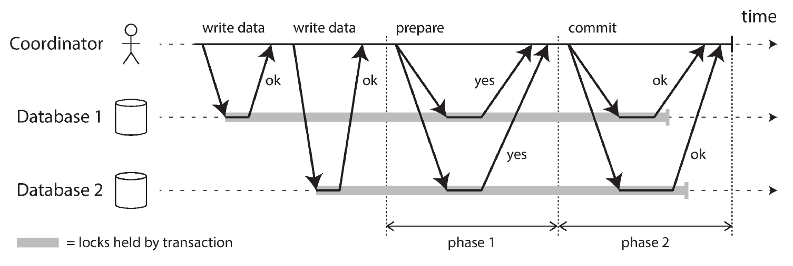

# Chapter 9. Consistency and Consensus

- Distributed systems can fail in many ways (lost, delayed, or duplicated messages; clock issues; node pauses or crashes).
- Instead of letting services fail, fault tolerance aims to keep them functioning despite such problems.
- The best approach is to build **general-purpose abstractions** — like **transactions** or **consensus** — that hide failures from applications.
- Consensus, in particular, ensures **all nodes agree on decisions** (e.g., leader election), preventing issues like **split brain**.
- This chapter explores the guarantees and abstractions distributed systems can provide, along with their fundamental limits, offering an informal overview while pointing to deeper research in the literature.

## Consistency Guarantees

- Replication in databases leads to temporary inconsistencies between nodes, regardless of replication method. Most systems offer **eventual consistency** (better termed **convergence**), meaning replicas will agree eventually, but without guarantees on when.
- This weak model complicates application development, since it differs from the predictable behavior of variables in single-threaded programs. Subtle bugs often appear only under faults or high concurrency.
- The chapter explores **stronger consistency models**, which trade performance and fault tolerance for easier correctness. It introduces:
  - **Linearizability** (a strong model) and its pros/cons.
  - **Ordering guarantees** (causality, total order).
  - **Distributed transactions** and **consensus**, focusing on atomic commits.
- Consistency models, while related to transaction isolation levels, address different challenges: replica coordination vs. concurrency control.

## Linearizability

- Linearizability (also called **strong** or **atomic consistency**) is the guarantee that a distributed system behaves as if there were only **one copy of the data**. Every operation appears instantaneous and immediately visible to all clients.
- In a linearizable system, once a **write completes**, all subsequent reads return the **updated value** (no stale data).
- It provides a **recency guarantee**: reads always reflect the most recent completed write.
- Without linearizability (e.g., in **eventually consistent** systems), different replicas may return different answers, leading to anomalies.
- 👉 After Alice sees the final score of a match, Bob refreshes later but still sees an outdated result — a clear violation of linearizability.

### What Makes a System Linearizable?

- **Reads and Writes**:
  - Reads that happen strictly before a write must return the old value.
  - Reads that happen strictly after a write must return the new value.
  - Reads concurrent with a write may return either, but once one client sees the new value, all later reads must also return it (no “flip-flopping”).
- **Atomicity model**:
  - Each operation is pictured as a bar (request to response) with a point inside representing the moment it logically takes effect.
  - The sequence of these points must form a valid forward-moving history: once a value is written or read, all subsequent reads reflect it until overwritten again.
- **Concurrency quirks**:
  - Operations may complete in an **order different** from request arrival, and that’s okay as long as the resulting sequence is valid.
  - Responses can be **delayed**, so a read might return a new value before the writer has even received its own success acknowledgment.
  - CAS helps ensure updates aren’t lost to concurrent modifications.
- **Violations**:
  - If a client reads an older value after another client has already read a newer one, linearizability is broken (similar to the Alice & Bob example).
- **Testing linearizability**:
  - You can verify it (at high cost) by recording request/response timings and checking if operations can be ordered into a valid sequential history.
- 👉 Linearizability = the illusion of a single, atomic timeline of operations, preserving recency guarantees across concurrent clients.

#### Linearizability Versus Serializability

- The key difference between **linearizability** and **serializability** is often confused because both involve the idea of a **sequential order**. However, they are distinct guarantees:
  - **Serializability** is an **isolation property** for **transactions** (groups of operations). It guarantees that the result of multiple concurrent transactions is equivalent to if they had executed one after another (in some serial order). It is about the correctness of a group of operations.
  - **Linearizability** is a **recency guarantee** for a single object. It ensures that once a write completes, all subsequent reads will see that value until it is overwritten. It is about the freshness of a single operation.
- A system can be:
  - **Both**: This combination is called **strict serializability**.
  - **Serializable but not linearizable**: For example, databases using SSI use consistent snapshots, so reads may not see the very latest write.
  - **Linearizable but not serializable**: A system can guarantee fresh reads on individual objects but not protect against multi-object transaction anomalies like **write skew**.
- 👉 Serializability is about transactions appearing atomic; linearizability is about reads and writes appearing instantaneous.

### Relying on Linearizability

- Linearizability is essential in distributed systems for three main use cases where strict agreement on the most recent state of a single object is necessary:
  - **Locking and Leader Election**: Systems that use a distributed lock or single-leader replication must have a linearizable lock to prevent **split-brain** scenarios. All nodes must agree on which node currently holds the lock. Coordination services like `ZooKeeper` and `etcd` provide this linearizable foundation.
  - **Enforcing Uniqueness Constraints**: Hard constraints, such as ensuring a username or email address is unique, require linearizability. This is effectively like acquiring a lock on a value. If two users try to create the same username concurrently, a linearizable system guarantees that only one will succeed. This also applies to constraints like preventing a bank account from going negative.
  - **Cross-Channel Timing Dependencies**: Linearizability prevents race conditions when two different communication channels depend on the same data. For example, if a web server writes a photo to storage (channel 1) and then sends a message via a queue (channel 2) for another service to process it, a non-linearizable storage service might cause the processor to read a stale or missing file, leading to inconsistencies.

### Implementing Linearizable Systems

- The naive way is a single copy of data, but that isn’t fault-tolerant 🤷.
- So, replication methods are used — but not all support linearizability:
- **Single-leader replication**:
  - Can be linearizable if **reads** go to the **leader** or **synchronously** updated followers.
  - Risks: leader uncertainty (split brain), async replication causing lost writes, or databases intentionally using weaker models.
- **Consensus algorithms** (e.g., `Raft`, `Paxos`, `ZooKeeper`, `etcd`)
  - Provide linearizability by preventing split brain, ensuring durability, and keeping replicas consistent.
  - Safest way to implement linearizable storage 👍.
- **Multi-leader replication**:
  - Not linearizable: multiple leaders accept concurrent writes → conflicts, async replication → no single-copy illusion.
- **Leaderless replication** (`Dynamo`-style):
  - Often claimed to be “strong” with quorum reads/writes (`w + r > n`), but still not strictly linearizable.
  - LWW with clocks → broken by **clock skew**.
  - **Sloppy quorums/hinted handoff** break linearizability further.
  - Even strict quorums can allow anomalies.

#### Linearizability and quorums

- Quorums (`r + w > n`) in `Dynamo`-style systems may seem to guarantee linearizability, but network delays can cause race conditions.
- Example:
  - Writer updates `x = 1` across 3 replicas (w = 3).
  - Reader A (r = 2) sees `1`.
  - Later, Reader B (r = 2) still sees 0.
  - Even though quorum conditions are satisfied, this violates linearizability.
- To achieve linearizability:
  - Readers must perform **synchronous read repair**.
  - Writers must read the latest quorum state before writing.
- ⚖️:
  - Riak skips synchronous read repair → better performance, but no linearizability.
  - `Cassandra` does synchronous repair for quorum reads, but still breaks linearizability under concurrent writes (LWW).
- Limitation: Only reads and writes can be made linearizable this way — CAS requires full consensus.
- Conclusion: Dynamo-style leaderless replication should be assumed not linearizable.

### The Cost of Linearizability

- Multi-leader replication:
  - Each datacenter can keep accepting writes independently.
  - Writes are queued and later exchanged once connectivity is restored.
  - System stays available, but may have conflicts to resolve later.
- Single-leader replication:
  - All writes and linearizable reads must go through the leader.
  - If the leader’s DC is unreachable, follower DC clients cannot perform writes or linearizable reads (only stale reads).
  - This means **outages** for clients that can’t reach the leader until the network recovers.
- ⚖️ Multi-leader offers higher availability under network partitions, while single-leader ensures strict consistency but risks unavailability.

#### The CAP theorem

- Linearizable systems: If replicas are disconnected, they cannot safely process requests → they must block or return errors → unavailability.
- Non-linearizable systems (e.g., multi-leader): Replicas can keep working independently during disconnections → higher availability, but weaker consistency.
- This trade-off is the essence of the CAP theorem: during a **network partition**, you must choose between **Consistency** (linearizability) and **Availability**.
- CAP is often misrepresented as “*pick 2 of 3,*” but the real meaning is:
  - In normal conditions: you can have both consistency + availability.
  - Under partition: you must sacrifice one.
- CAP was influential (helped inspire `NoSQL` systems), but:
  - It only covers linearizability + partitions, not **other faults** (delays, crashes, etc.).
  - Its definitions of availability are confusing 🤷‍♀️.
- It has limited practical value today, mostly of historical interest, as more precise results now exist.

#### Linearizability and network delays

- Few systems are truly linearizable — even RAM on modern **multi-core CPUs** isn’t.
  - Each CPU core has caches and store buffers. Writes are propagated asynchronously to main memory.
  - This boosts performance but breaks linearizability unless memory **fences** are used.
- Reason for dropping linearizability:
  - Not CAP or fault tolerance.
  - Purely performance — linearizability is always slower, not just during faults.
- Distributed databases often avoid linearizability for the same reason: to improve speed and latency.
- Theory (*Attiya & Welch*):
  - Linearizable storage is fundamentally slow.
  - Response times are at least proportional to network delay uncertainty.
  - No faster algorithm exists for linearizability.
- ⚖️:
  - Linearizability = correctness but high latency.
  - Weaker consistency = much faster, better for latency-sensitive systems.

## Ordering Guarantees

- Linearizability ensures operations appear to occur atomically in a **single global order**.
- Ordering recurs in many contexts:
  - **Leaders** in **replication logs** impose order on writes to avoid conflicts.
  - **Serializability** ensures transactions act as if executed in sequential order.
  - **Timestamps/clocks** help determine event order in distributed settings.
- The link between **ordering** and **causality** is 🔑:
  - **Causality** means causes must precede effects (question before answer, create before update, message sent before received).
  - Violations of causality cause anomalies like:
    - Reading answers before questions (prefix inconsistency).
    - Updates to nonexistent rows due to overtaking writes.
    - Non-repeatable reads that show effects without their causes.
    - Write skew where decisions depend on outdated assumptions.
    - Observing stale data even after effects are already visible elsewhere.
- **Causal consistency** requires that if you see some data, you must also see all data that causally precedes it. For example, snapshot isolation guarantees causal consistency by ensuring snapshots reflect all causally prior operations.
- 👉 Overall: Ordering is fundamental in distributed systems because it preserves causality, which underpins intuitive correctness (cause-before-effect).

### The causal order is not a total order

- **Total order**: Any two elements can always be compared (e.g., numbers).
- **Partial order**: Some elements can be compared, others are incomparable (e.g., sets where neither is a subset of the other).
- Applied to databases and consistency models:
  - **Linearizability** = total order of operations.
    - Every operation appears atomic.
    - All operations fall on a single global timeline.
    - No concurrency in the logical model: one operation always comes before the other.
  - **Causality** = partial order of operations.
    - Operations are ordered only if causally related (one depends on the other).
    - Concurrent operations are incomparable (neither before the other).
    - This results in branching timelines that later may merge, as seen in distributed systems.
- Analogy: Distributed version control (e.g., `Git`).
  - Linear history = total order.
  - Branches and merges = partial order (causal graph of commits).
- 👉 Key point: Linearizability enforces a single, strict timeline (total order), while causality reflects the reality of concurrency (partial order with branching and merging).

### Linearizability is stronger than causal consistency

- Linearizability ▶️ causality.
- A linearizable system automatically preserves causal relationships, even across multiple communication channels.
- 👍 of linearizability:
  - Simple to reason about.
  - Intuitive model (operations appear atomic in one timeline).
- 👎 of linearizability:
  - Hurts performance and availability, especially with high network latency or geo-distribution.
- Middle ground:
  - Causal consistency also preserves causality, but without the performance/availability penalties of linearizability.
  - Strongest consistency model that is still tolerant of network delays/failures (not limited by CAP theorem).
- Practical insight:
  - Many systems don’t really need **full** linearizability— **causal** consistency is often enough.
  - Research is exploring efficient databases that offer causal consistency with performance close to eventual consistency.
- Current state:
  - Still experimental and not widely in production.
  - Promising direction, but with open challenges.
- 👉 Key idea: Linearizability is sufficient but costly; causal consistency is often sufficient and much cheaper.

### Capturing causal dependencies

- To maintain causal consistency, a system must ensure that if one operation happened before another, replicas process them in that order. Concurrent operations can be applied in any order.
- 🔑 ideas:
  - A replica can only process an operation once all its causally preceding operations are applied; otherwise, it must wait.
  - Determining causality requires tracking what a node “knew” when it issued an operation (similar to tracing dependencies).
  - Techniques resemble detecting concurrent writes in leaderless datastores but extend across the entire database, not just one key.
  - **Version vectors** (generalized) help track causal dependencies.
  - Databases often need to know what version of data was read before a write—passing version info back ensures causal order is respected.
  - Similar to SSI, the system checks if data read during a transaction is still current at commit time.
- 👉 Essentially: causal consistency relies on tracking and enforcing the “happens-before” relationships across all data, often using version vectors and read-dependency tracking.

### Sequence Number Ordering

Tracking all causal dependencies directly is impractical because clients often read lots of data before writing. Instead, sequence numbers or logical timestamps can efficiently order operations. These are compact, provide a total order of events, and can be made consistent with causality: if A happened before `B`, `A`’s number is lower. Concurrent operations can be ordered arbitrarily.

In databases with single-leader replication, the leader’s log naturally provides this total order — each write gets a monotonically increasing sequence number. Followers that apply operations in log order remain causally consistent, even if they lag behind.

#### Noncausal sequence number generators

- In **multi-leader** or **leaderless** databases, generating sequence numbers is harder. Common approaches include:
  - Per-node counters (e.g., odd/even, or embedding node IDs in the number).
  - Physical clock timestamps (time-of-day).
  - Preallocated blocks of sequence numbers per node.
- These methods scale better than using a single leader, ensuring unique and roughly increasing numbers. However, none preserve **causal consistency**, since:
  - Nodes may progress at different speeds (odd/even scheme).
  - Physical clocks suffer from skew, misordering events.
  - Block allocation may assign lower numbers to later operations.
- 👉 In short: they provide uniqueness and scalability, but not causal ordering.

#### Lamport timestamps

- Lamport timestamps (1978) provide a **causality-consistent** way of generating sequence numbers.
- Each node maintains a counter and pairs it with its node `ID → (counter, nodeID)`. Ordering works by comparing counters first, then node IDs if counters are equal.
- The key idea: every node/client tracks the **maximum** counter value seen and includes it in requests. If a node sees a higher counter than its own, it **jumps forward**. This guarantees that causal dependencies always result in higher timestamps.
- Unlike **version vectors**, Lamport timestamps cannot distinguish between **concurrency** and **dependency**, since they enforce a total order of all operations. Their advantage is **compactness**.

#### Timestamp ordering is not sufficient

- Lamport timestamps provide a **causality-consistent** total order, but they are not enough for problems like enforcing **uniqueness** constraints (e.g., usernames).
- While you can resolve conflicts after the fact by comparing timestamps, you can’t decide safely in real time—because **other nodes** may **concurrently** create operations with earlier timestamps that you don’t yet know about 🤷.
- Thus, Lamport timestamps only define order after **all operations are known**, but not when that order is finalized.
- To guarantee correctness (e.g., safely declaring a username creation successful), you need not just ordering but also agreement on when the order is final — this is the role of **total order broadcast**.

### Total Order Broadcast

- On a **single CPU core**, operations have a clear total order, but in distributed systems achieving this is challenging.
- Timestamp or sequence number ordering is **weaker** than single-leader replication, since it cannot enforce **uniqueness** under faults.
- Single-leader replication enforces order by funneling all operations through one leader’s CPU, but this creates scalability and failover issues.
- The distributed systems solution is **total order broadcast** (**atomic broadcast**), which ensures two guarantees:
  - **Reliable delivery** – if one node delivers a message, all nodes do.
  - **Totally ordered delivery** – all nodes see messages in the same order.
- A correct algorithm must uphold these guarantees despite node or network faults, retrying until messages are successfully and consistently delivered.

#### Using total order broadcast

- Consensus systems like *ZooKeeper* and *etcd* implement total order broadcast, highlighting its close link to consensus.
- It underpins several key use cases:
  - **Database replication** (state machine replication): replicas stay consistent if they process the same writes in the same order.
  - **Serializable transactions**: if each message is a deterministic stored procedure executed in the same order, partitions and replicas remain consistent.
  - **Logs**: total order broadcast effectively creates a replication/transaction log, with all nodes appending and reading the same ordered messages.
  - **Lock services** with **fencing** tokens: each lock request is appended to the log and assigned a monotonically increasing sequence number (e.g., ZooKeeper’s *zxid*), ensuring correct fencing.
- A critical property is that once messages are delivered, their order is fixed — **no retroactive reordering** is allowed—making this approach stronger than timestamp ordering.

#### Implementing linearizable storage using total order broadcast

- Linearizability and total order broadcast (TOB) are closely related but distinct concepts.
  - TOB guarantees that all messages are delivered reliably and in the **same order** to **all nodes**, but delivery timing is **not guaranteed** (it’s asynchronous).
  - Linearizability guarantees that each read sees the most recent write — a stronger recency property.
- You can build linearizable storage (e.g., enforcing unique usernames) on top of TOB by using it as an **append-only log**:
  - Append a tentative claim.
  - Wait until your message is delivered back.
  - If your message is the first for that key, succeed; otherwise, abort.
- Because all nodes receive messages in the same order, they agree on which operation “won.” This also enables serializable transactions.
- However, this setup only guarantees **sequential consistency** (operations appear in the same order everywhere) — not **full linearizability for reads**.
- To make reads linearizable, systems can:
  - Route reads through the log (like `etcd` quorum reads),
  - Use a sync mechanism to catch up to the latest log position (like *ZooKeeper’s* `sync()`), or
  - Read from a synchronously updated replica (like chain replication).

#### Implementing total order broadcast using linearizable storage

- If you have a linearizable register supporting an atomic **increment-and-get** (or compare-and-set), you can assign each broadcast message a unique, consecutive sequence number. Nodes then deliver messages in order of these sequence numbers, ensuring total ordering.
- Unlike **Lamport timestamps**, these sequence numbers have **no gaps**, so nodes can detect missing messages (e.g., if message 5 is missing between 4 and 6).
- However, maintaining such a linearizable counter in a distributed system is hard — **failures** and **network partitions** make it complex to ensure correctness.
- 👉 Linearizable registers, total order broadcast, and consensus are **equivalent problems** — solving one allows you to implement the others. This equivalence leads into the study of **consensus algorithms** in the next section.

## Distributed Transactions and Consensus

- Consensus - getting multiple nodes in a distributed system to agree on a single decision - is one of the most fundamental yet difficult problems in distributed computing.
- Although it sounds simple, many systems have failed because the problem was **underestimated** 🤷‍♀️. Understanding consensus requires knowledge of topics like replication, transactions, system models, and linearizability.
- Consensus is crucial in scenarios such as:
  - **Leader election**: ensuring all nodes agree on one leader to prevent split-brain situations.
  - **Atomic commit**: ensuring all nodes in a distributed transaction either commit or abort together to preserve atomicity.

### Atomic Commit and Two-Phase Commit (2PC)

- Transaction atomicity ensures that when a transaction involves multiple writes, the system produces a clear, **all-or-nothing** outcome:
  - **Commit**: all writes are successfully applied and made **durable**.
  - **Abort**: all writes are rolled back, leaving **no partial changes**.
- This guarantees that failed transactions don’t leave the database in an **inconsistent** or **half-updated** state. Atomicity is particularly crucial for multi-object transactions and systems with secondary indexes, ensuring those **indexes** remain **consistent** with the **primary data**.

#### From single-node to distributed atomic commit

- For **single-node** transactions, atomicity is handled by the storage engine using a WAL:
  - The node writes all transaction data to disk, then appends a commit record.
  - If a crash occurs before the commit record is written, the transaction aborts; if after, it’s committed.
  - Thus, the moment the commit record is safely written defines the **commit point** — the decision is made by one disk controller on one node.
- For **multi-node** transactions, things are more complex:
  - Simply sending commit requests to all nodes can lead to inconsistency — some nodes might commit while others abort due to failures, network loss, or conflicts.
  - Once a node commits, it cannot later abort, since other transactions may already depend on that data.
  - ▶️ Therefore, a node must only commit when it’s certain **all participants will commit**, ensuring atomicity across the system.
- Undoing a committed transaction can only be done via a separate compensating transaction, not by retroactive rollback.

#### Introduction to two-phase commit

- Two-Phase Commit (2PC) is a distributed algorithm that ensures **atomic commits** across **multiple nodes** — meaning either all nodes commit or all abort.
- It introduces a **coordinator** (transaction manager) that orchestrates the process among participants (the database nodes). The protocol has two phases.
- Phase 1️⃣ — Prepare:
  - The coordinator asks each participant if it can commit.
  - Each node responds “yes” (ready) or “no” (cannot commit).
- Phase 2️⃣ — Commit or Abort:
  - If all reply “yes,” the coordinator sends a commit command.
  - If any reply “no,” it sends an abort command to all.
- The process ensures consistency but introduces dependency on the coordinator.

#### A system of promises

- 2PC guarantees atomicity across multiple nodes by introducing **two irreversible commitment points** — one for **participants** and one for the **coordinator**.
- Here’s how it ensures atomicity:
  - The coordinator assigns a **global transaction ID** and manages the process.
  - Each participant runs a local transaction tagged with that ID.
  - When ready to commit, the coordinator sends a prepare request to all participants.
  - Each participant ensures it can commit under all circumstances (**writing all data to disk**, **verifying constraints**) before replying “yes.” Saying “yes” means it cannot abort later, even after crashes ❗
  - Once all votes are in, the coordinator makes a final decision (commit or abort), writes it to disk — the commit point — and then sends the final command to all participants.
  - The coordinator **must retry commit/abort** messages **indefinitely** until all nodes acknowledge.
- Atomicity is preserved because:
  - Participants promise to commit once they vote “yes.”
  - The coordinator’s decision is final once recorded.
- In short:
  - Saying “yes” (prepare phase) = can no longer abort.
  - Coordinator deciding “commit” = can no longer change its mind.

#### Coordinator failure

- In 2PC, if a participant or the network fails, recovery is straightforward through retries or aborts.
- However, if the **coordinator crashes**, the system can enter an uncertain state:
  - Once a participant votes “yes” (in the prepare phase), it cannot unilaterally abort — it **must wait** for the coordinator’s final decision.
  - If the coordinator crashes before sending the final commit/abort message, participants that already voted “yes” become **in doubt** (uncertain whether to commit or abort).
  - **Acting independently** (e.g., aborting after a timeout) r**isks data inconsistency**, since some participants may have already committed.
- To recover safely, the coordinator must log its decision (commit or abort) to durable storage before notifying participants.
- When it restarts, it reads this log to resolve all in-doubt transactions:
  - Transactions with a commit record → commit.
  - Transactions without one → abort.
- ▶️ The commit point of 2PC effectively depends on a **single-node** atomic commit at the coordinator 🫤.

#### Three-phase commit

- 2PC is known as a **blocking** atomic commit protocol because it can get stuck waiting for the coordinator to recover after a failure.
- While **nonblocking alternatives** exist — such as **three-phase commit** (3PC) — they rely on unrealistic assumptions like **bounded network delay** and **guaranteed response times**.
- In real-world distributed systems, where delays and pauses are unbounded, these assumptions don’t hold, and 3PC cannot ensure atomicity.
- In theory, nonblocking commit requires a **perfect failure detector** (a mechanism that can always tell whether a node has truly failed), but such a detector is impossible to build in unreliable networks 🤷‍♂️.
- Therefore, despite its blocking limitation, 2PC remains the **standard** in practice because it’s the most reliable option under realistic network conditions.

### Distributed Transactions in Practice

- There is a mixed reputation of distributed transactions, particularly those using 2PC:
  - 👍 They offer **strong safety** guarantees that are otherwise difficult to achieve.
  - 👎 They often cause **operational complexity**, **poor performance**, and **overpromised reliability**. Many cloud systems avoid them due to these issues 🤷.
- For example, *MySQL*’s distributed transactions can be `10×` slower than single-node ones, mainly because of extra disk syncs (`fsync`) for crash recovery and network round-trips.
- We can distinguish two types of distributed transactions:
  - **Database-internal** transactions:
    - Occur between nodes of the **same distributed database** (e.g., VoltDB, MySQL Cluster NDB).
    - Use a common protocol and can be optimized for that system — often **work reasonably well**.
  - **Heterogeneous** distributed transactions:
    - Span across different systems or technologies (e.g., different databases, message brokers).
    - Must ensure atomic commit across incompatible systems — much harder to implement reliably.
- 👉 Don’t dismiss distributed transactions entirely — study them carefully to understand their trade-offs and lessons.

#### Exactly-once message processing

- Heterogeneous distributed transactions enable atomic coordination across **different systems** — for example, ensuring that a **message acknowledgment** and a **database update** either both succeed or both fail.
- This allows powerful guarantees such as **exactly-once** message processing:
  - If the database write or message acknowledgment fails, the whole transaction aborts, and the message can be safely retried.
  - All side effects of a failed transaction are rolled back, ensuring consistency.
- However, this only works if all participating systems support the **same atomic commit protocol** (e.g., two-phase commit).
- If one system (like an email server) doesn’t, it can cause inconsistencies such as duplicate emails on retries.
- 👉 Heterogeneous distributed transactions make strong atomic guarantees across systems — but only when every participant supports coordinated commit semantics.

#### XA transactions

- X/Open XA (eXtended Architecture) is a 1991 **standard** defining how to implement 2PC across heterogeneous systems like databases and message brokers. It’s not a network protocol, but a `C` API that allows a transaction coordinator to manage distributed transactions through **drivers** or **client libraries**.
- Many systems support XA (e.g., PostgreSQL, MySQL, Oracle, ActiveMQ, IBM MQ). In Java EE, it’s used via JTA with JDBC and JMS drivers.
- When a driver supports XA, it coordinates with the transaction manager to include operations in distributed transactions and exposes **callbacks** for prepare, commit, and abort.
- The coordinator itself is usually a **library** inside the **app process**, maintaining a **local log** of transaction states. If the application or machine crashes, participants in the transaction may be left in doubt until the coordinator recovers its state from the log upon restart. Communication with participants always goes through their client libraries, not directly to the coordinator.

#### Holding locks while in doubt

- An **in-doubt** transaction is a serious problem because of locking.
- Databases hold **exclusive locks** on **modified rows** (and sometimes shared locks on read rows for serializable isolation) until the transaction’s outcome is known. If the coordinator crashes, those locks remain held — potentially for minutes or indefinitely if the coordinator’s log is lost 🤷.
- While locks are held, other transactions cannot modify (and sometimes even read) the affected rows, causing blocking and possibly making large parts of the application unavailable until the issue is manually resolved.

#### Recovering from coordinator failure

- Although a restarted transaction coordinator should recover in-doubt transactions from its log, in practice orphaned in-doubt transactions often occur due to issues like **lost or corrupted logs**. These transactions remain unresolved indefinitely, holding locks and blocking others, even after database restarts — since releasing them prematurely would break atomicity.
- The only remedy is **manual intervention**, where an administrator inspects each participant’s state and decides whether to commit or roll back, often under high stress during outages.
- Some XA implementations offer **heuristic decisions**, allowing a participant to unilaterally commit or abort to unblock the system - but this breaks atomicity guarantees and is meant only as a last-resort recovery option, not normal operation.

#### Limitations of distributed transactions

- XA transactions ensure consistency across multiple systems but introduce serious **operational** and **reliability issues**. 
- The transaction coordinator functions like a database, storing transaction outcomes, and thus becomes a critical component requiring **durability** and **availability**.
- 🔑 problems include:
  - **SPOF**: If the coordinator isn’t replicated, its crash can block entire systems due to in-doubt transactions.
  - **Loss of statelessness**: Applications that embed the coordinator lose their stateless nature since coordinator logs become essential for recovery.
  - **Limited functionality**: XA is a lowest common denominator - it can’t detect cross-system deadlocks or support advanced isolation levels like SSI.
  - **Failure amplification**: Since two-phase commit requires all participants to respond, any system failure can cause the entire transaction to fail.
- Although XA has major drawbacks, there are alternative approaches to maintain cross-system consistency without these complications.

### Fault-Tolerant Consensus

- **Consensus** is the process of getting multiple nodes to **agree on a single value or decision**, even in the presence of **failures** 👌. For example, it can decide which user successfully books the last seat on a flight.
- Formally, a consensus algorithm must satisfy four properties:
  - **Uniform agreement**: All nodes reach the same decision.
  - **Integrity**: No node decides more than once.
  - **Validity**: The decided value must have been proposed by a node.
  - **Termination**: Every non-faulty node eventually reaches a decision.
- The first three ensure **safety** (consistency), while termination ensures **liveness** (progress). Without fault tolerance, consensus is easy—one node can act as a dictator - but if that node fails, decisions halt. This is similar to the 2PC problem, where a failed coordinator blocks progress.
- Termination requires that the system **continue making decisions** even if **some nodes fail**. However, consensus is only possible if a **majority of nodes** remain functioning (forming a **quorum**). If most nodes fail, progress stops — but the system still won’t make incorrect or conflicting decisions ❗.
- Most consensus systems assume **non-Byzantine faults** (nodes crash but don’t act maliciously). Algorithms that tolerate Byzantine faults exist but require that fewer than one-third of nodes behave incorrectly.

#### Consensus algorithms and total order broadcast

- The most widely used fault-tolerant consensus algorithms include *Viewstamped Replication* (VSR), *Paxos*, *Raft*, and *Zab*.
- While they share many core ideas, they differ in details and complexity - implementing them correctly is notoriously difficult.
- Rather than deciding on a single value, these algorithms decide on a **sequence of values**, effectively implementing **total order broadcast**, where all nodes deliver the same messages **exactly once** and in the **same order**.
- Total order broadcast can be seen as performing **multiple rounds of consensus**, one per message.
  - Agreement ensures all nodes deliver the same messages in the same order.
  - Integrity prevents duplicates.
  - Validity ensures only real, proposed messages are delivered.
  - Termination guarantees messages are eventually delivered.
- Algorithms like **Raft**, **Zab**, and **VSR** directly implement total order broadcast for **efficiency**, while **Paxos** achieves the same through an optimized form called **Multi-Paxos**.

#### Single-leader replication and consensus

- Single-leader replication resembles total order broadcast, but it avoids consensus only because the leader is chosen **manually** - essentially a “dictator” model. This approach works but lacks the **termination** property of consensus, since it needs human intervention after failures.
- When systems add automatic leader election for failover, they approach fault-tolerant total order broadcast — but this introduces the **split-brain** problem, where multiple nodes might think they are leader. To avoid inconsistency, all nodes must agree on who the leader is, which requires consensus.
- This creates a **paradox**: to elect a leader, we need consensus — but to run consensus (or total order broadcast), we already need a leader. The question is how to bootstrap consensus without having one in the first place 🤷‍♀️.

#### Epoch numbering and quorums

- Consensus algorithms like Paxos, Raft, and Viewstamped Replication all use a **leader-based approach**, but they guarantee a unique leader only within an **epoch** (also called a *ballot*, *term*, or *view*). Each time a leader is suspected dead, nodes hold an election with a higher epoch number. Epochs are totally ordered, and if **conflicting leaders exist**, the one with the **higher epoch number prevails**.
- Before making decisions, a leader must ensure it hasn’t been replaced by collecting votes from a quorum (typically a majority). A node votes for a **proposal only** if it hasn’t seen a higher epoch.
- Consensus thus involves 2️⃣ voting rounds:
  - **Leader election** (to choose a leader for a new epoch).
  - **Proposal agreement** (leader proposes a value and gets quorum approval).
- The overlap between these quorums ensures **continuity** - if a proposal passes, at least one node that voted also participated in the latest leader election, preventing conflicts between epochs.
- Although this resembles 2PC, key differences are that:
  - The coordinator (leader) in consensus is elected **dynamically**,
  - Consensus requires only a **majority quorum**, not unanimous agreement, and
  - Consensus includes **recovery mechanisms** to maintain safety after failures - making it **fault-tolerant**, unlike 2PC.

#### Limitations of consensus

- Consensus algorithms are a major advance in distributed systems, ensuring strong safety properties — agreement, integrity, and validity —while remaining fault-tolerant as long as a majority of nodes are reachable. They enable total order broadcast and thus can provide linearizable, atomic operations across nodes.
- However, these guarantees come with significant ⚖️":
  - Consensus involves **synchronous replication**, reducing **performance** compared to asynchronous replication (which risks data loss on failover).
  - A **strict majority** is required to operate (e.g., 3 nodes to tolerate 1 failure, 5 to tolerate 2), meaning any network partition that breaks majority halts progress.
  - Most algorithms assume a **fixed cluster membership**, making node additions/removals complex and less understood.
  - **Timeout-based failure detection** can cause **false leader elections** under variable network latency, hurting **performance**.
- In **unreliable networks**, algorithms like *Raft* can enter **unstable states** - leadership constantly flipping - causing the system to stall indefinitely.
- 👉 Overall, while consensus brings reliability and correctness, it is complex, slower, and fragile under network instability, and improving its robustness remains an active research challenge.

### Membership and Coordination Services

- **ZooKeeper** and **etcd** are not general-purpose databases, but **coordination services** built **on top of consensus algorithms** to provide strong consistency guarantees for small, critical data.
- They store only small, in-memory datasets replicated across nodes via **fault-tolerant total order broadcast**, ensuring all replicas apply **updates** in the **same order**. This consistency is essential for coordination tasks rather than data storage.
- Their main features include:
  - **Linearizable atomic operations** (e.g., CAS) — used to build distributed locks and leader elections safely.
  - **Total ordering of operations** — ensures unique, monotonically increasing IDs (*zxid*, *cversion*) for fencing tokens to avoid conflicts.
  - **Failure detection** — via session heartbeats and automatic cleanup of ephemeral nodes when clients die.
  - **Change notifications** — clients can watch keys and react to cluster changes without polling.
- Only the atomic operations strictly require consensus, but together these features make ZooKeeper and etcd indispensable tools for distributed coordination and cluster management, not for storing large-scale application data.

#### Allocating work to nodes

- ZooKeeper/Chubby is effective for coordination tasks in distributed systems:
  - **Leader election**: Choosing a primary node among several instances, useful for single-leader databases or job schedulers.
  - **Partition assignment and rebalancing**: Deciding which node handles which partition of a resource, and redistributing partitions as nodes join or fail.
- These tasks leverage **atomic** operations, **ephemeral** nodes, and **notifications** to enable **automatic fault recovery** without human intervention. Libraries like Apache Curator simplify using ZooKeeper, but implementing consensus from scratch is much harder.
- ZooKeeper runs on a **small, fixed cluster** (usually 3–5 nodes) to perform majority votes efficiently, while supporting a large number of clients, effectively outsourcing consensus, operation ordering, and failure detection.
- It manages **slow-changing metadata**, such as leadership and partition assignments, rather than fast-changing application state, which requires other tools like Apache BookKeeper for replication.

#### Service discovery

- **ZooKeeper**, **etcd**, and **Consul** are commonly used for **service discovery**, helping services find the correct IP addresses in **dynamic cloud environments** where VMs frequently change. Services register their endpoints in a service registry so others can locate them.
- However, service discovery itself **does not require consensus** — traditional DNS, which is eventually consistent and allows stale reads, is often sufficient. Consensus is **only needed for leader election**, ensuring a single authoritative leader.
- To improve efficiency, some consensus systems offer **read-only caching replicas** that asynchronously replicate the decision log. These replicas can serve **non-linearizable read requests** (like service discovery) without participating in **votes**, reducing load on the consensus cluster.

#### Membership services

- ZooKeeper and similar systems are part of a long tradition of membership services, which track which nodes are active in a cluster — critical for building reliable distributed systems.
- Because network delays are unbounded, nodes cannot reliably detect failures on their own. By combining failure detection with consensus, nodes can agree on the **current membership**, even if some nodes are mistakenly declared dead 🫤.
- Having a **consistent view of membership** is essential for operations like leader election, since divergent views across nodes would prevent coordinated decisions.