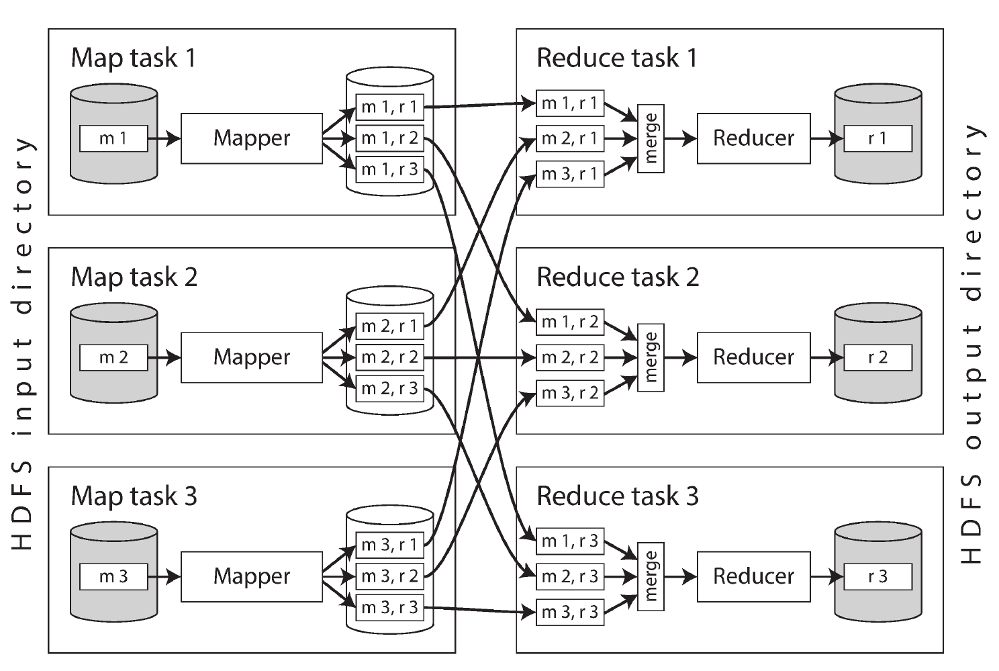

# Chapter 10. Batch Processing

- There are 3️⃣ major styles of data processing — **services**, **batch processing**, and **stream processing**/
- Most modern systems follow a **request/response model**, where a client sends a request and quickly receives a reply. This is typical of online services like web servers, APIs, and databases, where **response time** and **availability** are **critical** because users are actively waiting for results.
- However, not all systems work this way. Two other models are common:
  - **Batch Processing Systems** (Offline Systems):
    - These handle large volumes of data in scheduled jobs that may take **minutes to days**.
    - There’s no immediate user interaction; instead, the focus is on **throughput** — how efficiently data can be processed.
    - Technologies like `MapReduce` (and its open-source implementations such as **Hadoop**) exemplify this model. Though MapReduce is now less dominant, it remains important for understanding scalable data processing.
  - **Stream Processing Systems** (Near-Real-Time Systems):
    - These process continuous streams of data as **events** occur, achieving lower latency than batch jobs.
    - Stream processing blends elements of online and batch systems and is discussed as an evolution of batch processing.

## Batch Processing with Unix Tools

- A sample nginx access log line contains multiple fields, including client IP, user, timestamp, request, status, bytes sent, referrer, and user agent.
- For instance, the line shows that on `Feb 27, 2015, at 17:55:11 UTC`, a client at `216.58.210.78` requested `/css/typography.css`.
- The user wasn’t authenticated, the request succeeded with status `200`, the response size was `3,377 bytes`, the referrer was `http://martin.kleppmann.com/`.

### Simple Log Analysis

- By chaining commands like `cat`, `awk`, `sort`, `uniq`, and `head`, you can quickly find the five most popular pages on a website.
- The pipeline extracts the requested URLs, counts how often each appears, sorts them by frequency, and displays the top results.
  ```sh
  cat /var/log/nginx/access.log |
      awk '{print $7}' |
      sort |
      uniq -c |
      sort -r -n |
      head -n 5
  ```
- Despite looking complex, this method is **fast**, **flexible**, and **powerful**, capable of processing **gigabytes** of logs efficiently. Small tweaks to the `awk` command can easily change what’s analyzed (e.g., ignoring CSS files or counting client IPs).
- 👉 Unix text-processing tools like `awk`, `sed`, `grep`, `sort`, `uniq`, and `xargs` are valuable for quick, effective data analysis.

#### Chain of commands versus custom program

We can replicate the Unix log analysis using a simple Ruby script:
  ```ruby
  counts = Hash.new(0)
  File.open('/var/log/nginx/access.log') do |file|
    file.each do |line|
      url = line.split[6]
      counts[url] += 1
    end
  end

  top5 = counts.map{|url, count| [count, url] }.sort.reverse[0...5]
  top5.each{|count, url| puts "#{count} #{url}" }
  ```
While it’s less concise than the Unix pipeline, the Ruby version is **easier to read**. However, the key point is that — beyond syntax — the **execution flow differs** significantly, especially when processing large files, which impacts **performance** and **efficiency**.

##### Sorting versus in-memory aggregation

- The **Ruby script** uses a **hash table** that keeps a counter for each unique URL. Its **memory** usage depends on the number of **distinct** URLs, not total log lines. This works well when all unique URLs fit comfortably in memory (e.g., within 1 GB).
- The **Unix pipeline** avoids keeping everything in memory by **sorting** the repeated URLs. Sorting can efficiently handle large datasets using **disk-based mergesort**, which relies on sequential I/O — ideal for disks.
- GNU sort automatically handles datasets larger than memory by spilling to disk and **parallelizing** sorting across **CPU cores**, allowing it to scale smoothly.
- 👉 Hash tables are faster for smaller datasets, while sorting pipelines scale better for very large datasets that exceed available memory.

### The Unix Philosophy

- *Doug McIlroy* introduced the concept of **Unix pipes** in `1964`, comparing them to “garden hoses” that can be connected to process data in flexible ways. This idea evolved into the Unix philosophy, summarized as:
  - Make each program do **one thing well**.
  - Ensure each **program’s output** can serve as another **program’s input**.
  - Build **quickly**, **iterate**, and **rebuild** when necessary.
  - Use tools to **automate** and **simplify** tasks.
- This philosophy emphasizes automation, modularity, and experimentation, ideas that strongly resemble today’s **Agile** and **DevOps** principles.
- 👉 The Unix shell enables this **composability**, allowing independently built tools to interoperate seamlessly and form complex, efficient data processing pipelines.

#### A uniform interface

- Unix programs interoperate so well because they all share a simple, uniform interface — the **file descriptor**, which represents an ordered sequence of bytes. This abstraction allows diverse things (**files**, **devices**, **sockets**, **pipes**) to communicate seamlessly.
- Most Unix tools conventionally treat this byte stream as ASCII text, typically organized as lines separated by `\n` and fields split by whitespace. This shared convention enables tools like `awk`, `sort`, `uniq`, and `head` to work together easily, even if the text-based interface **isn’t elegant** or **strongly** structured.
- 👉 While this simplicity sacrifices **readability** and **rich data semantics**, it provides extraordinary **composability**: Unix programs can be chained together flexibly — something rare in modern software ecosystems, where systems are often fragmented and data exchange between them is difficult.

#### Separation of logic and wiring

- Standard input (*stdin*) and standard output (*stdout*) are key to Unix’s flexibility and composability.
- By default, **stdin** comes from the **keyboard** and **stdout** goes to the **screen**, but users can redirect them to or from files — or connect programs together using **pipes**, which stream data directly between **processes** without writing to **disk**.
- Programs that simply read from stdin and write to stdout don’t need to know where their data comes from or goes, enabling **loose coupling** and easy composition in pipelines. Users can integrate their own tools just as easily as system ones, since everything shares the same interface.
- However, this model has limitations: it’s less suited for programs needing **multiple inputs/outputs** or **complex I/O** like network connections or subprocesses, which must be handled within the program itself — reducing the shell’s flexibility 🤷.

#### Transparency and experimentation

- Unix tools are powerful because they make it easy to observe and **experiment** with data processing:
  - Input files are **immutable**, so you can safely rerun commands without altering data.
  - You can inspect **intermediate** output at any stage (e.g., using `less`) for debugging.
  - You can save intermediate results to files, allowing **partial restarts** without reprocessing everything.
- This simplicity and transparency make Unix tools ideal for experimentation, despite lacking the sophistication of database query optimizers.
- Their main limitation, however, is that they operate on a **single machine**, which is where **distributed** systems like `Hadoop` extend the model.

## MapReduce and Distributed Filesystems

- Instead of stdin/stdout, MapReduce reads and writes to a distributed **filesystem**, typically **HDFS** (*Hadoop Distributed File System*) —an open-source version of *Google*’s **GFS**. Other similar systems include **GlusterFS**, **QFS**, and object stores like `Amazon S3` or `Azure Blob Storage`.
- HDFS follows a **shared-nothing** architecture, using **commodity** servers rather than specialized hardware. Each machine runs a **daemon** that manages its local disks, while a central **NameNode** tracks block locations.
- Files are replicated across machines (via multiple copies or erasure coding like **Reed–Solomon**) to tolerate failures — similar in concept to RAID but distributed over a network.
- This design allows HDFS to scale to tens of thousands of machines and hundreds of **petabytes**, offering massive, fault-tolerant storage at a fraction of the cost of traditional centralized storage systems.

### MapReduce Job Execution

- **MapReduce** is a programming **framework** for **processing large datasets** stored in **distributed filesystems** like HDFS, following a pattern similar to Unix-style log analysis pipelines.
0 It works in four main steps:
  - Read and parse input files into records (e.g., each log line).
  - **Map phase**: the mapper function extracts **key-value pairs** from each record (e.g., URL as key).
  - **Sort phase**: all key-value pairs are **automatically sorted** by **key**.
  - **Reduce phase**: the reducer function processes all values for each key (e.g., counting URL occurrences).
- You implement two callbacks:
  - **Mapper**: statelessly converts each input record into zero or more key-value pairs.
  - **Reducer**: receives all values for a key, **aggregates** or **transforms** them, and outputs results.
- If another sorting or aggregation is needed, you simply chain multiple MapReduce jobs, feeding the output of one as the input to the next.
- 👉 In essence, MapReduce **automates** distributed data **shuffling** and **sorting** so developers only need to define how to map and reduce data.

#### Distributed execution of MapReduce

- **MapReduce** differs from **Unix pipelines** in that it **automatically parallelizes** computation across many machines, without requiring the developer to manage data movement or concurrency.
- Each **mapper** and **reducer** processes **one record** at a time, while the framework handles distributing data, transferring intermediate results, and managing failures.
- In `Hadoop`, mappers and reducers are typically **Java classes**, while in systems like `MongoDB` or `CouchDB` they can be **JS** functions. The input dataset (usually in HDFS) is split into large file blocks, and each block is processed by a separate map task.
- The scheduler tries to run each map task on the same machine that stores the data, improving performance through **data locality**.
- Before execution, MapReduce distributes the job code (like JARs) to all relevant machines. Each mapper produces **KV pairs**, which are then partitioned by a **hash** of the **key** to route data to the correct reducer.
- The system performs a **multi-stage sort**: each mapper writes locally sorted files per reducer, and reducers fetch and **merge these sorted partitions** in a process called the *shuffle*.
- Finally, reducers process all values for each key sequentially and write their outputs back to the distributed filesystem, typically stored **locally** and **replicated** across nodes.
<p align="center"></p>

#### MapReduce workflows

- A **single MapReduce job** can only handle **limited** tasks — like counting page views per URL—but not more complex ones, such as finding the most popular URLs, which require multiple processing stages.
- To perform multi-step operations, MapReduce jobs are **chained into workflows**, where the output of one job becomes the input of the next. `Hadoop` doesn’t natively support workflows, so this chaining is done through **HDFS** directories: one job writes to a directory, and the next reads from it.
- Unlike Unix pipelines (which stream data directly), MapReduce workflows materialize intermediate results to **disk**, which has pros and cons. Since a job’s output is only valid after it finishes successfully, dependent jobs must wait for the previous ones to complete.
- To manage these dependencies and complex workflows, workflow schedulers like `Oozie`, `Azkaban`, `Luigi`, `Airflow`, and `Pinball` are used. These tools help coordinate large pipelines—sometimes with 50–100 MapReduce jobs—common in big systems like recommendation engines.
- Additionally, higher-level tools such as `Pig`, `Hive`, `Cascading`, `Crunch`, and `FlumeJava` simplify this process by automatically generating and linking multiple MapReduce stages into complete workflows.

### Reduce-Side Joins and Grouping

- In **databases**, **joins** on small datasets are efficient because they use **indexes** to quickly find matching records. However, **MapReduce** has no indexes — it processes all input files completely, performing a **full scan** instead of selective lookups.
- Though this would be inefficient for small queries, it’s acceptable for **analytic workloads** that aggregate data across many records, especially when the work is parallelized across multiple machines.
- In **batch processing**, a *join* means *resolving all relationships* across an entire dataset (e.g., joining data for all users), not just performing a lookup for a single record.
- Let's look at an example at how joins are performed in batch processing systems like MapReduce: joining user activity logs with user profile data.
  - The activity log (fact table) records user actions on a website, while the user database (dimension table) contains profile details like age or birthdate.
  - To analyze behavior by demographics (e.g., page popularity by age group), the two datasets must be joined on the user ID.
  - A naive approach — querying the remote user database for each event— would be slow and inefficient, due to network latency, caching limits, and potential database overload.
  - Instead, for high throughput, all data should be **local** to the computation. The recommended method is to **extract a static copy** of the user database (via an ETL or backup process), place it in the **same distributed** FS (e.g., HDFS) as the activity logs, and then perform the join within MapReduce.
- 👉 This approach ensures deterministic, parallel, and efficient processing without depending on **live remote queries**.
<p align="center"></p>

##### Sort-merge joins