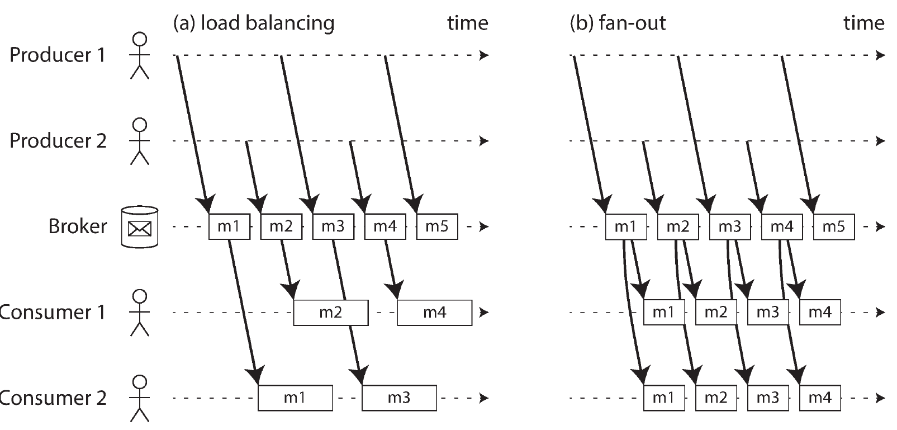
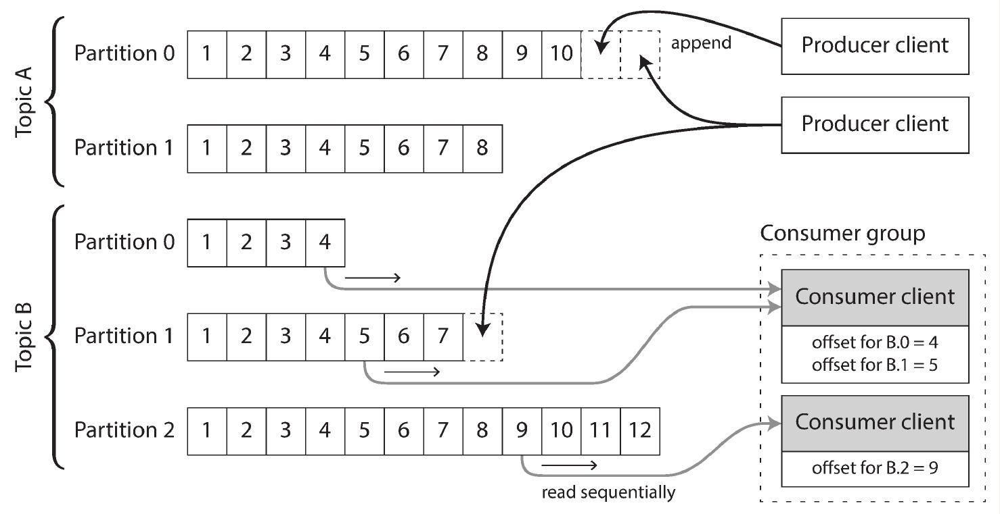

# Chapter 11. Stream Processing

- Chapter 10 introduced **batch processing**, where a **finite** set of input files is processed to produce derived output files. This model is effective for building **search indexes**, **recommendation systems**, and **analytics pipelines**, since the data is **bounded** and processing knows when it’s complete.
- However, **real-world data** is often **unbounded** 🫤, it continuously arrives over time (e.g., user activity, logs, or sensor data). Because the dataset is never “finished,” batch systems must **artificially segment** the input into time-based chunks (e.g., hourly or daily batches).
- This segmentation introduces **latency**: if the batch runs daily, users only see updates once per day. Increasing the frequency (hourly, per-second, or continuously) reduces this delay, leading to the concept of **stream processing**, which processes data **as it arrives** rather than in discrete batches.
- A **stream** represents **incrementally available data** over time, a concept found across systems like Unix I/O streams, lazy lists in programming, file APIs, TCP connections, and multimedia delivery.

## Transmitting Event Streams

- In **batch processing**, jobs read input files and produce output files. In **stream processing**, the equivalent concept is an **event stream** — a continuous sequence of **records** (called **events**) representing things that happened over time.
- An **event** is a small, immutable object describing an occurrence (e.g., a page view, purchase, or sensor reading). It usually includes a **timestamp** indicating when it occurred.
- Like batch files, which can be read by multiple jobs, events in streaming systems can be **consumed** by multiple **subscribers**. The **producers** (*publishers*) send events to **topics** or **streams**, grouping related events together.
- While a file or database could, in theory, connect producers and consumers (with consumers polling for new data), **polling** becomes inefficient as latency requirements drop — frequent polls waste resources when no new data is available 🫤. Thus, **push-based** systems that **notify consumers** of new events are preferred.
- Traditional **databases** offer limited support for notifications (e.g., via **triggers**), which are inflexible and not designed for continuous event delivery. To fill this gap, specialized systems were developed for **event notification and streaming**, forming the backbone of modern stream processing architectures.

### Messaging Systems

- To evaluate messaging systems, two key questions arise:
  1. **Handling Producer-Consumer Speed Mismatch**
     - If producers send messages **faster** than consumers can handle, the system can:
       - **Drop messages**
       - **Buffer messages** in a queue
       - **Apply backpressure** (block the producer until the consumer catches up)
     - For buffered systems, it’s important to know what happens when queues grow too **large**:
       - Do they crash when memory runs out?
       - Do they spill to disk, and how does that affect performance?
  2. **Handling Failures and Message Loss**
     - Durability can be achieved through **disk writes** or **replication**, which add overhead.
     - ⚖️ Allowing message loss yields higher throughput and lower latency.
     - **Acceptability of loss** depends on context:
       - For periodic sensor data, occasional losses may be fine.
       - For event counting or critical data, message loss leads to incorrect results.

#### Direct messaging from producers to consumers

- Some messaging systems bypass intermediaries and use **direct network communication** between producers and consumers. Examples include:
  - **UDP Multicast**
    - Common in finance (e.g., stock market feeds) for **low-latency** message delivery.
    - UDP is unreliable, but higher-level protocols can **recover lost packets** by retransmission.
  - **Brokerless Messaging (ZeroMQ, nanomsg)**
    - Implement **publish/subscribe** models over **TCP or IP multicast**, avoiding centralized brokers.
  - **Metrics Collection (StatsD, Brubeck)**
    - Use **unreliable UDP** to send lightweight metrics across machines.
    - Since UDP can drop packets, results (e.g., counters) are **approximate** at best.
  - **Webhooks (HTTP/RPC Push Model)**
    - A producer pushes messages directly to a consumer’s **callback URL** whenever an event occurs.
- These **direct messaging systems** perform well for **low-latenc**y or lightweight applications but have **limited fault tolerance**:
  - Applications must handle **message loss** explicitly.
  - They assume **constant online availability** of producers and consumers.
  - If a consumer goes offline, it **misses messages** sent during downtime.
  - Some protocols retry failed deliveries, but if a **producer crashes**, any buffered messages waiting for retry are **lost**.

#### Message Brokers

- **Message brokers** (or **message queues**) act as intermediaries between producers and consumers, functioning like a specialized **database for message streams**.
- They run as **servers**, with producers and consumers connecting as **clients**:
  - **Producers** write messages to the broker.
  - **Consumers** read messages from it.
- 🔑 Characteristics:
  - **Centralized durability and reliability:**
    - The broker manages persistence and client disconnections.
    - Some brokers keep messages **in memory** only.
    - Others **persist to disk** to survive crashes.
  - **Handling slow consumers:**
    - Brokers typically use **unbounded queueing** (buffering messages) rather than dropping them or applying backpressure — though this behavior can be **configured**.
  - **Asynchronous delivery model:**
    - Producers only wait for **acknowledgment** that the broker has **buffered the message**, not for consumers to process it.
    - Messages are then delivered **later**, possibly immediately or after delays if **queues backlog**.
- 👉 Message brokers **decouple producers and consumers**, providing **fault tolerance**, **durability**, and **asynchronous communication**—but at the cost of **potential queuing delays**.

#### Message brokers compared to databases

- Some **message brokers** can participate in **two-phase commits** (via **XA** or **JTA**), making them somewhat similar to **databases**, though several key differences remain:
  - **Data Retention:**
    - **Databases** store data until explicitly deleted.
    - **Message brokers** usually **delete messages after delivery**, making them unsuitable for long-term storage.
  - **Working Set Size:**
    - Brokers assume **short queues** and **small working sets**.
    - When consumers are slow and queues grow large, performance and throughput **degrade** - especially if messages spill to disk.
  - **Data Access:**
    - Databases offer **secondary indexes** and **search queries**.
    - Brokers allow clients to **subscribe** to specific **topics or patterns**, providing a more limited filtering mechanism.
  - **Change Awareness:**
    - Database queries give **point-in-time snapshots**; clients must **poll** to detect updates.
    - Brokers **push notifications** when new messages arrive, providing **real-time updates**.
- This traditional model is defined by **JMS** and **AMQP** standards and implemented in systems such as: **RabbitMQ**, **ActiveMQ**, **Google Cloud Pub/Sub**.

#### Multiple consumers

- When multiple consumers read from the same topic, **two primary messaging patterns** are used:
- 1️⃣ **Load Balancing**
  - **Each message is delivered to only one consumer** within the group.
  - Used to **distribute workload** and **parallelize message processing**.
  - Ideal when messages are **expensive to process**.
  - Implemented as:
    - **Multiple clients consuming from the same queue** in **AMQP**.
    - **Shared subscriptions** in **JMS**.
- 2️⃣ **Fan-Out**
  - **Each message is delivered to all consumers**.
  - Enables independent consumers to **receive the same data stream**, similar to multiple batch jobs reading the same file.
  - Implemented via:
    - **Topic subscriptions** in **JMS**.
    - **Exchange bindings** in **AMQP**.
- 3️⃣ **Combined Pattern**
  - Groups of consumers can **each subscribe** to a topic:
    - Each group receives **all messages**.
    - Within each group, **only one node** processes each message.
<p align="center"></p>

#### Acknowledgments and redelivery

- Message brokers use **acknowledgments (acks)** to ensure messages aren’t lost when consumers crash or disconnect:
- **Acknowledgment mechanism**:
  - Consumers must **explicitly** confirm message processing.
  - If the broker doesn’t receive an ack (e.g., due to crash or timeout), it **redelivers the message** to another consumer.
  - This prevents message loss but can lead to **duplicate processing** if the ack was lost after successful processing.
- With **load balancing**, redelivery can cause **message reordering**:
  - Example: Consumer 2 crashes while processing message *m3*.
  - The broker reassigns *m3* to Consumer 1, which is already processing *m4*.
  - Result: Consumer 1 processes messages in order *m4 → m3 → m5*, breaking the original order.
- Message brokers like `JMS` and `AMQP` try to preserve order, but **load balancing + redelivery** can still reorder messages.
- To maintain strict ordering ▶️ Use a **dedicated queue per consumer** (no load balancing).
- Reordering is acceptable if messages are **independent**, but problematic if **causal dependencies** exist between messages.

### Partitioned Logs

#### **From Transient Messaging to Durable Logs**
- Traditional messaging systems (like AMQP/JMS) are **transient**:
  - Messages are deleted after being consumed.
  - Adding a new consumer only gives access to **future messages**.
  - Reprocessing past data is impossible.
- Databases, by contrast, keep data **durably**, enabling reprocessing and experimentation.
**Log-based message brokers** combine both ideas — durable, append-only storage with streaming semantics.

#### **How Log-Based Brokers Work**
- A **log** is an append-only sequence of records on disk.
- **Producers** append messages to the log’s end.
- **Consumers** read sequentially and wait for new messages (like `tail -f`).
- Logs are **partitioned** for scalability, allowing parallelism across machines.
- Each partition has **monotonically increasing offsets** that uniquely identify messages.
- Examples: **Apache Kafka**, **Amazon Kinesis Streams**, **Twitter DistributedLog**, **Google Pub/Sub**.
<p align="center"></p>

👉 These systems achieve **high throughput (millions of msgs/sec)** via partitioning and replication.

#### **Log-Based vs. Traditional Messaging**

| Feature | Traditional Brokers (AMQP/JMS) | Log-Based Brokers (Kafka-style) |
|----------|-------------------------------|--------------------------------|
| **Message retention** | Deleted after consumption | Retained for configured time |
| **Fan-out** | Requires duplication | Natural — multiple consumers can read same log |
| **Ordering** | Can reorder under load balancing | Strict within each partition |
| **Reprocessing** | Not possible (messages deleted) | Possible via offsets |
| **Consumer tracking** | Per-message acks | Simple per-partition offset tracking |
| **Throughput** | Degrades when queues grow | Constant (disk-based append only) |

#### **Consumer Offsets and Recovery**
- Each consumer tracks a **current offset**.
- Broker doesn’t need per-message **acknowledgments** — just records offsets periodically.
- If a consumer crashes:
  - Another node can resume from the last recorded offset.
  - Some messages may reprocess if offsets weren’t committed yet (duplicates).

👉 This mirrors **database replication**: offsets act like **log sequence numbers**.

### **Disk Space and Retention**
- Logs are **divided into segments**; old ones are periodically **deleted or archived**.
- Acts as a **bounded disk buffer** (circular buffer):
  - Example: A 6 TB drive at 150 MB/s can hold ~11 hours of messages.
  - Usually, retention is configured to keep **days or weeks** of data.

👉 Throughput remains **constant** regardless of history size (unlike memory-based brokers).

#### **Handling Slow Consumers**
- The log-based approach uses **disk buffering** instead of backpressure or dropping.
- If a consumer falls too far behind (past retention window), it **misses messages**.
- Other consumers remain unaffected — great for **fault isolation** and **experimentation**.
- Operators can monitor consumer lag and take corrective action before loss.

#### **Replaying Messages**
- Consuming from a log is **non-destructive** — the log remains intact.
- Consumers can **reset offsets** to reprocess historical data (e.g., replay yesterday’s data).
- Enables:
  - Rebuilding derived datasets.
  - Experimentation with new logic.
  - Easy recovery from bugs or data corruption.

#### **Key Advantages**:
- Durable storage + low-latency streaming.
- Simplified bookkeeping via offsets.
- Natural fan-out for multiple consumers.
- Replay and reprocessing support (like batch jobs).
- Operational robustness — consumers can come and go independently.

## Databases and Streams

- **Writes = Events** → Every database write is an event that can be captured and streamed.  
- **Replication Logs = Event Streams** → Leaders produce a stream of writes; followers consume it to stay in sync.  
- **State Machine Replication** → If replicas process the same events in the same order, they reach the same state.  
- **Key Insight** → Databases store **current state**; streams record **state changes** (history).  
- **Unified View** → Databases and event streams are two sides of the same coin — one shows the end result, the other shows how it got there.

### Keeping Systems in Sync

- Modern applications use multiple systems (OLTP databases, caches, search indexes, data warehouses), each with its own optimized copy of the data. These copies must be kept **synchronized** when data changes.
- **Common Synchronization Methods:**
  - **Batch ETL Processes:** Effective for data warehouses, involving periodic full dumps and bulk loading.
  - **Dual Writes:** The application code explicitly writes to all systems (e.g., database, then search index, then cache) when data changes.
- **Problems with Dual Writes:**
  - **Race Conditions:** Concurrent clients can cause systems to see writes in different orders, leading to permanent inconsistency (e.g., the database ends with value B while the search index ends with value A).
  - **Fault Tolerance:** If one write succeeds and another fails, the systems become inconsistent. Solving this requires an expensive atomic commit protocol.
- **The Core Issue:** Dual writes fail because there is no single system determining the order of writes across the different technologies (like having multiple leaders).
- **Proposed Solution:** A better approach is to have a single leader (e.g., the database) and make the other systems (like the search index) followers that consume its stream of changes.

###  Change Data Capture

- Traditional database replication logs were **internal-only** → hard to extract changes to sync with caches, search indexes, or data warehouses.
- **CDC (Change Data Capture)** is the solution ✨.
  - Observes and streams **all data changes** from a database.  
  - Makes one database the **leader** and others (indexes, warehouses) **followers**.  
  - Uses **log-based message brokers** to preserve message order.  
  - Typically **asynchronous** — doesn’t block writes, but introduces **replication lag**.
- **Implementation Approaches:**  
  - **Triggers:** capture changes via DB triggers → simple but slow and fragile.  
  - **Parsing replication logs:** more robust but harder (schema evolution, format).  
  - Used in large-scale systems (`Databus`, `Wormhole`, `Sherpa`, `Bottled` `Water`, `Debezium`, etc.).
- **Initial Snapshot:**  
  - Needed when the full log isn’t retained.  
  - Snapshot must align with a known **log offset** to resume applying changes.
- **Log Compaction:**  
  - Keeps only the **latest value per key** (like LSM trees).  
  - Allows reconstructing full DB state by replaying the compacted log.  
  - Enables rebuilding derived systems (e.g., search indexes) **without fresh snapshots**.  
  - Supported by **Kafka**.
- **API Support for Change Streams:**  
  - Newer DBs expose real-time change APIs directly:  
    - **RethinkDB**, **Firebase**, **CouchDB**, **Meteor**, **VoltDB**, etc.  
  - **Kafka Connect** integrates CDC pipelines into Kafka for syncing data across systems.

👉 CDC bridges databases and streaming systems — treating data changes as **events** enables consistent, real-time synchronization across **heterogeneous** systems.

### Event Sourcing

- Both **Event Sourcing** and **CDC** store all state changes as **append-only event logs**.  
- **Difference:** CDC captures *low-level* database changes; Event Sourcing captures *high-level* application events (user actions, business logic).
- **Event Sourcing Principles:**  
  - Application writes **immutable events** representing *what happened*, not *current state*.  
  - Database **updates**/**deletes** are discouraged; events are append-only.  
  - Enables **debugging**, **evolution**, and **replayability** of application state.  
  - Example: Instead of updating records, record “*student cancelled enrollment.*”
- **Deriving Current State:**  
  - Users need current state → rebuild it by replaying events deterministically.  
  - Systems can store **snapshots** for faster recovery, but keep full event history.  
  - **CDC vs Event Sourcing:**  
    - CDC: later updates overwrite earlier ones → supports **log compaction**.  
    - Event Sourcing: events build on each other → need **full history**.
- **Commands vs Events:**  
  - **Command:** user request (may fail if invalid).  
  - **Event:** validated, immutable record of success.  
  - Once an event is stored, it **cannot be rejected or modified**.  
  - Validation must happen **before** an event is recorded (e.g., via transactions).  
  - Sometimes split into “tentative” and “confirmation” events for async workflows.

👉 Event Sourcing turns application logic into a stream of **immutable** facts. It combines the reliability of CDC with domain-level intent, enabling reproducibility, consistency, and temporal traceability of all state changes.

### State, Streams, and Immutability
 
- Mutable state (like a database) and immutable event logs **complement each other** — state is the *result* of applying a sequence of immutable events.  
  → **State = integration of events over time**  
  → **Events = differentiation of state over time**
- **Log as the Source of Truth:**  
  - The **event log** (changelog) is the **system of record**.  
  - The **database** is just a **cache** of the latest values derived from the log.  
  - **Log compaction** bridges both by keeping only the latest version per key.
- **Advantages of Immutable Events:**  
  - **Auditability:** Mistakes are corrected via compensating events, not overwrites (like in accounting ledgers).  
  - **Debuggability:** Easier recovery from bugs since history is preserved.  
  - **Richer data:** Retains transient actions (e.g., “added to cart then removed”).  
  - **Multiple views:** Same log can feed different read-optimized stores (analytics, search, caches, etc.).  
  - **Evolution:** Enables new derived systems or features without altering old data or schemas (supports CQRS).
- **CQRS (Command Query Responsibility Segregation):**  
  - Separate **write model** (event log) from **read models** (query views).  
  - Write once → derive many different read-optimized states.
- **Concurrency Control Simplified:**  
  - Appending events is **atomic and serial** within a partition.  
  - No need for multi-object transactions if each user action = one event.  
  - Asynchronous reads can cause temporary lag (“read-your-own-writes” issue).  
  - Synchronous updates or total-order broadcast can mitigate it.
- **Limitations of Immutability:**  
  - **Storage growth:** Constant updates/deletes can make immutable logs huge.  
  - **Regulatory deletion:** Sometimes real deletion is required (privacy laws, data leaks).  
  - True deletion is **hard**, since data may persist in backups or storage layers.  
  - Systems like **Datomic (excision)** and **Fossil (shunning)** handle controlled history rewriting.

👉  Treating the **log as truth** and **state as a cached projection** unifies databases and stream processing. It offers auditability, flexibility, and resilience — but requires careful handling of consistency, storage growth, and data deletion.

## Processing Streams

- **Three Main Uses for Streams:**
  1. **Write to Storage:** Send stream data to a database, cache, or search index to keep it synchronized with other systems. This is the streaming equivalent of a batch workflow's output.
  2. **Push to Users:** Deliver events directly to people via alerts, notifications, or real-time dashboards for visualization.
  3. **Process into New Streams:** Process one or more input streams to produce new, derived output streams, often through a multi-stage pipeline.
- 📌 **Focus: Stream Processing (Option 3)**
    - Code that performs this is called an **operator** or **job**.
    - It follows a similar dataflow pattern to Unix pipes and MapReduce: read-only input, append-only output.
- **Similarities to Batch Processing:** Patterns for partitioning, parallelization, and basic operations (like transforming and filtering records) are very similar.
- **The Crucial Difference: Streams are Unbounded**
  - Because a stream never ends, several batch concepts break down:
    - **Sorting** is not feasible on an infinite dataset.
    - **Sort-merge joins** become impossible.
    - **Fault Tolerance** must change; you cannot simply restart a job that has been running for years from the beginning after a crash.

### Uses of Stream Processing

Stream processing originated in **real-time monitoring** systems:
- **Fraud detection:** detect abnormal credit card patterns.
- **Financial trading:** act on price movements.
- **Manufacturing:** detect equipment malfunctions.
- **Military/intelligence:** monitor for suspicious activities.

These systems rely on **pattern matching and correlation** in event streams.

#### Complex Event Processing (CEP)

- CEP matches **patterns of events** (like regex for streams).  
- Uses **declarative SQL-like rules** or GUIs.  
- Events flow past **stored queries** (opposite of databases where data is stored and queries are transient).  
- **Examples:** `Esper`, `IBM InfoSphere Streams`, `Apama`, `TIBCO StreamBase`, `SQLstream`, `Samza` (with SQL).  
- Useful for detecting **specific event sequences** and triggering actions.

#### Stream Analytics**

- Focuses on **aggregations and statistics** rather than event patterns.  
  Examples:
  - Event rates per time interval  
  - Rolling averages  
  - Trend detection or anomaly alerts  
- Operates on **time windows** (e.g., 5-minute average).  
- Often uses **probabilistic algorithms** for efficiency:  
  - **Bloom filters** (set membership)  
  - **HyperLogLog** (cardinality estimation)  
  - Percentile estimators  
- **Frameworks:** `Apache Storm`, `Spark Streaming`, `Flink`, `Samza`, `Kafka Streams`, `Concord`, `Google Dataflow`, `Azure Stream Analytics`.  
- Probabilistic ≠ inaccurate — approximation is optional.

#### Maintaining Materialized Views

- Streams of DB changes can update **derived systems** (caches, search indexes, warehouses).  
- Equivalent to **maintaining materialized views** that stay in sync.  
- In **event sourcing**, application state = materialized view built from all past events.  
- Some frameworks (`Samza`, `Kafka Streams`) support this via **log compaction** for long-term state retention.

#### Search on Streams

- Like CEP but matches **individual events** with **stored queries**.  
- Used for **media monitoring**, **real estate alerts**, etc.  
- Example: **Elasticsearch Percolator** — queries are stored, events (documents) stream past them.  
- Optimization: **index queries** to speed up matching.

#### Message Passing and RPC

- Actor and message-passing systems share event-driven models but differ in goals:  
  - Actors handle **concurrency and execution**.  
  - Stream processors handle **data transformation and persistence**.  
- Actors → **ephemeral, one-to-one**; Streams → **durable, multi-subscriber**.  
- Usually **acyclic pipelines** in streaming; **cyclic interactions** in RPC.  
- Example crossover: **Apache Storm distributed RPC** (interleaves queries and streams).  
- Actor-based stream processing is possible but **needs extra reliability mechanisms** for fault tolerance.

### Reasoning About Time

#### Event Time vs Processing Time

- **Batch processing:** uses *event timestamps* → deterministic results regardless of when processing occurs.  
- **Stream processing:** often uses *system (processing) time* → simple but inaccurate when events are delayed.  
- **Delays** (network issues, queueing, restarts, reprocessing) can cause out-of-order events or wrong aggregations.  
- Example: If processing resumes after downtime, rate metrics may show false spikes.

#### Handling Delayed or Out-of-Order Events

- Stream processors must decide **when a window is complete**:
  - **Option 1:** Ignore late (“straggler”) events; track drop rate as a metric.  
  - **Option 2:** Publish *corrections* for affected windows.  
- Some systems send special “**watermark**” messages to signal no more events earlier than a given timestamp.  
- Multiple producers complicate watermark tracking since each may have different delays.

#### Clock and Timestamp Issues

- Timestamps may come from devices with unreliable clocks (e.g., mobile phones).  
- To reconcile timing:
  - Log **three timestamps**:
    1. Event time (device clock)  
    2. Send time (device clock)  
    3. Receive time (server clock)  
  - Estimate and correct device–server clock offset.  
- Even batch systems face similar timestamp alignment challenges.

#### Types of Time Windows

| Type | Description | Example |
|------|--------------|----------|
| **Tumbling Window** | Fixed, non-overlapping time segments | 1-min windows: 10:03:00–10:03:59, 10:04:00–10:04:59 |
| **Hopping Window** | Fixed length with overlap for smoothing | 5-min window hopping every 1 min |
| **Sliding Window** | Includes all events within a moving time interval | Events within last 5 minutes |
| **Session Window** | Variable length; ends after user inactivity | Groups user events until 30 min idle |

### Stream Joins

Stream joins extend the concept of database joins to real-time, unbounded data streams.   They are essential for combining related data from different sources over time.

#### Stream–Stream Join (Window Join)**
- **Purpose:** Correlate two live streams of events within a time window.  
- **Example:** Match *search events* with *click events* using the same session ID to compute click-through rates.  
- **Challenges:**  
  - Clicks may arrive late or never.  
  - Variable time gaps between related events.  
  - Requires **stateful storage** to keep recent events and match them by key within a defined **window** (e.g., 1 hour).  
- **Output:** Joined events for matched pairs; unmatched events can indicate unclicked searches.

#### Stream–Table Join (Stream Enrichment)

- **Purpose:** Enrich a stream with reference data from a database or cache.  
- **Example:** Attach *user profile data* to a stream of *activity events*.  
- **Implementation:**  
  - Stream processor keeps a **local copy** of the database (e.g., in-memory hash or on-disk index).  
  - Local data is **kept up to date** via **Change Data Capture (CDC)**.  
- **Concept:** The table’s changelog is treated as an *infinite stream* of updates, joined with the event stream.

#### Table–Table Join (Materialized View Maintenance)

- **Purpose:** Maintain a live, precomputed result of joining two tables.  
- **Example:** Twitter’s **timeline cache**:
  - When someone tweets, followers’ timelines are updated.  
  - When a user follows/unfollows, corresponding tweets are added/removed.  
- **Equivalent Query:**
  ```sql
  SELECT follows.follower_id AS timeline_id,
         array_agg(tweets.* ORDER BY tweets.timestamp DESC)
  FROM tweets
  JOIN follows ON follows.followee_id = tweets.sender_id
  GROUP BY follows.follower_id;
  ```
- Stream processor continuously updates this **materialized view** as input tables change.

#### Time Dependence and Ordering

- Joins depend on** event order** — which update happened first (e.g., profile update vs. activity event).
- **Partitioned logs** preserve order per partition but not across streams → potential **nondeterminism**.
- Reprocessing may yield different results if event interleaving change,  this issue is known as SDC (**Slowly Changing Dimensions**).
- To ensure reproducibility, each version of a record (e.g., tax rate) gets a **unique version ID**.
- Joins reference the correct version at the event’s time.
- ⚖️ Prevents log compaction since all historical versions must be retained.

### Fault Tolerance

**Batch systems** (like MapReduce) achieve *exactly-once semantics* easily by restarting failed tasks — since inputs are immutable and outputs are committed atomically when a task completes.

**Stream processing** is harder because streams are infinite — you can’t “wait until done.”

#### Fault Tolerance Techniques

**Microbatching (e.g., Spark Streaming)**  
- Split stream into small time batches (≈1s). Each treated like a mini batch job.  
- 👍 Simple recovery model  
- 👎 Adds latency, limited window flexibility.

**Checkpointing (e.g., Flink)**  
- Periodically snapshot operator state to durable storage.  
- On failure → restart from latest checkpoint and discard partial output.  
- 👍 Continuous processing, lower latency  
- 👎 Complex coordination and recovery.

Both provide *exactly-once semantics within the framework* — but **not for external side effects** (e.g., database writes, emails).

#### Atomic Commit

To achieve visible *exactly-once effects*, **all outputs (state, messages, DB writes)** must succeed atomically.  
→ Done via internal **transaction protocols** (e.g., Google Dataflow, VoltDB, Kafka).  
→ Avoids distributed XA complexity by staying within the framework.

#### Idempotence

Alternative to atomic transactions:  
  - Make operations **idempotent** → repeatable without changing the outcome.  
  - Example: store Kafka offset with DB write → **skip duplicate updates**.  
  - Requires deterministic processing and **ordered** replay.

#### State Recovery

State (windows, aggregates, joins) must survive failures:
- **Remote state store** (replicated DB): reliable but slower.  
- **Local state + checkpoint replication** (Flink, Samza, Kafka Streams): faster, efficient.  
- **Rebuild from logs** (replay events or CDC streams) when feasible.

#### Key Idea

Stream processors emulate *exactly-once semantics* via:
- **Microbatching** or **checkpointing** for internal fault tolerance.  
- **Atomic commit** or **idempotence** for consistent external effects.  
- **State replication/recovery** to resume processing without data loss.
