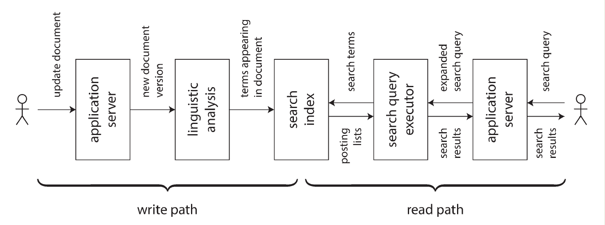

# Chapter 12. The Future of Data Systems

The final chapter shifts focus from how systems **are** to how they **should be**, proposing ideas to improve the design of reliable, scalable, and maintainable applications. It synthesizes the book’s main themes—**fault tolerance, scalability, and maintainability**—and explores how to build future systems that are **robust, correct, evolvable**, and **beneficial to humanity**.

## Data Integration

- There are **multiple valid solutions** for any problem, each with trade-offs (e.g., log-structured vs. B-tree vs. column stores; single-leader vs. multi-leader replication).
- No universal solution fits all use cases 🤷‍♀️; **different workloads require specialized tools**.
- Real-world applications often need to **combine multiple systems**, leading to complex integration challenges.

### Combining Specialized Tools Through Derived Data

- Example: integrating an **OLTP database** with a **full-text search index**.
- As systems multiply (databases, search engines, caches, ML models, etc.), synchronization and consistency become more **difficult**.
- Data integration requires clear reasoning about **dataflows** — where data is written first and which systems derive from it.

#### Reasoning About Dataflows

- **CDC** or **event sourcing** can help maintain derived data in sync with a system of record.
- A single system deciding the **total order of writes** simplifies synchronization and prevents permanent inconsistencies.
- This mirrors the **state machine replication** model: process writes in a consistent order to ensure deterministic results.

#### Derived Data vs. Distributed Transactions

| Aspect       | Distributed Transactions | Derived Data (Log-based)          |
| ------------ | ------------------------ | --------------------------------- |
| Ordering     | Locks & 2PL              | Log ordering                      |
| Commit Model | Atomic commit            | Deterministic retry + idempotence |
| Consistency  | Linearizable             | Eventually consistent             |
| Performance  | High coordination cost   | Asynchronous, scalable            |

- Distributed transactions (e.g., XA/2PC) provide strong guarantees but **poor fault tolerance and performance**.
- Log-based derived data systems are **more promising** for integration, though they lack immediate consistency guarantees.
- The goal: find a **middle ground**—asynchronous systems with stronger correctness properties.

#### The Limits of Total Ordering

Constructing a **totally ordered event log** works for small systems but faces limits as scale increases:

1. **Throughput**: a single leader cannot handle all events.
2. **Geographic Distribution**: multiple data centers introduce ambiguous orderings.
3. **Microservices**: independent services lack shared durable state.
4. **Offline Clients**: different event orders between client and server.

Total ordering = **consensus problem**.  
Scaling consensus across partitions or datacenters remains an **open research challenge**.

#### Ordering Events to Capture Causality

When total order is infeasible, causal relationships must still be preserved:

- Example: a user unfriends someone, then posts a message. If causality is lost, the ex-partner might still get notified.
- The challenge: maintain **causal dependencies** between related events stored in different systems.

#### Potential Solutions

- **Logical timestamps**: give order without coordination, but require extra metadata.
- **Causal references**: events can reference prior events that influenced them.
- **Conflict resolution algorithms**: handle reordering but not side effects.

Over time, application patterns may evolve to **efficiently capture causality** and maintain derived state **without total ordering bottlenecks**.

### Batch and Stream Processing

The main goal of **data integration** is to ensure that data is transformed into the right form and delivered to the right places.  
This involves:

- **Consuming inputs**
- **Transforming, joining, filtering, aggregating**
- **Training and evaluating models**
- **Writing outputs**

**Batch** and **stream processing** systems are the core tools that achieve these transformations.

#### Derived Datasets

The outputs of these processing systems are **derived datasets**, such as:

- Search indexes
- Materialized views
- Recommendations
- Aggregate metrics

Batch and stream processing share similar principles; the key distinction is:

- **Batch processing** → finite datasets
- **Stream processing** → unbounded, continuous data

Modern systems blur this line:

- **Apache Spark**: stream processing via _microbatches_
- **Apache Flink**: batch processing built on top of a streaming model

#### Maintaining Derived State

- Both batch and stream processing emphasize **deterministic, functional operations**:
  - Pure functions (output depends only on input)
  - Immutable inputs and append-only outputs
  - No side effects other than explicit outputs
- Stream processors extend this model with **managed, fault-tolerant state**.
  - 👍 Improves **fault tolerance** through **idempotent and deterministic** processing
  - 👍 Simplifies **reasoning about dataflows** across an organization
  - 👍 Makes derived data (e.g., indexes, caches, models) easier to maintain through **functional pipelines**
- Maintaining derived systems **asynchronously** increases robustness:
  - 👍 Failures are isolated to local components
  - 👍 Avoids failure amplification common in **distributed transactions**

Cross-partition indexes (e.g., term/document partitioning) are most scalable when updated asynchronously.

#### Reprocessing data for application evolution

- Batch and stream processing support **system evolution**:
  - **Stream processing** → low-latency updates
  - **Batch processing** → large-scale reprocessing of historical data
- Benefits of Reprocessing:
  - Enables major **schema and model changes**, not just incremental ones
  - Supports **gradual evolution**: maintain old and new views side-by-side
  - Allows **canary migrations** (testing new views with limited users)
  - Each step is **reversible**, reducing migration risk and improving confidence

#### The Lambda Architecture

The **Lambda Architecture** combines batch and stream processing:

- **Stream layer**: processes recent data for quick, approximate updates
- **Batch layer**: reprocesses historical data for accurate, corrected results
- Data is stored as **immutable, append-only events**
- **Advantages**:
  - Encourages **event-sourced** dataflows and **derived views**
  - Promotes **fault tolerance** through immutability and reprocessing
- **Limitations**:
  - Duplicated logic between batch and stream systems
  - Operational complexity (two frameworks to maintain)
  - Difficulty merging outputs from batch and stream pipelines
  - Expensive to frequently reprocess large datasets
  - Incremental batch updates add **temporal complexity** and blur distinctions between layers

#### Unifying Batch and Stream Processing

Modern architectures overcome Lambda’s downsides by **unifying batch and streaming**:

- One engine handles **both historical reprocessing** and **live event processing**
- Simplifies code reuse, operations, and consistency guarantees
- **Required Features**:
  1. **Event replay**: ability to reprocess historical data through the same pipeline, e.g., Kafka’s log replay or reading from distributed filesystems (HDFS)
  2. **Exactly-once semantics**: ensures consistent outputs despite failures
  3. **Event-time windowing**: processes data based on event timestamps, not processing time. Supported by frameworks like **Apache Beam**, **Flink**, and **Google Cloud Dataflow**

## Unbundling Databases

At a high level, **databases**, **Hadoop**, and **operating systems** share a common goal: managing data storage and processing. While Unix provides low-level abstractions (files, pipes), relational databases offer high-level abstractions (SQL, transactions) that hide complexity such as concurrency and recovery. The philosophical tension between Unix simplicity and database abstraction continues today - manifesting in movements like **NoSQL**, which adopt Unix-style low-level flexibility for distributed systems.

### Composing Data Storage Technologies

Databases internally implement mechanisms like:

- **Secondary indexes** (for efficient lookups)
- **Materialized views** (cached query results)
- **Replication logs** (for data consistency across nodes)
- **Full-text search indexes**

These functions parallel how **batch** and **stream processors** manage derived data systems.  
For example, creating a database index resembles setting up a **new replica** or **bootstrapping change data capture**—it involves scanning existing data and keeping updates synchronized.

Thus, the entire dataflow of an organization can be viewed as one large “meta-database,” where batch and stream processors maintain various derived data views—akin to indexes or materialized views—across multiple systems.

### Two Integration Philosophies

#### 1. **Federated Databases (Unifying Reads)**

- Provide a **single query interface** across diverse storage engines.
- Example: PostgreSQL’s **Foreign Data Wrappers**.
- Follows the relational tradition — high-level unified querying over heterogeneous systems.
- Suitable for combining data for read-only purposes.

#### 2. **Unbundled Databases (Unifying Writes)**

- Focus on **keeping multiple systems in sync**.
- Instead of distributed transactions, rely on **asynchronous event logs** and **idempotent writes**.
- Inspired by Unix’s philosophy: small, composable tools communicating via uniform APIs (like pipes).

#### Benefits of Log-Based (Unbundled) Integration

1. **System robustness** — asynchronous event logs decouple components, preventing local failures from escalating system-wide.
2. **Team autonomy** — each service or data system can evolve independently, connected via durable, ordered logs that maintain consistency.

### Unbundled vs Integrated Systems

- **Databases remain essential** for maintaining local state and serving queries from batch/stream outputs.
- **Specialized engines** (e.g., MPP warehouses) will continue to exist for niche workloads.
- Integrated systems can offer better performance and easier management for specific needs.
- **Unbundling’s goal** is not outperforming single databases, but enabling **breadth** — combining multiple specialized systems for a wider range of workloads.

Use integrated systems if one tool meets your needs; embrace unbundling when no single system fits all requirements.

### What’s Missing: The “Unix Shell” for Data Systems

We still lack a **declarative, high-level language** to compose unbundled data systems as easily as Unix commands.  
Ideally, one could define: `mysql | elasticsearch` to automatically replicate and index MySQL data into Elasticsearch, handling changes transparently—without custom glue code.

Future systems could extend this idea to **declarative caching and materialized views**, possibly using innovations like **differential dataflow**, bridging the gap between low-level unbundled tools and the declarative power of databases.

### Designing Applications Around Dataflow

The **“database inside-out”** or **unbundled database** approach advocates composing applications from specialized storage and processing systems instead of relying on monolithic databases. It’s best seen as a **design pattern** that encourages modular, dataflow-oriented system design. The concept draws from **dataflow**, **functional reactive**, and **logic programming**, as well as the **automatic recalculation model of spreadsheets**—where dependent results update automatically when inputs change.

- Spreadsheets automatically refresh derived values when inputs change; data systems should do the same for indexes, caches, and aggregations. The challenge is doing this **reliably, at scale, and durably** across distributed components.

#### Application Code as Derivation Functions

- Many data artifacts (indexes, full-text search, ML models, caches) are **derived datasets** computed through transformation functions.
- Some derivations (like secondary indexes) are built-in to databases.
- Others (like ML models or domain-specific caches) require **custom application logic**.
- This custom logic often struggles within databases’ limited UDF or trigger systems 🤷.

#### Separation of Code and State\*

- Databases are poor environments for managing modern application code—lacking tools for versioning, dependency management, observability, and integration.
- Instead, **databases should focus on storage**, while platforms like **Kubernetes or Docker** manage code execution.
- This leads to a **separation of application logic (stateless services)** and **persistent state (databases)**—a principle humorously referred to as separating _“Church and state.”_
- **From Polling to Dataflow**:
  - Traditional databases are **passive**—applications poll for changes.
  - **Dataflow systems**, by contrast, are **reactive**: they treat state changes as streams of events that trigger further computations or updates.
  - This unifies concepts from **event logs, triggers, and stream processors** into one model of computation where code reacts to data changes.
- **Derived Data and Streams**
  - Maintaining derived datasets (indexes, caches, analytics) demands **ordered**, **fault-tolerant**, and **reliable** message processing—similar to how **stream processors** operate.
  - Modern stream systems can ensure **ordering** and **exactly-once processing**, enabling **application code to run as composable stream operators** (like Unix pipes).
- **From Microservices to Dataflow Systems**  
  While **microservices** communicate via synchronous APIs (REST/RPC), **dataflow systems** connect through **asynchronous event streams**.
  - This yields **better performance and fault tolerance**.
  - Example: instead of querying an exchange-rate service on each purchase, an app can **subscribe to exchange-rate updates**, store them locally, and join them with purchase events.
  - ▶️ The result is faster, more resilient, and naturally models **time-dependent computations**.

### Observing Derived State

This section connects **dataflow systems** with the concepts of **read and write paths**, exploring how data moves from ingestion to user consumption, how caches and indexes shift computational work, and how event-driven architectures can extend all the way to clients.

### Write Path vs. Read Path

- **Write path:** Precomputes derived data (indexes, views, models) when new data is written.
- **Read path:** Executes computations at query time when users request information.
- The two are ⚖️ more computation at write time (materialized views, indexes) can make reads faster, while minimal precomputation makes writes cheap but reads slower.
- This balance mirrors **eager vs. lazy evaluation** in functional programming.
- Indexes, caches, and materialized views represent different points along this spectrum.

#### Materialized Views and caching

- A **search index** shifts some work to the write path (updating index entries) to make reads faster.
- Precomputing results for every query (pure caching) would make writes impossible—too expensive and infinite in scope.
- Caching common queries is a practical middle ground: precompute popular results and update them incrementally.

▶️ Thus, **caches, indexes, and views** all serve as boundaries that define **how much work happens at write time versus read time**.

#### Stateful, offline-capable clients

Modern applications blur this boundary further:

- Traditional **stateless clients** rely on synchronous server requests.
- **Stateful, offline-capable clients** (e.g., mobile apps, SPAs) keep local state and sync in the background, acting like caches or materialized views of server state.
- This model improves responsiveness and offline functionality—important when connectivity is intermittent.

#### Pushing State Changes to Clients

Instead of clients polling servers:

- **Server-sent events (SSE)** and **WebSockets** allow servers to push updates in real time.
- This extends the **write path** to the end user: clients receive a stream of state changes after initial synchronization.
- Techniques from **stream processing** (like consumer offsets in Kafka) allow clients to resume from missed updates when reconnecting.

This creates an **end-to-end event stream**, connecting data changes in the backend to user interfaces on devices.

#### End-to-End Event Streams

- Modern UI frameworks (e.g., **Elm**, **React**, **Flux**, **Redux**) already model user interaction as event streams.
- Extending this paradigm:
  - Servers can push state changes directly into client-side event pipelines.
  - This creates a full **reactive dataflow** from backend events to UI updates with sub-second latency.
- While used in real-time apps like chat or gaming, this model could apply to all apps—if databases and APIs supported **subscribe-to-change** semantics instead of just request/response.

#### Reads are Events too

- Reads can be modeled as **streams of query events** processed alongside write streams.
- A stream processor can join **read events** with stored state, effectively performing **stream-table joins**.
- Recording read events also helps track **causal dependencies** (e.g., “what data did the user see before making a purchase?”), improving auditability and analytics.

This unifies reading and writing under the same **event-driven abstraction**, where both are logs of state interactions.

#### Multi-Partition Data Processing

Treating queries as streams allows distributed joins and computations across partitions:

- Examples include computing the reach of a URL on Twitter or assessing fraud risk by joining multiple reputation databases.
- These patterns resemble internal query execution graphs in **MPP databases**, though stream processors can generalize the idea for **large-scale, real-time systems**.

## Aiming for Correctness

- Stateless vs. Stateful Systems:
  - **Stateless services** can easily recover from faults—restart and move on.
  - **Stateful systems**, by contrast, retain data permanently, so errors can have lasting consequences, requiring much greater care in design.
- Limits of Traditional Transactions:
  - For decades, **ACID transactions** (atomicity, isolation, durability) have been the foundation of correctness.
  - However, they are **weaker than they appear**—especially under weak isolation levels or distributed setups.
  - Systems may appear correct under low concurrency but fail subtly under faults or high load.
  - Tools like **Jepsen tests** have revealed large gaps between claimed and actual database guarantees.
  - Misconfigured applications often misuse transaction features, leading to silent data corruption.

#### The Need for End-to-End Correctness

- Even if databases are safe, **application logic can still cause corruption**— f or example, buggy code deleting or overwriting data.
- **Immutable or append-only data models** make recovery easier, as they avoid destroying good data.
- Still, immutability alone cannot prevent **duplicate or inconsistent operations**.

#### Exactly-Once Execution & Idempotence

- “Exactly-once” semantics aim for operations that behave as if executed only once, even after retries or faults.
- **Retrying operations** (e.g., billing, counter increments) can cause corruption if the operation is not idempotent.
- The fix is to make operations **idempotent**—safe to repeat without side effects.
- This often requires tracking **unique operation IDs** or metadata to detect duplicates and enforce correctness.

#### Duplicate Suppression Across Boundaries

- TCP can suppress duplicate packets within a connection—but not across reconnects or between client and server.
- Example: if a banking app retries a transaction after a network timeout, the operation could be **executed twice**.
- **Two-phase commit (2PC)** helps decouple transactions from TCP connections but still doesn’t prevent end-user retries (e.g., repeated form submissions).

#### Operation Identifiers as End-to-End Safeguards

- The robust solution is **application-level deduplication**:
  - Each operation (e.g., money transfer) carries a **unique identifier (UUID)**.
  - The database enforces a **uniqueness constraint** on these IDs.
  - Duplicate retries automatically fail due to constraint violations, preventing double execution.
- This also forms the basis for **event sourcing**, where each event is logged once and downstream consumers derive state from it.

#### The End-to-End Argument

- Introduced by _Saltzer, Reed, and Clark_ (1984):
  _Some correctness properties can only be implemented fully with cooperation from the application endpoints—not by lower layers alone._
- TCP, checksums, or even database transactions provide **partial reliability**, but cannot ensure full end-to-end correctness.
- Examples:
  - Checksums detect network corruption but not disk or software corruption.
  - WiFi or TLS encryption secures transmission, but not the server itself.
  - Only **end-to-end encryption and validation** ensure full integrity.

#### Applying End-to-End Thinking to Data Systems

- Strong transactional guarantees don’t eliminate the need for **application-level safeguards**.
- True fault tolerance requires **end-to-end reasoning** across all layers—user, app, and data.
- Unfortunately, implementing this correctly at the application level is **complex and error-prone**.
- **Transactions simplify many issues** (collapsing failures to commit/abort outcomes), but they don’t scale easily across distributed or heterogeneous systems.
- Refusing distributed transactions for performance reasons often forces developers to reimplement partial, buggy equivalents.
- 👉 The author argues for **new fault-tolerance abstractions** that:
  - Provide **application-specific end-to-end correctness** (like deduplication or idempotence).
  - Are **easier to reason about** than current models.
  - Maintain **high performance and scalability** in distributed systems.

### Enforcing Constraints

When databases are **unbundled** into components like logs, stream processors, and storage systems, enforcing **correctness** and **constraints** (such as uniqueness or consistency) requires rethinking traditional database mechanisms.

#### Uniqueness Constraints require Consensus

- Enforcing **uniqueness** (e.g., unique usernames, non-overlapping bookings, no negative balances) fundamentally requires **consensus**.
- In distributed systems, consensus ensures only one of several concurrent conflicting operations is accepted.
- Traditionally, this is achieved with a **single leader** that serializes decisions.
- However, if the leader fails, the system must re-enter consensus to elect a new leader.
- **Partitioning** by the value that must be unique (e.g., username hash, request ID) can scale the system, but **asynchronous multi-master replication** cannot guarantee uniqueness—synchronous coordination is necessary.

#### Uniqueness via Log-Based Messaging

- **Logs** (as in Kafka-style systems) provide a **total order broadcast**, equivalent to consensus.
- A **stream processor** consumes messages in strict order from each log partition.
- If partitions are based on the unique value (e.g., username hash), the processor can deterministically decide which operation “wins.”
- **Example (unique username claim):**
  1. Each request is appended to a log partition (by username hash).
  2. A stream processor reads sequentially, maintains a local DB of taken names:
     - If free → marks as taken, emits _success_.
     - If taken → emits _rejection_.
  3. The client waits for its result message.

This mechanism ensures consistent, deterministic conflict resolution and scales horizontally by adding partitions.
It also generalizes to other constraints where potentially conflicting writes must be processed sequentially.

#### Multi-Partition Request Processing

Some operations, like transferring money between accounts, touch multiple partitions.
Traditional databases handle this via **atomic commits** (distributed transactions), but that introduces cross-partition coordination and reduces scalability.

Instead, an **unbundled log-based approach** can achieve equivalent correctness **without atomic commit**:

1. **Client logs the request** (with a unique ID) to a partition based on the request ID.
2. **Stream processor reads requests** and emits:
   - A _debit_ message for payer account (partitioned by payer).
   - A _credit_ message for payee account (partitioned by payee).
3. **Downstream processors** consume credit/debit streams and:
   - Deduplicate by request ID.
   - Apply balance updates atomically per account.

If a processor crashes, it resumes from the last checkpoint—possibly re-emitting duplicate messages—but the deterministic and idempotent design ensures correctness via deduplication.

An additional processor can validate transactions (e.g., check overdrafts) before logging them in step 1.

- By **decomposing transactions** into:
  - Sequentially processed log partitions,
  - Deterministic stream processors,
  - And **end-to-end request IDs** for deduplication,
- 👉 Systems can achieve **strong correctness guarantees** (like uniqueness and exactly-once application) **without distributed transactions**—even in multi-partition environments. This approach combines partitioned logs, deterministic processing, and idempotent writes to preserve correctness while maintaining scalability.

### Timeliness and Integrity

When operations are **unbundled** into asynchronous stages (e.g., logs and stream processors), we must rethink **correctness**, **consistency**, and **constraints** beyond traditional ACID transactions.

- Traditional **transactions** are **linearizable**: once committed, their writes are immediately visible.
- In **streaming systems**, operations are **asynchronous** — producers don’t wait for consumers.
- A client may wait for an output message (for confirmation), but correctness does not depend on waiting — only the notification does.
- The term _consistency_ actually mixes two distinct ideas:

| Concept        | Meaning                                                                 | Violation Type                                 | Recovery         |
| -------------- | ----------------------------------------------------------------------- | ---------------------------------------------- | ---------------- |
| **Timeliness** | Users see up-to-date state (fresh data)                                 | Temporary inconsistency (eventual consistency) | Wait and retry   |
| **Integrity**  | No corruption or contradictory data (derivations and views are correct) | Permanent inconsistency (data corruption)      | Must be repaired |

- **Integrity** violations are catastrophic (e.g., mismatched credits/debits).
- **Timeliness** violations are merely delays (e.g., recent card transaction not yet visible).
- In practice, **integrity matters far more than timeliness**.

#### Correctness of dataflow systems

Event-driven dataflow systems **decouple timeliness from integrity**:

- They lack timeliness by default (since they are asynchronous).
- But they can **preserve integrity** with:
  - **Exactly-once/effectively-once semantics** (no lost or duplicate events)
  - **Idempotent operations** and **deduplication**
  - **Atomic writes of input messages** (fits with event sourcing)
  - **Deterministic derivation functions** (to compute derived state)
  - **Immutable messages** (reprocessing allows recovery from bugs)
  - **End-to-end request IDs** (to track and deduplicate events)

These mechanisms provide **strong integrity guarantees** _without distributed transactions or atomic commit_, resulting in high correctness, performance, and robustness.

#### Loosely Interpreted Constraints

While strict uniqueness constraints require coordination (consensus), many real-world systems can **tolerate temporary violations** if they can **compensate** afterward:

- Duplicate username → apologize, ask to choose another.
- Oversold inventory → reorder, delay shipment, offer discount.
- Overbooked flights → compensate or upgrade.
- Overdrawn account → apply overdraft fee.

Such **compensating transactions** handle constraint violations after the fact.
The key: **integrity must hold**, but **timeliness of enforcement can be relaxed**.

This allows **optimistic writes** followed by validation — trading strict synchronization for operational simplicity.

#### Coordination-Avoiding Data Systems

Two insights:

1. **Integrity** can be maintained without atomic commit or linearizability.
2. Many **constraints** can be relaxed or repaired later.

Therefore, **coordination-avoiding systems** can:

- Ensure integrity without synchronous coordination.
- Operate across datacenters with **asynchronous multi-leader replication**.
- Achieve **high performance and availability** while tolerating weaker timeliness.

In such systems:

- **Serializable transactions** remain useful for small-scope derived state.
- **Global distributed transactions (XA, two-phase commit, etc.)** are unnecessary.
- **Synchronous coordination** can be selectively applied only where recovery is impossible.

#### The Trade-Off

- Coordination reduces inconsistencies but hurts performance and availability.
- Lack of coordination improves performance but may increase temporary inconsistencies.
- 👉 The goal is to find the **sweet spot** — balancing between inconsistencies that require apologies and outages that require apologies.

### Trust, but Verify

Traditional system design assumes certain things can fail (e.g., crashes, power loss, network delays) but others cannot (e.g., CPU arithmetic, disk persistence). In practice, every assumption is probabilistic — rare failures **can** occur even in supposedly reliable hardware and software.

#### Maintaining integrity in the face of software bugs

- Data corruption can occur silently on disks or in memory, despite protections like checksums or TCP reliability.
- Rare events such as **random bit flips** or **Rowhammer attacks** show that hardware integrity is not absolute.
- Software, including mature databases like `MySQL` and `PostgreSQL`, can have **bugs that violate integrity guarantees**.
- Application code is even more error-prone, often misusing database features like transactions or foreign keys.

#### Don’t just blindly trust what they promise

- Both hardware and software eventually fail — so **integrity checks are essential**.
- Systems should not assume correctness; instead, they should _verify_ it.
- Mature systems (e.g., **HDFS**, **Amazon S3**) regularly **audit their own data** by comparing replicas and verifying integrity.
- Backups must also be **periodically tested** to ensure they’re actually usable.

#### A Culture of Verification

- Many systems still lack “trust but verify” mechanisms, assuming ACID guarantees are absolute.
- This “blind trust” became riskier with **NoSQL systems** and weaker consistency guarantees.
- Future systems should adopt **self-auditing** mechanisms that detect corruption automatically.

#### Designing for Auditability

- Traditional mutation-based transaction logs make it difficult to reconstruct _why_ changes occurred.
- **Event sourcing** improves auditability:
  - Each user action becomes an **immutable event**.
  - Derived state is **deterministically** computed from events.
  - The same event log can be replayed to reproduce state and verify integrity.
- Using **hashes** or **redundant computation** helps detect corruption in both logs and derived data.
- Deterministic dataflow makes debugging and time-travel analysis easier.

#### The end-to-end argument again

- Since no layer (hardware or software) can be fully trusted, integrity must be checked **end to end** — from source to derived data.
- Continuous verification across the entire pipeline provides higher confidence, reduces bugs faster, and increases agility (similar to automated testing).

#### Tools and Future Directions

- Few systems natively support auditability.
- Some use **audit tables** or **signed transaction logs**, but ensuring correctness of what goes into logs remains difficult.
- **Cryptographic auditing** (e.g., **Merkle trees**, distributed ledgers) introduces mechanisms to verify integrity across untrusted replicas.
- Technologies like **blockchains** and **certificate transparency** show potential for **tamper-evident, verifiable data integrity**.
- Future data systems may integrate these cryptographic proofs for scalable, continuous integrity checking.

👉 We should stop blindly trusting our systems — hardware and software both fail. True robustness comes from **verification**, **auditing**, and **end-to-end integrity checks**. Designing systems that continuously verify their own correctness will make them more trustworthy, maintainable, and resilient in the long run.

## Doing the Right Thing

In building data systems, every design choice has intended and unintended consequences. As engineers, we must consider how our systems affect the world and consciously decide what kind of world we want to create. Much of the data we handle represents people—their behavior, interests, and identities—so we must treat it with respect and uphold human dignity.

Software engineering increasingly involves ethical decisions. Although ethical guidelines exist (e.g., ACM’s Software Engineering Code of Ethics), they are rarely discussed or enforced, leading to **carelessness** toward **privacy** and the **societal impact** of technology. Technology itself is neutral; what matters is how it’s used and its effects on people.

### Predictive Analytics

- Predictive analytics—one of the major trends in “Big Data”— can have serious real-world implications 🫤.
- While predicting the weather or disease spread is harmless, **predicting human behavior** (e.g., credit risk, recidivism, or employability) directly affects **lives**.
- Organizations often act cautiously to minimize risks, but such caution can unfairly exclude people from essential opportunities.
- When algorithms systematically reject individuals across multiple domains, this can create an “_algorithmic prison_,” restricting basic freedoms without due process or appeal.

#### Bias and Discrimination

- Algorithms are not inherently more fair than humans.
- Data-driven systems often learn and **amplify existing biases** in their input data. If discriminatory patterns exist in historical data, the model will reproduce and reinforce them ❗.
- Anti-discrimination laws prohibit decisions based on protected traits (e.g., race, gender, age), but correlated features—like location—can serve as **proxies** for those **traits**.
- Believing that biased data can yield fair outcomes is misguided; ML can act as “bias laundering,” giving discrimination a veneer of mathematical legitimacy.
- To build a fairer future, **human moral judgment** is indispensable — data should assist decision-making, not dictate it 🫤.

#### Responsibility and Accountability

- When algorithms make decisions that harm people, the question arises: who is **accountable**❓
  - Humans can be held responsible for their actions, but algorithmic decisions often lack transparency and appeal mechanisms.
  - **Credit scores**, though imperfect, are at least **understandable** and **correctable**.
  - ML models, however, are opaque, often using irrelevant or hidden data features, making it hard to contest unfair outcomes.
- Predictive analytics tend to generalize based on **similarity to others**, promoting **stereotyping** and **group-based** decisions.
- Individual errors are inevitable, as predictions are **probabilistic**, not certain. **Blind faith** in** data-driven decisions** is dangerous; we need transparency, accountability, and mechanisms to detect and correct bias.
- Data should be used to help people, **not exploit them** — for example, targeting aid rather than selling harmful products to vulnerable populations.

#### Feedback Loops

- Even seemingly benign predictive systems, such as **recommendation algorithms**, can create harmful **feedback loops**.
  - By showing users only content they agree with, systems **reinforce** polarization and misinformation, as seen in social media echo chambers influencing political outcomes.
  - In other cases, feedback loops can trap individuals in **worsening** conditions. For instance, an employer using credit scores for hiring may deny opportunities to those already in financial trouble, deepening their hardship and perpetuating the cycle of poverty. These outcomes often stem from hidden assumptions presented as objective analysis.
- Preventing such consequences requires **systems thinking** — examining not just algorithms but their interaction with people and society.
- We must ask: does the system **amplify inequality** or **promote fairness**❓ Even with good intentions, we must remain alert to unintended effects.

### Privacy and Tracking

- When users intentionally submit data (e.g., uploading a file or form), the system serves them— **the user is the customer**.
- But when activity is _passively tracked_ (e.g., clicks, movement, behavior), the relationship changes. The system begins to act in its **own interests**, which often conflict with the user’s.
- Tracking initially serves **user-facing goals** (e.g., better search ranking, recommendations, UX improvements), but in ad-funded models, _advertisers_ become the true customers. Users are incentivized to stay engaged while their data fuels targeted marketing—turning the relationship into one of **surveillance**.

#### Surveillance

- If we replace “data” with “surveillance,” the modern internet’s language becomes alarming: “surveillance-driven organizations,” “surveillance warehouses,” etc 🦹‍♂️.
- The global expansion of connected devices—smartphones, TVs, assistants—creates a voluntary yet pervasive **mass surveillance infrastructure**, run by corporations rather than governments.
- We accept this surveillance because:
  - We believe we have “nothing to hide.” 😲
  - We see the purpose as benign (recommendations, ads). 😲
- But once such data influences crucial areas (insurance, employment, credit), the effects become coercive and discriminatory.

#### Consent and freedom of choice

- Although users “agree” to terms and privacy policies, this consent is **not meaningful**:
  - Users don’t understand how data is used, retained, or combined with external datasets 🫤.
  - Data collection is **one-sided** and **non-negotiable**; users can’t choose how much data to share or how it’s used.
  - Opting out of major platforms (Google, Facebook) comes with **social and professional costs**, making participation effectively mandatory.
- ▶️ Surveillance thus becomes **inescapable**, especially for those without the privilege or knowledge to avoid it.

#### Privacy and use of data

- Privacy isn’t about hiding—it’s about **control**: deciding what to share and with whom.
- In surveillance-driven systems, this control shifts from individuals to corporations that ask users to “trust us.” These companies:
- Keep their profiling methods secret to avoid appearing “creepy.”
- Reveal personal insights indirectly (e.g., ad targeting for medical conditions).
  Thus, **corporations, not individuals, decide what information is exposed**, guided by profit rather than ethics.
  Even privacy settings only govern what _other users_ see, not what the company can do internally with the data.

#### Data as assets and power

- Behavioral data isn’t “exhaust”—it’s the **core asset** of data-driven businesses.
- Users’ creativity and interactions are exploited to feed surveillance infrastructure.
- A vast industry of **data brokers** buys, analyzes, and sells personal data, while companies, governments, and criminals all compete to obtain it.
- Since **data leaks**, **hacks**, and **coercion** are inevitable, data becomes a **“toxic asset”**—a risk to collect at all.
- Collecting it assumes that no future regime will misuse it— an **unsafe assumption** 😞.

As the saying goes:

> “It is poor civic hygiene to install technologies that could someday facilitate a police state.”

👉 Surveillance is a form of **asymmetric power**: those who observe gain control over those who are observed.

#### Remembering the Industrial Revolution

- Like the Industrial Revolution, the **Information Age** brings **progress** _and_ **harm**:
  - Economic growth and connectivity come with **privacy pollution** and **exploitation**.
  - Just as factories once polluted rivers and abused workers, data industries now **exploit human information** with few safeguards.

_Bruce Schneier_ aptly said:

> “Data is the pollution problem of the information age, and privacy protection is the environmental challenge.”

👉 Future generations will judge how we handled this crisis of data misuse.

#### Legislation and self-regulation

- Data protection laws (e.g., the EU’s 1995 Directive) require that personal data be collected only for **specific purposes**—but this conflicts with the **Big Data** ethos of collecting everything “just in case” 🫤.
- **Over-regulation** risks **stifling innovation**, especially in beneficial fields like medicine, but lack of oversight leads to **abuse**.
- The solution isn’t purely legal—it’s **cultural**:
  - Treat users as **humans**, not **metrics**.
  - Build **trust** through **transparency** and **education**.
  - Respect user agency over data.
  - Avoid **indefinite retention** — purge data once it’s no longer needed.
  - Explore cryptographic enforcement of access control.
